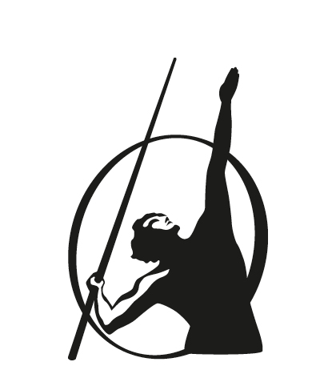

Portfolio / Penguin

An imprint of Penguin Random House LLC

[penguinrandomhouse.com](http://www.penguinrandomhouse.com)

Copyright © 2022 by Vanessa Van Edwards

Penguin supports copyright. Copyright fuels creativity, encourages diverse voices, promotes free speech, and creates a vibrant culture. Thank you for buying an authorized edition of this book and for complying with copyright laws by not reproducing, scanning, or distributing any part of it in any form without permission. You are supporting writers and allowing Penguin to continue to publish books for every reader.

Image credits: [1](08_Chapter_1_Cue_for_Cha.xhtml#image_page_9), [2](08_Chapter_1_Cue_for_Cha.xhtml#image_page_11), [3](08_Chapter_1_Cue_for_Cha.xhtml#image_page_17), [4](08_Chapter_1_Cue_for_Cha.xhtml#image_page_19), [5](09_Chapter_2_How_Cues_Wo.xhtml#image_page_29), [6](11_Chapter_3_The_Body_La.xhtml#image_page_38), [7](11_Chapter_3_The_Body_La.xhtml#image_page_54), [8](11_Chapter_3_The_Body_La.xhtml#image_page_56_1), [9](11_Chapter_3_The_Body_La.xhtml#image_page_70), [10](12_Chapter_4_The_Wow_Fac.xhtml#image_page_75), [11](13_Chapter_5_How_to_Look.xhtml#image_page_101), [12](13_Chapter_5_How_to_Look.xhtml#image_page_129), [13](14_Chapter_6_How_to_Spot.xhtml#image_page_132_0), [14](14_Chapter_6_How_to_Spot.xhtml#image_page_158), [15](18_Chapter_8_Vocal_Likab.xhtml#image_page_204), [16](20_Chapter_9_How_to_Comm.xhtml#image_page_212), [17](20_Chapter_9_How_to_Comm.xhtml#image_page_218_1), [18](20_Chapter_9_How_to_Comm.xhtml#image_page_219), [19](20_Chapter_9_How_to_Comm.xhtml#image_page_224), [20](20_Chapter_9_How_to_Comm.xhtml#image_page_225), [21](20_Chapter_9_How_to_Comm.xhtml#image_page_228), [22](22_Chapter_10_Creating_a.xhtml#image_page_236) by Science of People; [23](11_Chapter_3_The_Body_La.xhtml#image_page_42), [24](11_Chapter_3_The_Body_La.xhtml#image_page_43) by Brian Dean; [25](11_Chapter_3_The_Body_La.xhtml#image_page_63_0), [26](11_Chapter_3_The_Body_La.xhtml#image_page_64_0), [27](11_Chapter_3_The_Body_La.xhtml#image_page_66_0), [28](11_Chapter_3_The_Body_La.xhtml#image_page_68_1), [29](12_Chapter_4_The_Wow_Fac.xhtml#image_page_86_0), [30](13_Chapter_5_How_to_Look.xhtml#image_page_102), [31](13_Chapter_5_How_to_Look.xhtml#image_page_106), [32](13_Chapter_5_How_to_Look.xhtml#image_page_108), [33](13_Chapter_5_How_to_Look.xhtml#image_page_123), [34](13_Chapter_5_How_to_Look.xhtml#image_page_124), [35](14_Chapter_6_How_to_Spot.xhtml#image_page_149), [36](14_Chapter_6_How_to_Spot.xhtml#image_page_151_0), [37](14_Chapter_6_How_to_Spot.xhtml#image_page_153) by Maggie Kirkland; [38](13_Chapter_5_How_to_Look.xhtml#image_page_115_0), [39](17_Chapter_7_Sound_Power.xhtml#image_page_171), [40](17_Chapter_7_Sound_Power.xhtml#image_page_172_2), [41](18_Chapter_8_Vocal_Likab.xhtml#image_page_194), [42](22_Chapter_10_Creating_a.xhtml#image_page_237), [43](22_Chapter_10_Creating_a.xhtml#image_page_238) by Vanessa Van Edwards.

Library of Congress Cataloging-in-Publication Data

Names: Edwards, Vanessa Van, author.

Title: Cues: master the secret language of charismatic communication / Vanessa Van Edwards.

Description: New York: Portfolio, [2022] | Includes bibliographical references and index.

Identifiers: LCCN 2021048764 (print) | LCCN 2021048765 (ebook) | ISBN 9780593332191 (hardcover) | ISBN 9780593332207 (ebook)

Subjects: LCSH: Interpersonal communication. | Social interaction. | Body language.

Classification: LCC BF637.C45 E32 2022 (print) | LCC BF637.C45 (ebook) | DDC 153.6—dc23/eng/20211202

LC record available at <https://lccn.loc.gov/2021048764>

LC ebook record available at <https://lccn.loc.gov/2021048765>

Cover design: Elizabeth Connor

Book design by Tanya Maiboroda, adapted for ebook by Cora Wigen

While the author has made every effort to provide accurate internet addresses at the time of publication, neither the publisher nor the author assumes any responsibility for errors or for changes that occur after publication. Further, the publisher does not have any control over and does not assume any responsibility for author or third-party websites or their content.

pid_prh_6.0_139326548_c0_r0
