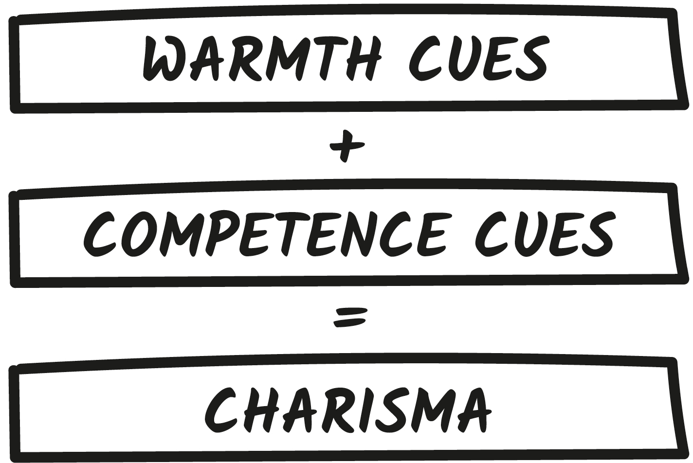
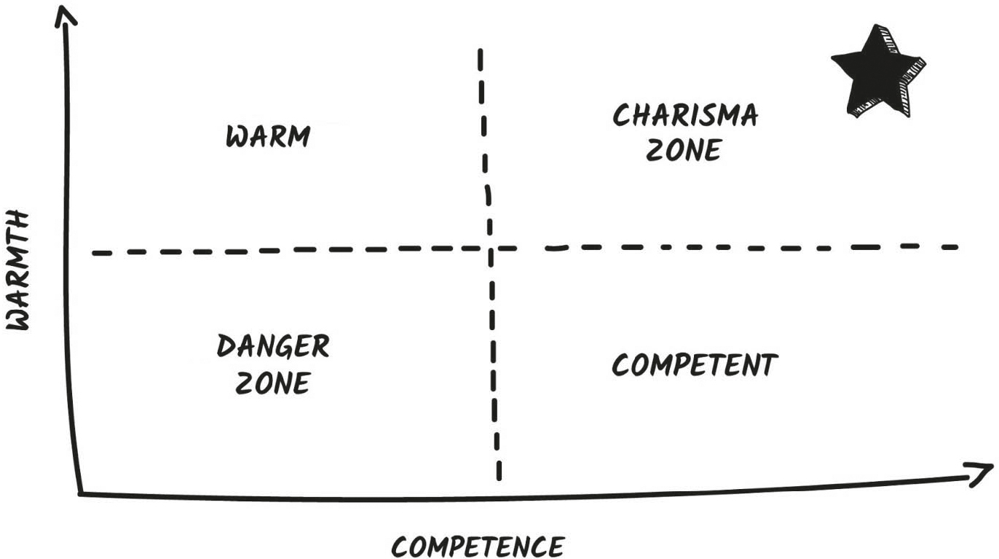
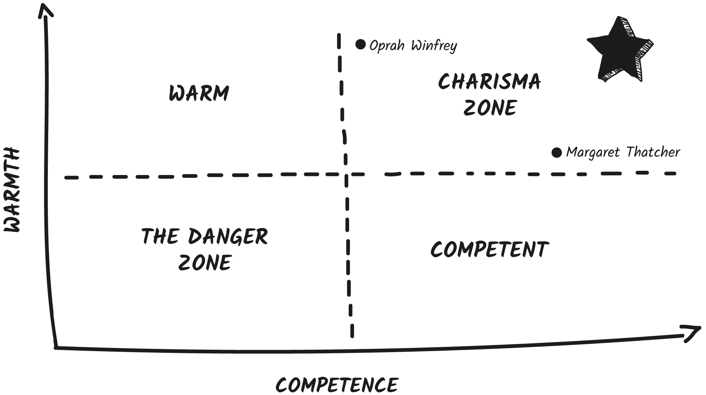
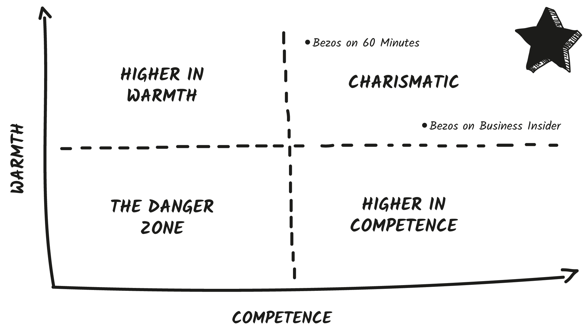

## CHAPTER 1

## Cue for Charisma

Who is the most charismatic person you know?

This is one of my favorite questions to ask audiences. People immediately shout out their answers. “My dad!” or “My teacher!” or “My best friend!”

The next question is where things get more interesting. I ask, “What _makes_ someone charismatic?”

Typically, I hear crickets. People rack their brains to come up with the answer. They venture, “Well, it’s, you know, that feeling?” **Why is it that we struggle to define charisma, even though we immediately recognize it in others?**

In a groundbreaking study from Princeton University, researchers found that highly charismatic, likable, compelling people demonstrate a special blend of two specific traits: warmth and competence. It’s a simple equation:

This formula is a powerful blueprint for every interaction. And it can completely change the way you communicate if you know how to use it.

According to the research, warmth and competence cues account for 82 percent of our impressions of others.

First, we quickly assess someone’s warmth, answering the question: **Can I trust you?**

Then we look for competence, answering the question: **Can I rely on you?**

And this formula isn’t just at play when making a first impression. Any time people interact with you, they continuously scan for cues to gauge your warmth and competence. And you do the same to others. Whether you are in a business meeting, on a date, with your boss, or with new friends, managing these two traits is essential for your effectiveness.

Highly charismatic people exhibit the perfect blend of warmth and competence. They immediately signal trust and credibility. We see them as friendly and smart, impressive and collaborative. They earn both our respect and admiration.

Here’s the problem: **Most of us have an imbalance between these two traits.** It’s often the hidden cause of our social difficulties, missed potential, and miscommunications.

We need this balance to succeed. Highly charismatic people use both warmth and competence cues to communicate successfully. We love being around people who make us feel like we are in both safe _and_ capable hands. We like our leaders to be both highly effective and very approachable. We look for partners we can trust with our deepest secrets and call in an emergency. We want to work with people who are both friendly and productive.

We’re always on the lookout for people who hit the sweet spot of both warmth and competence—the quadrant that has the star on the Charisma Scale on the following page. This Charisma Scale helps us map our communication.

Where do you think you fall on the scale? Are you more warm (upper left quadrant) or more competent (lower right quadrant), or do you strike a perfect balance and land in the Charisma Zone? Not sure? You might not show enough cues at all, putting you in the Danger Zone.

Consider where _others_ might _place you_ on the scale. Do a quick test below by choosing which column sounds more like you:

COMPETENT |  WARM  
---|---  
Impressive |  Trustworthy  
Powerful |  Collaborative  
Smart |  Kind  
Capable |  Compassionate  
An Expert |  A Team Player  
Effective |  Open  
  
Be sure to take your official Charisma Diagnostic in your digital bonuses at [scienceofpeople.com/bonus](http://scienceofpeople.com/bonus).

### Higher in Warmth

If you are highly warm, you have a strong desire to be liked. This can be good—you strive to be friendly and personable—but it can also be challenging. Highly warm folks are often people pleasers and struggle to say no and set boundaries. **Your desire to be liked can get in the way of your need to be respected.**

You might be seen as:

  * Trustworthy but not always powerful

  * Compassionate but not always competent

  * Friendly but not always impressive

If this is you, you likely have good relationships with your colleagues but you find it hard to pitch yourself or your ideas. You might even get interrupted in meetings or feel underappreciated for all the hard work you do. In social or casual settings, people enjoy talking to you but might not ask for your business card.

You’re likely higher in warmth if people tell you things like:

  * I always feel so comfortable around you!

  * You’re such a sweetheart.

  * I feel like I have known you forever.

  * You have a trustworthy face.

Steve Wozniak is a good example of a business leader who is known for being jovial and kind but doesn’t get as much credit for his accomplishments as his former partner, Steve Jobs, who was known for high competence.

### Higher in Competence

If you are highly competent, you have a strong desire to be seen as capable and impressive. People take you and your ideas seriously, but you might have a harder time building rapport. You could be seen as:

  * Smart but not always approachable

  * Dependable but not always collaborative

  * Important but not always kind

People might even be intimidated by you. They may tell you that you’re hard to talk to or come across as cold. In business settings, this can be a double-edged sword. You’re taken seriously as a leader, but you may have a harder time working with teams.

Clients, customers, or colleagues may find you credible but might not feel comfortable telling you all their needs. Researcher Susan Fiske found that **“ competence without warmth is likely to leave us feeling suspicious.”** In social settings, this means you’re often perceived as important, but it takes you longer to build deeper connections and make friends.

You’re likely higher in competence if people tell you things like:

  * I never know what you’re thinking.

  * You can be a little intimidating!

  * You’re hard to read.

  * You must be the one in charge here.

Business leaders like Mark Zuckerberg, Anna Wintour, and Elon Musk are examples of people who have had success with high competence but have been criticized for being harsh, hard to read, and unemotional.

You might notice that highly competent people will often partner with highly warm folks to balance them out. Many famous duos include a highly warm character and a highly competent character. This is a good way to think about how these traits play off each other.

  * Captain Kirk (warm) and Spock (competent)

  * Warren Buffett (competent) and Charlie Munger (warm)

  * Ernie (warm) and Bert (competent)

  * Sherlock Holmes (competent) and Dr. Watson (warm)

Put together, these duos often hit the sweet spot.

### The Danger Zone

The last part of the quadrant is the one you need to work hard to avoid: the Danger Zone.

**Researchers have found that if you rank low in both warmth and competence, you are more likely to be overlooked, dismissed, pitied, and undervalued.**

The Danger Zone is also where I would have placed Jamie Siminoff during his _Shark Tank_ pitch. His idea wasn’t bad, he simply didn’t send enough warmth and competence cues. As a result, the Sharks didn’t believe him.

**You can have the best** _content_ **in the world, but if it’s not shared with the right charisma** _cues_**, it doesn’t land.**

Siminoff’s low competence and low warmth cues undermined his message. He addressed every single one of the Sharks’ verbal questions with logical answers but missed critical nonverbal feedback cues from them. He prepared his numbers and created a helpful demo, but his Danger Zone cues sabotaged his credibility every step of the way.

Here’s the key: You might be the most competent, warmest person in the world, but if you don’t show it, people won’t believe you.

The good news is that even if you fall into the Danger Zone, you don’t have to stay there. Siminoff’s idea was so successful that he was invited to come back to _Shark Tank_ five years later _as a Shark_! When he walked into the tank as an investor, it was like seeing a different person. His cues transformed him. He strode into the room, made broad gestures, smiled, and shook hands with each of the Sharks. He even sounded different.

Sure, Siminoff had one bad pitch, but he bounced back. Everyone can improve their cues.

### Why Charisma Matters

Golden Globe–winning actress Goldie Hawn is known for her beauty, her humor, and her talent in front of the camera. But in 2003 she decided to set her sights on a very different goal—creating a mindfulness program in schools. She decided to call the program MindUp and set out to create a mental fitness program for children that could be used in classrooms. But she had a problem. She worried that people wouldn’t take her and the program seriously.

Hawn was keenly aware that she is known for her warmth but not necessarily for her competence. In her own words, “It’s hard enough being me, being Goldie, who has been known for all these decades as being funny and sometimes bubble headed,” said Hawn.

To help give her idea credibility, she brought in neuroscientists and psychologists and launched a massive study to validate the program. Hawn intuitively knew that she had to balance out her warmth with competence to get people to _trust_ and _rely_ on the program. And it worked!

Hawn and her team have grown the program to help over seven million students in fourteen countries and trained over 175,000 teachers. Eighty-six percent of the children who go through the MindUp program report being able to boost their well-being, and 83 percent show improvements in positive social behaviors.

Hawn isn’t the only one embodying the balance of warmth and competence. If you visit the MindUp website, you will see it has a powerful blend of warmth cues—smiling kids, a laughing Goldie, and great stories— right alongside competence cues like statistics, social proof, and data. Brands, websites, social profiles, and companies also need to hit the sweet spot of warmth and competence.

No matter who you are or what you’ve achieved, balancing warmth and competence is key to your success. A famous study published in _The Journal of the American Medical Association_ looked at how patients rated doctors on their warmth and competence. Researchers wondered, do _both_ of these perceptions really matter? Isn’t competence more important for doctors? Shouldn’t years in school be enough?

Nope.

The researchers found that doctors who were rated poorly for warmth, rather than for their actual medical mistakes, were more likely to be sued for malpractice. Doctors who don’t use enough warmth cues are unable to get across their competence and are sued more often.

**If you can’t showcase your warmth, people won’t believe in your competence.**

Too often I see people stuck in one part of the scale. I run into brilliant engineers who focus so much on technical skills that they are disliked and avoided in the office. They can’t get buy-in on their innovative ideas, feel disconnected from the team, and wonder why they’re always doing all the heavy lifting on projects.

Or I meet generous office managers who worry so much about being liked that they can’t speak up in a meeting or get the respect they deserve. They wish for more social assertiveness so they can feel empowered to say no to toxic people and stand up for themselves.

Often it seems the kinder someone is, the less they are appreciated and respected. On the other hand, the more skilled someone is, the more they might struggle with their colleagues and teams.

Whether you’re starting a new project, pitching ideas to a team, or trying to reset your reputation at work, we need _both_ likability and respect. The right charisma cues can help.

PRINCIPLE

Balance warmth and competence cues to be charismatic.

### Flavors of Charisma

When I ask audiences to name the most charismatic people they know, two names frequently come up: queen of talk Oprah Winfrey and the former prime minister of the United Kingdom, Margaret Thatcher.

Both of these women are considered successful, well respected, and charismatic. Yet their charisma feels completely different. How can this be?

One study examined Winfrey’s and Thatcher’s communication styles and found they use very different cues.

Thatcher was known for her control. She “stood leaning against the parliamentary podium, elbow out as if she owned it. Her head tilted upward. Her voice strong, loud, and with controlled pauses . . . Her body and face still,” explained the researchers.

Winfrey is known for her expressiveness. She “moves with gusto—her arms are long and she gestures broadly. Her facial expressions carry every feeling—she cries, and laughs. . . . She sits and stands and moves all around,” explained the researchers.

Winfrey and Thatcher both fall into the Charisma Zone, but they have different leanings. And that’s good! We don’t want everyone to look the same or mimic cues like robots.

Winfrey leans toward warmth but grounds her warmth with enough competence cues to be taken seriously. This is clear in every episode of her show. She cries with people, touches their arms, but also listens intently and asks challenging questions. She laughs freely and pairs heartfelt stories with hard-hitting perspective.

Thatcher leans toward competence but shows enough warmth cues to be seen as trustworthy. In her speeches, Thatcher spoke with clarity and precision, rarely using flowery language, but she imbued her words with passion. She used fewer gestures but would frequently tilt her head toward the sky in a nonverbal gesture of warmth and optimism. Does it surprise you that the “Iron Lady” showed warmth cues? You can demonstrate warmth and still be seen as serious. In fact, you need both elements to communicate effectively.

Yes, there is one formula to charisma—warmth cues plus competence cues. **But each of us has our own special balance.** As long as you’re in the Charisma Zone, you’re showcasing enough warmth and competence to be perceived as credible and trustworthy.

Compare TV hosts and chefs Jamie Oliver (higher in warmth) with Gordon Ramsay (higher in competence). Both are considered very charismatic but have different flavors.

My goal is to give you the full menu of cues. Then you can _choose_ how much of each ingredient you need to hit your unique charisma sweet spot. This is how we communicate authentically inside the Charisma Zone. You can add cues as you need them.

And the best part? **The most charismatic people move** _flexibly_ **within the Charisma Zone.** Need a little more warmth in a situation? Use more warmth cues. Need to inject competence into an interaction? Add competence cues. You can use the Charisma Scale like a dial.

### Your Charisma Dial

You are most charismatic when you adjust your warmth and competence based on the situation and person you’re with—while still staying in the Charisma Zone. Take, for example, billionaire founder of Amazon Jeff Bezos. In one early interview with _60 Minutes Australia,_ Bezos uses warmth cues as he casually takes a reporter around the office—he smiles, laughs, and gestures freely. The reporter even says, “The thing that strikes you first and most profoundly about Jeff Bezos is his laugh.” He was incredibly likable in the interview because he leaned into warmth but still balanced his communication with competence cues—speaking with credibility about his company’s growth, sharing impressive statistics and goals in between laughs.

In a later interview with _Business Insider,_ Bezos got asked more serious questions about his legacy as a leader.[[*]](30_Footnote.xhtml#footnote_1 "footnote") In response, Bezos dialed up his competence cues. He sits expansively and makes purposeful eye contact with the interviewer, and if you listen carefully, you will hear that Bezos even uses a lower tone of voice than in the earlier interview. But Bezos still uses enough warmth cues to stay in the Charisma Zone (his famous chuckle kept the audience laughing with him).

The number one way to improve your interactions is to send clear cues based on your goals.

When you need more credibility or to be taken seriously, as in negotiations, pitches, and important interviews, dial up competence. Additionally, if you’re with someone who appreciates highly intelligent, capable, efficient people, use more competence cues.

If you want to build more collaboration and trust, dial up warmth. If you’re with someone who values connection, rapport, and empathy, you should generate warm cues.

PRINCIPLE

The most charismatic people move flexibly within the Charisma Zone.

### How to Solve Your People Problems

Every day we interact with people who fall into different zones of the Charisma Scale. This can create all kinds of disconnects and miscommunications. Let’s say, for example, that you’re a little higher in warmth. But your client or customer (or boss or colleague) is a little higher in competence. This can cause a connection problem.

You, as a highly warm person, love rapport. When you start a meeting, you feel that chitchat is essential for a successful interaction. When you present an idea, you value great stories, case studies, and examples. When you make decisions, you often go with your gut. You place a lot of confidence in recommendations by referrals.

Your client, as a highly competent person, loves information. When they start a meeting, they want to get right to business. They don’t want to waste time with unproductive catch-ups. They prefer presentations with lots of data, research, and facts. If they doubt what you’re saying, they _will_ fact-check you on Google. They don’t really care about social proof (it’s only one person’s opinion!) and they prefer hard numbers. Oh, and nothing drives them crazier than going off agenda on an unrelated tangent. They say things like “I need to do my own due diligence.”

So what happens? You try to bond, while they try to be productive. You try to build trust, while they try to get informed. You feel your presentation is inspiring and they find it disorganized. You give them testimonials to close the sale, but they want more proof and data. You try to cultivate warmth and they try to harvest competence.

Neither of these approaches or preferences is right or wrong; they are just _different._ Remember, people have their own unique flavors of charisma, and that’s good. Warm and competent folks have different talents, and we need _both_ on a team. I will teach you how to spot these differences and even make them work for you.

Mismatches in charisma explain so many problems you might face:

  * Why you just can’t click with your boss.

  * Why your presentations or ideas sometimes don’t land.

  * Why you’ve been passed over for a promotion or dismissed by a potential friend.

  * Why you sometimes feel awkward or disliked.

Know you need more trust, collaboration, and openness with someone? Dial up your warmth cues.

Know you’re interacting with someone who is higher in competence? Dial up your competence cues as a sign of respect.

We can use these cues to be more successful in every area of our life—face-to-face chats, social media profiles, voicemails, slide decks, presentations, and even in our offices. I’ll teach you cues for each area of the Charisma Scale so you can use them purposefully, in the right situations, with the right people.

### CHAPTER CHALLENGE

To help you get the most out of this book, we have created an official **Charisma Diagnostic.** This will help you identify exactly where you are on the scale. Take the official quiz and get your results at:

[scienceofpeople.com/bonus](http://scienceofpeople.com/bonus)

This is also where you’ll find all the digital goodies, videos, and extras in this book.
