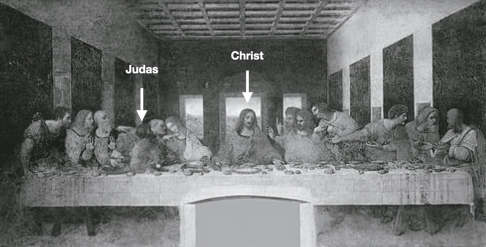
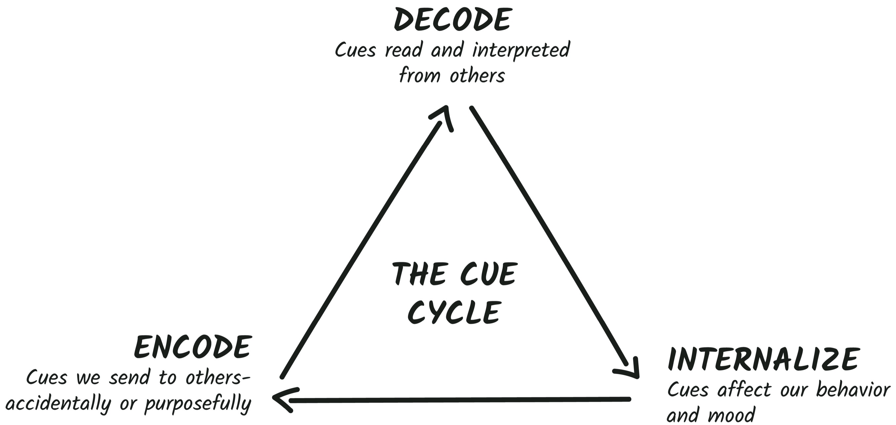

## CHAPTER 2

## How Cues Work

In 1498, Leonardo da Vinci finished painting _The Last Supper._ It would become one of the most famous paintings in the world. It is a beautiful, historic piece of art, but when you look deeper, you can see a new dimension: Da Vinci hid nonverbal cues in plain sight.

The painting depicts Christ’s final meal with his twelve apostles before he finds out he has been betrayed by Judas.

What cues is da Vinci showing? First, take a look at Christ’s hands. He’s depicted with his arms held wide, palms open toward the viewer. This is a universal cue of openness. Seeing another person’s palms tells our brain they have nothing to hide. Christ also holds one palm facing down, and this is unusual. Typically, Christ is depicted with _both_ his palms open toward the viewer. Why this difference?

The **palm up cue** is a signal of openness and trust. It’s a high warmth cue, best used when trying to get people to be more collaborative and open. When I get to the question-and-answer part of my presentations, I always use the palm up gesture to invite questions.

The **palm down cue** is a signal of power and dominance. It is a high competence cue.

The palm down cue is best used when giving directives, commands, or instructions in situations that don’t call for questions or feedback. It is most often used by people in positions of power.

Christ is depicted exhibiting both of these cues. Put together, they hit the perfect blend of warmth and competence.[[*]](31_Footnote.xhtml#footnote_1 "footnote")

The next cue is in Christ’s overall posture compared to the figures of the twelve apostles. Christ is depicted in the most expansive pose of any figure in the painting. It appropriately signals his outsize importance in relation to the others at the table. And it’s another competence cue. The more space someone takes up, the more confident they look and feel. Da Vinci was able to signal Christ’s importance with this **expansion cue**.

Da Vinci balanced this expansive competence cue with the ultimate warmth signal—a head tilt. A**head tilt** is a universal sign of engagement. We literally tilt our head to the side when trying to hear someone better, giving one of our ears a better chance to hear what is being said.

You’ll notice a few of the apostles use expansion cues without head tilts or head tilts without expansion cues. **Christ is the only figure with the balance.** Unwittingly or not, da Vinci used the perfect balance of cues so Christ could be viewed as both highly competent (powerful) and highly warm (trustworthy).

The corollary to an expansion cue is a **contraction cue**. People who contract their body and take up as little space as possible signal low confidence. Who has the most contracted pose? Judas, of course. The apostle who betrays Christ.

Judas is also showing a **blocking cue** : he has his arm in front of his torso. Blocking protects our body by putting something between us and another person. It can be as simple as crossing our arms or holding props in front of us like a laptop, clipboard, or sofa pillow. Whereas Christ is completely open, with nothing blocking our view of him, Judas is depicted as the only apostle in a contracted blocking pose. Others hold up their hands in innocence or point or gesture, but only Judas blocks. It’s a clever way for da Vinci to signal Judas’s guilt. Someone guilty of a crime is more likely to feel the need to nonverbally protect themselves by blocking.

Judas is depicted looking behind him. Can you guess why? This is an interesting **distancing cue**. When we try to get away from something or someone, we need to physically distance ourselves, sometimes literally pulling back. Liars often jerk their head back, scoot backward, or look away when confronted with their guilt. The phrase “watch your back” has some nonverbal truth to it. This is another cue signaling Judas’s betrayal and shame.

Judas has one more illustrative cue. He is clenching his right fist. Not only does this conceal one of his palms from us—which makes him look more closed off—but it also signals that he is hiding something. A**fist** is a unique nonverbal cue. Sometimes it’s positive—a signal of unshakable determination. And sometimes it’s negative—a signal of concealment and anger. Researchers find that our hands evolved to make fists for punching. We make a fist right before we punch someone. This is another clever hint to Judas’s anger and attack on Christ.

Cues give us the full picture _behind_ this painting. Da Vinci’s masterful use of cues allowed him to tell a richer story in a single image. **When you read cues, you see hidden meanings, understand more, and everything has more clarity.**

Luckily, our brain is hardwired to look for hidden meaning in cues. It’s always scanning our real-life interactions in real time to provide us with additional social information. You probably picked up on some of these cues in _The Last Supper_ without even realizing it. Let’s hone that power.

### Your Secret Superpower

Imagine this: You’re interviewing for a job. On paper, it’s a match made in heaven, and the interviewer seems happy with your answers. But halfway through the interview, you get a nagging sense that you’re not getting an offer. Why?

Or you give a presentation and you have a sinking sensation that people are tuning out. Where did it go wrong?

Or your partner tells you, “I’m fine,” but you know with absolute certainty that things are not, in fact, FINE.

You’ve certainly experienced these sensations before. They often come to us in the form of “intuition” or “gut feelings.” But what’s really happening is that your brain probably saw a cue from the Danger Zone of the Charisma Scale it didn’t like. This ability, this spidey sense, is our secret superpower. **Learning to decode cues gives a name to your intuitive hits.**

Whether you know it or not, you have a sophisticated cue reading machine inside your head. Our brains have dedicated neural tools for handling and managing social signals. One part of the brain reads and identifies emotions displayed on another person’s face within thirty milliseconds!

Though our brain is incredibly skilled at picking up these subtle signals, far too often this superpower is left untapped. While your lizard brain is great at picking up on social cues, your human brain often has trouble making sense of everything.

Culturally, we emphasize language as communication, and children are taught to express themselves verbally, which means our cue decoding skills atrophy. But cues remain one of the most powerful communication mechanisms we have. In this chapter, I’ll share the fundamental rules of how cues work and why.

### Your Cues Are Contagious

“I’m getting anxiety just being here,” admitted Karamo Brown. Brown is one of five hosts on the hit Netflix show _Queer Eye._ And he’s working to make over “Anxious Activist” Abby Leedy. After only a few hours with her, he admits to “catching” her anxiety.

In the show, the hosts (nicknamed the Fab Five) help make over one “hero” by giving them a refreshed look and a newfound sense of confidence. And Leedy certainly needs the boost! There isn’t a moment on-camera when Leedy isn’t in the Danger Zone. She leaks nervous cues—wringing hands, hunching shoulders, anxious pacing, and biting nails.

Fellow host Antoni Porowski even asks her, “Why do you look anxious in your own kitchen?” And then, “Are you an anxious person?”

Leedy cowered. “Ah, yeah . . . I would . . . I’ve been told that I seem anxious. Um, I think that is probably because I yeah . . . I am . . . yeah, pretty anxious,” she admitted.

We watch her anxiety slowly spread through the Fab Five. Luckily, in true TV show fashion, by the end of the episode, Leedy uncovers her true source of confidence and promises to work on herself more.

What the Fab Five experienced is called **emotional contagion**.

EMOTIONAL CONTAGION

When one person’s emotions and related behaviors directly trigger similar emotions and behaviors in others.

Have you ever been excited by someone else’s good news? Or felt sad after being with someone going through a tough time? When your brain identifies an emotion in others, it primes your own brain to feel the same way. Your cues don’t just influence your emotions, they also influence other people’s emotions. This is why we can often “catch” a bad mood.

In one experiment, researchers split students up into small “salary committees.” Each group was tasked with allocating a share of company funds to imaginary employees. But there was a catch. Each group was assigned an actor who was told to show one of four different moods: “cheerful enthusiasm,” “serene warmth,” “hostile irritability,” and “depressed sluggishness.”

Through projecting a simulated disposition, the one actor was able to completely change the decisions of the entire committee. When the actor was cheerfully enthusiastic and serenely warm, the groups got along better, had less conflict, cooperated more, performed better on the task, and _distributed raises more fairly_ than the negative groups. **One person’s mood can affect both the mood of others and an entire group’s collaboration and decisions.**

Here’s the thing: None of the other committee members could pinpoint exactly why their meeting changed directions. We are grossly unaware of our power to infect others—both positively and negatively.

Another study found that as soon as we see another person’s facial expression, the muscles in our own face activate and subtly mimic it. This in turn causes us to _feel_ the emotion they are transmitting. Researchers found that people caught moods within only _five minutes_ of being near one another—even when working on different projects.

Simply moving our facial muscles in the positions of expressions like tiredness, fear, and happiness **activate our autonomic nervous system to feel the simulated emotion**. Another person’s nonverbal cues can change _our_ hormone levels, cardiovascular function, and even immune function.

Luckily, learning cues is one of the best ways to prevent their negative contagion. How? **Labeling**. UCLA neuroscientist Matthew Lieberman found that the moment we label a negative cue, it disengages the amygdala. In one experiment, researchers showed participants photos of an angry face while in an fMRI. Just seeing the angry face activated the fear center of participants’ brains—we don’t like to see people who are angry, it makes us nervous (and we don’t want to catch it!). But here’s the key: When participants were asked to label the emotion they saw, it immediately disengaged their amygdala, and their fear subsided.

**Labeling negative cues reduces their impact.** Learning cues will help you spot and stop negative cues being sent to you and be more in control of the cues you send to others.

Your cues can also help you influence for good and be positively contagious. Leaders can learn to spread productive feelings to others. When you project warmth, people are more likely to be warm with you. When you project a competent, confident calm, others are more likely to follow suit. Your charisma cues can flip others’ negative ones. We just need to model the cues we want to inspire in others.

### The Cue Cycle

When most people think about communication, they think about decoding cues.

**Decoding is how we read and interpret social signals from others.** Social signals help us decipher everything about a person—their intentions toward us, their trustworthiness, their competence, even their personality. Too often we miss cues and then wonder why people act the way they do. Decoding cues is essential for accurately reading emotions, predicting behavior, and solving your people problems. As you become more adept at decoding cues, you’ll be able to figure out the difference between what people say they are feeling and what they actually feel.

But decoding is only a part of the equation. What about the cues we _send_ to others? This is called **encoding**.

**Encoding is how we send social cues.** We send some cues purposefully—we stand with good posture to show confidence, or we smile to show friendliness. But many of our cues are accidental. We can’t control every cue we send—it’s almost impossible to alter your blink rate, for instance—but we can influence our most important cues.

Purposeful encoding puts you in control of how others perceive you. This helps you feel more confident, make stronger first impressions, and create a more memorable presence. You’ll also avoid sending signals that are at odds with your relationship goals, like wanting to impress people but sending out too many warmth cues or seeking rapport but encoding competence cues that shut down bonding.

That fateful day in the tank, Jamie Siminoff missed the mark on _both_ decoding and encoding. Even though he had a great product, he didn’t encode the right cues to hook the Sharks and build their confidence in him. He also failed to decode the cues that could have saved his pitch. A little decoding could have alerted Siminoff to their early doubt.

**Internalizing is how cues influence your internal emotional state—your productivity, your success, and your mood**. The cues we decode in the world change how we feel about the world. Every cue we spot is internalized, which influences which cues we subsequently encode.

Imagine you’re in a meeting and you experience a few negative cues from a colleague. They barely murmur hello; they roll their eyes at your comment and huff an exasperated sigh when you give your update. As you begin to contemplate what this might mean, something else happens in your body to help you figure it out. Researchers found that when we decode a cue of social rejection, **it actually increases our field of vision to see more, just in case another, perhaps more socially dangerous cue is coming our way**.

In other words, we spot certain cues, they are internalized, and then our body changes to adapt to what we think might come next. We decode cues, internalize their meaning, and then encode responses.

We don’t realize that cues affect so many aspects of our success—not just the smoothness of our interactions and the clarity of our communication, but also our stress levels, our motivation, and even our feelings of inclusion at work. One MIT researcher observed that employees who receive positive cues from superiors and colleagues feel more included, engaged, and loyal and therefore become better performers. On the other hand, when employees receive negative cues, they feel excluded, devalued, and underappreciated. This in turn makes them less productive and connected and leads to lower morale.

PRINCIPLE

Cues trigger both positive and negative loops for you and others.

### There’s No Mute Button

Have you ever played poker? I think the hardest part of poker is bluffing. It’s really hard to mute your cues to hide a particularly good or bad hand. In one fascinating study, MIT researchers studied bluffing. Researchers discovered that players often try to go “mute” while bluffing by going completely still and saying nothing. Players hope that if they conceal all gestures, no single gesture will give them away. **Muting** is a cue in and of itself. A bluffer’s tell is that they try to show no tells at all.

I find many professionals also try to “go mute” to hide their emotions, neutralizing their face and using a sterile tone of voice in an attempt to become unreadable. Here’s the problem: We really can’t mute our cues. In fact, muting your cues sends you directly into the Danger Zone.

Muting is an attempt to be sterile. And sterile people are boring, forgettable, and cold. Concealing your cues is not the goal. Our mission is to align our cues with our professional and relationship goals.

### CHAPTER CHALLENGE

Want to know how you are really coming across to others? The only way to accurately assess the cues you are encoding is to watch yourself on video (painful, I know!).

Try to record yourself in meetings or video calls where you can be as natural as possible—don’t overthink your cues. We want to see what your starting point is.

Or dig up some old video call recordings or social media clips of you speaking or giving a toast. The more you have to study, the better.

**As you learn each cue in the following chapters, revisit your videos to see which cues you use naturally.**
