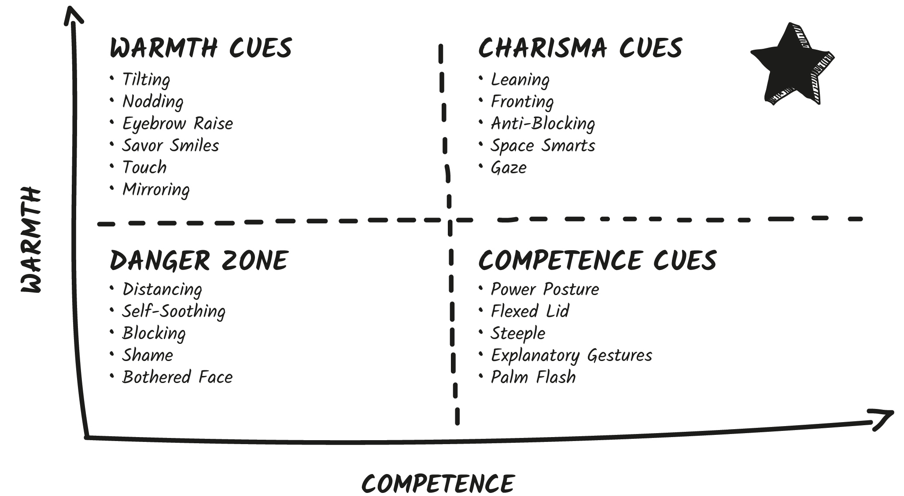
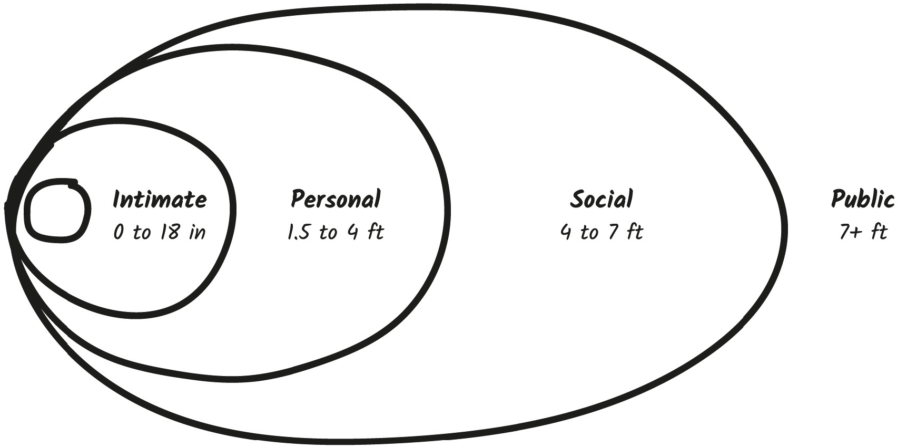
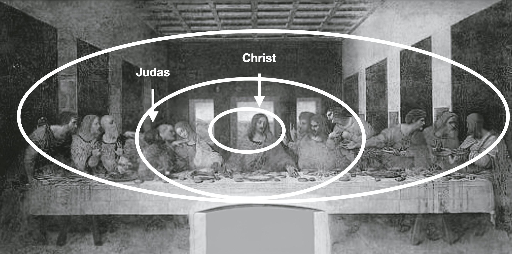
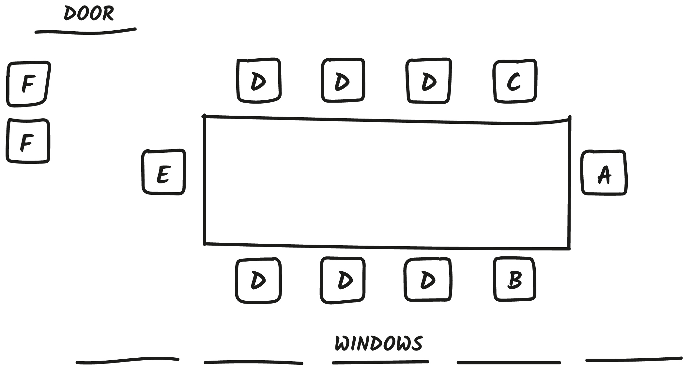
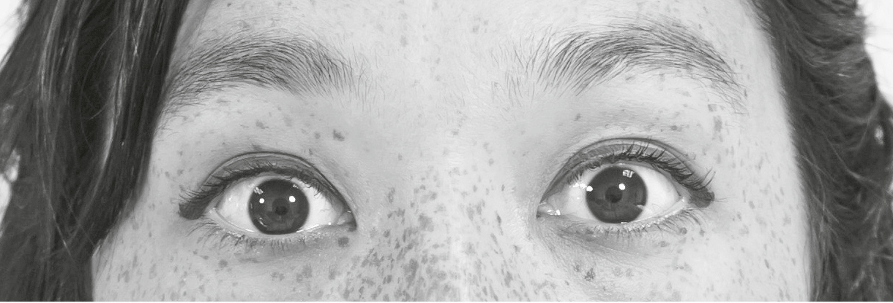
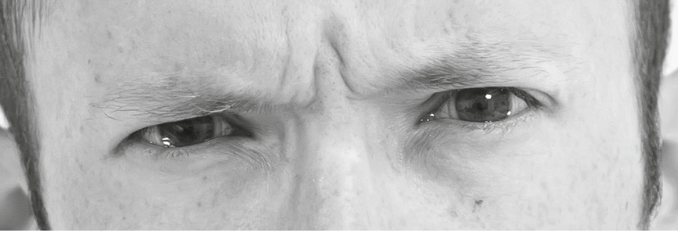
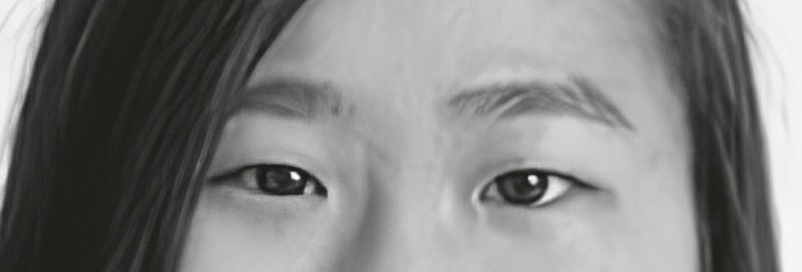
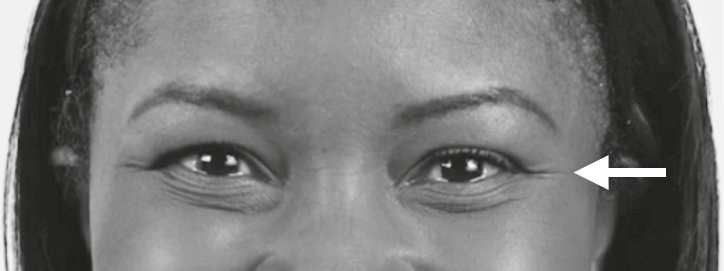
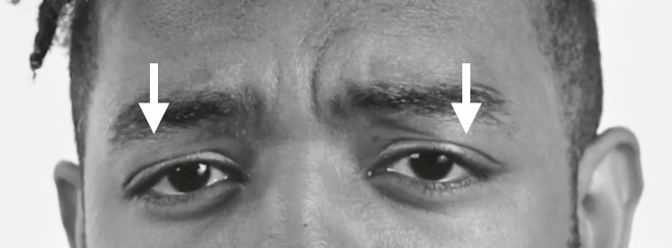
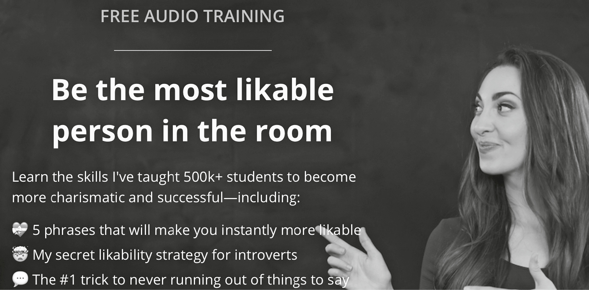

## CHAPTER 3

## The Body Language of Leaders

Growing up in Little Rock, Arkansas, Kofi Essel had two big dreams: become a doctor and go to the NBA . . . at the same time.

I met Kofi many years later while we were both studying at Emory University. From the moment I met him, I knew he would go on to do big things. While he didn’t grace the NBA with his presence, he did go on to become a doctor, a professor of pediatrics, and an advocate for children’s health.

Now working as a pediatrician at Children’s National Hospital in Washington, DC, Dr. Essel has a tough job—he has to quickly connect, build trust, and show competence in the first few seconds of meeting his patients. And it’s usually at least two different types of people at once—a child and a parent.

“When I think about connecting with my families . . . I have a few seconds to really make an impact. Make a statement. Because if not, I have lost them completely,” said Dr. Essel.

To do this, Dr. Essel has an engagement protocol he uses with every family he sees: “First thing I tend to do is greet the child. Typically, I high-five the child. Then I try to drop down to the child’s eye level. . . . I’ll bend down or get down on my knees to really make sure I’m engaging them,” explained Dr. Essel.

Dr. Essel has found that when he greets the child _first_ , it wins over the parents. He noticed this by decoding facial cues. “I have noticed if the parents see that I engage with the child, it really takes the stress off of them. I see their face sort of changing. They seem more comfortable with me if I can engage with the child,” said Dr. Essel.

Engagement is central to Dr. Essel’s practice. **“People are always looking for appreciation, acceptance, and acknowledgment,”** he said. And his goal is to show this verbally and nonverbally.

Once the child feels welcome, Dr. Essel literally turns his attention to the parents, pointing his body and gaze toward them, making eye contact, and shaking hands. Dr. Essel has discovered that this small nonverbal cue is so important, he has created a way to do it even while taking notes on his computer. “I make sure I have a direct line of sight with the family,” he says. “I don’t like to have that divide there.”

Dr. Essel finds that any kind of barrier puts up walls between him and his patients. He has a nonverbal trick for handling this: “To emphasize that I’m listening . . . I’ll stop typing and turn my body all the way to them to let them know that I’m here.” This communicates to the other person that “if you are sharing something with me that you need me to be completely and fully present for, I will do that.”

Dr. Essel has a time-tested nonverbal protocol for interacting with his patients that makes him highly charismatic. Before we dissect the cues he uses, let’s see why using nonverbal cues is a critical part of your charismatic communication.

### The Power of Nonverbal

When most people think about communicating, they focus on one piece: verbal. While words matter, unfortunately, your words alone aren’t enough. **Your nonverbal cues influence—by either enhancing or detracting from how your words are understood.** The old cliché is true: “You hear what you see.”

You can have the greatest story, the best piece of data, or the most impressive credentials, but if you don’t share them with the right cues, they won’t land.

You’ll recall from the introduction that nonverbal cues account for 65 to 90 percent of our total communication. We’re constantly sending or encoding nonverbal cues to others through our gestures, facial expressions, body movements, and posture. And of course in every interaction, cues are being sent right back to us. When you know how to accurately decode them, you get a sneak peek into someone’s inner world.

Research finds that improving your ability to read nonverbal cues really pays off. Nonverbal prowess is a skill that is helpful in almost every area of life—socially, romantically, and professionally.

**One study** **found that people with strong nonverbal cue recognition earn more money in their jobs.** Why? Being able to quickly and accurately read emotions gives you an incredible advantage in the workplace. You can better predict behavior, spot hidden feelings, and get your ideas across more clearly. People who are adept at nonverbal skills “are considered more socially and politically skilled than others by their colleagues,” explains the study’s author.

Understanding nonverbal cues can help all of your relationships. Researchers found that students who made more errors decoding the emotions in facial expressions and tones of voice reported significantly less relationship well-being.

Researchers at the University of Victoria filmed real job interviews. They then showed the videos to a team of judges with the sound turned off. Simply by observing the candidate’s nonverbal cues, judges were able to accurately assess their hireability _and_ social abilities. Amazingly, the candidate with the highest ratings from the judges was the candidate who actually got hired. Just think about that for a moment! How much time have you spent thinking about and practicing your answers to the questions you know will come during an interview? But how much time did you spend thinking about how you were going to sit, how you were going to say hello, or what gestures you were going to use? _How_ you say something is just as important as _what_ you say.

**We use nonverbal cues to assess everything—capability, social skills, and hireability.** And nonverbal cues are either supporting your message or detracting from it.

In this chapter, I’ll teach you the highly charismatic nonverbal cues leaders like Dr. Essel use to be nonverbally captivating. These special cues hit the sweet spot of both high warmth and high competence.

In chapter 4, I’ll show you the highly warm cues that signal trust and openness.

Then, in chapter 5, we will go through the highly competent nonverbal cues that signal power and intelligence.

And in chapter 6, I’ll show you the cues to avoid in order to stay out of the Danger Zone. These are the cues that trigger people’s distrust, disrespect, and all the really bad _dis-_ words you can think of—disengagement, disgust, and dislike.

Using purposeful cues, Dr. Essel created a nonverbal protocol to build trust and rapport with his patients more quickly. Now let’s create one for you.

SPECIAL NOTE

### Cultural Differences

While many of our nonverbal cues are universal, some, of course, have cultural influences.

Italians tend to use more hand gestures than Americans.

In India and Pakistan, people use nodding differently from Western cultures.

In certain Asian and Middle Eastern cultures, making eye contact with superiors is considered rude. In America, it is considered rude not to make eye contact with superiors.

Luckily, there are more similarities than differences in nonverbal behavior across cultures. Researchers conducted a meta-analysis of ninety-seven studies and found that emotions are universally recognized at better-than-chance levels across cultures.

Not surprisingly, people were more accurate at detecting emotions expressed by others in their same national, ethnic, or regional group. This tells us that you have an in-group advantage when you are decoding cues, and a distinct _disadvantage_ when you are decoding cues of people outside it. All the more reason to get clear on cues and their meaning—so we can equalize our decoding abilities.

For the purposes of this book, whenever possible I will stick to universally recognized cues. If there is a strong cultural difference, I will note it.

### CHARISMA CUE #1: Lean Like a Leader

Can we play a little mind game together?

Wherever you are right now—whether you’re sitting or standing, would you mind leaning forward, please? Not too far, just a few inches. Go ahead and hold the lean for ten seconds.

How does it feel? Notice anything interesting?

This simple movement activates a specific part of your brain that makes you feel more motivated. In a fascinating experiment, researchers found that when they asked participants to lean forward, they had increased neural activation in the left frontal cortex. This is the part of our brain associated with desire and motivation—it creates an eagerness to move toward something. **The control group, who was asked to lean back, didn’t exhibit any increased activation at all.**

When we lean in, we literally feel more motivation. When we lean back, we lose motivation.

Humans lean toward people, things, and ideas they like. When we lean, we’re able to activate our five senses easier.

We lean in to **see** something more clearly.

We lean in when we need to **hear** something better.

We lean in when we’re about to **touch** something.

We can lean in to **smell** something better.

We lean in when we want to pick up something and **taste** it.

If we like something, are interested in something, or want something, we want to get closer to it. So it makes sense that we decode leaning forward as a signal of interest. We like it when people lean toward us. And leaning in is the ultimate compliment because it makes _us_ feel interesting and wanted. It doesn’t take much—just a few inches will do the trick.

**Lean cues** are powerfully charismatic nonverbal signals because they both communicate interest to others and trigger internal interest.

In another study, researchers asked participants to look at photographs of people leaning forward or leaning back. They were then asked how much they liked or disliked each person. Results were clear: People seen leaning forward got much higher likability ratings.

**Leaning in is the single fastest way to look (and feel) interested and engaged**.

I think of leaning in as a nonverbal **boldface**. When you lean in, it bolds or highlights whatever has just been shared. I lean to show:

  * Emphasis: If someone is saying something I think is important, I lean into them. If I’m saying something important, I lean in slightly.

  * Agreement: If I agree with what someone is saying, I always bold it with a lean. It’s to demonstrate to that person that _I’m so into what you’re saying, I want to get closer to hear it better._ And it helps me feel even more motivated about understanding them.

  * Partnership: If I’m feeling kinship with someone or want to show I’m on the same page, I will lean in toward them. This works especially well in the first few minutes of an interaction. Dr. Essel leans into and down to his patients’ level to build rapport.

You can use leans while sitting or standing, on stages, and even on video calls.

FUN TIP

### Germ-Free Leans

If you don’t want to shake hands or touch when greeting, you can use the lean as a replacement. Zoologist Desmond Morris reportedly recorded slow-motion analysis of people greeting one another and found that non-embracers showed tiny, perceptible leans toward each other as a way to show the intention of embracing without the actual embrace.

One of the biggest misconceptions about leaning is that leaning back looks cool. Well, it is literally cool . . . as in cold. Leaning back or **slouching** is a Danger Zone cue.

One of the most uncharismatic things you can do is lean back, slouch, or recline while someone is sharing something that’s important to them. Leaders make a point of leaning in.

PRINCIPLE

Lean in to show and stimulate interest, engagement, and agreement.

When to lean

  * When you’re talking to colleagues or partners and you want to show them how much you support them, are interested in their idea, and are engaged with them.

  * When you want to call attention to someone else’s idea and show you agree.

  * When you are giving a presentation, to emphasize your most important points.

When NOT to lean

  * When you disagree with others. In fact, withholding leaning is a great way to respectfully show someone you are _not_ into what they’re saying.

  * When you need to create space or boundaries. Have a toxic person in your life? Do NOT lean in while stating your needs. Stand tall, stand firm.

  * If you feel like you’re bowing, you’ve leaned too far.

### CHARISMA CUE #2: Open Body, Open Mind

Imagine if Christ in _The Last Supper_ had been painted with his arms crossed. Or if the Statue of Liberty was clutching her torch in front of her chest, instead of proudly over her head, arm outstretched. These works of art wouldn’t be as powerful, right?

**A closed body signals a closed mind . . . and it inspires close-mindedness in others.** I shared this phenomenon with my friend and famed online marketing expert Brian Dean. One day I was visiting his website and noticed his header had a photo of him with his arms crossed:

Knowing Brian’s talent with data, I proposed a test. “Replace this picture with a photo of you with uncrossed arms. It will increase your website conversions,” I told Brian. “It will make you look more open-minded and make people be more _open_ to opt in to get your email updates.”

Brian agreed to try this out and set up what’s called a split test on his website. This means 50 percent of visitors to his site see the image of Brian with arms crossed and the other 50 percent see the open body version. Everything else on the website stayed exactly the same.

Split tests enable you to truly compare two versions of the same variable (in this case, body posture) with thousands of visitors. Over a period of ninety days, 237,797 people went through the test. And . . . the open posture won by A LOT. Simply switching to the open posture increased Brian’s website conversions by 5.4 percent! That might not sound like much, but in terms of web traffic conversions, it’s phenomenal. It translates to thousands more email subscribers from one tiny cue change.

Nonverbal cues don’t just have an effect in situations where you are physically present. They also come across in your profile photos, websites, social media photos, and marketing materials. Researchers asked professionals to rate videos of people speaking in a business setting. It didn’t matter whether participants watched the videos on mute or with the sound on. **Everyone with crossed arms was rated as more distant and defensive and less charismatic.** And this happened with one or both arms crossed over their chest.

Humans don’t like to have barriers between us and other people while trying to connect. Recall that in _The Last Supper_ , Judas was depicted with his arm across his chest, exhibiting a **blocking cue** —which puts a barrier between ourselves and someone else. As I’ve discussed, this is most commonly done with crossed arms or with objects like a computer, purse, podium, clipboard, or pillow that we clutch or put in front of our torso.

Here’s the problem: Most people _like_ crossing their arms. Crossing our arms feels good because it makes us feel less vulnerable. With our arms across our chest, we protect our vital organs. But it comes at a cost. Your charisma is compromised for a little extra comfort. And many of us merely cross our arms out of habit. This small nonverbal cue creates a physical and emotional barrier between you and the people you’re trying to connect with.

You might notice that when someone feels nervous in a meeting or on a date, they suddenly and often subconsciously cross their arms. This is an instinct to protect themselves from whatever is making them nervous. It’s as if they’re giving themselves a hug. When someone engages in sudden blocking behavior, I pay close attention to the behavior and make a mental note: they likely want to feel more secure.[[*]](32_Footnote.xhtml#footnote_1 "footnote")

Dr. Essel makes a point of deliberately moving his computer to show he’s removing a barrier. **He learned that any time our bodies aren’t open, people are less likely to open up**.

Making a point of removing a barrier is an **anti-blocking cue** , a wonderful way to demonstrate charisma and get people to open up.

Evy Poumpouras is a former Secret Service agent who hosts Bravo’s TV show _Spy Games._ In her life as a Secret Service agent she conducted interrogations and interviews to get people to open up. And she used a little nonverbal trick that involved anti-blocking. “When I would do interviews, I would take my phone. I would put that thing away. I would take my watch off. . . . I wanted that person, whoever it was, to know that I had nowhere to go. And all that mattered, in that moment, was them,” she explained.

FOR STAGE PRESENTERS

If you present onstage, you often deal with microphones and podiums. Beware: These can cause accidental blocking. When handling a microphone, never, ever clutch it to your chest. People often make the mistake of tucking in their chin and contracting their body as they speak into the microphone. Hold it up and out. Or better yet, get a hands-free microphone!

Watch out for podiums. Physicist Neil deGrasse Tyson is frequently asked to speak to organizations, but the podium plagues him. “They always say, ‘You’ve got to stay behind the podium,’ ” he says. But he likes using the whole stage to communicate. “What, you want me to stand here for two hours and talk? I say, No, I will use the entire stage,” he explained. A podium limits stage movement, the fluidity of your gestures, and makes you look small.

Researchers have even found that a podium blocks presenters’ ability to share new material. If you can help it, avoid standing behind a podium at all costs. It’s a huge blocker to charisma.

Charismatic people also make a point to be as open and barrier-free as possible with the people they meet. Remember how our cues are contagious? **If you’re open, it inspires openness.** When someone sees you’re comfortable enough to be barrier-free, it encourages them to open up as well.

And openness is not just important as a social signal to others, it’s also a critical signal for _yourself._ In a mind-blowing study, researchers in 2017 found that the way you hold your body changes the way you think. Participants were asked to complete creative tasks in different body postures. When participants sat in an open posture, they were significantly more creative! Bottom line: **Closed body posture makes us less creative and less open-minded.**

FUN TIP

### Anti-Blocking Props

Knowing that blocking can clog up our thinking, I try to discourage others from blocking as well. In my first few presentations as a speaker, I noticed that when I gave attendees handouts before getting started, they ended up clutching them to their chests or holding them in front of their bodies during the entire lecture. Now I wait to give handouts until a break or before the question-and-answer session. Think about what blocking props you might be using. Are people accidentally using them to block you out?

PRINCIPLE

To inspire openness, open up nonverbally.

When to be open

  * When you are in one-on-one interactions where you need to build rapport. Make a show of removing all barriers between you and others. Clear the table in a client meeting. Push aside a computer in a brainstorming session. Move your clipboard to the side when talking to people. Scoot your coffee over on a date. Open body, open heart, open mind.

  * When you need to spark ideas. Want to be more creative, open-minded, imaginative? Uncross your arms. Want others to be more creative, open-minded, or imaginative? Encourage them to uncross theirs. Hand them a cup of water, give them a pen to take notes, show them a photo of your family so they have to open up and lean in.

  * When you are presenting or pitching. Always try to be barrier free—an open torso is the most charismatic. Use a remote instead of sitting in front of your computer. Step away from the podium. Leave your arms loose by your sides so you can gesture easily and keep your torso open to the audience.

  * When you are choosing profile pictures—especially for LinkedIn or dating app profiles. A closed body signals a closed mind and a closed heart.

When NOT to be open

  * When openness is not the right message. Irish mixed martial artist Conor McGregor is often photographed with his arms crossed. And this makes complete sense for his brand. He doesn’t _want_ to be seen as open! It’s better for his reputation to be seen as closed, intimidating, and tough. For him, crossed arms sends the right cues—he wants to be in the Danger Zone.

  * When you don’t want to engage. Is someone making you feel uncomfortable? Cross those arms! If you want to signal you’re closed for business or aren’t open to someone’s ideas, block them out. This works well with close talkers or over-touchers.

### CHARISMA CUE #3: Front Forward

John Stockton was a normal college senior playing basketball for Gonzaga University. Then, in June 1984, his entire life changed. Stockton was a surprise selection by the Utah Jazz in the first round of the 1984 NBA Draft. This was so shocking that when the announcement was made to 2,000 fans, “there was absolute silence. Pre-dinner blessings are noisier,” reported the _Deseret News_.

Little did they know that Stockton would go on to play nineteen seasons for the Jazz, become a ten-time NBA All-Star and a member of the U.S. men’s Olympic team, and be named one of the fifty greatest players of all time by the NBA.

What made Stockton so successful? One stat stands out. Despite retiring in 2003, he still holds the record for most assists of all time: 15,806, to be precise. (Jason Kidd comes in a distant second with 12,091 assists.)

In basketball, an assist is when one player makes a pass to a teammate that leads that teammate to score a basket. You’ve probably seen thousands of assists if you’re a regular basketball watcher. What I bet you don’t know though is that there is a critical nonverbal cue that makes assists successful. Stockton used it expertly: fronting.

**Fronting** is when you angle your body to signal attention. Specifically, we point our three T’s—toes, torso, and top—toward whatever we’re paying attention to. Our physical orientation cues others as to our mental orientation. Fronting is a great cue to know what someone is thinking about.

When someone is about to leave, they’ll turn their toes toward the exit.

When two people are having a great discussion, their entire bodies align as if their toes, hips, and shoulders are on parallel lines.

When someone is hungry, they often front toward the buffet.

FUN TIP

### Crushes and Bosses

When my team and I observed work holiday parties, we noticed most people’s toes were angled toward the boss, the most important person in the room, even when people weren’t speaking with her. Want to know who people really respect? Watch their toes.

People also tend to point their toes toward their crush. When our mind is on someone, our toes follow suit and are always at the ready to physically move toward them.

Conversely, people _don’t_ front when they _aren’t_ paying attention. When people are more interested in an email than in a presentation, they keep their body, feet, and head turned mostly toward their computer, only occasionally glancing up front. When someone isn’t that into a conversation during a networking event or party, they angle their body out and point their feet toward the open room—in hopes of escape. On a bad date, people angle their bodies out and away.

The difference between the good and the great assisters of all time is their ability to signal to other players nonverbally before they even make a pass. Stockton used fronting to nonverbally communicate with his teammates. Stockton said this often came across as mind reading. “You throw crazy passes, and he catches them. People say, ‘Wow. He must know what he’s thinking,’ ” said Stockton, describing how he wordlessly threw expert passes to his teammate Karl Malone. Together they were known as the dynamic duo.

When you watch clips of Stockton’s assists, you will notice that right before he makes a successful pass, he first turns his head toward his target, then angles his torso, and finally, if he has time and enough space on the court, points his toes in the direction of where he will pass the ball.

This method set him up for thousands of successful assists. And today Stockton is regarded as one of the greatest point guards of all time. Stockton cued other players to where he was going to send the ball. **His attention caught their attention.** Stockton nonverbally telegraphed to other players where the ball _would_ be before he ever passed. Without realizing it, you might be doing the same.

How does fronting work in real life? From the top down.

When something first catches our attention, we turn our head toward it. Biologically it’s easier and takes less energy to move just our head. If we’re really interested, we turn our torso—all the better to be prepared to engage or embrace the object of our attention. And if we want to give it our full attention and maybe even get closer to investigate, we turn our toes as well.

With all the effort involved in physically reorienting ourselves, it’s not surprising that fronting is a nonverbal cue for respect. It’s a great way to make someone feel nonverbally engaged. Leaders give their full nonverbal attention to everyone they’re with. They demonstrate with their body that _You’re so important to me, I’m going to angle my entire body toward you._

The fastest way to show someone that you’re interested, present, and engaged is to fully square your body toward them. **The biggest mistake we make while attempting to build connection is giving only partial nonverbal attention.**

  * Someone is speaking to us and we barely glance their way. “Uh-huh,” we murmur without taking our eyes off what we’re doing.

  * A colleague speaks up in a meeting, and we don’t even bother to turn toward that person, focusing on the presentation slide deck at the front of the room.

  * Our partner comes home with great news and our gaze stays locked on the TV instead of moving to them. “Great news,” we call over our shoulder.

Want to show someone they matter? That you’re listening? **Turning toward is tuning in.**

Dr. Essel showed his patients he was listening by actually turning toward each person in the room. In _The Last Supper,_ Christ was depicted as the _only_ figure “fronting” with the viewer. The apostles are gesturing or angled away from us. Only Christ is turned toward us from toes to top.

Fronting is one of the easiest cues to master, with the biggest payoff. It’s a powerful charisma cue for two reasons:

  1. Fronting makes it easy to encode and decode nonverbal cues. You can see someone from tip to toe and they can see you.

  2. As we learned from the Cues Cycle, aligning ourselves physically makes it easier to get on the same page emotionally and mentally.

One of the best ways to use fronting is to make a point of turning toward someone and aligning with them. This is especially important when you’re taking notes on a computer.

You immediately become more charismatic by fronting with someone. Do it while standing in the break room, while mingling at a bar or conference, or even when talking to your children. I notice that when I give my daughter my full nonverbal attention by angling toward her, she becomes calmer.

FUN TIP

### Inviting Fronting

Want to be approached at a bar or networking event? Stand against the bar or lean against a high table and front with as much of the room as possible. This shows you’re open to connection and invites people to come speak with you.

Want to approach others? Look for open toes. When people are very engaged in conversation, they angle their entire body toward each other—so their feet are on parallel lines. Don’t interrupt this kind of conversation! When people are open to interlopers, they stand with their feet angled out in an open-toe position, like a croissant. It’s as if their toes are saying, “This is good, but there’s room for one more. Come join!”

What about the opposite? Need to be “rescued” from someone who won’t stop talking? Front toward a friend or host that can save you. This subtly cues them to come over and help.

And don’t forget to front while seated. If someone down the conference table speaks up, rotate your chair and swivel your body to front with them.

PRINCIPLE

If you want someone to feel heard, accepted, and respected, turn toward them.

When to use fronting

  * To signal respect and/or care. Make sure your torso is turned toward people who matter to you. Greet your boss with full fronting when they come through the office doors, front with your partner when they’re sharing good news, always swivel your chair toward the person speaking.

  * To see what others value. Pay attention to where others are pointing their toes, torso, and top—it might give you a deeper understanding of where they’re focusing.

  * At the office. Make your office setup and furniture fronting-friendly. Move chairs and desks to make it easy for everyone to front. Circular boardroom tables are best. Swivel chairs make it easy.

  * When it’s time to go. Occasionally, I desperately need to escape a party early—my ambivert[[*]](33_Footnote.xhtml#footnote_2 "footnote") self isn’t the most charismatic after nine p.m. I casually indicate my desire to leave a conversation by fronting toward the door. You would be pleasantly surprised at how often people pick up on this subtle cue.

When NOT to front

  * When you want to prevent distraction. If I’m focusing intently on something and want to respectfully signal “I don’t want to be bothered right now,” then I do not front.

  * When someone is opening up too much. Ever had someone verbally vomit all over you? Or share TMI—too much information? If you find someone is oversharing, stop fronting! You’ve given them too much engagement. Angling away is a nice way to cue them to slow down and back up.

  * When you don’t have time or space. John Stockton made thousands of successful passes without fully fronting first. Sometimes all he had time for was a quick look or turn of the head. And that can work too when you are pressed for time—it’s certainly better than no turn at all!

  * When you need to be covert. Some of Stockton’s best assists were made on the sly, where he _deliberately_ didn’t front because he was sneaking a pass to someone. If you’re trying to hide your attention and intentions, don’t front.

### CHARISMA CUE #4: Be Smart with Space

“She wants to say hi. She’s with her new boyfriend,” says Jerry Seinfeld.

“What’s he like?” asks Jerry’s mom.

“He’s nice. Bit of a close talker,” said Jerry.

“A what?” she asks.

“You’ll see,” said Jerry.

A few minutes later Elaine’s new boyfriend walks into Jerry’s apartment and proceeds to stand six inches away from everyone he meets. While practically talking into people’s mouths and breathing in their faces, the “close talker” is totally clueless to his social faux pas.

This episode of _Seinfeld_ brings to light an incredibly important nonverbal cue: **space**.

Anthropologist and cross-cultural researcher Edward T. Hall found there are certain unwritten rules that lead individuals to maintain distances from one another. As humans, we navigate space based on how we feel about others in our environment. **The closer we feel to someone, the closer we allow them to come physically.**

Hall proposed that we use physical distance to cue intimacy. In other words, you can _decode_ how someone feels about you based on how close to you they stand or sit. And you can _encode_ how you feel about someone by how close to them you sit or stand.

People constantly enter or exit our personal space bubbles. Hall identified four space bubbles or zones. While every person and every culture have their own specific preferences concerning space, I have some averages for you on the following page. There are four areas around our body where we like to interact with different categories of people: (1) the intimacy zone, about zero to eighteen inches from our body; (2) the personal zone, about eighteen inches to four feet; (3) the social zone, about four to seven feet; and (4) the public zone, with anything beyond seven feet.

  1. Intimacy Zone: We prefer to have only people we highly trust this close to us because it potentially makes our body vulnerable. When someone is in this space, they can reach out and touch us, kiss us, punch us, or take something from us. We often feel uneasy when someone accidentally enters our intimate zone.

  2. Personal Zone: This is the most commonly used zone. In this zone we can easily reach out and shake hands with someone. When we speak to colleagues, friends, or family members, this distance makes it easy to hear someone as well as exchange familiar gestures like arm touches or high fives.

  3. Social Zone: This zone is most often used for business or professional interactions that don’t require touch or deep conversation. It’s often used at parties, when ordering at a bar, or sitting around a conference table in a meeting.

  4. Public Zone: This zone gives us enough space to figure out someone’s intentions before an approach. If you are seven feet from someone, you can see their entire body, their hand gestures and posture. Someone might wave, nod, or call out to us from the public zone before being invited closer.

Are you ever unsure how someone feels about you? This is an understandable worry. These days there are all different categories of relationship—online friends, Instagram friends, hometown friends, friends of friends, frenemies, business friends. It’s hard to know where you stand. Here’s a little tip: Plant yourself and see how close the person comes to you. If they come right into your personal zone, they likely feel very comfortable with you and are excited to connect. If they stand or sit farther back, hanging out in the social zone (or even just waving or nodding from the public zone), then they likely need more time to warm up. If they come into your intimate zone, take note! They probably want to get _very_ close physically or emotionally.

In one study, researchers directed a negative comment—something like “Your handwriting is messy”—toward a participant. They found that negative comments caused participants to pick seats farther away from the researcher who had insulted them. Not too shocking, right? We want to steer clear of people who we feel threaten us. In business we don’t always know who has negative feelings toward us, but space can give us clues.

FUN TIP

### Video Space

One of the biggest mistakes we make on video calls is getting too close to the camera—this is forcing yourself into someone’s intimate space. Always be sure to be at least two feet away from your camera so your head, shoulders, and some hand gestures are visible. This will immediately help the other person feel more comfortable.

Da Vinci himself might have been subconsciously aware of these zones. He painted _The Last Supper_ using space as a clue to allegiance. Religious scholars argue that the apostles who were closest to Christ are also placed closest to him at the table. Interestingly, da Vinci chose to have no one in Christ’s intimate space.

If we loosely draw the four space zones over _The Last Supper,_ we can see how the apostles rank in terms of intimacy.

This has modern applications as well. Think of your standard boardroom or conference table. Where do you sit at a conference table?[[*]](34_Footnote.xhtml#footnote_3 "footnote")

The physically closer to the boss you are, the more in the know you are. For example, typically the boss or leader of a meeting sits at the head of the table facing the door in position A. (Occasionally a leader will sit in position E at the head of the table facing a presentation or a whiteboard.) This seat is inherently high in competence because it’s the farthest away from everyone but also has the most visibility.

The people who sit in positions B and C are usually seen as the most supportive of the Power Player. In this way, these seats are high in warmth. Research from Cornell University found that **the closer you are to someone physically, the closer you feel to them**. When you are this close, you can lean into your boss’s personal space, share documents, quietly share ideas in their ear, and even reach out for an arm touch or high five. In this seat, your opinion is more likely to be heard by the person sitting in the power seat, even if the group is talking all at once.

Dr. Richard Winters of the Mayo Clinic calls these the flanking positions. “When you sit in this position you can influence the flow of the meeting by assisting. You can draw attention toward or away from topics. You can prompt a speeding up or slowing down of the agenda,” said Dr. Winters.

The farther away you sit from the leader of the meeting, the less you will be recognized or called on. Middle seats (position D) generate less eye contact and less floor time simply because of the nature of a boardroom table. **If you’re sitting on the side, you’re more likely to be sidelined**. But this isn’t always a bad thing. If you want to simply listen or take notes in a meeting, a middle seat can be a great place to blend in and take it all in.

Special tip for middles: You especially need to use fronting and leaning. Be sure to swivel your body toward whoever is speaking to show respect and engagement. You can also lean in to show support. If you’re forced into a middle seat, be prepared to speak up if you want to be heard.

What about sitting far away from the boss but in his or her line of sight? Position E (or the seat opposite wherever the boss is sitting) is an interesting choice. If you’re sitting opposite your boss, you better have a lot to say. Yes, it’s great to be close to the boss in seat B or C, but closeness isn’t the only issue to consider. You also want to think about line of sight. Seat E is the only seat that allows for full fronting with seat A. If you want to stay front of mind for your boss or plan to say a lot, you might consider seat E.

Be aware that it’s another high competence seat. If you choose it, be sure to dial up your warmth. Be more verbally and nonverbally supportive. Smile more, nod more, and give more supportive feedback.

**Special tip:** Sometimes if two people are running a meeting, they can take both ends of the table. This is a great way to physically show a balanced viewpoint, with info coming from both sides.

What about seat F? I call these sideline seats. Need to sneak out early? Don’t want to be heard? Aren’t a Power Player just yet? Then the sideline is for you. This is the seat farthest away from the action. If you don’t want to be sidelined or plan to speak up in a meeting, I would avoid these seats. Speaking up from this seat makes it hard for others to front with you, often forcing them to crane their neck to see you. It is a seat of silence.

Bottom line: Be sure to choose your seat wisely. And do it with your social goals in mind. There are some meetings where I have a lot to say and want to be in people’s personal space. Others, I want to hang back and observe, keeping my distance. Your seat can encode these goals.

You can also decode what someone’s seat might mean. I find I can learn a lot about how someone feels based on their seat choice.

FUN TIP

### Table Shape Matters

Researchers found that the shape of your table can affect how you make decisions! They asked 350 participants to sit at round or rectangular tables to evaluate advertisements.

Participants who sat at the circular table reacted more favorably to images that showed groups of friends and family members or conveyed a sense of belonging.

If participants sat in rectangular or square formations, they preferred ads portraying go-getters and competition.

It’s essential to be aware of people’s spatial needs in communal office spaces, bars, and parties. If you enter someone’s space too quickly, you will put them on high alert. When someone violates our space needs, we become hypervigilant, our pulse races, and we might even flush under the threat.

How do you know when it’s okay to move in? **Look for invitation cues or patience cues to determine someone’s spatial needs.** We can also use these cues to encode _our_ spatial comfort levels.

First, invitation cues nonverbally signal _Yes, please come closer!_ These invitation cues might look familiar.

  * Fronting: If someone is fronting us, it means they are fully engaged nonverbally.

  * Openness: If someone has no barriers between you and them, it’s a good sign they are open to you.

  * Leaning: If someone is leaning into you, they’re already working to get closer.

Other invitation clues include the warmth cues we will learn in the next chapter, which all signal friendliness and trust: smiling, nodding, mirroring, and eyebrow raises. If you want to _encode_ closeness, show these invitation cues. If you want to know if you can go closer, _decode_ these invitation cues.

On the other hand, always be on the watch for patience cues. Patience cues signal _I’m not ready yet._ Some common patience cues include:

  * Blocking: If someone suddenly crosses their arms, holds a computer in front of their chest, or clutches their drink in front of them, they’re trying to put a barrier between you and them. Back up.

  * Distancing: If you take a step forward and they take a step back, you have come too close too fast.

  * Self-soothing: Sometimes getting too close makes people anxious, so they engage in self-touch. You might see someone wring their hands, put their hand over their heart, or bite their nails.

Guess what? **You can use these patience cues to make a close talker back up.** If someone gets too close too fast, cross your arms or even put your hand out as a block.

And remember: When you see a patience cue, go slow and work to build more rapport.

Context is another important aspect that affects how we use space. For example, some contexts force people to get into intimate space quickly, like crowded bars, concerts, and dance clubs. This is one reason why these spaces often facilitate romance! They require people to get close quickly, and the heart follows.

FUN TIP

### Small Spaces

We have unspoken spacing rituals for all kinds of public spaces. Ever been in an elevator? You don’t talk, you don’t make eye contact, and you keep your eyes straight ahead or look at your feet. This is how we show _I’m forced into your intimate space, but I don’t want to get intimate._

Dr. Essel has a unique space problem. He has to go from being complete strangers with a patient to checking their heart rate a few minutes later. This is a challenge for anyone in a career where touch is involved—dentists, masseurs, doctors, trainers, nurses, physical therapists, teachers, and healers all have to enter someone’s personal space to do their job well.

Even reading about intimate space might be making some of you squirm. But fear not—I have an excellent nonverbal trick for dealing with quickly crossing space zones. I call it a**nonverbal bridge.** Nonverbal bridges help slowly bring you closer to someone by temporarily crossing into a more intimate zone.

Bridges are great warm-ups for intimacy because you aren’t actually moving your feet or your body into someone’s zone—which can be intimidating. A nonverbal bridge is just putting one limb or a part of your body into someone’s intimate zone temporarily.

In Dr. Essel’s protocol for listening, he first high-fives the child. This is the perfect example of a nonverbal bridge. It allows Dr. Essel to move quickly from public zone to personal zone to intimate zone and then back to personal zone. Then he bends down or gets on his knees in front of the child, so he is at their level. This genius move allows Dr. Essel to get closer in a less intimidating way. As he is talking to the child he leans in—another great nonverbal bridge.

Here are some of my favorites:

  * Leaning: When we lean toward someone or lean across the table toward someone, we get closer to their next zone. It is a subtle way to warm up someone as you get to know them.

  * Leveling: Have you ever tried to bond with someone while they’re seated and you’re standing? It’s so hard! Try to get on the same level. I love signing books and meeting readers. But I often face one awkward problem—the table. It’s weird to be sitting as someone is standing and opening up to you. For this reason, when I’m signing books, I try to use only high bar tables, so I’m standing _with_ people as I sign. If I must use a standard table, I always stand to greet someone and shake their hand before sitting down to sign.

  * Gesture: You can also use gestures to briefly enter someone’s next zone. I frequently use the “you and I” gesture, in which my hand goes briefly toward them. I also might point or open palm gesture toward someone as I acknowledge them. This brings just my limb, not my whole body, closer to them.

  * Touch: A touch is a way to temporarily cross into someone’s intimate zone. You might be standing in someone’s personal or social zone, but when you reach out and shake hands, touch their arm, give them a fist bump, or tap them on the shoulder, you’re getting a short trial in their intimate zone. Remember, a touch is not a whole body move into their zone, just the extension of a hand or an arm, which feels safer.

  * Props: When you hand someone a water, a handout, a clicker, a plate—any object they want or need—this is also an easy way to cross into their zone temporarily. On the TV show _Shark Tank_ , all the entrepreneurs start quite far away from the Sharks—in their social zone. My team and I spent countless hours coding 495 pitches on _Shark Tank_ and found that the most successful pitchers use nonverbal bridges to get closer to the Sharks during parts of the pitch.[[*]](35_Footnote.xhtml#footnote_4 "footnote") They offer samples, get Sharks to participate in demos, and pass out the product. Sometimes they even high-five or fist-bump with a Shark when they agree. This briefly allows entrepreneurs into the Sharks’ intimate zone without being threatening. And it often helps a pitcher get a deal.

PRINCIPLE

Highly charismatic people leverage space to show and encourage intimacy.

How to Use Space

  * Respect people’s space boundaries by moving physically closer as you feel more comfortable.

  * Try a side by side. One way you might test the waters in someone’s personal or intimate zone is to do it side by side. Fronting plus being in someone’s intimate zone can be a little much—think pre-kissing. But sitting side by side in someone’s intimate zone might be more comfortable for introverts or those slow to open up. This is why I love to go on hikes with new friends. I find walking side by side—in our intimate or personal zones but not always fronting—facilitates deep discussions more quickly. This might also be why people spill their life story while sitting side by side with someone at a bar, why teenagers often open up to parents when going somewhere in the car, and why some therapists have patients lie on a couch purposefully _not_ fronting, to take away some of the intimacy pressure.

  * Use nonverbal bridges to slowly cross into others’ inner space zones. Give people handouts, snacks, or pens.

FUN TIP

### Sense This

There are lots of fun ways to use nonverbal bridges. If someone comes to your house, hand them a tasty treat or have them smell a yummy candle. If you’re cooking dinner, offer a taste. If you’re wearing something soft, invite someone to feel the texture.

How NOT to Use Space

  * Don’t ever go too close too fast. Watch for invitation cues. Beware of patience cues.

  * Don’t back someone into an actual corner. Ever notice that people back themselves against a wall when you speak to them? You might be a close talker.

  * Never take a seat choice lightly. Choose seats in meetings, bars, and restaurants that match your social goals.

### CHARISMA CUE #5: Engage with Gaze

Can you read people’s emotions just by looking at their eyes? Let’s find out.

  1. Which word best describes what the person in the picture is thinking or feeling?

     1. Surprised

     2. Afraid

     3. Anxious

     4. Stressed

  2. Which word best describes what the person in the picture is thinking or feeling?

     1. Angry

     2. Disappointed

     3. Afraid

     4. Confused

  3. Which word best describes what the person in the picture is thinking or feeling?

     1. Bored

     2. Sad

     3. Confused

     4. Contemptuous

How did you do?[[*]](36_Footnote.xhtml#footnote_5 "footnote")

Over 15,000 people took this quiz.[[*]](37_Footnote.xhtml#footnote_6 "footnote") Most struggled to identify the negative emotions—only 42.2 percent of people can correctly identify the contempt in question three (most people chose A. Bored). Only 41.3 percent of people can identify the anger in question two (most people chose C. Confused).

These are big mismatches! Anger is a completely different emotion from confusion—and should be treated differently as well. If we mistake scorn for boredom, we completely miss a negative cue (this happened to Jamie Siminoff in _Shark Tank_)_._ Don’t worry, we will work on getting them right in chapter 6 on Danger Zone cues.

This quiz is based on the Reading the Mind in the Eye Test (RMET). The RMET was created by psychologist Dr. Simon Baron-Cohen (cousin of famed actor Sacha Baron Cohen) at Cambridge University. He found that humans are able to accurately identify people’s inner states at above chance levels by just looking at their eyes.

Turns out the old cliché is true. Eyes are the window into the soul—or at least our emotional self. Infants as young as seven months are able to decode emotional cues from adult’s eye cues. Eyes provide more information than any other part of the face. When researchers cut and pasted different facial parts together into one picture, participants always look to the eyes to identify the emotion. In other words, when people see angry eyes paired with a smile or a neutral mouth expression, they will always judge the entire face as angry.

Reading our eye cues became an especially important skill during the COVID-19 pandemic. When everyone wears masks, we have only the eyes and the eye regions to use when decoding emotion.[[*]](38_Footnote.xhtml#footnote_7 "footnote")

Most of us have been told that eye contact is essential for connection. And it is! Study after study shows that making eye contact is one of the most important ways to build trust with others. The RMET gives us another critical reason: **Making eye contact helps you decode emotions.**

You’ll notice this cue is about gazing, not about eye contact. That’s because we gaze at more than just people’s eyes. Most of us don’t realize that when we’re gazing at someone, we’re actually taking in a whole range of different parts of the face. In the RMET, the muscles and areas around the eyes are just as important as the eyes themselves. “When we look at a face, our gaze quickly dances across the eyes, nose, mouth, chin, and forehead, to provide the pieces from which the whole face is assembled in our mind,” said the researchers.

When you’re gazing, look for eye clues to emotions. Here are the most important ones to know:

  * Parallel lines: A **furrow** is when we pull our eyebrows down and together to form two parallel lines. If you see two parallel lines appearing between someone’s eyebrows, it’s usually an early sign of anger or irritation.

  * Eye crinkles: You might be surprised to learn that the only true indicator of happiness is when those eye crinkles (also known as crow’s-feet) appear on the sides of someone’s eyes. When you see these, that person is feeling engaged and positive.

  * Droopy lids: When we get sad, we droop our lids or even look down. Watch for suddenly droopy eyes—especially if they’re accompanied by a look down. This is an early sign of sadness (and sometimes tiredness if accompanied by a yawn).

There is another big reason to make eye contact: oxytocin. Every time you lock eyes with someone, you both produce an important hormone for trust called **oxytocin**. Oxytocin has a number of incredible effects on our body—it helps us feel bonded and builds trust. But its most important effect is not as well known. **Oxytocin makes us better decoders.** Eye contact is not just great for connection; it also helps you spot and read others’ cues better. Researchers even found that giving participants a nose spray full of oxytocin made them subsequently better at the RMET!

And yet another surprising benefit of mutual gazing: It helps us synchronize brain activity. Researchers used brain scans to look at neural activity while participants interacted. They found the greater the amount of mutual gazing, the more participants’ brain waves synced up. Want someone to get on the same page as you? Gaze can literally help you sync up mentally. This is why, from birth, babies prefer to look at faces that engage with them in mutual gazing. When babies are four months old, their brain shows increased neural activity when they receive direct eye contact as opposed to seeing someone looking away.

FUN FACT

### Gaze Direction

Have you noticed that many leaders use photos of themselves looking up and to the right? Researchers found that in Western cultures, looking up and to the right is associated with positive characteristics, like being upbeat, future-oriented, and successful. Want to look more like a hero? Gaze up and to the right in your photos.

**Gaze is an attention cue.** We look to gaze to see who or what someone is paying attention to. Are they looking at us? Great, that makes us feel important. In conversation, we pay attention to gaze direction to know whose turn it is to talk.

We also look to the gaze of others to see where _we_ should be looking. My team and I have found that when we add gaze cues to our website, we can help users find their way around. For example, when we add a header image in which I am looking down, visitors of the website are encouraged to keep scrolling down and continue reading for their answers:

A few years ago, we started to offer visitors a free audio download on likability. We thought tons of people would love this, but after the first few weeks we were disappointed to see people weren’t downloading it as much as we had hoped. Then a student told us they hadn’t even noticed the new guide on the website! We added an image in which I pointed to and looked at the offer. It worked! This gaze cue helped cue people to look to the side and take notice of the new offer.

PRINCIPLE

Gaze with purpose.

Am I advising to simply make more eye contact with everyone, all the time? Certainly not. I want you to gaze with purpose.

How to Gaze

  * Gaze with intent. Don’t just gaze, search. Looking for emotions gives your eye contact direction and purpose. When you’re speaking with someone, search their face for clues about how they’re feeling and what they’re thinking. This is highly competent.

  * Gaze for oxytocin. Avoid dead eyes and lifeless eye contact. Instead, try looking for eye locks. This is a moment where you and a conversation partner lock eyes—and it can be brief! Lock eyes when you agree, when you both laugh at the same time, or when you’re intensely paying attention. This is a great way to produce oxytocin and reduces the pressure of having to make eye contact all the time. A few great eye locks will give you all the oxytocin you need. And that’s a great way to add more warmth.

How NOT to Gaze

  * There are cultural differences concerning how much eye contact is appropriate. All humans benefit from oxytocin during gazing and use eye contact to decode behavior, but the amount of acceptable eye contact is different from culture to culture. Pay attention to invitation and patience cues to make sure you’re making the right amount of eye contact.

  * Be careful not to stare someone down! It’s creepy. Watch for patience cues like blocking, self-soothing, or distancing.

  * Are you dealing with an oversharer? A dominant colleague? An interrupter? You can subtly quiet a conversation hijacker by not making eye contact with them.

### Lead with Your Body Language

We have just learned our five big charisma cues (and many little ones in between)—these are the nonverbal signals that can be used for both warmth and competence. Remember to front, stay open, lean in, use space, and gaze with purpose.

Dr. Essel uses all five of these cues to truly connect with his patients.

“I like to establish relationships with my families. One of the things I try to do is really make sure that my perspective and my posturing is right. I’m on a journey with them. I’m walking alongside them. I want to get to know who they are in and outside of the clinic,” said Dr. Essel.

He signals his perspective nonverbally and verbally. “My positioning when I engage my families is key. I get at their level. I’m not standing above them and looking down upon them,” explained Dr. Essel.

He wants them to know one thing: “I’m here to serve and be of assistance.” When Dr. Essel keeps his body open, it encourages his patients to open up more. When he turns his body toward his patients and gets on their level, they feel they can level with him. Dr. Essel can help to the best of his ability, and patients get the help they need.

Truly charismatic leaders go into every interaction with cues that help them _and_ the people they’re with.

### CHAPTER CHALLENGE

With each nonverbal cue, it’s important to try it on to see how it feels. You can use this Cues Chart to track your learning. You will also find a full blank Cues Chart at the back of the book.

The Decode column is to track when you have _spotted_ a cue. When learning new cues, I’ve found spotting is a fun way to see it in action before trying it yourself.

The Encode column is for you to challenge yourself to try the cue in your own life. Mark the date every time you try a cue, and try it at least three different times in three different scenarios. This will help you see if it truly works for you.

The Internalize column is for you reflect on how the cue makes you and others feel. Do you feel confident using it? Do you need to work on something? This is a good self-check. Below are some prompts for you to think about before you fill yours out.

The Cues Chart is a great way to keep track of each cue and its possible uses in helping you to meet your charisma goals.

CUE |  DECODE |  ENCODE |  INTERNALIZE  
---|---|---|---  
Fronting |  Do you notice who fully fronts with you? Who doesn’t? |  Try fronting with everyone who talks to you today. |  How does fronting feel when someone does it to you? When you do it to others?  
Anti-Blocking |  Does anyone frequently block you with crossed arms or a computer? |  Try using open body language with everyone who talks to you today. |  How does it feel when someone blocks you? Does it feel better when you purposefully remove a barrier?  
Leaning |  Who leans in when you share? |  Try using a lean when you agree with someone. |  Do you like it when people lean into you?  
Space Smarts |  Pay attention to how the five most important people in your life use space. Which space bubbles do they use? |  How can you signal your intentions with space? Try it when you sit at your next conference table. |  What is YOUR personal space preference? Which zone do you prefer to use?  
Gazing |  Do you know someone who eye locks with you? How does it feel? |  Try eye locking with someone. How does it feel? |  Do you feel most comfortable with eye contact? It might explain a lot about where you fall on the Charisma Scale.
