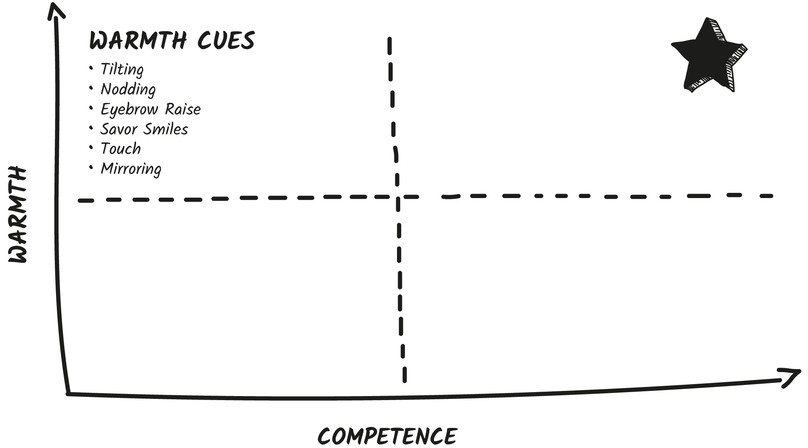
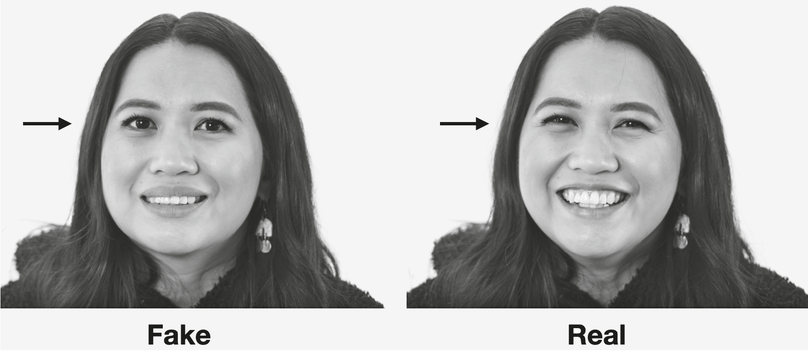

## CHAPTER 4

## The Wow Factor

In September 1953, two men had just two days to draw and draft a plan for a groundbreaking pitch that would one day become the happiest place on earth. In their proposal, Walt Disney and Herb Ryman wrote: “In these pages is proffered a glimpse into this great adventure . . . a preview of what the visitor will find in DISNEYLAND.” Almost seven decades later, about 51,000 people visit Disneyland _every day._ There are now twelve different Disney parks around the world.

Disney’s original goal of bringing people happiness is the underlying operational principle that carries on even today. Disney calls it the “Wow Factor.”

Wowing guests is not only about meeting those high expectations but exceeding them. Every employee of Disney Parks operates under one main requirement: “Every guest be treated like a VIP—that is, a very important, very _individual_ person.”

How do they do this? Not only with a helpful can-do attitude, but also with a specific set of nonverbal behaviors. Yes, really. Disney University teaches every single person who works in Disney parks—from janitors to princesses—the specific nonverbal cues to use with guests. And they all embody the pinnacle of warmth.

These little warmth cues might seem small, but to Disney they are an important part of the wow experience—baked into the very essence of what it means to visit a Disney park. “It is this plethora of little wows, many of which seem fairly insignificant at the time, on which Quality Service depends. If the little wows are delivered consistently and continuously, they add up to a big WOW!” And so it is with the nonverbal warmth cues in our interactions as well.

Each warmth cue builds a little bit more trust with every single person, every single time you interact. Each warmth moment strengthens bonds between customer and company, clients and salespeople, manager and employee. For Disney, these little wows resulted in a customer return rate of 70 percent. Now that’s magical.

**Warmth cues create loyalty.** We are drawn to people who wow us.

Warmth cues are also powerful because they create a **halo effect**. If you’re warm _and_ trustworthy, it makes people feel more trust for everything about you—from your personality to your office to your service to your mannerisms . . . even to your accent.

Researchers asked two groups of participants to watch a clip of a college professor teaching with an accent. One group saw the professor teach using lots of warmth cues. The other group saw the same professor teach the same content without warmth cues. They then asked the participants to rate the professor on his likability, his physical appearance, his gestures, and his accent.

It makes sense that the participants who saw the warmth video rated the professor as more likable. But they also rated his other aspects as more positive as well—they saw him as more attractive and liked his accent more. People who saw the video without warmth cues rated the same professor as less likable and attractive and even found his accent more irritating! Warmth cues created a halo effect, making everything about the professor better.

Warmth cues create a wow factor for everything about you. They signal trustworthiness, engagement, inclusion—all the warm and fuzzy feelings that make us feel close to others. Using tilts, nods, eyebrow raises, savor smiles, touches, and mirroring creates a halo effect around you.

And here’s the best part: Dialing up your warmth doesn’t just wow others. It also helps you _feel_ more “wow” yourself.

Researchers from the University of Amsterdam had participants watch a short film and then describe it to research assistants. Half summarized the film to a positive listener—someone who smiled and nodded and had more open body language. The other half told their story to someone who exhibited a negative listening style: the person frowned more, slumped, and gave no positive head movement.

The participants with the positive listeners not only described the film differently but actually thought about it more creatively. They described characters’ thoughts and emotions and included more of their own opinions about the film’s deeper meaning. People with the negative listeners focused solely on facts and concrete details.

In other words, warm body language encourages more insight, big thinking, and creativity. **Warm listeners sparked the Cue Cycle, and inspired people to** _feel_ **more wowed.** Cold body language caused people to withhold their ideas, think small, and be more close-minded.

Let’s learn the warmth cues you can start using right now.

### WARMTH CUE #1: Time Your Tilts

If I were to ask you, “Do you hear that?” what would you do?

Most people, when trying to hear something more clearly, tilt their head to the side to expose their ear. Because of this instinct, a **head tilt cue** shows interest and curiosity. People who tilt their head during conversations immediately increase their likability and thus their wow factor.

The head tilt is a literal indicator of “I really want to hear what you have to say.” Or “Wow, that’s interesting. Tell me more.” It often accompanies a verbal “Wow.”

Researchers even find that a head tilt is correlated with higher attractiveness ratings. Why? We like our potential partners to be good listeners (and of course it improves our self-image to boot).

Take a peek at your profile photos or headshots. Are you tilting? If you use dating apps, how many of your photos have a head tilt? When researchers asked people to pose for a photograph, nearly three-fourths of them tilted their head to one side! Instinctively, we know this makes us more approachable.

FUN FACT

### Tilt and Smile

Do any of your pictures have an open mouth smile _and_ a head tilt? In an analysis, Career Experts found that LinkedIn profile pictures that depict an open mouth smile with a slight head tilt were seen as the best pictures.

What do the famous paintings _Girl with a Pearl Earring_ by Johannes Vermeer, _The Kiss_ by Gustav Klimt, and _The Birth of Venus_ by Sandro Botticelli all have in common? Yup, you guessed it—the leading ladies in all of these paintings are head tilting. One group of ambitious researchers examined 1,498 paintings from the fourteenth to the twentieth centuries looking for head tilts. They found head tilts in almost half of all the portraits.

And here’s where head tilts get even more interesting. Researchers noticed differences between the head tilts in certain paintings. Specifically, **a person’s social role predicted the degree of their head tilt.** The higher someone’s social standing, the _less_ they tilted. What does this tell us? While a head tilt is one of the fastest ways to show warmth, it also serves as a gesture of appeasement and an exhibition of conciliatory behavior. Why? Because the head tilt exposes a highly vulnerable part of our body: the carotid artery. This artery runs up the right and left sides of our neck and supplies our brain with blood.

**Think of a head tilt as a heating blanket.** It instantly warms you up, but too much can burn you. And it’s a great way to warm up cold interactions.

Have to deliver bad news? Use the head tilt to show you’re listening and you’re there for them.

Been told you’re cold, intimidating, or hard to talk to? The head tilt can soften you and encourage people to open up.

PRINCIPLE

Head tilts show interest, curiosity, and appeasement.

When to Tilt

  * To show someone you’re interested and listening.

  * To deliver bad news.

  * To be seen as higher in warmth.

  * To encourage someone to open up.

When NOT to Tilt

  * If you’re trying to look powerful.

  * If you want to discourage someone from talking. Ever been with someone who won’t stop talking? Or won’t end a meeting? Don’t tilt!

  * If you’re already high in warmth, head tilting will make it hard to climb back into competence. Use it sparingly.

### WARMTH CUE #2: Nod to Know

Major League Baseball player Alex Rodriguez, also known as A-Rod, played twenty-two seasons and earned a total of $441.3 million in the league. In 2007, he was accused of doping.

Rodriguez sat down for an interview with Katie Couric on _Eye to Eye_ to answer questions about taking steroids. Couric asked Rodriguez, “For the record, have you ever used steroids, human growth hormone, or any other performance-enhancing substance?”

“No,” said Rodriguez.

Couric pressed on. “Have you ever been tempted to use any of those things?”

“No,” said Rodriguez.

Sounds pretty clear, right? Think again. Let’s decode his nonverbal cues.[[*]](39_Footnote.xhtml#footnote_1 "footnote")

SPEAKER |  VERBAL |  NONVERBAL  
---|---|---  
Couric |  “For the record, have you ever used steroids, human growth hormone, or any other performance-enhancing substance?” |   
Rodriguez |  “No.” |  Head nod yes. Microexpression of contempt.  
Couric |  “Have you ever been tempted to use any of those things?” |   
Rodriguez |  “No.” |  Look up to the right. Head nod no.  
  
The nods give Rodriguez away. An affirmative up-and-down nod is a nonverbal cue for yes. Liars often rehearse the verbal but forget about the nonverbal. And this is exactly what happened to Rodriguez. When asked about taking drugs he _says_ no but his _body_ says yes.

He also flashed a facial expression of contempt, exhibiting scorn or disdain. This is a one-sided mouth raise.

Rodriguez could have felt contempt for Couric, who was asking him hard questions. He could have felt it for himself. Liars often show contempt while lying because they know it can get them into trouble. Most people hate having to lie.

When Couric asks, “Have you ever been tempted to use any of those things?” Rodriguez looks up to the right and nods his head horizontally, a nonverbal cue for “no.” This is true—he wasn’t _tempted_ to take drugs, he _did_ take drugs.

A few years later, Rodriguez did come clean and admit to taking steroids.

So what’s the takeaway here? Our emotions often leak into our nods and can reveal our true feelings. If you want to have more control over your message, controlling your nods is essential. The vertical nod meaning yes is for agreement and encouragement. The horizontal nod meaning no is for disagreement and discouragement.

**Nodding is also one of the most underutilized persuasion tools.** In the mid-nineties, attorneys began to notice that nodding was having an effect on their courtroom cases. They observed that expert witnesses often looked to jurors to see if they were nodding in an agreement. Moreover, they found if a juror nodded, agreement could actually become contagious and infect the opinions of jurors around them.

In 2009, researchers decided to test the idea that head nodding by mock jurors could change perceptions of expert credibility. The researchers instructed certain jurors to nod vertically only while the expert was speaking. Could this small nonverbal cue change opinions in the courtroom? Oh yes. Results showed nodding significantly affected whether expert witnesses were believed and how much the other jurors agreed with the actual testimony. **Nodding changed how jurors voted in trial.**

Nodding is a great way to inspire agreement. Most people make the mistake of hiding or stifling their feelings in meetings or interactions. If you agree with something, show it.

Here is another weird effect of nodding: When you nod yes, you get the other person to speak more . . . 67 percent more. Researchers observed applicants interviewing for civil service positions. They found that when the interviewer nodded, the duration of interviewees’ speech increased by 67 percent.

What if you’re on a phone call or someone can’t see your body language? Nodding can still help. After one of my speaking events in 2015, I was approached by a lovely woman named Nicole Seligman. Seligman worked as an advocate for the National Domestic Violence Hotline. She talked to callers who are in traumatic or emotional situations. She said that advocates are trained to nod while listening to callers. “Even though the caller can’t see your nodding, the way you speak and behave on the call will be more empathetic and warmer, while also encouraging callers to use this safe space to continue sharing their story and seek resources,” she told me. Nodding created warmth for both the operators and callers.

Affirmative nodding is the ultimate warmth cue because it signals empathy and _triggers_ empathy. If you nod while listening to someone open up, you will encourage them to open up more and feel more open yourself.

Don’t just take my word for it; try it yourself the next time your partner is telling you something important, a colleague is sharing something personal, or you’re deep in conversation with a friend.

Nodding is part of the wow factor because it’s one of the fastest ways to show encouragement and agreement, and we like people who are encouraging and agreeable.

FUN TIP

### The Male Nod

My male students have told me that guys have an unspoken nodding custom. If you see another guy you know, you nod up. This nonverbally says, “What’s up?”

If you pass by a guy you don’t know but want to acknowledge, you nod down. This nonverbally says, “Respect.” Try this code for yourself: Nod up for friends. Nod down for strangers.

### Know the Speed Limit

There is one aspect of nodding that’s important to keep in mind when deploying the nod technique: speed. The best nods are slow and thoughtful. A slow triple nod is best. Fast nodding can actually look like impatience.

Try this exercise with me. Say the following three phrases slowly, about one per second, and nod with each one: “I hear you . . . I hear you . . . I hear you.”

You should feel and sound empathetic, compassionate, and kind.

Now say all three in less than a second with a quick nod for each one. “I hear you. I hear you. I hear you.”

This should feel and sound rushed, hurried, and impatient. The slow nod says, “Keep going, I have all the time in the world.” The fast nod says, “I get it. Finish up quick.”

FUN TIP

### Beware of the Bobblehead[[*]](40_Footnote.xhtml#footnote_2 "footnote")

Studies have found that women tend to nod more than men. A few years ago, I realized this was a big problem for me. I was nodding too much, which was overly warm. And it made me look like a bobblehead doll. It looked like I was agreeing with everything. If you have the bobblehead problem, try replacing your nod with a slight head tilt. It’s still warm but more moderate.

PRINCIPLE

Nod yes to get more yeses.

When to Nod

  * Nod to greet. Walk by someone in the hallway? Give ’em a nod and a smile. Hopped onto a team video call? Nod and wave hello.

  * Nod to encourage. Is someone saying something you really like or agree with? Nod yes.

  * Nod to solicit. Need to get someone to open up? Want someone to keep talking? Try a slow triple nod.

When NOT to Nod

  * To subtly show disagreement or discontent, withhold your nods. This can softly signal you’re not on the same page with someone.

  * If you’re already displaying too many warmth cues, don’t nod. Or if you’ve been nodding a lot already, don’t be a bobblehead.

  * If you want someone to stop talking or when you need someone to wrap up, don’t nod.

### WARMTH CUE #3: Eyebrows Raise Expectations

On the TV show _Dating in the Dark Australia_ , contestants are sent out on blind dates with random strangers . . . in complete darkness. Contestants can talk, touch, and even make out, but they can’t see each other until the final episode, where they participate in a “reveal.”

During the reveal each participant stands on opposite sides of a very dark room. Each contestant is lit up one at a time so they cannot see the other person’s reaction to how they look. At home, we get to see both people with a special infrared camera. Then, later in the episode, the contestants decide if they want to be together after the show.

The best part of this show is seeing the natural body language reactions and expressions. Since participants are dating without being able to see each other, their nonverbal cues are purely instinctive.

In one episode of _Dating in the Dark Australia,_ a promising couple enters the reveal room: Rob and Kim. They had wonderful dates, deep discussions, and lots of touch.

Rob is the first to be revealed. “I was so nervous. I was shaking like a leaf,” he said. Then the light turns on.

Kim, his partner across the room, takes him in. She immediately raises her eyebrows and smiles. Then she covers her mouth and raises her eyebrows again. She grins sheepishly.

The light turns off Rob. Kim’s eyebrows flash yet _again._

Kim raised her eyebrows three times in the span of four seconds because she liked what she saw . . . and wanted to see more of it.

If you want to convey excitement, curiosity, and engagement in an interaction, raise your eyebrows. When we raise our eyebrows, we signal that we, like Kim, want to see more. It’s as if we want our eyebrows to get out of the way to see something or someone better. As is true of all warmth cues, in professional, social, and romantic situations the eyebrow raise is a positive social cue that will increase your wow factor. Universally, the eyebrow raise is a sign of acknowledgment.

Researchers have found that we also raise our eyebrows to show an intention to communicate. This is because raising our eyebrows increases the distance at which it’s possible for an observer to detect our gaze direction.

In short, **the eyebrow raise is a nonverbal shortcut**. It’s the fastest way to communicate interest, curiosity, and attention. We can use it as a shortcut in many scenarios. For example:

  * When we’re seeking confirmation—we might raise our eyebrows in a soft question: “Does this make sense?”

  * When we’re actively listening. Researchers found that an eyebrow raise can be used to demonstrate agreement in conversation. This is especially useful on video calls where you are mute but still want to show engagement.

  * When we want to emphasize a point. When _you_ raise your eyebrows, others are cued to pay attention and are more likely to make eye contact with you. It’s as if you’re saying with your eyebrows, “Listen to this, it will wow you.”

  * When we are wowed. We often raise our eyebrows when we are positively delighted.

Neil deGrasse Tyson even uses the eyebrow raise to gauge what content he should include in his books. When writing _Astrophysics for People in a Hurry,_ Tyson would share facts with people on airplanes and then take note when they raised their eyebrows. Unsurprisingly, the eyebrow raises guided him well— _Astrophysics for People in a Hurry_ hit number one on the _New York Times_ bestseller list when it debuted in May 2017.

Tyson found that even a little signal like a subtle eyebrow raise can reveal our inner preferences. By strategically utilizing the eyebrow raise, you too can both demonstrate and uncover warmth and enthusiasm quickly.

One thing to be aware of—this cue is an _eyebrow_ raise, NOT an _eyelid_ raise. When we raise our lids to show the whites of our eyes, it signals fear. This is a negative cue. Be sure when you eyebrow raise that it’s _just_ your eyebrows and not your lids too.

And remember that the eyebrow raise is a shortcut. You don’t need to hold it for long. Most eyebrow raises are quick—less than a second. Keeping your eyebrows in the raised position too long will make you look permanently surprised—not a great look.

PRINCIPLE

The eyebrow raise is the fastest way to show interest and curiosity and capture attention.

When to eyebrow raise

  * To encourage someone to speak up. Do you work with or spend time with a serious introvert? Introverts may struggle with sharing their ideas. You can encourage them to share with an eyebrow raise in their direction. A quick raise shows them that you would like to hear from them without calling them out.

  * Use an eyebrow raise any time you want to show curiosity or interest.

  * Use it to greet someone you like.

When NOT to eyebrow raise

  * If someone is pushing your buttons, keep those eyebrows down. An eyebrow raise will only encourage them to keep doing what they’re doing.

  * Don’t do it too often. You do not want to look permanently surprised.

  * In Japan, the eyebrow raise is used to indicate romantic interest. Therefore, if you’re in Japan, suppress it in professional situations.

### WARMTH CUE #4: Savor Smiles

Here’s something that won’t surprise you at all: We’re 9.7 times more likely to be seen as warm when we’re smiling. A **smile** is a pure warmth cue.

But what might surprise you is that smiling is not just about warmth or happiness. It’s also about engagement. **Smiling makes you more memorable.** Researchers put participants in an fMRI and asked them to remember people’s names while looking at photos of them. Some of the faces they saw were smiling and some were not. When participants were trying to memorize the names of the smiling individuals, their orbitofrontal cortex, the reward center in the brain, activated. In plain English: Our brain likes smiling people and makes a greater effort to remember them. Smiles wow us because they wake up our _own_ reward centers, and it’s easier to remember people and things that make us feel good.

Our brain likes when _we_ smile too. Researchers found that smiling increases blood flow to your brain. It’s one of the few nonverbal cues that activates our entire nervous system by triggering a release of hormones that make us feel great. This gives you more energy and makes you feel more optimistic. Simply put, smiling creates an internal and external wow. **Smiling has internal benefits as well as social benefits.**

FUN TIP

### Smile Science

Researchers found that a smile can be as rewarding and stimulating to the brain as 2,000 bars of chocolate!

Does this mean I want you to walk around in a perma-smile? No! That’d be fake. And fake smiles aren’t memorable anyway. There is a very important difference between real and fake smiles: A real smile reaches all the way up into someone’s eyes. The best way to tell the difference between a real and a fake smile is that a real smile activates those eye crinkles, or crow’s-feet, like so:

Here’s why a real smile is so important: Only real smiles actually have an impact on the people that see them. When we see someone else authentically smile, it activates our own smile muscles. In fact, researchers found that it’s difficult to frown when someone is smiling at you.

**Your warmth triggers others’ warmth.**

This is why Disney instructs: “Start and end every guest interaction and communication with direct eye contact and a sincere smile.”

Note the word _sincere._ Even Disney, the world of happiness and magic, knows there is nothing worse than a fake smile.

Direct from their handbook: “Practices such as smiling, greeting, and thanking guests are well and good, but if these actions are restricted to rote, mechanistic behaviors, their effectiveness is severely limited.” Smile only if you truly feel it. And if you can, try a **savor smile**.

Savor smiles are smiles that **take longer to spread across someone’s face**. Researchers found that they are seen as more attractive. To get specific: a smile that takes longer than half a second gives the feeling that you are truly relishing someone’s presence, idea, or story.

The best part of a savor smile? A real one will often lead to laughter, another warmth cue. Most people think of **laughter** as a humor cue—it signals that something is funny. But laughing _with_ someone is also a great way to bond.

Researchers found that laughing with someone is one of the best catalysts for connection. This is because laughter is a shared positive experience that also stimulates feel-good endorphins. Laughter makes us more open _and_ encourages us to open up.

FUN TIP

### Honor Any Humor

Don’t feel pressure to be funny. It’s great if you can create humor, but it’s even better if you can honor other people’s humor. Always be ready to laugh. Think of a laugh like a compliment. It’s telling someone you appreciate them.

PRINCIPLE

Smiles spread joy and create joy . . . but only when they’re sincere.

When to Smile

  * Don’t perma-smile, **be smile ready**.

  * Start and end on a savor smile. Smiles are most important when we first see someone (we want to know, “Are you truly happy to see me?”) and when we’re ending an interaction (we want to know, “Did you enjoy our encounter?”).

  * If you see someone smiling, see if you can jump in on the action.

  * Match a smile. Don’t smile behind closed doors or behind people’s backs. Instead, save your smiles to enjoy with others. Don’t just smile about someone, smile _with_ someone. Smile once the Zoom camera pops on or the moment you lock eyes.

When NOT to Smile

  * If you’re already too high in warmth, work on saving your smiles for the big moments.

  * Need to show disproval? Want someone to back off? Don’t smile.

### WARMTH CUE #5: A Touch of Trust

Ever wondered why some teams have great chemistry?

One group of researchers at UC Berkeley wanted to find out and devised a clever way to watch basketball games in the name of science. The team watched the first three games of the NBA finals during the 2008–2009 season and counted every single time players were seen touching on-camera—from back pats to butt slaps to leaping shoulder bumps to arm drapes to head grabs. **They found the team who touched one another the most won the most games.**

The Mavericks had a total of 250 touches, making them almost twice as touchy-feely as the Miami Heat, who had only 134 touches. In those three games, the Mavericks had 82 percent more high fives.

The moment we touch someone or someone touches us, our chemistry changes. Touch creates the potent chemical oxytocin. As we have learned, oxytocin plays a complicated role in our body, but in interactions it increases trust, warmth, and rapport. **Even small touches—a high five, a fist bump, or a pat on the back—produce oxytocin and encourage trust.**

Oxytocin is the chemical of WOW. It feels like the warm and fuzzies. Ever been with someone and felt like you just clicked? That’s the feeling of oxytocin.

**Study after study shows that a subtle touch increases trust in all kinds of relationships, from social to romantic to professional.** Touch has also been shown to make us feel closer to and more positive about the toucher, whether that person is a friend, a family member, a colleague, a stranger, or even a basketball teammate. When you trust your teammates, you play better, you pass more, you have faith that everyone is doing their job well.

Oxytocin also helps us read and decode others better. The basketball researchers found that the more teammates touch one another, the better they’re able to read and predict their teammates’ future behavior.

FUN TIP

### My Secret Weapon

I’m a big, big fan of the high five. I high-five teammates on a job well done. I high-five friends whenever one of us makes a good joke. Take every opportunity to high-five—it’s one of the fastest and easiest ways to touch mid-interaction.

Touch can also help you make more money. Researchers wanted to know if a simple touch could change how much a server got tipped. And this is not just for women. They found a light touch on the hand or arm increased female servers’ **average tips by 23 percent and male servers’ average tips by 40 percent**.

Even more interesting, touching increased the average tips of _younger_ customers by 62 percent but only increased the tips of older customers by 15 percent. Those youngsters love that oxytocin rush!

### Be Strategic, Not Creepy

Now, not all touch is created equal. Touch is a nonverbal cue that varies from culture to culture. One study even found that touch nuances are different among three otherwise closely related European countries—France, the Netherlands, and England. In some cultures, people greet each other with a cheek kiss; in others, they bow. In some cultures, friends of the same gender hold hands in public. In some cultures, the feet are considered no-touch zones and are off-limits.

How do we work with this? By thinking about touch in terms of zones. In Western cultures, the hands and forearms are usually safe zones and the least intimate, making handshakes and arm touches good warmth cues in professional situations. For friends, family, and other closer relationships, contacts with the upper arms, the shoulders, the upper back (back pats), and cheeks (cheek kisses) are usually accepted warmly.

As you interact, think about touch zones for yourself and the people in your life. What are your comfortable zones? Watch for their invitation and patience cues. If you touch too much, too quickly, or too intimately you will see patience cues. If your touch is welcome, you will see invitation cues.

FUN TIP

### Liars Touch Less

Need another reason to touch appropriately? Liars have been found to touch less. Perhaps it’s because they don’t want to bond with the person they’re lying to.

What about video calls? Sometimes just mentioning touch is enough to create warmth. When I get on video calls, I often say, **“Sending you a virtual high five,”** or **“Here’s a little digital hug,”** and hug my camera. It always gets a chuckle and cues for warmth even though we can’t actually touch.

What if you’re in person but you can’t touch? Say it’s flu season, or an international pandemic hits. Dr. Kofi Essel said that during the COVID-19 pandemic, he gave his kids an elbow (for a quick elbow touch) because they couldn’t shake hands. This always produced a little laugh and a little touch. Dr. Essel also says addressing the _desire_ to bond is important.

“Sometimes I’ll address them and say, I’m sorry I can’t shake your hand. I really want to. But it’s very nice to meet you today,” explained Dr. Essel.

He also uses air fives and air hugs. Even the thought of touch adds warmth.

PRINCIPLE

Purposefully touch to build trust.

When to Touch

  * When you want to trigger warmth, closeness, and trust.

  * At the start, middle, and end of an interaction. Don’t just start with a handshake and end it there. Instead, high five during conversation, arm touch to emphasize a point, and end with a hug if it feels comfortable.

When NOT to Touch

  * When you don’t feel comfortable with someone or they don’t look comfortable with you. If you see patience cues, take it slow.

  * Beware of a belittling touch. We don’t like being patted on the head—it reminds us of our parents.

### WARMTH CUE #6: Mirroring Makes You Magnetic

It was four a.m. and my husband and I were groggily getting ready for our flight. Half asleep, we dragged our bags into the lobby of our hotel and clomped over to the checkout counter.

“Good morning!” the receptionist chirped. “Happy, happy day,” she singsonged.

I peered at her through blurry eyes. Did she fancy herself a Disney princess? This was a little much for four a.m.

Then she went into hyperdrive. “Did you have a lovely stay? We sure hope you did! Can’t wait to have you come again. Any suggestions for us?” Before we could reply, she asked, “Can I get someone to help you with your bags?”

“Yes, please,” my husband said.

Then she turned to the open lobby. “George?! Geooooooorge?!” she shouted.

“Actually, we’re good. Thanks, but we can get them.”

She flashed us a practiced smile and waved broadly, almost knocking over my paper cup of coffee. We ducked, grabbed our bags, and rushed toward the door. “Hope you come again!” she yelled after us.

“Wow,” my husband said to me once we escaped outside. “That was a LOT.”

There’s a big myth about wowing people. Wowing someone is not about showcasing the highest energy possible. Wowing someone doesn’t mean knocking them off their feet. (Who really wants to be knocked off their feet anyway?) **Wowing someone is meeting them where they’re at.** It’s showing someone nonverbal respect by going to _their_ level instead of forcing them to come to yours.

Warmth is about making someone feel welcome. This might mean being calm and serene for someone who is very stressed. Or bringing out the excitement for someone who’s enthused. Or even being contemplative and empathetic for someone who needs advice.

Even Disneyland, the happiest place on earth, recognizes the need for “appropriate,” or measured, warmth. If a mom can’t find her child in the park, it wouldn’t make sense for a Disney employee to be all smiles and cheer. Instead, Disney employees take the far more helpful and wow-inducing route: nodding in understanding and leaning in to get more information and be as competent and efficient as possible.

Dr. Essel is keenly aware of this with his patients as well. Sometimes he’s meeting a family for a routine checkup, so he keeps it positive and light—makes small jokes and smiles more. If a child is sick or there is a difficult diagnosis, he changes his nonverbal behavior, energy, and tone completely to match the seriousness of the situation.

“I really match the behaviors that families are making. If the mood in the room is very solemn and sad, I’m careful not to come in all spunky. I’ll try to calm it down and acknowledge everyone,” explained Dr. Essel.

This nonverbal practice is known as **mirroring** , or**mimicry**. We mirror nonverbally with our body language and facial expressions. We can mirror vocally, with our volume, tone, and pitch. And we can mirror verbally with the kinds of words we use.

Luckily, we _already_ mirror in our interactions. In chapter 2, I talked about how our cues are contagious—that we often “catch” the mood and nonverbals of people we are with. Studies find that humans begin to synchronize their blink rate, arm movements, breathing, and body movements without even realizing it.

#### The Magic Mirrors

There are many, many benefits to mirroring the people you are with.

First, **mirroring earns you more money and helps you feel better about it**. Researchers from MIT tracked the amount of mirroring in real salary negotiations of midlevel executives transferring to a new company. They found that the more a new hire mirrored during the negotiation, the more they earned in their final salary by 20 to 30 percent. Negotiations with mirroring were also rated to be more pleasant by the mirrorer and the mirroree!

Second, **mirroring makes you more likable and persuasive**. People who’ve been mirrored—even when they haven’t consciously noticed—later reported having a more favorable impression of the person doing the mirroring.

In one experiment, a team of researchers had an actor stop people in the street and ask them to take a survey. Half of the time the actor subtly mirrored the survey takers’ nonverbal behavior. A lean got a reciprocal lean, an arm cross triggered an arm cross, a slumped posture was met with a slumped posture. The other half of the time the actor stood normally.

Later, the researchers asked survey takers how they felt about the person who gave them their survey. Even though they had no idea they were being mirrored, the people who were mirrored reported feeling more emotionally close with the survey giver!

Third, **mirroring helps you emotionally sync up with someone by enabling your empathy**. In one study, participants watched videotaped couples arguing. Participants then had to guess the emotion of the couples. Researchers found that the participants’ physiology began to sync up to the people they were watching. And here is where it gets even more interesting. The _more_ a participant’s body mirrored the couple’s, the _better_ they were at identifying the emotions of the couple. Again, here is the Cue Cycle at work: Spot a cue, internalize the information, encode it in our own bodies.

There is one more critical aspect of mirroring successfully: Mirror what you want to magnetize. Don’t mirror negative body language; this will only highlight it. Effective mirroring is about matching and emphasizing positive, curious, engaging body language. This creates a positive feedback loop. They show openness, you show openness; they continue to catch your openness and you continue to catch theirs. And exponential openness is created!

Warning: Mirroring is so potent that only subtle mirroring is needed. Copy every cue and you will quickly stray into creepy territory. The key is to mirror subtly—no need to copy every gesture.

PRINCIPLE

Meet people where they’re at by mirroring—match the positive, transform the negative.

When to mirror

  * Mirror any and all positive body language to show you’re on the same page with someone.

  * If you want to encourage warmth, mirror their warmth to highlight it. If you want to stimulate competence, mirror their competence cues to emphasize them.

When NOT to mirror

  * If you feel awkward or see a cue that doesn’t feel natural to you, don’t mirror it!

  * Don’t mirror negative cues lest you catch and encourage them.

  * If you aren’t on the same page with someone and want them to know it, don’t mirror.

  * If you feel like you’re playing Simon Says, you’re mirroring too much. The best mirroring is subtle.

### Wowing Everyone You Meet

When you walk into a Disney park, you’re greeted with big authentic smiles and waves. Cast members nod when you ask for help and head tilt when you ask questions. They match your enthusiasm for the new attraction. They raise their eyebrows when you tell them this is your first time in the park. They give your child a high five. And you think, _Wow, this is going to be a great day._

Disney opens with warmth and then blows you away with know-how. Warmth cues are incredibly important for wowing people during your first impressions. My rule of thumb: **Show three warmth cues in the first three minutes of an interaction.**

Warmth cues can emphasize or even replace warm words. Here’s my cheat sheet:

WARM WORDS |  WARMTH CUE  
---|---  
“That’s so interesting.” |  Eyebrow raise  
“I agree.” |  Nodding  
“I’m listening.” |  Head tilting  
“This is exciting.” |  Leaning  
“I respect you.” |  Fronting  
“I trust you.” |  Touch  
“I’m on the same page.” |  Mirroring  
  
### CHAPTER CHALLENGE

Let’s expand our Cues Chart to put these warm cues into action.

CUE |  DECODE |  ENCODE |  INTERNALIZE  
---|---|---|---  
Nodding |  Do you notice who nods with you? Do you open up more with them? |  Try a slow triple nod when you next want someone to open up. |  When you’re with a non-nodder, do you worry they aren’t in agreement with you?  
Tilting |  Try to spot three head tilts in your next few conversations. What did someone want to hear more about? |  Try tilting next time you have to deliver hard or bad news. |  How does it feel when someone shows you a head tilt? Do you feel more open when you head tilt?  
Eyebrow Raise |  Try to spot three eyebrow raises in your next few conversations. What intrigued someone? |  Try an eyebrow raise upon greeting. Then try one when you hear something interesting. |  How do you feel when you eyebrow raise? Try a fast one and a slow one. Find your ideal speed.  
Smiling |  See if you can spot a fake smile in an interaction. Then try to understand why you didn’t get a real one. |  Try to show no fake smiles in the next week. Smile only when you mean it. |  Do you feel more authentic when you only stick to real smiles? Do you wish you had more reasons to smile?  
Touch |  Think of the three people you see most. What are their touch maps? |  What’s your touch map? |  What kind of touch makes you uncomfortable? Who makes you uncomfortable when they touch you? Set up boundaries.  
Mirroring |  Who mirrors you most? Least? |  Try mirroring with someone you like. Try mirroring with someone you don’t. Does it feel different? |  Does mirroring make you feel more in sync with someone? Or does it distract you? Only use mirroring if it feels good to you.
