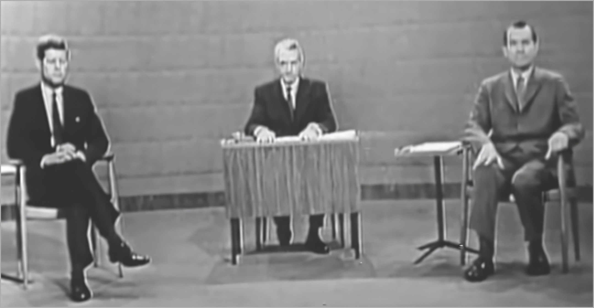
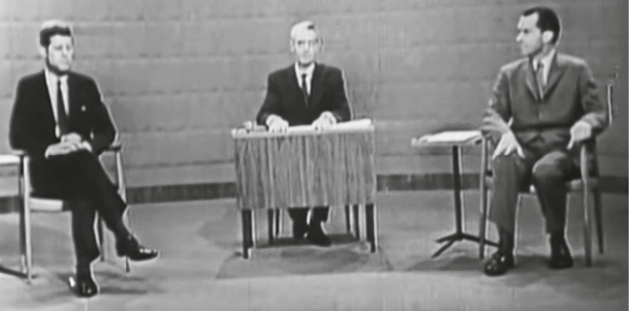
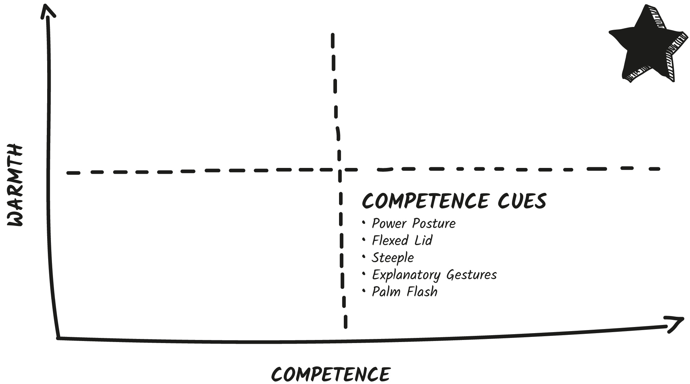
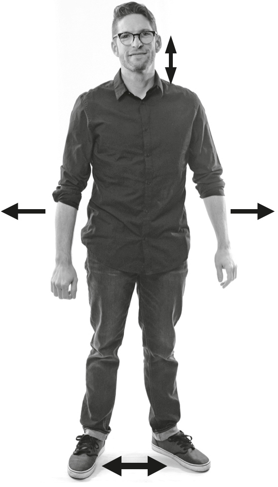
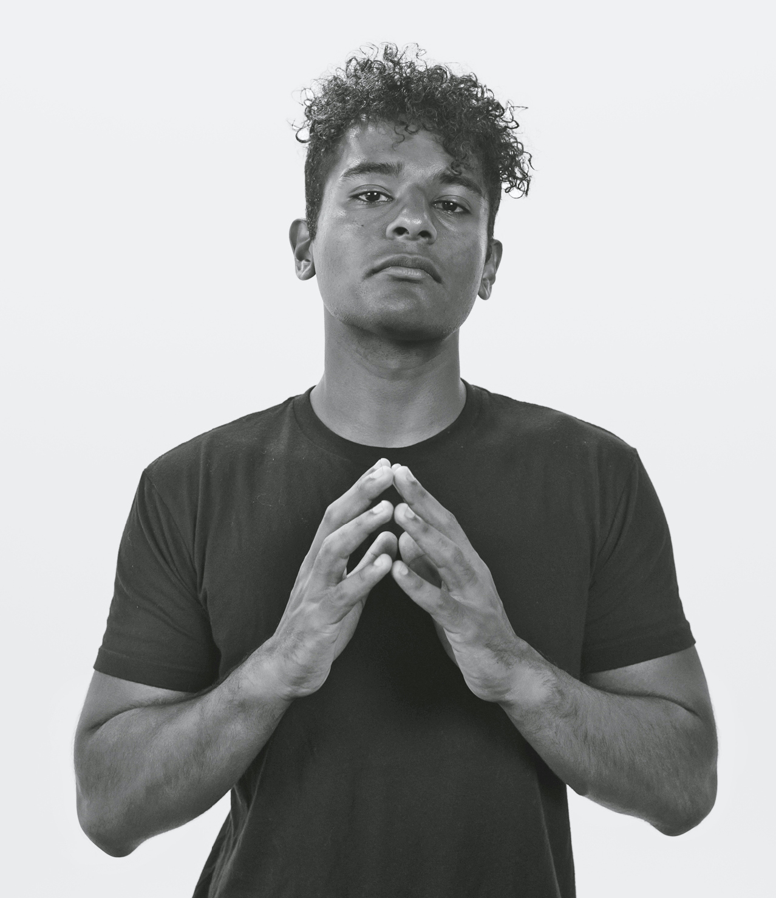
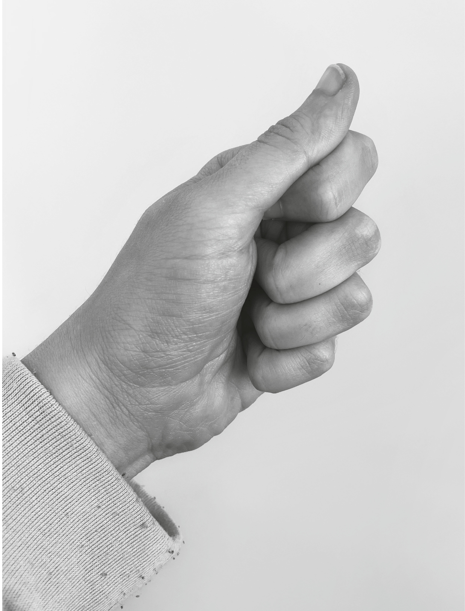
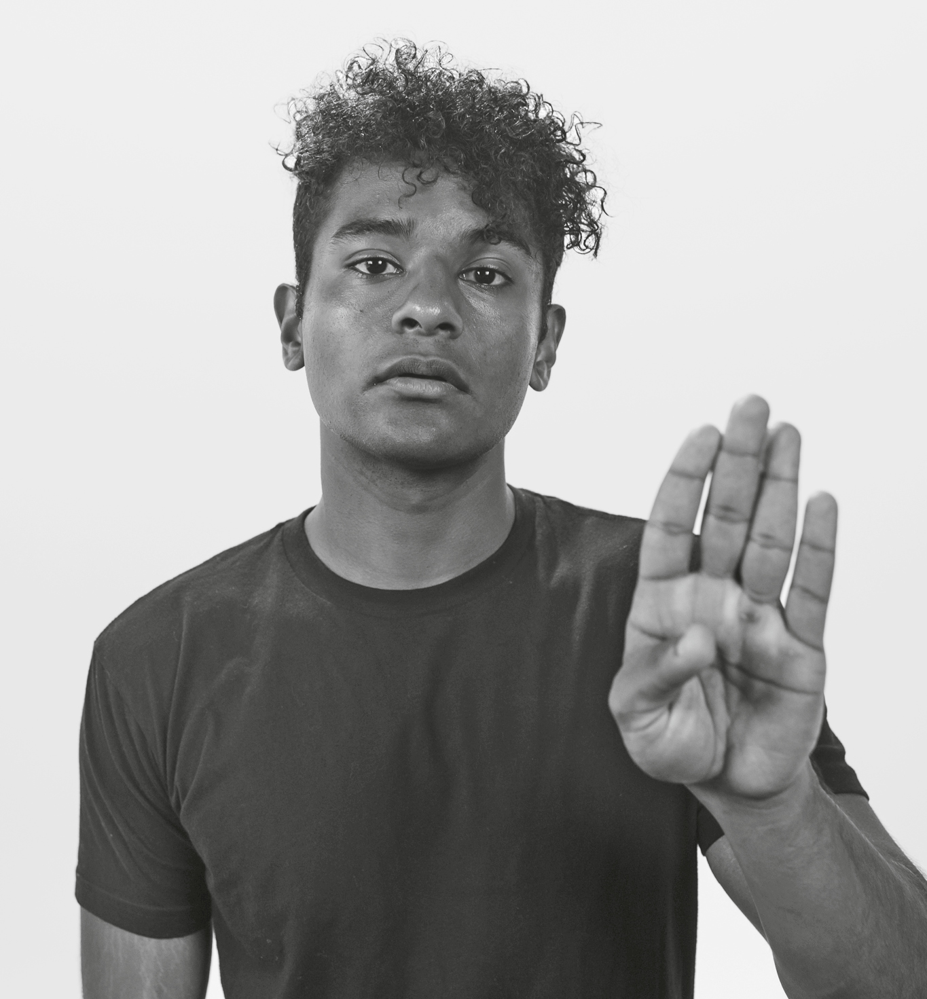

## CHAPTER 5

## How to Look Powerful

Richard M. Nixon was experiencing a string of bad luck. Just weeks away from the first ever televised U.S. presidential debate against John F. Kennedy, Nixon slammed his knee on a car door and ended up in the hospital. Weeks later, he emerged twenty pounds lighter, frail and weak with the flu.

On Monday, September 26, 1960, Nixon arrived at the television studio with a low-grade fever and a bandaged knee. While emerging from the car, he banged his injured knee yet again, exacerbating the wound.

Unfortunately for Nixon, things only went downhill for the rest of the evening. In fact, his performance during the debate changed the entire course of the election, and it all came down to his negative cues.

The very first thing we see is both candidates seated on either side of the moderator Howard K. Smith. Nonverbally, they couldn’t look more different.

  1. Runner’s feet: First, look at how both men have positioned their feet. Kennedy had his legs folded in a relaxed seated position. Nixon is displaying a cue called **runner’s feet**. This is when people pull one foot back as if they’re about to sprint down a track—you see runners use this as their starting position. It’s a cue that signals impatience. Imagine the message you send to prospective voters if you’re telegraphing that you’re about to run out on them! Now we know Nixon likely was in this position because he was nursing his injured knee. But he stayed in this distracting position throughout most of the debate. The ideal condition in this situation would have been to have relaxed, planted feet pointed toward the audience . . . like Kennedy.

His calm seated position made him look like he was reliable, sturdy, and confident.

jfklibrary.org

  1. White knuckling: Next, take a look at the candidates’ hand positions. Kennedy held his hands calmly folded in his lap. Nixon had one hand gripping the chair arm in what looks like a fist. This is an immediate anxiety cue. At first glance, it looked like Nixon was holding on to that chair arm for dear life. That’s because we **white knuckle** when we’re highly anxious and trying to keep it together. We also clench our fists when we’re very angry and trying to hold it in. It’s a way we can focus our internal emotions externally without changing our overall appearance too much, and it’s often done unconsciously. This white-knuckle cue made Nixon look both anxious and angry.

  2. Self-soothing: Nixon’s right hand was resting on the top of his thigh. This isn’t a negative cue on its own; in fact, it’s positive to have your hands relaxed and visible. However, during the debate Nixon consistently rubbed the top of his thigh in a **self-soothing gesture**. When nervous, we try to calm ourselves down with self-touch. We’re physically telling our body that everything will be okay. We might wring our hands, rub the back of our neck, or, like Nixon did, run our hands along our legs or arms. This cue was not only distracting but also made Nixon look very nervous.

You know why else we rub our hands over our thighs? When our palms are sweaty! Whether his palms were damp or not, it sure looked like he was drying his hands on his pants. Gross . . . and not very presidential.

And all that happens in the first 1.2 seconds . . . before the candidates spoke a single word.

  3. Gaze direction: Then, two seconds in, before the debate even started, things got worse. Nixon made a huge nonverbal mistake: He looked over to his right. Doesn’t sound like a big deal, right? From a nonverbal perspective this was the kiss of charisma death.

Remember how important gaze is for trust and attention? When Nixon looked away from the camera (and us), we immediately lost trust. But even more damaging, when Nixon looked over to the right, it makes _us_ want to look where he is looking—and that’s straight at Kennedy! Nixon was basically telling us nonverbally, “Don’t look at me, look at my opponent.”

And he held this pose for eleven seconds! He then continuously bounced between the cameras, Kennedy, the moderator, and reporters in the audience for the duration of the debate. At the time, Nixon had the nickname “Tricky Dick,” so his shifty gaze unintentionally reinforced his shifty reputation.

Kennedy, on the other hand, stared directly into the cameras.

jfklibrary.org

  1. Expressing contempt: At one point, moderator Smith introduced Nixon and a close shot zoomed in on his face. We see a number of quick cues—first a jerky head motion. Nixon shifted his head from side to side and then up and down in a nod. Then he flashed a microexpression of **contempt** —a one-sided mouth raise. This negative cue signals disdain, scorn, and pessimism.

Then the camera panned to Kennedy. Kennedy stared straight ahead, kept his face calm, and gave a single slow affirmative nod toward the audience. The difference between the two men could not have been starker.

Over the next fifty-eight minutes, Kennedy looked more and more like a winner. Calm, confident, secure—everything you’d want in a leader. And Nixon encoded cue after cue that undermined his credibility.

Before this debate, Nixon was consistently polling well, but his debate performance changed the course of the entire election. Nixon learned from his mistake, fixed his cues, and went on to perform exceptionally well in the remaining debates. But it didn’t matter. That one night still cost him the election.

Six weeks later, Kennedy won the popular vote 49.7 percent to 49.5 percent. Studies revealed that more than half of all voters had been influenced by the debates, and 6 percent stated that the debates alone were the sole deciding factors.

Nixon wasn’t a bad candidate; he just had a bad night of cue signaling. In his memoir, Nixon later admitted, “I should have remembered that ‘a picture is worth a thousand words.’ ”

Both of these men were powerful. But only one _looked_ powerful.

What can we learn from the Nixon-Kennedy debate? The look of power. Kennedy expertly used many competence cues from the Charisma Scale to create a powerful, memorable presence that took him all the way to the presidency. Now it’s your turn to learn how to use them to up your competence.

### POWER CUE #1: Powerful Posture

Let’s perform a posture diagnostic. Would you mind standing up for me? Please stand the way you would if you were talking to a professional acquaintance. If you can, grab two pens or pencils nearby and hold one in each hand (I’ll explain why later). Put your arms by your sides. Now let’s perform the evaluation by examining the three most essential parts of your posture.

  1. Your shoulders. Relax them. Add inches between your shoulders and earlobes. I know this sounds weird, but anxiety causes us to tense our shoulders to protect our neck and “turtle” our head down. Want to immediately feel and look more confident? Pull your head up, shoulders down.

  2. Your feet. Are they pressed tightly together? Are they wider than your hips? Place your feet three inches wider than you normally would. Whether you’re standing or sitting, you will feel instantly more grounded if you have your feet firmly, widely planted. If you’re a leg crosser, that’s fine. Just take a note from Kennedy and keep one foot firmly planted and the other relaxed. And if you can, angle them toward the person you’re with.

  3. Your hands. Relax them and create a little bit of space between your arms and your torso. Now take a look at the pens you’re holding. First, are you gripping them tightly? Hold them loosely so you are not accidentally making a **fist**.

Next, if there were laser beams shooting out of the tops of your hands, would the laser beams intersect? Rotate your arms from the shoulders so that the pens point straight out in front of you, making the laser beams parallel to your hips. This changes your shoulder position by only an inch or two but should immediately make you look (and feel) more powerful in a subtle way. When we’re confident, we roll our shoulders back and keep our arms loosely by our sides. This allows us to gesture and signals openness to the world.

These areas are the three elements of your posture. And they matter. Your **posture** is the single most important cue for signaling confidence to others.

We like to be around people who feel confident because we want to share in that confidence and borrow some of it for ourselves! One 2016 study followed 144 speed dates and found that postural expansiveness was the most romantically appealing trait. **Participants who took up more space were 76 percent more likely to be chosen for future dates.**

Powerful posture isn’t just important for your _perceived_ confidence, it’s important for your _actual_ confidence.

Here’s a simple rule: The more powerful you feel, the more space you take up, the more powerful you look. When we feel confident, we feel safe taking up space and are more comfortable with others noticing us.

When we feel powerless or anxious, we take up less space, so we’re less noticeable to others and are less of a target to potential threats. We shrink up by hunching our shoulders and pinning our arms to our sides to protect ourselves and not expose vulnerable areas.

One study had participants sit in either a contracted or an expansive posture while writing about their own positive or negative traits. The participants in the expansive posture believed more strongly in what they wrote—no matter if it was positive or negative. They also found that participants in the contracted posture said they felt greater overall stress than participants who were in the expansive position. **Expansive posture helps you both look and feel more powerful.**

FUN TIP

### Device Size Matters

When we use a computer or hunch over a phone, we’re assuming the opposite of powerful posture. Researchers find that using bigger screens inspires more assertive confidence than working on small ones. If possible, get an external screen.

Does this mean you should walk into every room like Rocky? Stand at networking events like Superman? Please, no!

The best posture fixes are small—a few _inches_ of movement. These tiny changes create a powerful shift, cuing others and yourself for more confidence.

PRINCIPLE

Use confident posture to inspire confidence.

When to Use Powerful Posture

  * Whenever you want to both look and feel more competent, use our easy posture fixes. Roll your shoulders down. Rotate your hands away from your body. Widen your feet just a smidge.

  * When you check your phone! We tend to hunch down and tighten up when checking our phone. Be sure to pivot it up and keep your shoulders rolled out to maintain a powerful presence.

  * One easy way to be more expansive is to lean on something. If it feels comfortable for you, try leaning forward on a desk, draping your arm on a chair, or leaning on a high table next to you.

  * Pick the right chairs—in meetings, at social events, and at networking dinners. I love using chairs with armrests because these make it easier to create space between my torso and arms. But be careful not to encroach into others’ space—that can be seen as socially aggressive.

When NOT to Use Powerful Posture

  * If you want to show deference, humility, or regret. Or if you’re apologizing to someone.

  * If you want to calm someone down or show them you’re not a threat. A social worker once told me that if someone is standing and shouting at you, sit down. This immediately takes up less space and shows the other person you don’t want a conflict. It also encourages them to take a breather and take a seat as well.

  * If you don’t want to be noticed. I know you would never show up to a meeting unprepared (wink, wink), but if that ever were to happen, taking up less space will make you less noticeable.

### POWER CUE #2: All Seeing, All Knowing

What do Dwayne “The Rock” Johnson, Blake Shelton, and John Legend all have in common?

They’ve all been named “Sexiest Man Alive” by _People_ magazine. This highly anticipated annual issue publishes a list of the fifty sexiest men alive.

In the name of science, I recently picked up the latest issue and scanned the pages. I quickly noticed one specific nonverbal cue on almost every page.

Can you guess what almost every single one of the sexiest men did?

Along with their biceps, their lower lids were really hard.

Hardening our lower lid is sometimes called “flinty eyes,” “steely eyes,” or “narrowed eyes.” This **flexed lid cue** is a signal of intensity, judgment, and scrutiny—it’s the “look at me, I’m deep and thoughtful” stare. Tyra Banks calls it a smize.

This is an interesting cue because it’s neither positive nor negative but rather a signal of one specific emotion: intensity.

When we want to see something better, we narrow our eyes by hardening our lower lids. We do this for an interesting biological reason.[[*]](41_Footnote.xhtml#footnote_1 "footnote") When we widen our eyes, usually when experiencing emotions like fear and surprise, it allows us to see more. If we’re afraid, we want to take in as much of our surroundings as possible to assess for potential threats or escape routes. When we narrow our eyes, it blocks out light so we can see greater detail.

Try this right now. See if you can spot a fleck on a wall nearby. Really try to see it. Do your lower lids harden as you try to see more? Do you feel like you’re doing blue steel from _Zoolander_? Then you’re doing it right.

This is one of my favorite cues because it’s so easy to spot (and often missed). The moment you see someone flex their lower lids, it means they’re trying to understand more deeply.

In social situations, someone might flex their lower lids while really trying to get to know you and understand you better. It’s as if they’re saying, “I want to really see you.”

In romantic situations, it can demonstrate intense interest, which is why this cue is often seen on sultry photos of leading men.

In business scenarios, we like to see people laser focused and determined. A flexed lid shows powerful discernment and deep thought.

However, a lower lid flex can move from intense interest to confusion and then to suspicion rather quickly. I’m _always_ on the lookout for a lower lid flex to see if someone is confused about what I’m saying. Then I can quell concerns immediately.

**A sudden lid flex means someone has gone from just listening to scrutinizing.**

It’s a cue for you to pause. See a flexed lid? Try to:

  * Take questions. Say, “Any questions so far?”

  * Repeat the point you just made in a different way.

  * Tell a story or give an example to demonstrate your point.

  * Do a quick check-in. Ask, “All good?”

A major mistake presenters make is to skip decoding cues from their audience and to think only about encoding. They send all the cues of competence, warmth, and confidence, but then forget to see if their content is resonating and making _others_ feel competent, warm, and confident. Even the most perfect presentation is going to be scrutinized by a savvy partner. Be ready for that scrutiny!

I was once giving a presentation on the science of leadership to a small group of executives. It was going great, lots of laughs and aha moments. But when I began talking about oxytocin as the chemical of connection, I noticed multiple lower lid flexes from the CEO. Since we were such a small group, I paused, looked directly at him, and asked, “Does this cue resonate with you, Greg? You look like you have some hesitations.”

He immediately looked relieved and said he was confused—his only experience with oxytocin was when the doctors gave it to his wife to induce labor!

Cue laughter all around. Then I explained: “Yes, that’s true! But in low doses, in social situations, it just makes us feel the warm and fuzzies. Oxytocin is a complicated chemical, but the bottom line is, it’s essential for human bonding. Literally from the moment of birth.”

This was a great learning moment. First, the CEO felt that I immediately addressed his concerns. He has asked me back for many trainings at many different levels of the company.

Second, it was a great learning opportunity for _me._ Now when I teach oxytocin I _start_ with this caveat: “Oxytocin is a complicated chemical with many effects in the body. But for our purposes, we need to know . . .” I’ve become a better teacher because I learned a way to address confusion before it starts.

PRINCIPLE

A lower lid flex shows contemplation, suspicion, and scrutiny—be ready for it!

When to Flex

  * When you want to show someone you’re intensely focused on them and using your competence to listen.

  * If you don’t want to be interrupted, flex your lower lids to show you’re sharply focused on a task.

  * When you feel suspicious and want someone to expand on their point.

  * Forgive me for this one: If you want people to think you could be on the cover of _People_ magazine, give this cue a whirl. Many men and women find it very attractive. (This tip is only reserved for the most confident. If you feel silly, don’t do it!)

When NOT to Flex

  * For longer than five seconds. That just cues people you have something in your eye. This is a quick flex, no need to hold it.

  * If someone is really boring and won’t stop talking. Flexing your lower lids will only make you look more interested.

### POWER CUE #3: Smart People Steeple

German chancellor Angela Merkel does it. French president Emmanuel Macron does it. Former prime minister Theresa May does it. What do all of these powerful leaders use? The **steeple gesture**.

Steepling is when the palms of our hands are facing each other and we gently place just the tips of our fingers together to look like a church steeple. A steeple is a universal display of confidence.

In one study, participants were shown pictures of a leader using seven different hand positions. Steepled hands was chosen as one of the most positive gestures among the seven choices. This is because the steeple conveniently combines a few powerful cues:

  * It shows we’re relaxed. When we’re anxious, we tend to make a fist or tense our grip. The steeple can be made only when our hands are nice and relaxed. The steeple cues others to our own calm state.

  * It shows confidence. Remember from Power Cue #1: Powerful Posture, expansiveness shows confidence. The steeple is the most expansive hand gesture we can make. Our hands are up in front of us, fingers splayed and palms open. The steeple is like a power pose for your hands.

  * It keeps our palms visible. Subconsciously, when we can see someone’s palms, we’re assured they aren’t concealing something from us.

**Steepling is a powerful gesture to convince others of your commitment to and confidence in what you’re saying.** It shows you’re relaxed and open and they should be too.

In a study involving medical school teachers, researchers found the steeple gesture to be a great **complement cue** to teaching. A complement cue is a nonverbal signal that can be used to emphasize an idea. The steeple is a strong complement nonverbal cue when giving directives. It signals, “Let’s think and consider this new information.” Here are some other great complement cues:

  * The head tilt when delivering hard news.

  * The lean when sharing the most important point in a meeting.

  * Fronting nonverbally encourages an introvert to speak up.

Not only does the steeple gesture indicate that _you_ are a contemplative thinker, but it’s also a great cue to encourage _others_ to listen and think. A steeple in front of the body is a great way to tell the audience it’s time to ponder what you said.

On _Shark Tank,_ the steeple is one of Kevin O’Leary’s favorite gestures. When he is thinking about a deal, considering how to structure an offer, or waiting to counter someone, he often uses the steeple gesture. It cues pitchers that he is seriously considering something, and they should wait. It’s also a clever signal to other Sharks to know he’s intently considering taking the deal and they should take note too. The steeple also has the added bonus of making him look calm and collected to the audience at home—no matter what he’s really thinking.

**Special Note:** The steeple can get dangerously close to **evil fingers**. If you don’t want to look like you’re hatching an evil plan, don’t drum your fingers while steepling! This is a cue for scheming and should be avoided.

PRINCIPLE

The steeple is a power pose for your hands. Use it to show confident contemplation.

When to Steeple

  * When you want to signal competence, contemplation, and confidence.

  * To show you’re listening and seriously considering what’s being said and want others to do the same.

  * **To anchor your hands and stop fidgeting**. Sometimes I tell fidgeters to steeple because it gives their hands something to do. It’s hard to simply stop fidgeting. It’s much easier to replace fidgeting with steepling.

When NOT to Steeple

  * If you feel silly. **As with every single one of these cues, try them on, use them a few times, and adopt them only if they feel natural.**

  * Don’t feel like you have to hold the steeple gesture all the time. Continue to gesture, take notes, shake hands, and rest your hands in other positions. Steeple to highlight your contemplation.

### POWER CUE #4: Excel at Explaining

Maria Konnikova had been playing poker for three straight days. The tournament started with 290 people and had dwindled down to just 62 players after fourteen hours of play on the first day.

By day three, Konnikova was sitting at the final table. She was up against Alexander Ziskin, a seasoned poker champion with two career titles who’s won over $1.2 million. Meanwhile, Konnikova learned to play poker less than a year earlier. This was her first time at the tournament. The cameras were watching Konnikova closely—a novice player had never made it this far this fast.

After a few quick dramatic hands, Konnikova got her opponent to go all in and came out on top. She won the entire tournament for a take-home haul of $86,400.

Konnikova is not a professional poker player. She moved to the United States from Russia, attended Harvard and Columbia, and earned a PhD in psychology.

In 2017, she decided to spend one year learning to play poker and wrote a book about the experience. Despite her lack of poker knowledge, she had one big leg up: poker research. Before beginning her journey, Konnikova unearthed a little-known study that she felt could give her an edge over other seasoned players.

Before I tell you what it said, let’s play a little thought experiment. Pretend I offered you $10,000 to watch a group of five people play poker. Your mission is to pick out the player with the best hand, but there’s a catch. You have to choose which view you want to see to make your selection. Which would you choose?

  1. Head only: You can see the players’ heads but nothing below.

  2. Arms only: You can’t see the players’ faces, heads, or lower bodies, but you can see how their arms and hands move as they handle the chips and cards.

  3. Full body: You can see the players’ entire bodies.

Most people would choose C, full body—the more the better, right? Wrong. Researchers conducted this exact experiment and found that when they showed subjects full body clips of poker players, the subjects’ guesses as to how good someone’s hand was were no better than chance.

The next most popular guess would be A, head only. Facial expressions are telling, right? Nope. This answer is also surprisingly wrong.

“When subjects looked at faces, their judgments actually dropped to _below_ chance levels,” explained Konnikova. Skilled poker players are very adept at hiding telling facial emotions and head movements.

Your best bet is B, arms only!

How can this be? Do the hands leak some secret tell? Actually, yes, they do. One researcher found that confident players with winning hands have a fluidity of movement; they play smoothly.

There are two important cues we can learn from Konnikova. The first is the importance of **fluidity** and precision of movement. **Powerful and confident people don’t waste energy on purposeless movement.** They move with intention. They don’t hesitate. They don’t stall. They aren’t jerky. They know exactly what they want. People with clear thought take clear action. Researchers have found this to be true beyond the poker table as well.

When I show audiences the Nixon-Kennedy debate, the biggest difference consistently pointed out is Nixon’s movement. He’s jerky, he fidgets, he squirms. He wastes energy. It’s distracting for viewers and makes Nixon look indecisive. Kennedy is still until it matters. He doesn’t waste a single move. His precision makes him look confident, purposeful, and put together.

The second cue we learn from Konnikova is that the knowledge we gain from observing hands is underappreciated. People say that eyes are the windows to the soul, but I say hands are more telling. Powerful people intuitively know how important their hands are for effective communication.

We tend to think of powerful people as stoic, unmoving, unreadable beings. But this is not borne out by the research.

Researchers asked participants to rate photos of leaders using positive hand gestures, like a steeple, compared to leaders using no hand gestures. They found that “participants perceived the leader with no hand gestures to be distant, and the leader with positive hand gestures to be more immediate and attractive.” Immediacy is defined as relatable, positive, and engaging—that’s an immediate social win. In contrast, when leaders put their hands behind their back or in their pockets or had one or both arms crossed over their chest, they were rated as more defensive and distant.

This makes sense intuitively—our hands help us get things done. We grab with our hands, write with our hands, build with our hands. If they’re out of sight or unavailable, we appear less likely to act.

Highly competent people signal power and capability with what I call **explanatory gestures**. These nonverbal cues help expand, explain, and expound upon verbal messages.

FUN TIP

### Hands Are Honest

It’s hard to lie with our hands. For example, try saying the number three out loud but holding up five fingers. Hard, right? We like to pay attention to hand gestures because intuitively we know they’re used more by those who are telling the truth. Researchers found that liars tend to clasp their hands together to inhibit hand leaks. Liars often use no gestures because they’re reciting memorized verbal information.

**Researchers found that purposeful, confident gestures improve comprehension by 60 percent.** **And some gestures are so powerful that they carry 400 percent more information!** Gestures can convey importance, size, emotion, the direction of the conversation, and needs.

My team and I coded hundreds of hours of TED Talks looking for patterns. We wanted to know if there were any nonverbal differences between the most and least viewed TED Talks.

We found that hand gestures were key. The more popular TED Talkers used more hand gestures overall: an average of 465 gestures in eighteen minutes compared to 272 gestures by the less popular TED Talkers.

Second, we noticed that the more popular TED Talkers used explanatory gestures to help get their message across clearly. Here were the most common explanatory gestures you can use as well:[[*]](42_Footnote.xhtml#footnote_2 "footnote")

  1. Numbers: Any time someone mentioned a number, they nonverbally emphasized it by showing it on their hand.

  2. Big or Small: We also noticed that TED Talkers helped their audience understand the size or importance of something with their gestures. If something was small or no big deal, they held up their fingers only an inch apart to emphasize just how small. If something was really important, they held their hands as if they were holding a beach ball.

  3. Me vs. You: Really powerful speakers use their gestures to help _you_ keep pace with their content. When they speak about their opinion or something personal, they often gesture toward themselves, sometimes even touching their own heart. When they’re encouraging the audience or speaking about a call to action, they gesture toward the audience.

FUN TIP

### Don’t Point

One popular nonverbal cue is a **pointing gesture**. And here’s what’s weird: Humans don’t mind pointing but don’t like being pointed _at._ It tends to feel accusatory and aggressive. You can point at objects or locations but try not to point at people. If you want to gesture toward the audience or someone in particular, gesture with an open palm or thumb pinch.

  1. Thumb Pinch: This is a favorite power gesture of politicians. The thumb pinch is when we make a loose fist with our thumb on top. It’s a subtle thumbs-up gesture that in many Western cultures stands for “good” or “okay.” This makes it a positive way to point or gesture toward someone or something and avoid the finger point (which we don’t like).

  2. Them vs. Us: This is the most impressive gesture we noted. Highly competent speakers will show two different opinions or two different groups with their hands. For example, when talking about liberals, a politician might hold up his left hand; when talking about conservatives, a politico might hold up her right hand. By the end of a speech, all the audience has to do is look at which hand is gesturing to know who the speaker is referring to. They’re nonverbally providing us characters in their story, slowly ascribing meaning to their own body parts to use as shortcuts later on without having to repeat themselves.

Explanatory gestures represent competence because they lower the cognitive load of the speaker _and the listener._ Researcher Susan Goldin-Meadow has studied the power of gestures for decades. She finds that we better connect with those who gesture because it helps us track and understand content. Nonverbal gestures add depth to the verbal content we hear. This is what makes explanatory gestures a highly competent cue. **The better you know your verbal content, the more easily you’re able to demonstrate it.**

Want to be a great communicator? Be able to explain anything to anyone? Speak to people on two tracks: **nonverbally and verbally.**

If you have a big idea, show your listeners just how big with your hands. If you have three great ideas, hold up one finger as you start the first one, two when you get to the second, and three at the final idea. This will help you stay on point _and_ help your listeners track and remember each of the three.

FUN TIP

### This Is Going to Be Good

One of my favorite cues as a presenter is the “this is going to be good” cue. Rubbing your palms together in excited anticipation is a great way to get an audience excited. Taking off one’s glasses or rolling up your sleeves can also have the same effect, signaling that you’re really getting into the material.

Gesturing also helps us express ourselves more clearly. Try this little experiment with me: Tell me about your favorite childhood memory out loud . . . while sitting on your hands. It’s tough, right? Our hands are outlets for our thinking. The more we use gestures, the more fluent we are in our explanations and stories. Gestures don’t just help your listener; they help you as the speaker.

FUN TIP

### Conducting

Researchers have found that humans gesture to keep beat with their own words. It’s like being a conductor for yourself. Ever see a speaker hit flow while telling a story as their hand lightly bounced with them? This is a **beat gesture**. Beats or “batonic” movements are simple, rapid hand movements that repeat regardless of the content (unlike explanatory gestures that match or emphasize a verbal statement).

When researchers coded people telling stories, they found that the participants used both explanatory gestures and beats as they narrated.[[*]](43_Footnote.xhtml#footnote_3 "footnote")

PRINCIPLE

Explanatory gestures help you explain and others understand.

When to Gesture

  * When you want to explain something well and have it understood thoroughly.

  * To show you have confidence in what you’re saying and are competent about your topic.

  * To be more engaging on video calls or onstage. Gestures add a new dimension to your explanations.

When NOT to Gesture

  * If you don’t want people to look at you, don’t gesture. For example, I work with many engineers and folks who have to explain highly technical concepts. They often show slides. When you want someone to look at your graphic, video, or demo and not you, don’t gesture as much. Gesturing will distract the watcher.

  * If people are staring at your hands while gesturing, you might be over-demonstrating. **Gestures are your backup dancers.** They’re best kept in the background to emphasize your verbal points, but they shouldn’t steal the show.

  * If people are ducking out of the way when you gesture, you’re gesturing too much. Try holding a pen, clicker, or cup of water to keep your hands under control. Ever played baseball? Try to keep your hands within the strike zone—under your shoulders, above your waist, and no more than a foot out from your body.

FUN TIP

### Hands at Rest

Some researchers have noted a gesture called **humility hands**. This is when someone has their hands relaxed in front of their body at waist level. You can do this standing or sitting. Kennedy did this for the entire first minute of his presidential debate. This is a positive cue you can use while listening to others—it shows your hands are relaxed and calm while still keeping your torso open.

### POWER CUE #5: Palm Power

María Eva Duarte was born out of wedlock, in a poor rural village in the heart of Argentina in 1919. Nicknamed Evita, at sixteen she fled to Buenos Aires to pursue her dream of becoming a star.

While working at a local radio station, she met her future husband, Juan Perón, a government official. Evita began to help him campaign for an even bigger position: president of Argentina. She organized rallies, gave speeches to workers, and led mass demonstrations on his behalf.

Quickly she became a star in her own right. Perón won the election and Evita began to take on an even larger role in the government. She spearheaded workers’ rights and helped secure women the right to vote in Argentina. Her speeches were attended by thousands of avid fans.

She became known for a signature nonverbal cue: **the palm flash**. Watch clips of Evita’s speeches and you’ll see dozens of palm flashes—from waves to blowing kisses to holding her arms over her head.[[*]](44_Footnote.xhtml#footnote_4 "footnote") She used her palms to guide the audience, to quiet them down or rile them up as necessary.

On October 17, 1951, over a million people gathered to hear one of Evita’s final speeches. She had just been diagnosed with the cancer that would kill her just a few months later. The speech was given at a rally for workers. She called for change, spoke out against injustice, and then, in what would become an iconic picture, lifted her hands above her head, opened up her palms, and stretched up toward the sky.

The speech would go on to become one of the most famous speeches in history. It was dramatized by Madonna in the movie _Evita_ and was the inspiration for the song “Don’t Cry for Me Argentina” by Andrew Lloyd Webber. And, interestingly, whenever Evita’s story has been told, it’s often accompanied by that famous **palm flash**.

Our palms are our biggest attention grabbers, and to be powerful, you need to command attention. When we want someone’s attention across the room, we wave at them. When we want teachers to call on us, we raise our hand, palm faced toward them. When we want someone to stop, we hold up our palm in front of our body.

Palm flashes are more than just explanatory gestures; they cue for attention. We love to see a palm, so we’re always on the lookout for them.

When we can see someone’s palms, we know they are not concealing anything from us. An open palm is the opposite of a fist, so it demonstrates that there’s no hidden anxiety or aggression.

A palm is also how we nonverbally acknowledge people. Ever thought someone was waving at you, wave back, and then realized they were waving at someone else? This is an embarrassing but very human mistake. We love to be acknowledged, so we’re always on the lookout to see if someone is waving at us, beckoning us over, opening their palm for a handshake, or gesturing toward us.

**When you flash your palms, people pay attention.** We’re hypersensitive to palm cues because we know the hands are our deadliest weapon. Researchers found that when we raise our palms, we activate our limbic system, specifically the amygdala, which is the defensive area of the brain. In other words, palm flashes cue our emotions. The mere sight of someone flashing a palm-up gesture triggers our own mirror neurons to feel as the other person feels. Viewing a palm flash activates our limbic system as if we were doing it ourselves.

Many powerful people punctuate speeches in Evita’s signature pose—arms above head, palms exposed. Russian president Vladimir Putin often holds his hands high with palms toward the audience while speaking. Pope Francis holds his palms high when offering blessings. Famous boxers like Mike Tyson, Muhammad Ali, and Floyd Mayweather held their hands up high, palms toward the audience, after winning a match. **Winners typically expose their palms and reach them toward the sky.**

Since we’re subconsciously hyperaware of palm cues, let’s use them purposefully. Here are the most common palm flashing gestures and what they mean:

  * Pre-Handshake: Hold your hand out with a palm up in a greeting and you’re asking for a handshake.

  * Pre-Hug: Hold both hands out with palms facing toward the other person and you’re asking for a hug.

  * Get Excited: Hold your hands up with palms facing up and move your hands up and down toward the sky and you’re asking people to get excited, stand up, or cheer. (Think about the “raise the roof” gesture.)

  * Calm Down: Hold your hands out with palms facing down and move your hands up and down toward the ground and you’re asking people to calm down, sit down, or quiet down.

  * Stop: Hold your hand up and show someone your palm and it means stop. This can signal for someone to stop coming closer or stop talking.

  * Tell Me More: Hold your hands out with palms up and gesture toward someone to tell them you’re open and want to hear more from them.

  * Let Me Explain This: Hold out one hand with a palm up and gesture while speaking to punctuate you’re explaining something. It’s as if you are holding the idea in your hand as you explain it.

  * Here’s the Whole Story: Rotate your forearms so that your palms are facing toward each other and move them in and out to show that you’re explaining or presenting an idea.

The single best way to showcase your palms is to flash them instead of pointing. **An open palm is an invitation, while a finger point is an accusation.** If you want someone to look at your slides, refer to their handout, view a graph, or look at something, use an open palm point.

**Special Note:** Have you noticed some of these palm gestures might fall outside the ideal strike zone discussed in the last power cue? Here’s my rule of thumb: **The bigger the room, the bigger you can gesture.** When you are in a meeting, on a date, or sitting with friends, the strike zone is ideal. In bigger spaces like conference rooms, ballrooms, or onstage, larger gestures are more acceptable. I doubt Evita used her iconic arms up, palms up gesture when having an intimate tête-à-tête with a diplomat. But onstage in front of thousands? It worked perfectly.

PRINCIPLE

Show your palm to cue attention.

These palm gestures are not hard to decode; in fact, many of them you probably recognized instinctively. My goal is to help you _encode_ them more purposefully.

**Palm cues can speak for you.** Palm cues are the most powerful when used as a substitute for speech or to emphasize a verbal point. Here’s how:

When to Palm Flash

  * The “Call on Me” Cue: You want to speak up in a meeting but can’t seem to find an opening. Flash your palm to the group. This will subtly cue that you would like to say something so people turn toward you.

  * The “Giving” Cue: You have a great idea for someone. In fact, it’s so good, it’s practically a gift of knowledge. You want them to know this. As you build up to your idea in a presentation, hold out one of your hands as if offering something to them and say, “Here’s the idea I really want to share with you.” It will spark their attention that something good is on offer.

  * The Hand Shrug Cue: Someone is explaining something complex to you, but you want someone to slow down and clarify. Hold open both of your palms and shrug in a subtle but clear “I don’t understand” gesture. This cues the other person that they need to clarify (and is much more polite than interrupting).

  * The “Let Me Explain This” Cue: You have a highly technical pitch you’re giving to a client or colleague. You have slides, charts, and graphs on a projector in the front of the room, but you also need to explain each one in depth. When you’re speaking and want people looking your way, use explanatory gestures. When you want people to pay attention to the slides, open palm gesture toward the screen in front. This cues people to know exactly where they should be looking and when. It also makes you look highly competent and puts you more in control of the flow of information.

When NOT to Palm Flash

  * If you’re concealing something. If you’re trying not to be noticed and don’t want to be questioned, hide your palms. It’s a subtle signal to help people leave you be.

  * If you’re all palms, all the time. People love to see your palms, but constantly holding them up to the world might be inauthentic. Use palm flashes purposefully, not constantly.

### POWER CUE #6: How to Nicely Get Someone to Stop Interrupting You

Do people interrupt you? Or do you struggle with droners? Those people who just drone on and on and on . . . and never stop talking?

Powerful people are able to subtly and politely control the flow of conversation through nonverbal cues. Here are my favorite cues to get someone to stop talking, starting with the least aggressive and ending with some serious interventions.[[*]](45_Footnote.xhtml#footnote_5 "footnote")

#### The Fish

Let’s say you’re talking to someone who just won’t stop chattering. One way to get them to stop talking is to open your mouth about an inch and let it stay open for a few seconds, making a face like a fish. We intuitively know that when someone opens their mouth to say something, we should stop talking.

When you open your mouth, it indicates subtly that you have something to say and you’re just waiting for others to pause. The simple act of slightly opening your mouth will often get people to wrap up and give you a turn to speak. You can also use the fish if someone interrupts you and you were not finished. When interrupted, we often snap our mouth shut in frustration. It’s better to let it hang open for a few seconds to show them nonverbally you were mid-sentence or mid-thought.

#### The Bookmark

I have a frequent interrupter in my life. He looks for any opportunity to jump in with his thoughts. It became so bad that if I paused for a second to catch my breath, he interrupted. That made me rush to get out my thoughts, speaking faster and faster in the hopes of preventing his interruption. It was exhausting. Then I learned an easy little nonverbal cue: the **bookmark**.

When you’re speaking to someone who you know interrupts but you need to pause for a breath or a thought, hold up your hand or finger, palm toward them. This subtle stop gesture is like adding a little bookmark to your thoughts. You’re saying nonverbally, “Wait, I’m not done. Hold right there.”

You can also do this with a droner. If they’re talking incessantly, try holding up your hand in the bookmark pose. It’s a nice way to ask them to pause so you can get a word in. The movement of your hand should also draw the other person’s attention to you and get their thoughts off themselves, serving as a reminder that “someone else is in this conversation too!”

The bookmark works especially well when you pair it with the fish.

#### The Anchor Touch

Are they _still_ talking? Let’s turn it up a notch to what I call the **anchor touch**. Sometimes someone gets so into their story and in their head, they’re literally in another universe. It’s as if their head is in the clouds and you need to bring them back down to earth. To do this, you have to anchor them.

You can anchor someone by reaching out and slightly touching their hand, forearm, upper arm, or shoulder. It’s a light touch as if to say, _I’m still here! My turn, please._

This gesture pulls people out of their monologue, because while they may not pay attention to your facial expressions or gestures, they _will_ notice if you touch them. Even people who love to talk will usually become silent for a moment when they’re touched. Use that moment of silence to jump in and say your piece . . . or say goodbye.

FUN TIP

### The Preview Technique

If you know you’re about to have a conversation with a droner or an interrupter, you can discourage them from overtalking by telling them what you need to convey ahead of time. For example, if you have three points you need to make, tell them you have three things to say. Then hold up your fingers as you go through each one. You can also preview by saying something like “I want to tell you about a big idea, so it might take me a minute to explain it.” This lets them know they need to give you a little more time to explain.

### Create a Powerful Presence

If warm cues wow, power cues add that extra pow. Combined, they create a memorable presence.

Researchers in 2014 studied highly charismatic leaders and found they use nonverbal cues to move, inspire, or captivate others. And their presence is contagious. **Their confidence breeds confidence in others.**

They’re also characterized by their ability to both **decode** the emotional needs of others and **encode** the right cues to inspire and spur emotion in others.

When the researchers showed videotaped speeches of leaders to participants and asked them to rate the speakers on their charisma, they found that the highest-rated speakers blended both competence cues and warmth cues. They:

  * Used dynamic hand and body gestures.

  * Showed more erect posture.

  * Maintained eye contact, especially at the end of statements.

  * Had a more open body and didn’t engage in blocking behaviors.

  * Nodded more.

  * Were more emotionally expressive through their facial expressions, gestures, and tone of voice (there will be more on this in the section on vocal cues).

  * Invited others to speak up.

  * Sat at the head of the table.

  * Had a greater repertoire of cues and strategies to express themselves.

  * Touched themselves less but touched others more.

One of my clients—let’s call him Dave—leads an international supply chain team of thousands. Every week he meets with his managers to talk about goals for the week. He told me these meetings had gotten stale. People straggled in late, leaving Dave stalling for time until people arrived. There wasn’t much engagement when he asked for feedback on new projects. He suspected people were checking email while he presented important changes in the business.

Together, we watched a Zoom recording of a recent meeting he led. We immediately noticed a number of missed opportunities that could have reinvigorated these important gatherings.

At the start of the meeting, Dave slipped into the room, head bowed, laptop in front of his chest in blocking behavior. While waiting for people to arrive, Dave checked his phone in a low power posture. He didn’t acknowledge people as they trickled in.

Once the meeting started, Dave quickly clicked through his slides, aiming his gestures back toward the slides behind him. Instead of looking at his audience, he barely glanced up, the glow of his laptop screen illuminating his face. When he wasn’t clicking through slides, his hands were mostly hidden in his lap under the table.

And we counted, Dave smiled only once . . . for a colleague’s birthday.

The meeting wasn’t terrible, it was just boring and sterile. Dave’s presence wasn’t offensive or aggressive, it was forgettable.

**He needed a presence reset.** We identified some simple cues he could employ comfortably to reset these meetings.

We started by turning his forgettable entrance into a grand entrance. He was the person leading the meeting, so it needed to start when he entered. No more waiting. His lingering starts were encouraging people to show up late and cued low energy and low impact.

At the very next meeting, Dave walked in with his laptop _at his side_ and waved to everyone as he walked in. He smiled broadly and said, “Good morning!”

As he passed people, he touched their shoulder and said hello. He made eye contact with those across the room and offered personal acknowledgments to all the participants.

Dave took his seat, plugged in his computer, and pushed it to the side—no longer blocking his view to everyone else in the room. “Today we have a few things on the agenda, but let’s start with a quick update from everyone. Tell me how you’re doing and what projects you’re tackling this week.”

We decided the best way to make purposeful eye contact would be to start with quick updates from each person. This worked on multiple levels. First, it would get everyone off their email. Second, if there were latecomers, they wouldn’t miss anything crucial as everyone shared their updates. Third, it allowed him to gaze, lean toward, and front with each person as they spoke. Dave also felt comfortable in the steeple gesture as he listened to people’s answers.

For the slides portion of the meeting, we got him a remote to switch his slides, so Dave was freer to gesture. He thought it would be too awkward to stand and present while everyone was sitting, so instead we had him roll his chair to the center of the table, so his computer was off to the side. This opened up his body language, allowed him to gesture more, and made it easy to turn and front with people as he delivered.

We added two surprise laughter moments into his slides: a funny meme to kick off and a customer service story to end. This created laughter for everyone. On a few technical slides we added some helpful explanatory gestures to aid in comprehension.

At the very end of the presentation, Dave invited people to ask questions. This usually didn’t go very well. But this time he put down his clicker and opened up his palms to the room. “I’d love to hear from you.”

Dave looked at one of his top engineers and asked, “Sarah, I would especially like to hear what you think about the new model. Anything I missed?” He raised his eyebrows and leaned in toward her.

This opened up a table-wide discussion on the issue, with Dave directing the conversation with open palm gestures and head tilts. He nodded to encourage one introverted colleague to keep going on an important issue. Overall, the meeting had a completely different feel. People shared more, discussed more, and stayed off their laptops. Most important, Dave _felt_ more empowered as a leader. He knew exactly what he needed to do to encourage his team and inspire confidence. He stopped second-guessing himself. He knew where to put his hands, where to stand, and how to engage people—especially his introverts. His own confidence inspired their confidence.

After the meeting, one of his engineers messaged him, “That was a GREAT meeting. Loved it!” This had never happened before. It was the start of many great meetings to come.

How’s your presence? Do you inspire competence? Warmth? Charisma? You now have a portfolio of cues to use to hit your charisma sweet spot.

### CHAPTER CHALLENGE

Let’s expand our Cues Chart to put these competence cues into action.

CUE |  DECODE |  ENCODE |  INTERNALIZE  
---|---|---|---  
Power Posture |  Do you notice certain people get smaller around you? Bigger? |  Try standing a few inches wider. Try rolling your shoulders down. Do you feel more confident? |  Do certain people, places, or topics make you contract in anxiety? Expand in confidence? Stick to what gives you confidence.  
Lower Lid Flex |  Try to spot three lower lid flexes in your conversations or media. What were they trying to understand better? |  Try a lower lid flex to encourage someone. |  When you use the lower lid flex, does it make you feel more curious or more judgmental? Try to keep it positive.  
Steepling |  Does anyone in your life steeple their hands? Do any of your favorite characters use the steeple on TV or in movies? |  Try to steeple in at least three different situations—maybe on a video call, with a friend, or in a meeting. How does it feel? |  Does steepling make you feel silly or strong? You decide if it works for you!  
Explanatory Gestures |  Who in your life over-gestures? Who under-gestures? |  Try to add more purposeful gestures to your elevator pitch. |  Are you overly conscious of your hands when you speak? Don’t be! It’s enough to find a few gestures you like and then keep it natural.  
Palm Flashing |  Can you think of any pop culture examples of people flashing their palms? |  Do you use the palm flash? Try to do three this week. |  Does exposing your palm make you feel vulnerable or powerful? Find the palm flashes that work for you.
