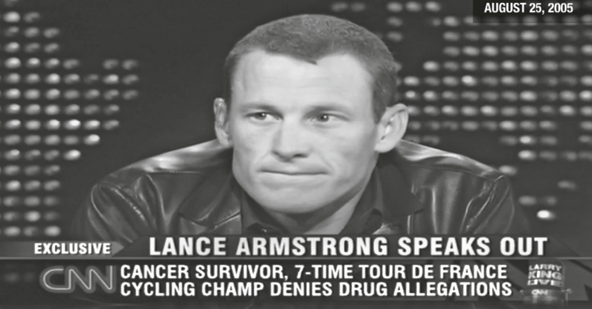
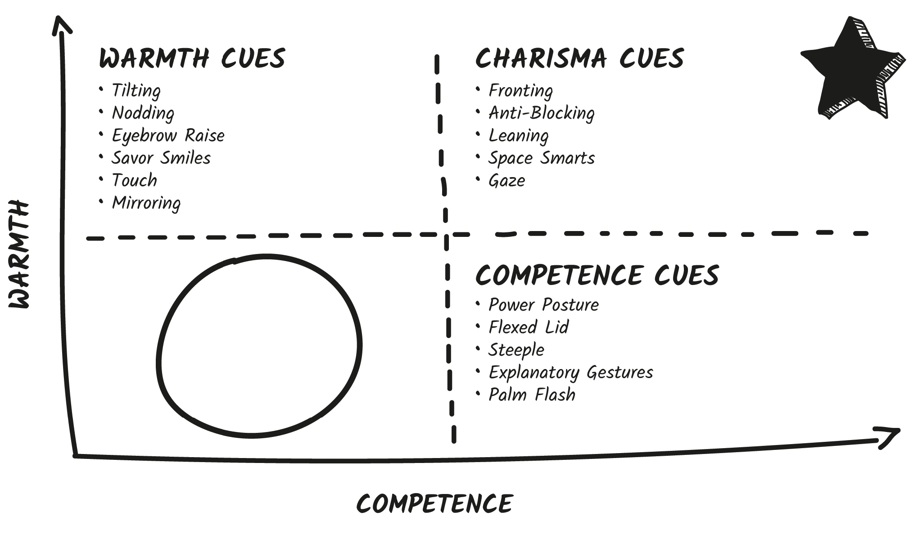
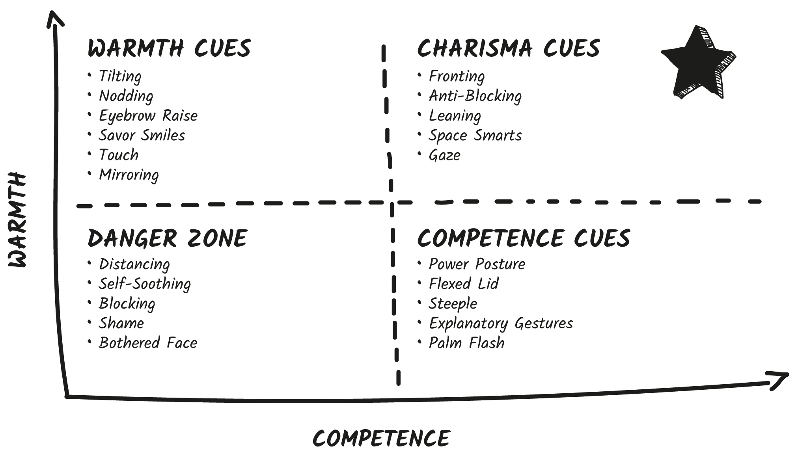

## CHAPTER 6

## How to Spot a Bad Guy . . . and Not Be One Yourself

On August 25, 2005, Tour de France champion cyclist Lance Armstrong appeared on _Larry King Live_ to convince the public he wasn’t doping. I listened to his words, watched his quasi-sincere expressions, and thought, _This guy is hiding something._

I didn’t know why I had that feeling at the time, but Armstrong was leaking all kinds of negative nonverbal cues and my gut was picking up on them.

A few minutes into the interview, Armstrong told a bald-faced lie about his use of performance-enhancing drugs. “That’s crazy,” he said. “I would never do that . . . that’s . . . no. No way.” And he then pressed his mouth into a hard line forming a cue called a **lip purse**.

A lip purse indicates suppressing or hiding one’s true feelings. When we’re hesitant to say something, we press our lips together as if to force ourselves to “keep it in!”

Eight years later Armstrong finally admitted to his massive undercover doping scheme dating back to the nineties.

_Larry King Live,_ CNN

The lip purse cue falls squarely in the Danger Zone. Cues in the Danger Zone are red flags indicating the possibility of something negative. If you see them, they warrant further investigation. They signal anxiety, boredom, confusion, defensiveness, close-mindedness, incompetence, or aggression. Always be on the lookout to **decode** and address these cues, while also making sure not to **encode** them yourself.

### Lie to Me

Have you ever wondered what happens to your body language when you lie? If you leak any tells? Now’s the time to find out.

Let’s play a little game I call Lie to Me. You’ll need five minutes and a way to film yourself.

Sit in a well-lit spot so your camera can record your face, hands, and upper body clearly. Open the camera on your phone or computer and hit record.

> STOP HERE UNTIL YOU’RE READY TO RECORD. DO NOT PREVIEW THE QUESTIONS BEFORE HITTING RECORD.

Ready? Okay, please look at your camera and answer the following questions out loud. Pretend you’re going to send this video to me to decode. That is to say, speak in full sentences, make sure the lighting is decent (we’ll be looking at small signals on your face), and pretend you’re really talking to someone. If you can’t immediately think of an answer, that’s okay—**don’t pause the recording**. What you do while you _think_ about your answer is just as important to code. Think of your answers as quickly as possible.

Answer the following questions into the camera:

Question #1: What did you have for breakfast yesterday?

Question #2: What is your most embarrassing moment? Please share the full story with as many details as possible.

Question #3: Make up an embarrassing story that did not really happen to you. When you’re ready, tell it to the camera in as convincing a manner as possible.

Done? Great job! Save the video and we’ll review it at the end of the chapter.

The first question is a _recall_ task. The goal is to see what you look like when you remember a truth that is not embarrassing or stressful but just factual.

The second question is an _embarrassing recall_ question. The goal is to see what you look like when remembering a truth that’s slightly embarrassing or anxiety provoking.

The third question is your lie.

At the end of the chapter, we’ll code the nonverbal cues in each to see how you express yourself when recalling, embarrassed, and lying.

We’ve had hundreds of people play this on our website and send in their Lie to Me video. My amazing team and I have spent countless hours coding the videos looking for patterns. We’ve found that no one cue signals someone is lying—and the research backs this up. Unluckily for us, there’s no Pinocchio’s nose in real life.

However, some cues do signal anxiety, shame, and guilt. When you see these cues, it’s important to note that they don’t necessarily denote lies but rather are red flags that should be investigated further.

### DANGER CUE #1: Distancing

“I am not a crook. I’ve earned everything I’ve got,” said President Richard Nixon at a press conference on November 17, 1973.

Of course, as it turns out, that famous line was a lie. Nixon was very much involved in the Watergate criminal conspiracy.

I’d always heard this line but never seen it myself. But when you watch the original footage of Nixon delivering this line, you’ll notice an interesting nonverbal cue.[[*]](46_Footnote.xhtml#footnote_1 "footnote") Immediately after saying it, he takes a large step back from the podium.

This is a **distancing cue**. When we don’t like something, we have the urge to physically distance ourselves from it. When we think something is threatening or dangerous, we want to get as far away from it as possible.

And you know what’s really dangerous? Telling lies. Deception gets us into trouble. It makes us feel guilt and shame and fear—emotions physically distressing to our body.

One of the first cues my team and I noticed in the Lie to Me videos was that on question 3, the lying question, people tended to lean back away from the camera, scoot their chair back, or turn their head away while they lied (or prepared to lie).

Always be on the lookout for sudden distancing behaviors, like:

  * Stepping back

  * Leaning back in a chair

  * Turning your head or body away

  * Scooting back

  * Turning away to check your phone

  * Angling backward

Distancing is a subtle signal that someone has said, seen, or heard something that didn’t sit right with them.

Of course we also need to make sure _you_ are not accidentally distancing. Others won’t respond well when they sense that you are pulling or turning away. **Physical distancing can trigger emotional distance.** The most charismatic people are stable, present, and engaged. They front, they lean in, they get closer. Distancing is the opposite of those positive cues.

Not only does distancing make you less charismatic, it can also negatively impact the people you are with. In one study, physical therapists were videotaped while they were working with clients. They found that the physical therapists who exhibited negative nonverbal cues—specifically looking away and not smiling directly at their patients—had a negative effect on their patient’s _health_ outcomes. The more distancing the physical therapists demonstrated, the worse their clients’ physical and cognitive functioning was at discharge _and_ three months later! The physical therapists who nodded, smiled, and leaned in had better client outcomes.

I’ve noticed people tend to distance accidentally. This happens in two ways.

First, **phubbing**. Phubbing (a word that combines _phone_ and _snubbing_) is when you ignore the person you are with by turning away to check your phone. Not only is this _super_ rude, research finds it also makes you appear less trustworthy. It lands you squarely in the Danger Zone.

The second way we accidentally distance can occur while you are presenting, giving a toast, or standing in front of a room. In our Powerful Presentations course, I asked students to send in videos of presentations that didn’t go well—you know, those moments you wish you could’ve done over? A frequent pattern we encountered was that nervous presenters often got in front of the room, delivered their first line, then took a step back or leaned on their back foot. This forced them to deliver their first few points while they were rocking back and forth from their back foot to their front foot, making them look unsure.

This was a double hit for their charisma. That backward distancing signaled a lack of connection with the audience and made them look unstable. It was also distracting.

Another accidental flub? We noticed presenters making excellent points . . . while their back was facing the audience. Presenters would turn to draw things on the board or gesture to slides behind them by turning their back on the audience, so they ended up fronting with their slides instead of their people.

Here’s how to avoid these negative cues:

  * Before you start, pick one spot on the floor to deliver your opener. Walk to it and plant.

  * Avoid nervous feet—the step back, the hop side to side, the shuffle—or standing on the edge of your feet.

  * Always use a remote to change slides so you can click without having to turn around or hunch over a computer.

  * Try to memorize the order of your slides and notes so you don’t have to keep checking behind you or turning toward your monitor to see what’s up next.

  * When you need audience members to look at your slides or a board behind you, move to one side and practice the open palm gesture.

  * If you’re drawing on a whiteboard or screen, try to save your important points for when you’re done or take a break from drawing to make the point while facing the audience.

  * If you’re sitting while talking to people, try to use a chair that swivels to make it easy to turn. If you do choose a swivel chair, be sure not to accidentally swivel away (or wiggle in your chair).

  * Do you have a tendency to step backward while presenting? I’ve seen nervous presenters end up with their back practically to the wall after presentations! To avoid this, put water, your notes, or your computer on a table in the area you want to present from. That will keep you anchored toward the front.

Have you ever blanked out in a presentation? Or lost your place? While taking a step back can be damaging for interpersonal relationships, it can be helpful for _you_ when you are trying to figure something out. A group of researchers found that when people take a literal step back from an overwhelming project, they feel more capable and in control.

When you have a blank-out moment, just take a step back to gather your thoughts. Move back, catch your breath, take a sip of water, and then step forward when you’re ready to get back on track.

Can’t figure something out? Can’t think of that word? If you’re alone at your desk, try scooting back or stepping back. The enhanced physical space can create more mental space.

PRINCIPLE

Physical distance can create emotional distance. Don’t turn away, turn toward. Don’t step back, move in.

When You Might See Distancing

  * You said or did something that made someone nervous or uncomfortable.

  * Someone just lied and they want to get as far away from that trouble as possible.

  * When someone is distracted by their phone, screen, computer, or slides behind them.

What to Do If You See Distancing

  * Research: What was the trigger that caused someone to distance? What’s the reason _you_ distanced?

  * Resolve: Add clarification, clear up confusion, and get back on the same page.

  * Rapport: Find something you can both lean in to. Find a reason to bond, connect, and turn toward.

### DANGER CUE #2: Self-Comfort

Britney Spears is on _Dateline_ and is getting grilled about her second husband, Kevin Federline. It’s 2006 and they already have a nine-month-old son. Spears is pregnant again.

The interviewer asks Spears about how their relationship began. Immediately Spears sits back in a distancing gesture.

She proceeds to pull both hands up to her forehead and pull her hair out of her face. This is a ventilating gesture. **Ventilation** is an attempt to draw airflow to the skin to prevent nervous sweat. People “ventilate” by lifting their hair, pulling their collar away from their neck, or fanning themselves.

One second later, Spears begins to rhythmically rub the side of her calf with her hand. This is a **comfort gesture**.

Research finds that we self-touch more when we are talking about anxiety-producing topics. Think of parents with small children—moms rub a baby’s back and dads pat heads to calm kids down. Even after we reach adulthood, this desire for soothing remains, and we self-touch by rubbing our neck, wringing our hands, or stroking our legs to calm ourselves. Touch produces oxytocin, which makes us feel calm and connected.

Comfort gestures like biting nails and sucking on pens are called **pacification** gestures because, like a pacifier, they can be used to soothe anxiety. We also pacify by biting our lips or sucking on the inside of our cheeks. All of this reminds us of having a pacifier or a bottle in our mouth—which felt very comforting indeed.

We can also comfort ourselves by **preening**. This is when we use self-touch to make ourselves look better—either purposefully or out of habit. We touch our hair, fix our makeup, or fidget with our clothes. Spears’s attempt to push her hair out of her face might also have been a preening cue.

FUN TIP

### Flirty Preen

Preening is not always a Danger Zone cue. It can also signal flirtation. One study found that women preen more than men and typically do it in new or developing relationships. Women do not preen as much when they’re already paired with someone. This could be because preening is a way to boost self-esteem, improve physical appearance (straighten clothes, comb hair, or fix makeup), or even call attention to physical features by touching lips or hair. If you don’t see any other Danger Zone cues, you might be the target of someone’s romantic interest!

Here are some common comfort gestures you’ll see:

  * Rubbing arms or wringing hands

  * Rubbing the back of the neck

  * Stroking thighs or calves

  * Cracking knuckles

  * Biting nails or pens

  * Sucking on cheek or biting lips

Another type of comfort gesture is a comfort movement. This is when people sway back and forth, rock onto their toes, jiggle their feet, or pace. Again, parents rocked us to sleep, bounced us when our tummies hurt, and paced our bedrooms to get us to calm down. As adults, we try to do it for ourselves as well. It’s why a rocking chair is so relaxing. You might notice presenters swaying back and forth as they deliver their points—this is an unconscious way of keeping themselves calm.

The nose touch is another unique self-touch gesture. Something happens to your nose when you lie. Your nose won’t grow like Pinocchio’s, but it might itch. Psychiatrists used thermographic cameras and found that when people lie, their nose actually heats up! This can cause nerve endings to tingle, which is why people may have the instinct to touch or scratch their nose while lying.

Researchers Alan Hirsch and Charles Wolf dissected Bill Clinton’s testimony in the Monica Lewinsky trial and found that when he lied, he touched his nose twenty-six times.

Self-touch gestures negatively impact your charisma on two levels. First, comfort gestures make you look anxious. **Study after study finds that comfort gestures, fidgets, and extraneous movements make you look less charismatic.**

Powerful people don’t waste energy on purposeless movements. They gesture to explain, they lean in to emphasize, they’re still unless they have a reason to move.

And this brings me to the second reason comfort gestures are so damaging: Self-touch or comfort movements are distracting to others. Our eye is drawn to motion. If you’re talking but also cracking your knuckles or stroking your leg, people find it hard to give full attention to your words. If you’re pacing back and forth, people find it difficult to focus on your words and not your body. Comfort cues detract from the quality of your message.

Self-soothing gestures also make your _audience_ nervous. One team of researchers found that when speakers were fidgety onstage, it raised the cortisol levels of the audience members watching them! Remember the Cue Cycle? Our nonverbal cues are contagious. **Your nervous gestures inspire nervousness.**

Okay, so you know comfort gestures are damaging to your charisma, but how do you stop them? If you’re a fidgeter, pacer, or nail biter, you’ll find it hard to stop. I know this because pacing is one of my nonverbal vices. Instead of trying to quit cold turkey, I encourage you to use what I call **displacement tactics**.

When we’re anxious, we pace to give our legs something to do. We fidget because we don’t know what to do with our hands and need a way to work out the anxiousness. Displacement tactics help you focus on something mentally and give your body something to do physically. Here are some ideas:

  * Hold a pen or pencil.

  * Use a clicker—this has helped me so much as a presenter! It allows me to front more with my audience and limits my extraneous gestures.

  * Carry a mug of tea or coffee. I do this at networking events. I leave the hand I use for shaking free but carry a drink in the other. This helps me fidget less.

  * Lean against a podium to stop from swaying.

  * Make your hairstyle fluff proof. I had bangs for a month but had to grow them out because I was constantly pushing them out of my face.

  * Don’t wear jewelry or clothes that require adjustments.

FUN TIP

### Thumb Hold

I once was interviewed by a news anchor while we were standing in a big open pavilion. This was my first standing interview and I kept swaying back and forth. The reporter gave me a trick to stop myself from swaying on-camera. She told me to put my hands by my sides and press my thumb and index finger together and to hold it during the interview. I was shocked that this trick actually worked! It also prevented me from using jazz hands (I tend to be an over-gesturer). It’s invisible to others and really works!

PRINCIPLE

Comfort gestures distract and detract from your charisma.

When You Might See Self-Comforting

  * If someone is anxious, doubtful, or uncomfortable.

  * If someone is a habitual fidgeter or preener.

  * In hands—wringing hands or cracking knuckles. Near the mouth—biting lips, sucking cheeks, or biting pens. On the neck—rubbing or playing with jewelry.

What to Do If You See Self-Comforting

  * Research: What did you say to make someone nervous? Are they fidgeting from anxiety or is it just a nervous habit? Some people’s comfort gestures are merely habitual. If someone continually displays the same nonverbal tic, try to ignore it (or tell them how to stop by giving them this book).

  * Resolve: Do you notice someone stops fidgeting when you do, say, or address something? I was once talking to a colleague who was playing with her earring. I didn’t think much of it until she stopped the moment I mentioned our New Year launch. Her _stopping_ the cue made me aware that I had hit something important. After some digging, I realized she had been very nervous about the end-of-the-year rush and was hoping to ask for some extra help.

  * Rapport: Do you make someone nervous? Get to know them more. Find commonalities. Help them feel heard with warmth cues—mirror them, smile encouragingly, use the eyebrow raise.

### DANGER CUE #3: Block It Out

Michelle Poler conquered a hundred fears . . . and filmed every single one. She skydived, got a bikini wax, and ate spicy food.

When she posted her fear-conquering videos to YouTube, they went viral. Her courage started a movement, inspiring others to conquer their own fears. I took part in one of her episodes—helping Michelle conquer her fear of talking to strangers. We filmed a video of us together walking through the streets of New York handing out flowers.

I love watching Michelle’s videos because they’re inspiring and a great nonverbal snapshot of what someone looks like right _before_ they’re about to do something that makes them feel afraid.

In one hilarious episode, Michelle got her first bikini wax. You see her enter the room and touch her **suprasternal notch**. This is the indent right between your two collarbones. She does it again when she lies down on the table.

People often touch this spot or fiddle with something _near_ the notch—a necklace, tie, or scarf—when they want to calm themselves down. It makes us feel safe to have our hand over our heart, chest, and neck, the most vulnerable parts of our body.

Michelle also displays what I call a **fear smile.** She is smiling and showing the whites of her eyes. This is a Danger Zone cue because it is incongruent and often happens when someone is trying to smile to hide their nerves. Sometimes people accidentally do this in their profile photos (especially if they hate having their photo taken). Check your profile photos to make sure you’re not showing the upper whites of your eyes. It will only distract from your smile.

FUN TIP

### Notch to Calm

Be careful not to touch your suprasternal notch absentmindedly. It’s distracting and signals anxiety. However, it can be used if you need to calm down quickly. I teach my students in my speaking class that if they have anxiety before speaking, one way they can calm down quickly is to stroke this notch. Weird, but it works.

Touching the suprasternal notch is also a **blocking gesture**. We learned about anti-blocking in chapter 3. Blocking our body with our arms, our hands, or a prop like a computer or notebook makes us feel protected but signals close-mindedness. We block when threatened or uncomfortable to protect our most vulnerable areas.

There are three types of blocking gestures, and Michelle exhibits all of them:

  * Body blocking protects our heart, lungs, and abdomen. In Michelle’s videos, she gives herself self-hugs, puts an arm in front of her chest, touches her suprasternal notch, and clutches items in front of her body.

  * Mouth blocking protects our only mechanism for consuming nutrition and water (and our best way to communicate). When people are afraid, they often bring their hands up to their mouth or clap their hand over their mouth. This is a mouth block. Biting nails is both a mouth block and a comfort gesture. This is why people have such a hard time breaking that habit!

  * Eye blocking shields our eyes from harm. Receivers of bad news will often cover their face or eyes with their hands or pull their glasses off to rub at their eyes in exasperation. Subconsciously they’re trying to block out what they just received _and_ give themselves a moment to process. It’s like shutting everything out to give yourself time to think. Rubbing the eyelids stimulates a special nerve in the eyelids called the vagus nerve, which helps slow down heart and breathing rates when it’s massaged. A quick eye touch is one of the fastest ways to calm down.

Michelle actually has an entire playlist of fears related to pain. Unsurprisingly, these have the most eye and mouth blocking. When we are experiencing pain, it’s all we can focus on, so we want to literally block out the rest of the world. And we mouth block when we are in pain—biting on our knuckles, covering our mouth, sucking on our lips because we’re trying to stifle the urge to scream. Yikes!

FUN TIP

### Let Me See You

When you want to bond, try purposefully taking off your glasses. You’re subtly saying, “I want to see you clearly and have no barriers between us.” Of course, if you need glasses to actually see the other person, be sure to keep them on! But if you use them for reading, make a point of removing them at the start of an interaction as if to show, “I want to see you.”

An increased **blink rate** is another kind of eye block. Research finds that our blink rate speeds up when we’re nervous. This shields out potential threats but also gives us time to think.

One researcher coded President Nixon’s blink rate during the Watergate hearings and found that his blink rate increased significantly when he was asked a question he was not prepared to answer.

To see this in action, watch Britney Spears in her _Dateline_ interview. When Spears was asked if she was concerned about her husband cheating, she fluttered her eyes in a rapid series of blinks and took a deep breath before answering. That question made her very nervous indeed.

Be sure to decode sudden blocks and put people at ease when you think something has made them nervous or uncomfortable.

Most important, **don’t encode your own anxiety with accidental blocks**. These cues will immediately drop you into the Danger Zone.

PRINCIPLE

We block our bodies, eyes, and mouths to protect ourselves.

When You Might See Blocking

  * If someone’s feeling anxious, upset, or uncomfortable.

  * If someone needs time to think and block everything else out.

  * If someone just heard something surprising, negative, or threatening.

What to Do If You See Blocking

  * Research: Be on the lookout for sudden blocks. This is usually a signal that someone needs a little extra reassurance. You just need to find out why and how you can help.

  * Resolve: Once you know the cause of someone’s anxiety, you have a choice: soothe or solve. Can you help quell their anxiety? Can you solve their problem?

  * Rapport: Can’t solve or soothe? Give them space. Sometimes people like to process anxiety on their own.

### DANGER CUE #4: The Signal of Shame

On July 3, 2005, comedian and actor George Lopez pulled up to his home in Los Angeles, California. A city official, eight workmen, and two tractors were waiting for him.

According to the city official, Lopez had missed five letters from the city claiming his property was breaking code and they would need to tear down an entire room in his home. Lopez protested and argued. He questioned and begged, but the work crew was ready. There was no solution. The tractor began knocking down a wall in the front yard.

Moments before the tractor reached the house, actor Ashton Kutcher came running down the street with cameras. The city official and workmen were all actors in an elaborate ruse to fool Lopez for the TV prank show _Punk’d_.

Upon seeing Kutcher and hearing about the joke, Lopez immediately put both hands on his forehead and looked down. This is the quintessential **shame cue**. When we feel ashamed, we lightly touch our forehead with our fingers or hands. It is often accompanied by a look down or a tilt of the head down.

Watch any prank show and you’ll see it the moment the joke is revealed. It’s a combination eye block and self-soothing gesture. When we feel shame, we try to block it out. We do this by averting our gaze, looking down, and touching our fingers to our forehead in order to shield our face from the offending information or person. This is also a way to cover our embarrassed facial reaction.

Once I learned the shame cue, I was shocked at how often I saw it in everyday interactions. Here are the most common scenarios in which you might spot shame:

  * Talking about money. I often see the shame gesture when people are discussing financial matters. Talking about money embarrasses us. If you see this cue, take special note! You now possess an incredible piece of insider information—money is sensitive or emotionally charged for this person. Keep it simple, put it in writing, and try to give them advance warning of any money discussions.

  * Lack of knowledge or confusion. People often show shame when confused. Ask a colleague about their timeline on a new project and see the shame gesture? They might be confused or embarrassed about the project, the timeline, or an aspect of the work.

  * Too much information, too soon. I really love deep, long, intimate conversations (and walks on the beach), but not everyone does. Sometimes I find that I ask introverts personal questions too soon. If I overstep and ask too many questions, I often see the shame gesture. Then I know to slow down and verbally back up.

  * Someone made a mistake. When people make a mistake, they often use the shame touch. This might happen when you call them out on their mistake OR when they realize they’ve made one, which might be before you realize it! I’ve caught mistakes early by noticing someone’s shame touch at their own internal realization.

Shame is one of the most powerful cues to spot because it’s an indication that you’re close to the Danger Zone. Shame, in itself, is not a bad cue, but it is a leading indicator that you might be stumbling into a topic, an idea, or a scenario that is making someone nervous. **Shame means you’re entering the Danger Zone!** If you see it, tread lightly.

PRINCIPLE

The shame touch is a signal flare of nervousness.

When You Might See Shame

  * When you’ve embarrassed someone.

  * When you’ve stumbled onto a topic that’s too personal or too much. This happens more frequently with introverts.

  * When someone is confused or worried and doesn’t know how to talk about it.

What to Do If You See Shame

  * Research: Did you say or do something that made someone feel embarrassed, ashamed, or confused? Find out what!

  * Resolve: Welcome shame with open arms. Don’t shame shame! If you don’t honor shame, it can force someone to close up, withdraw, and lose trust in _you._ Work out shame by offering reassurance and acceptance.

  * Rapport: One of the best ways to soothe shame is to share a mutual vulnerability. I once spotted shame on a new team member when we were reviewing our highly technical email software. I immediately went into reassurance mode. “You know what? This took me _months_ to learn. You’ve gotten so far in the last few days. You got this! And we’ll be here to help as you learn.” It turned a shame moment into a bonding moment.

### DANGER CUE #5: Are You Okay?

I have a problem. I have what’s called RBF, or resting bothered face. My face looks downright perturbed when I feel completely neutral.

Ever had someone ask you if you’re mad when you’re perfectly fine?

Or tell you that you look tired even when you had a long night’s sleep?

I feel you!

RESTING BOTHERED FACE

Looking a little irritated, down, or mad even when you’re completely fine.

What does your face look like when you are thinking? Listening? Working? This matters more than you think. As humans, we’re very attuned to others’ faces, constantly scanning them for cues. Faces give us a wealth of information—not only does someone’s facial expression tell us what _they_ are thinking, it can also tell us what _to_ think.

If you don’t like something, maybe we won’t like it either.

If you’re afraid, maybe we should be afraid too.

We constantly scan the faces of people around us to look for hidden clues for what to think and feel. This behavior starts at a very early age. One researcher had parents hold their one-year-old baby on their laps. He then put two boxes on the table in front of them so the baby could see both him and the boxes.

First, the researcher opened one of the boxes and reacted with an expression of happiness. He made sure the baby saw his reaction but not what was in the box. Then he opened the second box and showed a negative expression. Again, the baby could see only the researcher’s face.

Then the researcher put both boxes in front of the baby. He found that _all_ the babies immediately reached into the happiness-provoking box but avoided the disgust-provoking box. **We learn what we want to engage with by observing people’s facial expressions.**

Three negative facial expressions contribute the most to resting bothered face.[[*]](47_Footnote.xhtml#footnote_2 "footnote")

  1. Anger: When angry, we pull our eyebrows down into a furrow. This creates two vertical lines in between the eyebrows.

The muscle that pulls your eyebrows down and together is called the corrugator supercilii. It’s used to express a variety of negative emotions from anger to worry to confusion, so we recognize the furrowed brow as something negative. If your resting face includes a furrowed brow—and many people do activate the corrugator supercilii in concentration—others might think you’re bothered.

Here’s where this gets more interesting: A furrowed brow doesn’t just look negative, it _feels_ negative.

Researchers find that when they force people to furrow their brow, this act actually generates more negative emotions. **A furrowed brow makes us less happy, less agreeable, and less engaged overall.**

Talk about motivation to relax those brows!

FUN TIP

### Botox

Incredibly, research found that people who use Botox to numb their furrow muscles feel less angry and irritable. When your muscles physically can’t make the face of anger, you actually feel less angry. However, if people Botox their smile lines, they also feel less joy.

  * Encoding anger: Look in a mirror while concentrating. Do you see two vertical lines in between your eyebrows? To avoid resting bothered face, try keeping your brows relaxed.

FUN TIP

### The Sun!

Do a quick check of your profile photos. Are you furrowing your brow? Sometimes taking pictures in the sun can accidentally cause you to furrow your brow, making you look angry to anyone viewing your profile. **Researchers actually studied this and found that sun-induced frowning uses the same facial muscles as anger.** When participants walked in the sun without sunglasses, they felt angrier and more aggressive compared to those who wore sunglasses. That furrow is powerful!

  * Decoding anger: Always be on the lookout for a furrowed brow. Is it their concentration face? Great, let them be. Are they a little angry? It’s a red flag! Research and try to resolve it.

SPECIAL NOTE

### The Lip Purse

Sometimes when we are angry we tense our lips and press them into a hard line called a **lip purse**. Remember how Lance Armstrong pursed his lips after his lie? When angry, we often try to suppress a yell or contain an outburst. Emotionally we’re trying to “keep it together,” and physically this looks like tension—pursing the lips, tightening our hands into fists, or clenching our jaw. If you see someone exhibit the lip purse, they might be hiding something or on their way to full-blown anger.

  1. Sadness: When sad, we pull the corners of our mouth down into a frown. We also droop our eyelids and pinch the corners of our eyebrows together.

Sadly, my face looks dangerously close to sad while at rest. This is because I have a naturally downturned mouth—at rest, the corners of my mouth point down (like a frown). I also have extra-large eyelids—yup, weird facial trait! So I tend to look droopy even when I’m quite awake.

Now that I know this, I can correct for it. When I’m in an important meeting or recording a video, I open my eyes a little wider than normal and hold my mouth in a more up position.

I can also manage this with makeup. I use liner to pull the corners of my lids up and shadow my lids, so they look more open.[[*]](48_Footnote.xhtml#footnote_3 "footnote") These small changes have a dramatic effect on my engagement.

Similarly, if you’re challenged with RBF, try positioning your camera slightly higher than your eyeline. This makes you look up, which widens your eyes and makes you look more awake. When you are in an important meeting, angle the corners of your mouth up or raise your eyebrows during the first impression or during important points. This is a subtle way to show people you’re engaged and not, in fact, bothered at all.

FUN TIP

### The Mouth Shrug

A mouth shrug, also known as a deep frown, is an expression of doubt or disbelief. It’s on its way to sadness—as in, it would make us sad if what we’re seeing or hearing wasn’t true. If you see it, pause and take note. Do you need to explain your point further? Get clarification? Check in that everyone is on the same page? Don’t let the mouth shrug go unchecked.

  * Encoding sadness: Which way does your mouth turn? Do your facial features encode a certain emotion? This is information you can use to be more purposeful when you need it.

  * Decoding sadness: See someone pull their mouth into a frown? Spot a mouth shrug? With sadness you have two choices: address it to make someone feel better or give them space. Sometimes, especially in professional settings, people need space to deal with their sadness.

  1. Contempt: The smirk, also known as contempt, happens when we lift up one side of our mouth.

George W. Bush was running for president of the United States. And he had a problem. He smirked. A lot. And it rubbed people wrong. “The infamous smirk was creating ‘the wrong impression,’ ” said political author Dr. Drew Westen.

The Republican Party took action and rapidly coached Bush on how to reflect “gravitas instead of hubris.”

“The smirk is causing much justifiable worry in Republican circles,” reported _Slate_ in a 1999 article called “George W.’s Smirk.”

It’s the simplest of the facial expressions but also the most confusing. Contempt—scorn, disdain, or superiority—is most often confused with boredom, apathy, and apprehension. When researchers asked participants to identify facial expressions, only 43 percent correctly identified contempt—the lowest score of any expression!

I see this contempt confusion all the time when people mistakenly use the smirk emoji  when trying to convey happiness . That asymmetrical smile shows scorn, not soft happiness!

Research shows contempt is the most common form of resting bothered face. And this matters for our professional, social, and even romantic relationships.

Dr. John Gottman is a marriage counselor and researcher in Seattle. He ran a thirty-year-long experiment to find out why certain couples get divorced while others stay together. He wanted to know if he could spot patterns among couples that could predict the future of their relationship.

Gottman found one single cue to predict the fate of these couples: contempt. If one or both people in the marriage flashed contempt about their partner in the intake interview, there was a 93 percent likelihood that couple would divorce!

SPECIAL NOTE

### Punctuators

Researchers discovered that most people have an expression or gesture they use to punctuate or emphasize their words. These are called **punctuators**.

Punctuators are cues, gestures, or facial expressions humans use to emphasize their words without the corresponding emotional meaning.

For example, actor and podcast host Dax Shepard is often teased by his _Armchair Expert_ cohost, Monica Padman, about his nonverbal punctuator—**the nose flare**. Also known as a nostril flare or nasal wing dilation, it’s a Danger Zone cue and a nonverbal signal of aggression.

When we need to quickly take in air, our nostrils flare and expand. We also tense and expand our nostrils when we’re angry.

But Padman noticed that Shepard does this when he isn’t actually angry (so it’s merely a punctuator). She has advised him to keep his nostrils in check because it signals aggression to their guests.

If _you_ encode a punctuator that happens to be a negative cue, try to switch it to a more positive or neutral cue.

If you see colleagues, friends, or family members show the same cue over and over again, seemingly at random times, it’s likely just their punctuator.

Contempt is a very powerful emotion. If it’s not addressed, it festers. Unchecked contempt can grow into disrespect and hatred if it’s not quelled.

  * Encoding contempt: Be sure you’re not accidentally smirking—at rest, in your profile pictures, or when listening.

  * Decoding contempt: If you see contempt, immediately identify the source. What was said, what was felt, what happened to trigger it? Then see if you can reassure, reaffirm, or resolve the cause of the negativity.

PRINCIPLE

Be aware of what cues your face is sending at rest—avoid accidental anger, contempt, and sadness.

### How to Negotiate for a Car . . . or Anything You Want

Up to this point we’ve been talking about avoiding the Danger Zone cues. However, there are rare times when Danger Zones cues can help enhance your communication. **You can use Danger Zone cues to subtly signal disapproval, dislike, or disengagement.**

Is someone making you uncomfortable? Cover your mouth and step back.

Did someone bring up something you disagree with in a meeting? Lean away and cross your arms.

My favorite way to expertly use Danger Zone cues is when negotiating. As a people pleaser, I find it a little challenging to say no. And sometimes a verbal back-and-forth can be exhausting and filled with tension. I much prefer letting my nonverbal cues speak for themselves.

My negotiation strategy is to let your nonverbal communication speak _for_ you. This has the effect of making your counterpart negotiate with themselves.

Here’s how it works: When the person you’re negotiating with says something positive or something you agree with, reciprocate with positive nonverbal signs and give verbal encouragement.

Let’s take the example of negotiating for a new car. This might sound like:

“Wow!” [Smile.] “I’m thrilled that your financing rate is so low.”

[Lean in.] “It includes heated seats. Love that.”

[Nod and make eye contact.] “Really? You give 100 free car washes if I buy today?”

**Most people make the mistake of not looking too excited when negotiating for something they want.** This actually works against you! Using nonverbal warmth and competence both builds rapport with your negotiator and helps them respect you—which might get you a better deal.

Researchers even found that nonverbal ambivalence (trying to be neutral) hurts your ability to negotiate. **They found that showing nonverbal signs of disappointment when you hear a bad offer can actually cause the person you’re negotiating with to make larger concessions.**

This is a more authentic way to negotiate—why hide your excitement or stifle your upset? Show it all! Highlight your true feelings. When you hear something that you don’t like or don’t agree with, switch to your Danger Zone cues. This is a nonconfrontational yet clear way to show disappointment and get the other person to make concessions without having to say a word.

They offer you a bad price: you lip purse.

They offer an unworkable timeline: you furrow your brow and cross your arms.

They don’t give you what you need: you shake your head no and turn away.

These are subtle nonverbal ways of saying, _No thanks. Can you do any better?_

What’s important to remember when negotiating is that being ambivalent or hiding your feelings can actually hurt your chances and authenticity. It also makes your negotiator trust you less. Show your real feelings to foster real rapport.

### Congruence Breeds Authenticity

Ambivalence doesn’t just hurt you in negotiations. It can also be damaging professionally.

Ever heard someone start a meeting with “I’m so happy to be here,” but they say it with an unhappy face, a bored voice, and a very tired-looking posture? This is called an **incongruity**. The words don’t match the cues.

CONGRUENCE

When our nonverbal cues and verbal content align.

When our words and body language cues are incongruent, it’s as if there’s a misfire. We sense something is not right. Not only does it come across as inauthentic, but it also confuses us. Which should we believe? The verbal message or nonverbal cues?

Here’s what is important to remember about Danger Zone cues: When they’re accompanied by the congruent verbal message, they can be reliably seen as negative. If someone _says_ they’re angry and _displays_ anger, then that’s congruent. **It’s negative, but you know nothing is being hidden from you.**

For example, Michelle Poler shows all kinds of Danger Zone cues in her videos and people still love them! Why? They’re congruent. She says she’s afraid, anxious, and nervous, and her nonverbal cues match.

When a Danger Zone cue is _not_ accompanied by the matching verbal cue, then you have a red flag. That needs to be investigated further.

My rule of thumb is to look for a **cluster** of three red flags in a row. One red flag might be an accident, context related, or a fluke—someone touches their neck because they have a mosquito bite you can’t see, someone crosses their arms because they’re cold, someone shows contempt because they had a random internal criticism that had nothing to do with you. But three incongruent nonverbal cues around the same topic should raise your concern.

Research confirms that looking for a cluster of cues in context is the safest way to accurately assess someone’s true feelings.[[*]](49_Footnote.xhtml#footnote_4 "footnote") For example, one researcher found that when participants withheld information, they showed a specific nonverbal cluster: a trunk swivel (distancing), rocking back and forth, and shaking their head.

PRINCIPLE

Use clusters to prevent false positives.

### CHAPTER CHALLENGE

We have made it to the end of the nonverbal section! Here are all the warmth and competence nonverbal cues you should know:

Now it’s time to analyze your Lie to Me video! Pull it up and use the chart below to mark every time you see yourself show one of the Danger Zone cues.

This will help you identify what you encode when you’re recalling (question 1), when you’re embarrassed (question 2), and when you’re lying (question 3)—and even when you’re just thinking (in between answers).

|  QUESTION 1 |  QUESTION 2 |  QUESTION 3  
---|---|---|---  
Lip Purse |  |  |   
Distancing |  |  |   
Ventilating |  |  |   
Comfort Gesture |  |  |   
Preen |  |  |   
Suprasternal Notch Touch |  |  |   
Body Block |  |  |   
Mouth Block |  |  |   
Eye Block |  |  |   
Shame |  |  |   
Anger |  |  |   
Nose Flare |  |  |   
Sadness |  |  |   
Mouth Shrug |  |  |   
Contempt |  |  |   
Punctuator |  |  |   
Other |  |  |   
  
**BONUS CHALLENGE:** Ask five people in your life to play the Lie to Me game with you. I have five blank Lie to Me tables in your digital bonuses. See if they would be willing to record _their_ Lie to Me video. Then you can uncover and record one another’s tells together.
