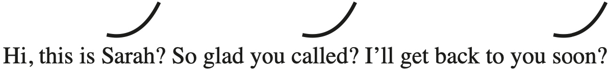
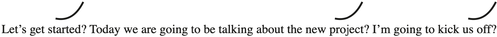
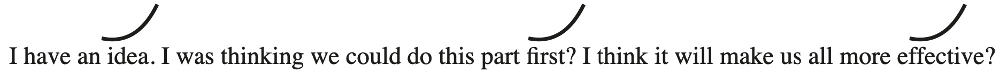

## CHAPTER 7

## Sound Powerful

Where are you from, Cameron?” asks Lauren.

“I’m from the state of Maine,” answers Cameron.

“I don’t think I’ve met anyone from Maine before.”

“I’m the only one you’ll ever need to meet.”

Lauren laughs. “I like that, I like that.”

Lauren Speed and Cameron Hamilton are on a blind date. Like, literally, a blind date. They’re participants on Netflix’s _Love Is Blind,_ where thirty men and women speed-date each other in different “pods.” They can talk to each other but not see each other. By the end of the show, they have a chance to get _engaged._ Crazy? I thought so too, but then something amazing happened.

Lauren and Cameron bond immediately and quickly get to know each other. By the end of their first date, they’re already building a strong connection.

“Gosh, I really want to get to know you more,” said Cameron.

“I know, I like you,” said Lauren.

“I like you too.”

**“I like your voice too, you** _sound_ **cute.”**

They both laugh flirtatiously.

Over the next few days, Cameron and Lauren go on multiple blind dates, getting to know each other more through the wall, simply by hearing each other’s voices and answering questions. No body language, no nonverbal cues, no touch, no eye contact, just voice.

On the fourth day of their knowing each other, Lauren and Cameron say they love each other.

On the fifth day of knowing each other, Cameron says, “I know she’s the one. I’m ready to propose to Lauren.”

And then later that day, he does.

Lauren says yes! You read that right. They got engaged without ever seeing each other . . . **after only five days of hearing each other’s voices**.

As of this writing, over two years later, they’re still happily married.

What cues can we learn from voices? Why do we like some voices more than others? What does your voice say about you? Let’s find out.

### Your Vocal Power

_How_ we say our words—our tone, volume, pace, syntax, and cadence—is just as important as _what_ we say. We can tell a lot about a person, their emotional state, their intentions, and their personality from their voice.

Our voice is so indicative of our internal state that companies now use voice analysis software on earnings conference calls to predict a firm’s financial future. When a manager uses more positive, confident vocal cues, analysts become more bullish on the future prospects of the stock price.

Vocal power translates into earning power.

> **Understanding vocal cues is incredibly important for uncovering others’ feelings toward you, your work, and your projects.**

FUN TIP

### Fighting Voice

An analysis of the vocalizations of Mixed Martial Arts (MMA) fighters found the intensity of their roars predicted their perceived fighting ability.

One study completely blew me away. Researchers recorded surgeons talking to patients during consultations, then edited them into ten-second clips. They took these clips and “garbled” the words so you could hear only the vocal cues, like pitch, volume, and cadence, but not any actual words. They were trying to test the impact of vocal cues alone without attaching any meaning to the words being said.

The researchers then asked participants to rate the surgeons on warmth, hostility, dominance, and anxiety. Imagine this for a second—you must decide how competent or warm someone is based on a clip of gobbledygook. Study participants had to rate each surgeon based on the audio track alone.

Here’s what’s astounding: Doctors who received poor ratings on their vocal power experienced higher rates of malpractice lawsuits. In other words, we don’t just sue doctors based on their skill level, we sue them based on our _perceptions_ of their skills—and this judgment is made within just a few seconds of _hearing_ them.

So what makes a doctor—someone already elevated in terms of perceived competence—sound incompetent, unbelievable, or dangerous? What made some doctors sound confident, powerful, and trustworthy?

Cultivating your most charismatic voice is an essential part of effective presence. If you want to project an image of confidence and professionalism, you must leverage your vocal power. Let’s start with the vocal power cues of competence and confidence. In the next chapter we’ll review the cues that make someone sound warm and trustworthy.

### VOCAL POWER CUE #1: How to Sound Confident

“Were you scared to face an audience in the beginning?” asked six-time Emmy award–winning actor Alan Alda of Betty White, the legendary comedian and actress.

“I still get stage fright,” said White.

Alda wonders what happens when she’s nervous. “Your heart beats faster, does something happen to your voice?” asked Alda.

“Yes . . .” and then Betty White forces her voice up a few octaves into a high pitch. “Hellooooo?” she squeaks, “Hello, everybody? I’m so . . . I’m so . . . happy to be here.”

Both Alda and White laugh in recognition.

When we’re nervous or stressed, our voice tends to pitch higher. I call this cue **nervous pitch**.

Remember our **postural expansion** cue? When we’re anxious, our body contracts—we tuck our chin in, tense our neck, clench our jaw, cross our arms, slump down, or roll our shoulders in. All this contracting allows less space in our lungs, making it hard to take in air and therefore difficult to project our voice. This is why our voice cracks or gets higher when we’re nervous.

But when we’re confident, we pull our shoulders down and back, puff out our chest, look up and around, and use our arms. This relaxes and expands the muscles we use to speak—our lungs, diaphragm, vocal cords, neck, throat, mouth, and tongue.

Let’s try our own experiment. First, try saying, “I’m happy to be here,” in whatever posture you’re currently in. This is your neutral expression.

Now contract your body and get as small as possible. Cross your arms, tuck your chin in, and clench all your muscles, including your jaw and lips.

Now try saying, “I’m happy to be here.” Does your voice sound small? Try saying it as loud as you can. (Hopefully no one else is around. If someone is, have them join in.)

It’s hard to speak loudly in this coiled, defeated posture, right?

Next open your body up as broadly as possible. Roll your shoulders back, take in a deep breath to expand your lungs, and relax your jaw, lips, shoulders, and neck.

Now say, “I’m happy to be here.” Sound better?

Try to say it as loud as you can. You can go much louder, right?

**The more space your body takes up, the more vocal freedom you have to project.**

The less space you occupy, the more restricted and limited your vocal confidence, the more nervous you sound, and the harder it is for people to be confident in what you’re saying.

We instinctually mistrust people using nervous pitch. We wonder if we should also be nervous or worry that we can’t trust what’s being said. Nervous pitch can also be a signal of lying. One research team found that participants unknowingly raised the pitch of their voice when they weren’t telling the truth.

FUN TIP

### Babies

There’s one very cute exception to high-pitch preference. Babies prefer interacting with adults with a higher-pitched voice, which may be why adults instinctively raise their voices into that higher pitch when talking to babies.

While we’re uncomfortable listening to a nervous pitch, we _love_ hearing a **confident pitch**. When we use our lowest comfortable pitch, we project confidence. It’s important to draw a distinction here. Confident pitch is not as deep as you can possibly go in your vocal range, but is the lowest pitch you can employ _comfortably._

Researchers find that lowering the pitch of your voice makes other people perceive you as more powerful. They also showed that when participants speak in their lowest comfortable pitch, they also _felt_ more powerful and thought more abstractly. What an easy way to think more broadly.

Now, I love a low pitch, but don’t go too low! Elizabeth Holmes, the now-infamous founder of defunct health technology company Theranos, stood out for her low baritone voice. Many of her former coworkers claimed it was fake. _The Cut_ reported that she often “fell out of character” and exposed her real, higher voice while intoxicated.

**If it feels unnatural using a deep pitch, it’s too low!** There are two ways to keep it natural: space and breath.

Action Steps

  * **Step #1: Use the posture fixes.**

You can instantly improve your vocal confidence and physical confidence at the exact same time! Use the same posture quick fixes we learned earlier. As a reminder, maximize the distance between the tops of your shoulders and earlobes. Plant your feet three inches wider than you normally would. Relax your hands and rotate them to parallel from the shoulder.

  * **Step #2: Speak on the out breath.**

Taking a deep breath is one of the fastest ways to feel and sound more confident. Try not to speak at the top of your inhale. Rather, take a deep breath in and speak as you release the breath.

PRINCIPLE

Use space and breath to engage the lowest end of your natural tone.

### VOCAL POWER CUE #2: Be Taken Seriously

A few years ago, I consulted with a large business software company to improve their sales funnel. We workshopped everything from behavior cues in their emails to vocal cues on the phone to nonverbal cues they used at trade shows.

My favorite part of this process was helping an inside sales rep who unfortunately had the lowest conversion rate on the team. Let’s call him Elliott.

Elliott is a great guy, but he had one big problem: He couldn’t close.

He was charismatic and knowledgeable about the product, so it had to be a cues issue. Clients and colleagues respected and liked him. Elliott and his managers were baffled as to why he couldn’t reliably make his quota. And when he did close deals, he had to offer all kinds of discounts to get the yes.

I listened to a few of his recorded sales calls and immediately identified the issue.

His entire pitch was great—low tone, lots of vocal charisma. Yet when it came time to discuss the all-important price of his offering, he gave away all his vocal power. Each and every time Elliott mentioned the price, he used the **question inflection**. This is when our voice pitch rises at the end of our sentence.[[*]](50_Footnote.xhtml#footnote_1 "footnote")

Elliott would say, “We’d love to have your business.” And then ask what should have been a statement: “The price of our service is $500?” _Ooof._

Elliott wasn’t _stating_ his price, he was _asking_ it. And this cued his prospects to question it too. They pushed him for discounts. They haggled and negotiated with him. Elliott was unknowingly cueing them to question his price because he was using the question inflection.

When Elliott asked his price, it changed the way customers were listening. Researchers find using the question inflection on a statement cues our brains to switch from just listening to scrutinizing. And when the question inflection is mistakenly used on a statement, it signals conversational weakness and insecurity.

Liars often accidentally use the question inflection incorrectly because they’re subconsciously asking the listener, “Do you believe me?” When we hear a misplaced question inflection, it reminds us of dishonesty.

The question inflection was killing Elliott’s deals at the worst possible moment. All the rapport and credibility he built up in the first part of his pitch was lost the moment he used the wrong inflection.

Fortunately, this is an incredibly easy cue to change. Elliott noticed a huge shift the moment he switched to a neutral inflection on price. Not only did he get less pushback, less haggling, and close more deals (yay!), but he also _felt_ more confident in his price. The virtuous Cue Cycle at work.

When you incorrectly use the question inflection, you invite people to doubt your competence. I hear this most often when people talk about themselves and their ideas.

I hear it on voicemails. “Hi, this is Sarah? So glad you called? I’ll get back to you soon?”

I hear it in introductions. “Let’s get started? Let’s talk about the new project? I’ll kick us off?”

I hear it when people share their ideas. “I have an idea? I worked on it a lot? I think it will be more effective?”

If you ask your statements, you’re asking others to doubt you. **Even the most confident words said with the question inflection invite less confidence.** If you want people to take you seriously and believe in what you have to say, then _tell_ people what you’re thinking, don’t _ask_ them.

Action Steps

  * Listen to your voicemail greeting. Are you using the question inflection? Rerecord it!

  * Listen to an old presentation or video call. Did you accidentally use the question inflection on statements or with certain people?

  * If you have something important to say or an idea to pitch, practice saying it without the question inflection.

PRINCIPLE

If you want people to stop questioning you, then stop accidentally using the question inflection.

### VOCAL POWER CUE #3: Eliminate Vocal Fry . . . Forever

Have you ever heard of vocal fry? It’s when someone’s voice cracks, creaks, and sounds raspy.[[*]](51_Footnote.xhtml#footnote_2 "footnote") It’s called _fry_ because it sounds like bacon sizzling in a frying pan.

**Vocal fry** , or glottal fry as it’s sometimes called, is used by both genders but it has become widespread among young women. Research finds that using vocal fry is one of the fastest ways to undermine professional success. This is because vocal fry signals _anxiety,_ undermining you and your message. **Vocal fry kills competence.**

Why does this happen? When we’re anxious, we have trouble taking deep breaths, and when there isn’t enough breath being pushed through the vocal cords, vocal fry occurs. When we breathe, our vocal cords separate. Then when we speak, those cords rub together, and that vibration creates sound. If you speak without enough breath throughout, your vocal cords cannot rub together effectively, and they create a creaky, hollow sound. With vocal fry, it’s as if you’re hearing someone’s vocal cords rattling next to each other. Gross, right?

Listening to vocal fry can be like nails on a chalkboard. It’s grating on the ears and triggers anxiety in listeners. And this makes sense. It’s a Danger Zone cue that signals low confidence and low competence. Confident, competent people have enough breath and space to avoid vocal fry.

It’s incredibly hard for people to take you seriously, listen to you, and believe you when you speak with vocal fry. And it often happens by accident! Vocal fry most often occurs at the end of a run-on sentence. By the end of a run-on sentence, you’re more likely to run out of breath. When we get nervous, we have the tendency to rush our words, smushing all of our thoughts into one big exhale.

Here’s the worst one of all: I’ve noticed people mistakenly use vocal fry when trying to sound casual, ambivalent, or easygoing. It’s as if less vocal intensity signals less energetic intensity. Don’t be fooled! **Vocal fry is not an indication that you are laid-back, it’s a signal of self-consciousness.**

Fortunately, there’s an easy vocal fry fix. **If you hear yourself using vocal fry, take a breath and speak a tiny bit louder.**

Upping your volume, even just slightly, is the fastest way to get out of vocal fry. It’s an easy way to push your vocal cords together to produce a more natural sound.

**What if someone you’re with is speaking with vocal fry?** Simply ask them to speak up. It eliminates vocal fry instantly.

Action Steps

  * Speak in shorter sentences.

  * Don’t speak too fast.

  * Speak louder or use more breath.

PRINCIPLE

Vocal fry undermines your vocal confidence.

### VOCAL POWER CUE #4: Volume Control Shows Emotional Control

When my team and I asked readers to submit Lie to Me videos, we noticed that along with raising their pitch, many liars also dropped their volume. Go back and listen to your own video—do you drop your volume?

FUN TIP

### Two Truths and a Lie

Have you ever played two truths and a lie? It’s a great way to test your people-reading abilities. I’ll give you an insider tip on spotting the lie: People often drop their volume when sharing their lie (or use the question inflection).

Liars accidentally drop their volume because they’re nervous, lack confidence in their words, and instinctively don’t want people to hear their lie—in case they get caught.

This is one reason we show increased confidence in those who speak with higher volumes. Surprised by this? Research has backed it up—we tend to like people who speak on the louder side. In one study called “How the Voice Persuades,” researchers examined how persuasive people attempt to influence others using paralanguage—volume, pitch, and inflection. They found that a strong, confident vocal demeanor persuades others because it signals that speakers strongly endorse their own message.

**The best communicators speak louder and vary their volume.** Volume is a critical aspect of power—it takes breath and expansiveness to be loud.

FUN TIP

### Volume for Introverts

Are you an introvert? Do you have trouble speaking loudly? If this is you, know you’re not alone! Don’t try to go too loud too quickly. Just dial up slightly on the points that really matter to you. In fact, this has an even greater effect than _always_ speaking loudly. Introverts can also try simply leaning in or moving closer; being closer to someone will make you sound louder.

Speaking louder also has all kinds of nonverbal benefits for you _and others._ Ask someone to speak up and they will:

  * Sit up straighter (expansive cue).

  * Take a deep breath, which helps with nerves.

  * Plant their feet (expansive cue).

  * Tilt their head up or bring their chin up (nodding cue and expansive cue).

  * Clear their throat and get rid of vocal fry.

Does this mean we should try to be as loud as possible? No! True vocal power comes from showing mastery of **volume dynamism**. Controlling your volume shows you have control of your message. It takes deep competence to be able to match your volume to your content. When master communicators want to show excitement, they speak up. When they want to share secrets or insider information, they speak quietly, forcing listeners to lean in.

Action Steps

  * When passionate or excited about something, speak louder. Charge your words with volume.

  * When letting people know insider information or sharing a secret tip, lower your voice and lean in.

  * When emphasizing agreement or encouraging someone, say, “Yes!” or “I agree,” a bit louder than normal.

PRINCIPLE

Vary your volume to highlight what’s important.

### VOCAL POWER CUE #5: Pause for Power

For the first twenty-seven years of my life, I was addicted to verbal fillers. Specifically, I used _um_ , _so_ , _like_ , _well_ , and _you know_ when I was nervous, thinking, waiting, or stalling, and sometimes simply out of habit.

Verbal fillers _destroy_ your credibility. One study found speakers who use fillers are seen as less prepared and less competent.

Another study asked participants to listen to and review speeches about Brexit. One speech had no fillers but was filled with fake facts. The other speech was factually accurate but had lots of verbal fillers. When speakers didn’t use fillers, even though they had their facts wrong, they were rated as more competent, better with people skills, and more attractive than those who gave the speech with fillers. A staggering **57 percent** of participants thought the speech with no fillers was given by a well-educated person despite their having their facts wrong! Only **36 percent** thought those giving the factually accurate speech with fillers were well educated.

FUN TIP

### Ummo App

I highly recommend an app called Ummo. Ummo helps you count your verbal fillers when speaking. Use it when you’re practicing speeches, having important conversations, or trying to identify when you use fillers and why.

We use verbal fillers for two main reasons. First, to stall for time while we are thinking of our next point. Second, because we’re afraid of being interrupted. Ever worry if you stop talking, someone might think you are done and interrupt you? I call that **conversational scarcity**. We believe there isn’t enough time or attention, so we fill our points with fluff words. This is also the reason people speak too quickly and then stumble over their words.

Here’s the catch: You may find the _more_ you use verbal fillers, the _more_ you’re interrupted. It’s as if people can pick up on your lack of confidence and don’t want to waste their time listening.

Is there a cure for verbal fillers? Yes! The power of the pause.

Pausing shows both competence and confidence. People confident in their delivery don’t need to fill with fluff. And they know listeners will wait for them to finish their points.

The best kind of pause is a cue I call the **breathing pause**. This is when you pause _and_ take in a breath. This is important because it gives you something to do _in_ the pause.

Taking a deep breath has many benefits:

  * It helps keep your vocal pitch nice and low.

  * It prevents vocal fry.

  * It allows you to increase your volume if you want.

  * It gives you a moment to think if you need it.

  * It makes you sound and feel more confident.

  * And, of course, it prevents you from using verbal fillers.

**Every time you feel yourself wanting to use a filler, simly take a breath.**

If you do accidentally use a verbal filler, don’t worry! Don’t react. Definitely don’t apologize. Just take the breath _after_ the filler. This is a slow way to retrain your brain that it should pause instead of filling.

Below are a few guidelines for practicing pauses:

  1. **Shorter is better.**

Short pauses are best. One researcher found that long pauses in conversation can hurt comprehension, but short pauses are highly beneficial. Short pauses are essential for processing information.

What’s too long? Four seconds.

What’s the right amount of time? At the shortest, about a quarter to half a second.

And luckily, a quarter to half a second is just enough time to take a breath.

Here’s where it gets even more interesting. The same researcher found that we tend to adapt our pauses to our conversation partner in a kind of pause mirroring. If the other person uses longer pauses, so do we, and vice versa.

When in doubt, take pause cues from your conversational partner.

  2. **In between pauses, speak slowly.**

Is speaking quickly the best way to get all of your points across? Studies find that this doesn’t actually work.

Researchers at Brown University determined that fast and slow speech convey information at the _same rate._ How can this be? Because faster speech communicates less information in each burst.

**Verbal fillers are harmful to competence because they enable you to speak faster but not necessarily** _better._ A slower speaking pace is best for increasing comprehension and signals higher competence to others.

Bottom line: Speak slowly to convey competence. Breathing pauses are one of the best ways to slow yourself down.

FUN TIP

### Rhetorical Questions

Another powerful place to use a breathing pause is right after asking a rhetorical question. Researchers found that waiting five to seven seconds after asking a rhetorical question encourages listeners to reflect, generate answers themselves, and then be more engaged in later discussion. When I give presentations, I like to ask a rhetorical question, pause, and then use that opportunity to take a sip of water. This helps me and my listeners process.

  1. **Power pause, don’t end pause.**

I used to pause at the end of an idea or at the end of a sentence. This often made people think I was done talking, so they’d “interrupt” me. They didn’t mean to be rude—they were just responding to my cues. The **end pause** indicates you have completed a point.

The best way to pause is to create intrigue. Pause right before you give an answer, reveal an idea, or deliver a punch line. I call this a **power pause**. It creates intrigue and interest and ensures people don’t accidentally think you’re finished.

Check out the difference between power pausing and end pausing.

“I discovered something fascinating that changed the way I see the world. [pause] It started in my childhood.” This pause is likely to invite more interruptions at the end of _world_ , even though I’m not done.

Here’s a power pause: “I discovered something fascinating [pause] that changed the way I see the world. It started in my childhood.”

Both pauses work, but the power pause invites less interruption and _creates_ intrigue.

FUN TIP

### Bad Behavior

There’s one more great way to use the power pause—as a way to highlight bad behavior. When someone snaps at you or says something inappropriate, don’t snap back or react reflexively. Take a breathing pause. Let it hang in the air. I’ve found this makes the snapper reflect for a moment. They will often take it back, apologize, or think twice before doing it again.

The bad news: It’s hard to permanently scrub your language of _um_ s. But it’s possible to reduce them by a lot. Here’s how:

Action Steps

  * Identify _why_ you use verbal fillers. Pull up a recent recording of a presentation or meeting (or record a voice memo of just your end of your next phone conversation) and pay attention to when you use verbal fillers.

  * Are you using them to stall for transitions? This tells you to work on alternative transitional phrases or stories.

  * Are you using them because you’re afraid of being interrupted? This tells you to work on more power pauses and to speak more slowly overall.

  * Are you using them when you don’t know something? This tells you that you need to practice more and get more familiar with your content.

  * Are you using them out of habit? This is the hardest usage to break! Again, try a breathing pause _after_ a verbal filler. It might take a while to retrain your brain, but it will work. You might also try putting a Post-it on your computer whenever you’re on a call. When you see it as you’re speaking, it will remind you to slow down and pause when needed.

PRINCIPLE

Powerful people pause purposefully.

### Your Voice Gives You Power

When you want to ask someone a question, are you more likely to:

Call or text?

Hop on a video call or an email?

Send them an instant message or walk over to their office?

These days more and more of our communication happens over text, email, and chat. And most of the time, that’s great—it’s efficient and easy.

But when it matters, it’s always better to leverage your vocal power. Psychological researchers Nick Epley and Juliana Schroeder found that our voice conveys secret cues about our personality.

They asked two groups of participants to grade job candidates on their competence, thoughtfulness, and intelligence. One group read a candidate’s job qualifications. The other group listened to the candidate read the exact same job qualifications out loud.

When asked beforehand, the candidates did not believe there would be any difference between their spoken or written word. But there was a difference—a big one! The participants who heard the candidate’s recordings rated them as more competent, thoughtful, and intelligent—even though the words being read were exactly the same. Merely hearing the candidate made them like the candidate more overall and be more interested in hiring them.

Epley and Schroeder were able to repeat these findings with professional recruiters from Fortune 500 companies.

Your voice gives you power. It showcases your confidence, competence, and talents. When it matters, use it.

### CHAPTER CHALLENGE

If you want to sound more competent, have people take you seriously, and get interrupted less, use these five vocal cues more often.

Let’s add them to our Cues Chart.

CUE |  DECODE |  ENCODE |  INTERNALIZE  
---|---|---|---  
Low Tone |  Do you have anyone in your life who speaks too high? How does it feel when you listen to them? |  Try standing in a power posture for your next few phone calls. Is it easier to speak deeper? |  Do you like the sound of your voice? Try different notes to find the one that is most comfortable.  
Question Inflection |  Who uses the question inflection on statements? Are they secretly nervous or is it just a habit? |  Practice delivering hard news, prices, timelines, or commands with a neutral or downward inflection. |  When do you use the question inflection incorrectly? Are you nervous or is it just a habit?  
Vocal Fry |  Do you know anyone who speaks with vocal fry? How could you help them fix it? |  Every time you hear yourself going into vocal fry, try slowing down and taking a breathing pause. |  Do you talk too fast when you’re nervous? Do you take shallow breaths when you’re nervous? Try to identify your nervous vocal tell.  
Volume |  Do you have someone in your life you are constantly asking to speak up? Talk softer? What does it say about their personality? |  Try to vary your volume with different people in your life and when talking about different topics. Does it help you articulate your ideas? |  Are you comfortable speaking with a louder volume? If not, don’t do it!  
Breathing Pauses |  Who speaks too fast? Too slow? How does it affect your impressions of them? |  Try a few power pauses and see how they feel. Do they slow you down? Increase your confidence? |  Do you speak too fast? Too slow? Why?  
  
**BONUS CHALLENGE:** Rewatch your Lie to Me video. Do you use any vocal cues of deception? Do you ask your lie? Drop volume? You might have a vocal tell!
