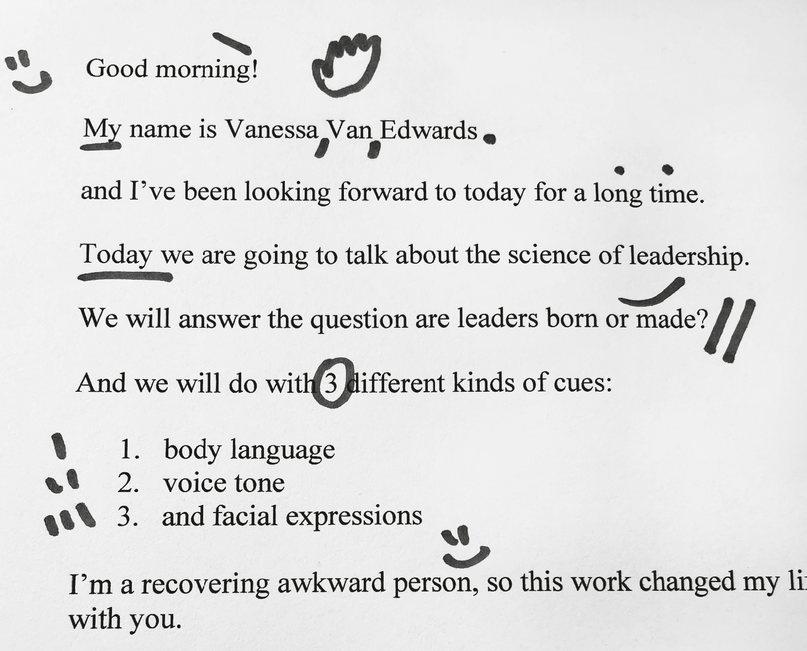
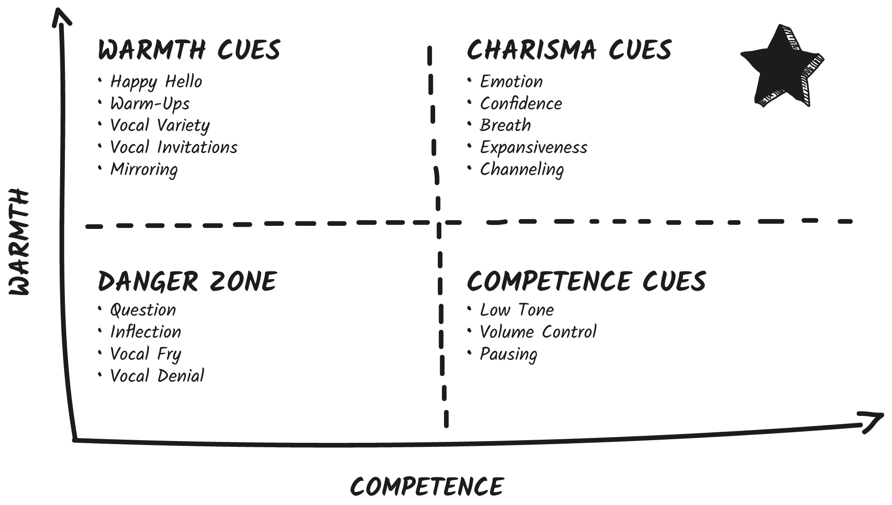

## CHAPTER 8

## Vocal Likability

She was called the Iron Lady for her strong and uncompromising leadership style. She was the first female and longest-serving British prime minister of the twentieth century. And through all that Margaret Thatcher struggled with her voice.

“Physically she had a problem in that she spoke from the top of her chest. . . . She had a schoolmarmish, slightly bossy, slightly hectoring voice,” recalled Tim Bell, one of Thatcher’s chief advisers.

Before she ran for prime minister, her advisers had her work with famed actor Laurence Olivier to transform her voice. Olivier taught her how to lower her vocal pitch naturally with breath. It helped but didn’t fix the problem.

Thatcher was consistently interrupted and ignored in the House of Commons. She particularly struggled during Question Time, which is a long-standing opportunity in the British Parliament for MPs to question government ministers. It can get very heated and very loud. This is what caused Thatcher the most trouble. When she was trying to project her voice, it became higher pitched and more strained.

This is a common struggle. To be heard or sound confident, we turn up our volume. But speaking louder takes more breath. So quickly we either become raspy or shrill, set our pitch too high, or hit vocal fry (neither loud nor powerful).

Women are faced with an even greater challenge: a strong “prejudice against women’s voices and their supposed shrillness, emotionalism, and lack of authority,” according to sociologist Dr. Anne Karpf.

What can be done? Playwright Ronald Millar taught Thatcher to lower her voice and speak slower so she could be heard _through_ the noise.

This was the start of one of the greatest vocal transformations in political history. In 1975, Thatcher was elected prime minister. She continued to work on her vocal charisma. During broadcasts to the nation, Thatcher also employed a unique vocal technique. If she was giving a broadcast that required a sympathetic and sensitive voice, she drank a cup of honey tea to relax her vocal cords. When she wanted to add oomph, she drank ice water. (Fun fact: This actually works. Try it yourself!)

This made Thatcher a truly exceptional communicator—she worked to project _both_ competence and warmth with her voice.

Remember, the best communicators use the Charisma Scale like a dial. They always stay in the Charisma Zone but flex between competence and warmth depending on their goals.

In chapter 7 we learned to use vocal competence cues—employing a lower tone, using varied volume, correctly timing the question inflection, adding more breathing pauses, and avoiding vocal fry.

How about warmth? How do you add personality to your voice? How can you sound more dynamic? Let’s learn the warm vocal cues. It all starts with your hello.

### VOCAL WARMTH CUE #1: Make a Memorable Vocal First Impression

Researchers find that people determine how confident you are within the first 200 _milliseconds_ of hearing you speak. That means your vocal first impression happens with your first spoken word. This is most often “Hello?,” “Hey!,” or “Hi.”

Here’s the problem: When we prepare for an interview, presentation, or meeting, we think about our credentials, accomplishments, and stories, but we rarely practice our opener. That’s a missed opportunity you can capture.

A few years ago, I wanted to know how emotion changes our voice—in particular, how emotion affects our _hello_ s. We conducted an experiment in two parts.

First, participants recorded six different versions of their typical hello. Try each of them yourself:

  1. Normal Hello: Say hello as you would when you normally answer the phone. This was our control hello.

  2. Happy Hello: Say hello while thinking of something that makes you happy and wearing an authentic smile.

  3. Sad Hello: Say hello while thinking of something that makes you sad and holding a sadness expression.

  4. Angry Hello: Say hello while thinking of something that makes you angry and looking angry.

  5. Power Pose Hello: Say hello while adopting an expansive posture—hands on hips like Superman.

  6. Normal Hello: Say hello one more time as a secondary control hello—after you’ve been warmed up.

Clearly each hello sounded different, even though it was the same person speaking.[[*]](52_Footnote.xhtml#footnote_1 "footnote") We wanted to know: Can you decide how much you like a person based on their hello? We asked thousands of new participants to rate each recording on likability.

Turns out, you can and you do.

When we tallied up the rankings, a clear pattern emerged. Can you guess which hellos got the highest likability rating? The lowest?

Sad hellos were scored as the least likable. Anger was a close second.

What does this mean? Don’t answer the phone when you’re in a bad mood! **Your irritability changes the sound of your voice.** (I keep a picture of my daughter as the background on my phone, so if I _must_ answer the phone when I’m feeling a little off, I look at her to spark some love.)

The control hellos and the happy hellos both ranked equally in likability. This is great news! It means you do _not_ have to maniacally smile (especially not fake smile) every time you answer the phone. Neutral or positive both work.

FUN TIP

### Do You Like the Sound of Your Voice?

Do you cringe when you hear the sound of your own voice? Do you ever think, _Is that what I really sound like!?_ There’s a scientific reason we sound different than we think we should. We normally hear our own voice while we are talking, and because it is conducted through bone, our voice sounds lower in our heads and higher in recordings. Our voice also gives away our anxiety levels, irritation, and personality traits we might like to hide.

There was one big surprise in this experiment. The power pose hello didn’t achieve high likability ratings. It ranked only slightly better than anger, coming in third place behind smiling and neutral.

Why do we think this happened? We like confidence, but power posing can sometimes come across as a little aggressive. Pride can be a powerful and even intimidating force.

This is more good news: You do not need to stand like Superman or Rocky on your phone calls. As long as you have enough breath, you’re good.

Speaking of breath, there’s one more mistake people make when saying hello. They hold their breath.

What do you do when you hear your phone ring? I noticed I take in a quick inhale and then hold it until I can answer. Sometimes this can last for a few seconds as I search for my phone. This causes me to answer the phone in a small, tight voice and with very little breath. In fact, when I recorded my phone calls, I noticed my “Hello?” was the highest-pitched word in the entire phone call!

When I work with sales professionals, I find this same pattern can happen when you call someone else and wait for them to answer. This is especially true if you’re nervous.

**Don’t hold your breath while saying hello.**

Instead, practice saying your hello on the out breath. This packs a double punch—it relaxes your body and gives you more breath, which makes you both sound and feel more confident.

And don’t forget to do this in person, in video calls, and on the phone. A confident hello works in every medium.

PRINCIPLE

Never answer the phone in a bad mood—or while holding your breath.

How to Say Hello

  * Take a deep breath or two.

  * Self-check: Are you in an okay mood to answer? If so, pick up. If not, consider a callback in a few.

  * Smile if you’re happy to talk to the person. Maintain a neutral expression if you aren’t.

  * Speak your first line on the out breath.

### VOCAL WARMTH CUE #2: Sound Friendly

Here’s everyone’s secret worry in an interaction: Do I belong here?

And next: Am I wanted?

**Your voice is the single best way to welcome someone with reassurance and belonging.**

Here’s how: Use a **warm-up cue**. Warm-ups are phrases that signal delightedness to another person. It shows them that they triggered _your_ warmth. Here are some of my favorites:

  * Oh, it’s so good to hear from you!

  * I was hoping you would call.

  * This is such a nice surprise.

  * So glad you called!

These are simple phrases, but I guarantee they will comfort the person on the receiving end. You can also use a warm-up cue when you recognize the person calling by saying . . .

  * Hello, friend! So happy you called.

  * Hello, [insert name]! Good to hear from you.

  * Well, hello you. Nice to see your name pop up.

  * Hi, [insert name]! What’s good in your world?

  * Hi there! It’s been way too long.

As we learned in the last cue, smiling helps you sound happier and be more likable. However, smiling can be a challenge in professional settings. How do you smile authentically on routine, even boring calls at work? Easy! Use warmth words.

When you utter phrases like “Wonderful to hear from you!” or “Happy Monday, team!” or “Good morning!” it’s easier to authentically smile. Try adding these to your first few moments of conversation to harness vocal warmth right from the start. Here are some others to try:

  * Happy Friday, everyone

  * Thrilled to be here

  * Lovely to see everyone

  * Wonderful to hear from you

  * What a lovely day it is outside

  * Anything exciting in your neck of the woods?

  * Good morning

  * Good afternoon

  * Good evening

#### Send Verbal Hugs

As more and more of our communication moves to video, I worry about losing some of the benefits of in-person rapport. Can you possibly replicate the warming effects of a handshake on a video or phone call? I partnered with Dr. Paul Zak to find out. We set up an experiment to find out if using verbal warmth cues would have similar effects as their nonverbal counterparts. Could _saying_ warm words like _hug_ or _high five_ stimulate the same connection as an actual hug or high five?

In our experiment, we found that when I used verbal warmth cues, people felt more connected to me. Like:

  * I’m sending a virtual hug!

  * Here’s a digital high five.

  * I’m fist-bumping my camera.

  * I’m sending a double cheek kiss your way.

By measuring skin conductance on smart watches, we found that people actually felt more engaged when they heard these verbal warmth cues as opposed to the standard neutral positive openers like “Thanks for coming” or “Great to see you.”

This is an easy way to add in vocal warmth: **Use words that cue for nonverbal warmth.** If you wish you could hug them, say so. If you would have given them a handshake in person, let them know. I do this when I want to be warmer on the phone, in video calls, and even in texts and email.

FUN TIP

### Flu Season

Don’t want to touch? With social distancing amid the COVID-19 pandemic, I would see a colleague or friend and simply say something like “Sending a hug from here” or “Air high five!” It always produced a smile and a little bit more warmth.

PRINCIPLE

Warm people up with permission, authentic happiness, and a vocal hug.

### VOCAL WARMTH CUE #3: How to Sound More Interesting

Do you ever feel like people tune you out? Or worse, find you boring? Ugh, I know that feeling! Here’s the good news: It likely has less to do with your content and more to do with your _delivery._ And that’s easy to fix!

When we listen to someone speak, we’re listening for two things: **confidence and emotion**.

  * Confidence is a power cue. It makes people take you seriously. A low tone and the right inflection signals to others: _I feel good about what I’m saying and so should you._

  * Emotion, as an aspect of warmth, makes people think you’re interesting. Vocal variety and a lively vocal personality signal to others: _I have something really interesting to say, so you should listen to it._

We signal emotion with a cue I call **vocal variety**. Researchers found it takes just a tenth of a second for our brains to recognize emotions conveyed by voice cues. It’s one of the primary ways we communicate our emotions, moods, and attitudes to others.

**Many professionals think emotion gets in the way of their message, but it actually enhances it.**

Emotion is what captures people’s attention and hooks them in to want to listen. Words imbued with emotion are more easily remembered.

Want people to listen to you? Add emotion. Vocal variety is the spice of speech.

When nurses used more vocal variety while talking to their patients, they were seen as both warmer _and_ more competent. Professionals tend to hide emotion. They don’t want to be seen as overeager or over-the-top.

**Going emotionless doesn’t sound casual or cool, it sounds careless.**

If you sound bored, you cue boredom.

When you feel proud of an idea, don’t act casual. Speak with gratitude and motivation.

When you care about something, don’t act ambivalent. Share your thoughts with power and emphasis.

Vocal variety can make people feel self-conscious. It can feel safer to project that you aren’t overly passionate about something. Showing emotion makes you vulnerable to others—but that’s what hooks people in!

Introverts in particular struggle with vocal variety because it calls attention to yourself. Here’s a reframe: You’ve worked hard to accumulate your knowledge, skills, and ideas. **You’re not calling attention to yourself; you’re calling attention to your ideas.** Vocal variety does more than just help you sound more interesting. It actually helps people be more interested in what you have to say. It’s a hook that benefits them and you.

You know the biggest killer of vocal variety? Scripting. Scripting is a great way to ensure your _words_ might be perfect but makes it hard to add _genuine_ vocal variety and emotion.

Data scientists at Quantified Communications used software to analyze more than 100,000 presentations from executives, politicians, and speakers. They looked at word choice, vocal cues, facial expressions, and even gesture cues. **They found that just a 10 percent increase in vocal variety greatly increases your audience’s attention!**

I often work with speakers crafting their TED Talks. I find they make two common mistakes: They overly script their talk, and then they rehearse all the emotion out of it.

In one practice session, a client started in the most bored, monotonous tone possible, saying: “Today I want to share the most exciting scientific development of the last decade. It’s going to change your life. And I’m thrilled to share it with you.”

“Wait, wait, wait,” I said to him. “Are you actually thrilled? Is it really exciting? You don’t sound very excited.”

“Oh yes! It’s amazing. I’ve been working on it for twenty years and it’s a game changer. It could completely revolutionize the way we think about—”

“Okay, NOW you sound excited! Where’s that emotion?”

“Hmmm, I’ve practiced this so many times to get the words right, I forgot all about my delivery.”

We took his script and we _filled it_ with emotion. I also _unscripted_ a few of his stories so he could speak off the cuff. I highly recommend keeping your stories and emotional parts of your presentations unscripted. Write out a few key bullets you want to remember. This forces you to tap into the true emotion underlying your words instead of falling into the memorization trap.

FUN TIP

### A Lesson from Reagan

Ronald Reagan was known as the great communicator. Well, that wasn’t always the case. Early in his career, he was fired from a radio station for sounding boring and flat while reading ads. To improve, he practiced reading scripts of FDR’s Fireside Chats. He knew Roosevelt was reading, yet he still sounded dynamic. Reagan realized if he read a short phrase from the script and then restated it while speaking in a conversational tone, it sounded much better. He memorized and then “conversationalized” the idea. If you must read a script, try taking this tip from Reagan. Read, and then look up. Memorize, and then conversationalize.[[*]](53_Footnote.xhtml#footnote_2 "footnote")

### Create a Nonverbal Script

Lord Tim Bell used an interesting technique with Margaret Thatcher. He added cues to her written speeches and reminders about when to sip the lemon tea or the ice water.

“For public meetings we put pause lines in her speeches. We didn’t put applause lines in—she’d get petrified if they didn’t applaud,” said Bell.

A surviving printed copy of one of Thatcher’s speeches from January 13, 1976, is marked with a note to herself: **“Keep voice low & relaxed. Don’t go too slow.”**

At this point Thatcher had given many, many speeches. By 1976 she was already a member of Parliament, had been elected education secretary, and was leader of the opposition, yet she _still_ added vocal reminders for herself. Even the most experienced speakers use cue reminders.

You can do this with a powerful tool I call a **nonverbal script**.

Nonverbal scripting is when you add cue reminders to your verbal script or notes. **The best way to use a nonverbal script is to help you remember where you need to add vocal variety, nonverbal emphasis, or helpful gestures.** If you’ve ever read a script for a movie or play, you’ll know this is commonplace, but it’s never used for presentations! Until now.

Here’s a sample script I use when I first greet an audience.

When I say, “Good morning!” I smile and give a wave to the audience to enhance warmth. I also signal competence with a low voice tone. I’ve had to break a bad habit of accidentally using the question inflection on my opening statement. A nonverbal script has been key to breaking that habit. **Nonverbal scripting helps you overcome charisma traps.**

When I’m nervous, I tend to swallow my name. I’ve had to practice slowing myself down. When I say my name, I gesture toward my heart and enunciate my name clearly, instead of rushing through it. I’ve found many people rush through their name. After all, we’ve heard our own name a million times but your audience hasn’t, so say it slowly.

When I say, “I’ve been looking forward to today for a long time,” I like to give a small affirmative nod and make eye contact with as many audience members as possible.

I tend to speak fast, so I add breathing pause reminders for myself. Sometimes I can sound bored when telling stories, since I’ve told them a hundred times to a hundred audiences, so I always leave my stories as bullets, which helps me tap into real emotion and change them up when I tell them.

PRINCIPLE

Vocal variety makes you sound more interesting.

Here’s how you can use nonverbal scripting: Imagine you’re getting help from a famous director. What would they have you add or punctuate? How would they encourage you to add emotion and spice?

Action Steps

  * Struggle with pauses or speak too fast? Add pause lines.

  * Speak too slow? Print slow sections in a different color. I like green for fast (as in a green light) and red for slow.

  * Forget to smile? Type or draw a smiley face in your notes.

  * Want to lean in, nod, or add emphasis to a certain section? Bold it or add the cue in the margins.

  * Find it difficult to make eye contact with the audience? Add “LOOK UP →” cues to your script.

### VOCAL WARMTH CUE #4: Sound Encouraging and Inviting

I pulled up to the Starbucks drive-through window in desperate need of coffee. My toddler was screaming for a croissant (unfortunately for us, she knows that word). My husband was ready for his mocha.

A friendly voice came out of the speaker in front of me. “Good morning! What can I get you?”

“Let’s see. We will have one Mocha Frappuccino.”

“ _Mmmm_ , good choice,” she said.

“And a croissant,” I added.

“ _Ooooo_ , yum. Uh-huh. Uh-huh,” she intoned, vocally encouraging me to keep going.

“And let’s do one breakfast sandwich,” I said.

“ _Mmm-mmmm-mmmm_ ,” she enthused, “delicious.”

“You know what? Make that two,” I said.

“Ahhh, excellent idea,” she said.

I was beginning to feel like an _excellent_ orderer indeed.

I tried to remember what else we needed. “Uhhhh,” I said, stalling for time.

“Uh-huh, uh-huh, take your time,” she said.

“ _Mmmmm._ Oh, right! I’ll have a tall coffee with a splash of almond milk,” I added, remembering.

“Oh, great! _Mmm_ ,” she said, “love that.”

“That’s it!” I said.

“That’s it!” she mirrored. “Your delicious order will be ready shortly. Please go to the next window.”

I pulled forward, feeling confident, encouraged, and cheerful.

This incredible Starbucks employee (wish I had gotten her name) used what I call **vocal invitations**. Vocal invitations are how we use our voice to include, invite, affirm, and welcome others. We use vocal invites to encourage someone to keep talking, to show agreement, to demonstrate interest, and to show we’re listening.

There are three different types of vocal invitations:

First, **listening sounds** are nonword exclamations of joy, interest, and intrigue. Some typical ones are _ah_ , _oh_ , _uh_ , _mmm_ , _ooo_ , _mmm-hmm, uh-huh_ , and _aha_. These are the noises you make when you listen. You make these sounds to show someone you’re engaged. These instantly improve your vocal warmth.

If you’ve ever been told you’re cold and intimidating or make people nervous, here’s an easy remedy: **Start using nonword vocal invitations with others.** If they say something interesting, say, “ _Ooo_.” If they pause in thought, say, “ _Mmm-hmm_.” If they look to you for acknowledgment, nod and say, “Uh-huh.” And you can always add an eyebrow raise, a smile, or a lean if you feel comfortable. A vocal invitation is a great way to add warm rapport.

FUN TIP

### Under-Expressers

This is especially helpful for overly stoic folks—people who are under-expressive with their face and gestures. If you know you’re under-expressive nonverbally, try dialing up vocally—and this can be very, very subtle. Many of my under-expressive students feel more natural adding a quiet “aha” or “ _mmm_ ” than using more hand gestures or smiles.

The second type of vocal invitation is using **encouraging words** with a warm and enthusiastic sound. Most commonly: “Yes,” “Wow,” “Go on,” “Tell me more,” “Interesting,” “Really?,” “Great,” “Fascinating,” “I see,” and “Keep going,” to name a few. You can think of these as **verbal nudges**. Typically, verbal nudges are under three words and are said to punctuate or encourage the other person to keep going. You’re nudging them with a few choice words.

FUN TIP

### Your Go-to Vocal Invites

Try this: Go watch an interesting TED Talk or listen to an intriguing podcast and see if you make any vocalizations while by yourself.

Whatever sounds or words you say (or even just think) are your most natural vocal invitations—use them with others!

The last type of vocal invitation is called **vocal mirroring**. This is when you subtly mirror someone else’s sounds, words, or vocal invitations. Whether she realized it or not, the Starbucks employee did this with me. I said, “ _Oh,_ right! I’ll have a Tall coffee.” And she replied, “ _Oh,_ great!” I said, “ _Mmm,_ ” while I was thinking, and she said, “ _Mmm,_ ” in response.

In a naturally great conversation participants mirror each other—in fact, this is what makes it great. Mirroring both amplifies our signals and syncs us up. The more we mirror each other’s vocal invitations, the more we affirm each other. I say, “Aha,” while listening to show I’m interested. Then when I’m talking, my partner says, “Aha,” to show he’s listening. And then we both know, “Great, we’re on the same page!”—without ever saying it.

As we build a strong connection we sync up and start using similar words, vocal invitations, and voice pitch. Vocal mirroring happens naturally, but you can also use it purposefully to spark faster rapport.

One of my students works as an undercover police officer. As someone who meets new people who are under stress on a regular basis, he always vocally mirrors to quickly build rapport. He copies their verbal nudges, vocal invitations, and **even the types of words they use**. He told me if his contacts use the word _rig_ instead of _truck_ or _soda_ instead of _pop_ , he uses the words they do. In his experience, this is the key to building trust quickly. This isn’t disingenuous, it’s his way of showing respect and paying close attention to the people he is with.

I learned from him that I should research the professional vocabulary that my clients use. Before a presentation, I find out if they use the term _client_ or _customer_ or say _sales pitch_ as opposed to _proposal._ Then I change the words in my presentation to match.

One study examined vocal mirroring at the start of salary negotiations. Researchers found that employees who used more vocal mirroring earned more money in their final salary agreement.

How can you vocally mirror authentically? The key here is **subtle and natural**. If you hear a word you like, use it! This is easy when someone is asking for confirmation:

They say, “Okay?”

You reply, “Okay!”

They say, “Got it?”

You say, “Got it!”

They say, “Aha!” while listening to you.

You say, “Aha!” while responding to them.

Of course, don’t go crazy with this! Too much vocal mirroring can sound like a parrot. (Of course, no offense to parrots, especially the endangered kind.)

A few subtle vocal invitations can encourage an introvert, engage a new friend, or soothe someone important to you.

FUN TIP

### Expectations vs. Reality

My childhood friend Elizabeth believes she’s effusive and warm, but she comes across as stoic and distant—even when she’s feeling happy. Every few months one of our mutual friends asks me, “Is Elizabeth mad at me?” And I have to explain, nope, she just under-signals.

**We tend to overestimate how obvious our warmth, interest, and excitement is to others.** Vocal invitations are one of the easiest low-barrier ways to signal.

A few years ago, I worked with a new manager who was struggling to build rapport with his team. I listened in on a few of his phone calls and immediately identified the problem. He was exhibiting a cue I call vocal denial.

The opposite of a vocal invitation cue is a **vocal denial**. A vocal denial shows dislike, disagreement, and disgust in a word or sound. They discourage people. They sound like “Ooof,” “Eeek,” “Oy,” “Eeesh,” or “Ay-ya-ya!” They can come in short words like “No,” “Yuck,” “Nope,” “Yikes,” or “Ouch.”

They’re often used accidentally! My student didn’t even realize that as he listened to his team members, he would say, “Eeeeek.” It was his natural listening cue, but it discouraged the people he was speaking with. Imagine their position. Why would they want to continue to share with him when they received what sounded like negative vocal feedback?

If you use vocal denial, use it purposefully. For instance, vocal denials can be used in place of or to preempt a harsh _verbal_ denial.

Here’s the thing: Verbal denials are intimidating. Vocal denials and vocal invitations can do the talking for you while entailing less social fear. A correctly placed vocal denial can subtly let someone know you don’t agree without your also having to say the words “I don’t agree.” The level of effort and courage required to utter those words can be substantially more difficult to muster.

In 2018, we rented a huge studio to film our course People School in front of a small live audience. I was very, very nervous. I had over three days’ worth of live content to teach in front of twenty new students, with a twelve-person crew on a multi-camera custom-designed set. It was expensive to put it all together, so the pressure was on to get it done on time.

One audience member, Bob, was my vocal lifeline. Bob is very vocally expressive and has this wonderful habit of murmuring “ _Mmm_ ” to himself whenever he feels inspired or interested. Whether he realized it or not, every few minutes he would “ _Mmm_ ” me with encouragement.

When I surprised him with a study or new fact, he would audibly say, “Aha!” in the otherwise silent soundstage. It gave me more confidence.

He’s also an authentically loud laugher—cueing others to laugh heartily along with the awkward jokes that I like to share while teaching. From my spot onstage, I could hear his subtle vocal encouragement every time I shared a good point.

**His vocal invitations were gifts to me as a teacher.** It was as if he was tossing me little vocal snacks from the audience, giving me energy to keep going and keep at it. Most important, these vocal invitations were encouraging for other students! I noticed when he said, “Aha!” other students would look up from their notes and nod. When he laughed, they laughed. Vocal invitations create warmth for everyone.

PRINCIPLE

Vocal invitations gift warmth, encouragement, and appreciation to others.

### VOCAL WARMTH CUE #5: Channel Your Charisma

Let’s play a vocal game. Get ready to share an answer to the following questions out loud—if you’re close to someone, ask them if they would be willing to listen and play along. Ready?

**Version A:** Describe your favorite meal in detail. What is it? Where do you get it? How good does it taste?

Pause. Take a deep breath. Now let’s try Version B:

**Version B:** Now pretend you’re Steve Jobs. Channel him for a moment. Stand or sit like you think he would stand or sit. Hold your hands like you think he would have held his hands. And now tell me about your favorite meal as you channel Steve Jobs. What is it? Where do you get it? How good does it taste?

Did you sound different when you pretended to be Steve Jobs? Did you speak louder? Emphasize more words?

This ridiculous exercise was an actual experiment. Researchers found that when they asked students to channel Steve Jobs, the students instantly became better speakers! Specifically, when students channeled Jobs, they used more purposeful eye contact, better vocal inflection, more volume, and clearer hand gestures.

This exercise improved their body language and vocal charisma so much that researchers now recommend channeling **speaking role models** as one of the fastest ways to improve public speaking.

Who’s your speaking role model? Is there a TED Talker, podcaster, or presenter who you love listening to? Channel them! My speaking role models are Brené Brown, Tracee Ellis Ross, and Mel Robbins. I find them genuine, funny, and authentic.

This visualization process works best as a warm-up exercise. Before you hop on your next important phone call or while getting ready for your next presentation, pull up a video of your favorite speaker and do some breathing exercises while you watch. Practice delivering your opening line and key points like your speaking role model.

Here are some other ways to warm up your voice and your charisma before your next big thing.

### What to Do Before Your Next Big Thing

To sound like your warmest and most charismatic self, I recommend warming up your voice before you go onstage. Use the techniques listed below whenever you need to dial up your charisma.

Find a private space if you’re feeling shy—it’s hard to do this one quietly.

  1. Take some deep belly breaths. The trick here is not to breathe with your shoulders–keep them down as you breathe; good vocal breathing is all in the belly.

  2. Do your quick posture fixes. Roll your shoulders down, widen your feet, and roll your hands out.

  3. Try a vocal exercise.[[*]](54_Footnote.xhtml#footnote_3 "footnote") Before every important call or speaking event, I hum my favorite songs to myself. It takes only two to three minutes and is a great way to get your vocal cords ready for vocal variety.

  4. **Got another few minutes?** Watch your favorite speaker on your phone to get you into flow. Practice your opening thirty seconds and your closing thirty seconds.

Take a screenshot of these two pages and save it for your next big thing. You got this!

### BONUS: How to Record a Charismatic Voicemail Greeting

Listen to your voicemail greeting. Do you like the way you sound? Do you sound bored? **Rerecord it with emotion and confidence.** Here’s how:

  * Sit down in a nice quiet place. I recommend using headphones to make you sound less echoey and distant.

  * Before hitting record, do some vocal warm-ups from above.

  * Take a deep breath and say hello a few times in your lowest range. This way, you can speak and record in that same register.

  * Think about someone you love talking to and imagine greeting them. Take that positive feeling and smile if it feels natural.

  * Keep your language simple. I recommend saying a greeting, your name, and your request to callers. Then end with a nice goodbye or sign-off wish. Here’s my template:

> Hello!
> 
> This is _____.
> 
> Please leave a message for me after the tone.
> 
> I hope you have a great day!

### CHAPTER CHALLENGE

Remember, your vocal charisma works like a dial. If you want to dial up warmth, use more warm vocal cues. If you want to dial up competence, use more competent cues. And if you want to sound like your best self, be sure to avoid the Danger Zone vocal cues: a misplaced question inflection, vocal fry, and vocal denials.

Let’s put your warm vocal cues into action. I’ve added these cues to your Cues Chart.

CUE |  DECODE |  ENCODE |  INTERNALIZE  
---|---|---|---  
Charismatic Hellos |  Who has the best hello? |  Try a few different versions of your hello. Try a smiling hello or an out-breath hello and see which sounds best to you. |  When you’re happy to talk to someone, show it. When you aren’t happy to talk to someone and want them to know it, show it! Sometimes I do use an angry hello if I have asked someone not to call me—especially telemarketers!  
Friendly Warm-ups |  Do you feel welcomed by the people you speak with? Does anyone make you feel unwelcome? Why? |  Try out a few different vocal warm-ups and find one that works for you and your personality. |  Feel the warm and fuzzies toward someone? Send them a virtual high five or digital hug.  
Vocal Emotion |  Do you know anyone who lacks emotion? Comes across as cold? Pay attention to their voice. It’s likely a major part of the problem. |  Every time you hear yourself getting bored or sounding bored, pull from your emotions. Use more stories. Share more awe. |  Is it hard for you to show emotion? I know it can feel a little silly, so start slow. Pick one cue to start with until you feel confident!  
Vocal Invitations |  What’s your favorite vocal invitation? I love when people say, “Aha!” What encourages you most? Share that with the people who matter. |  What vocal invitation feels most natural to you? Try them all! |  Do you accidentally use vocal declines? Listen to a recent speaking event or call to make sure.  
Vocal Channeling |  Who has great vocal charisma in your life? Try to learn from them. |  Try on a few vocal role models. Speak like Steve Jobs, Oprah, or Mel Robbins and see what feels best to you. |  Can you use yourself as a vocal role model? Have you ever delivered a great presentation or nailed it in a meeting? Pull up that recording whenever you need to be inspired!
