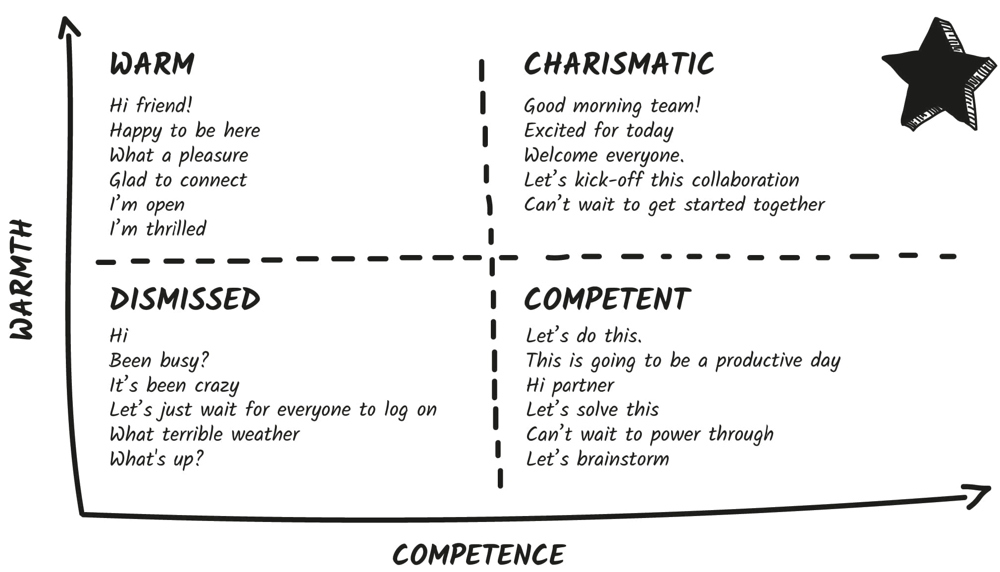
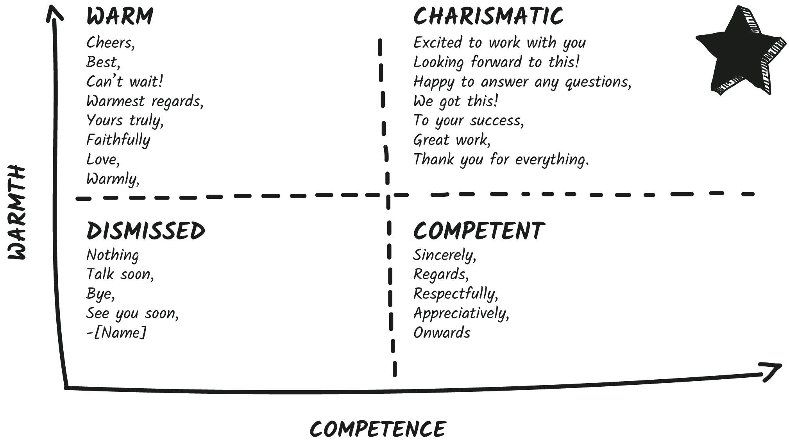
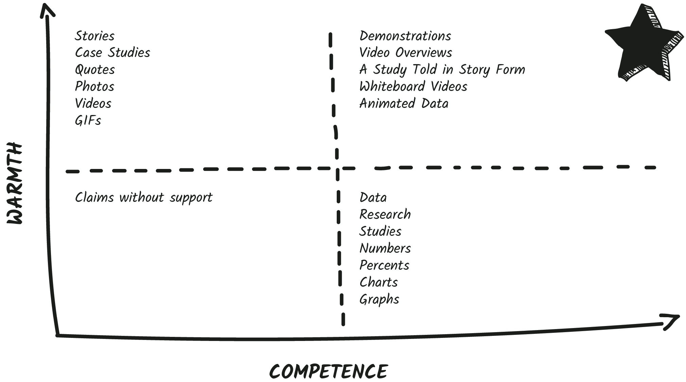
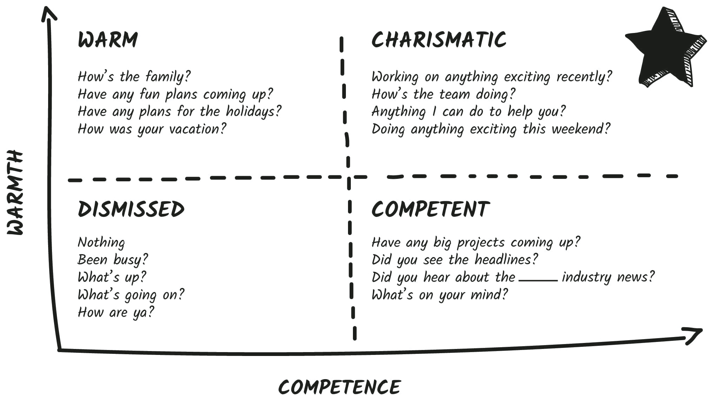
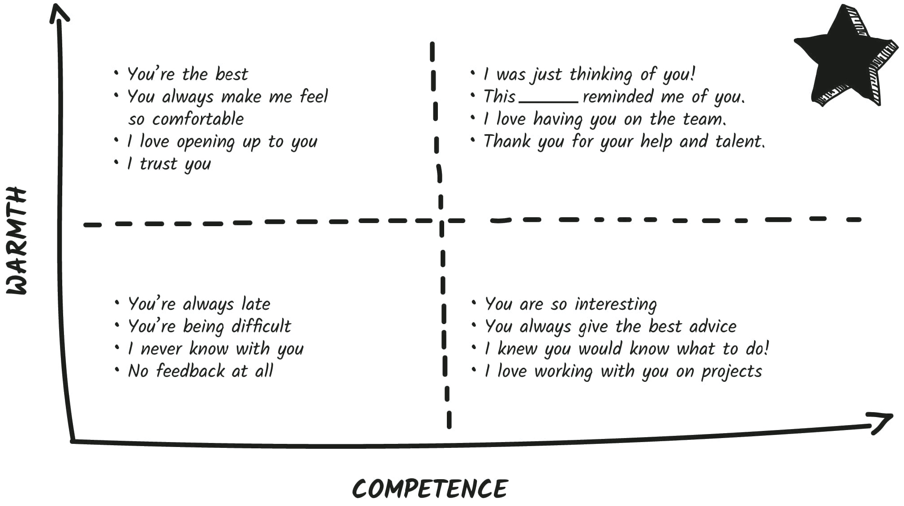

## CHAPTER 9

## How to Communicate with Charisma

It was 1996 and Sabeer Bhatia and Jack Smith were hard at work pitching an idea for a new web product. After months of pitches and twenty meetings with venture capitalists, the duo finally landed a $300,000 seed investment. It was just enough money to quit their day jobs. They quickly built the first version of the site and on March 27, 1996, bought the domain Hotmail.com.

As they neared launch, their worries turned to growth: How would they get the word out and attract the millions of users they needed to become successful? They considered billboards and radio advertising but didn’t have the money. Then they had an epiphany. What do you do with email? You send each message to _other people._ They decided to put a one-line message at the bottom of every email sent from Hotmail.

But what should it say? A straightforward advertisement? An appeal for help? They decided to try for both a heartwarming feel and a straight ask. They came up with this line and added it to the bottom of every email:

“PS: I Love You. Get Your Free Email at Hotmail.com.”

In just the first few weeks, Hotmail exploded in popularity. Bhatia and Smith didn’t realize the postscript is one of the most read parts of a message. In his research, communications consultant and author Dr. Frank Luntz found that **the postscript is the second most read part of a message after the opener**.

The founders credit that simple sentence as the single biggest driver of user growth. “Eighty percent of those who signed up said that they learned about it from a friend,” reported _TechCrunch_. Just one year later, Hotmail went on to be acquired by Microsoft for $400 million.

Bhatia and Smith used the right words to cue the right people. Are you using words that send the right cues?

### Power Words

Let’s imagine I ask you to play a game with a stranger. I tell you the name of this game is the Community Game, but I tell your opponent it’s called the Wall Street Game. Do you think the titles would influence how you both played?

Turns out the resounding answer is YES! A team of researchers introduced one group of participants to the Community Game (a warm title) and another group to the Wall Street Game (a competent title). The rules of the actual games were identical, but take a guess which group worked more collaboratively? In the Community Game, two-thirds of the participants collaborated, compared to just a third in the Wall Street Game. Simply changing one verbal cue changed how people acted in the group.

What do you call your meetings? Your calls? Your teammates? Yourself? The words you use change people’s actions and their perceptions of you. This is an easy way to dial up your charisma. **If you want to project warmth, use more warm words. If competence is your goal, use more competent words.**

Warm words convey friendliness, trust, and optimism. These are words like _connect_ , _collaborate_ , _happy_ , _both_ , and _together._ Warm words have the same effect as a smile or a head tilt. They make us feel the warm and fuzzies—connected, encouraged, and heard. I also consider emojis and exclamation points warmth cues. One study found that customers who texted with customer service agents gave higher ratings to agents who used emojis and rated those agents as more personable.

FUN TIP

### Emojis

Emojis are a great way to add nonverbal cues to your emails, texts, profiles, and chats. It’s also essential to use the right emoji to convey an emotion. Look in your digital bonuses for my comprehensive guide to emojis.

On the other hand, competent words cue power, knowledge, and effectiveness. These are words like _brainstorm_ , _effective_ , _productive_ , and _science._ Competent words are the equivalent of a steeple or a purposeful gesture. They make us feel motivated, capable, and like we’re in the right hands. Data, charts, and research are all competence signals.

A few rare charismatic words are so inherently good, they hit the sweet spot of both warmth and competence all by themselves. For example, _confident_ , _great_ , and _creative_ are both warm and competent because they trigger optimism and interest.

And of course the Danger Zone words are either negative or signal very little at all. We’re fighting sterility in the Danger Zone. **Most people don’t use overly negative words, just boring ones.**

Not sure which words are warm, competent, charismatic, or boring? This is more art than science. Think about what a word makes you think of. Is it a person, symbol, or thing that reminds you of warmth or competence? That’s good enough! To help, I’ve put together an extensive glossary of warm and competent words in your digital bonuses. And here’s a quick snapshot of the different types of charisma words:

### How to Send Better Emails

More and more of our professional communication has become sterile—lacking any charisma cues at all. What a waste! I used to send emails like this all the time. Can you see what’s wrong with it?

> Brian-
> 
> I’m all set for the meeting next week. I will prepare an overview and sample proposal for you. Then we’ll review them all in the meeting. Let me know if you have any questions.
> 
> Keep me posted,
> 
> Vanessa

First, it’s really boring. Second, there are no charisma cues at all. This email is basically asking the other person’s brain to just shut off. Sterile words are so overused we don’t even register them anymore.

This email gets the point across, but it could be doing _so much more._ Adding verbal cues can turn an okay message into a great one. This email has the exact same word count but feels completely different:

> Good Morning, Brian,
> 
> I’m looking forward to collaborating next week. I’ll prepare a goal worksheet and overview of desired outcomes for both of us. We can power through everything together. Happy to answer any questions.
> 
> All the best,
> 
> Vanessa

Each of the underlined words are charisma cues. The email has both warm words like _goal_ , _together_ , _happy_ , and _desire_ as well as competent words like _forward_ , _outcome_ , and _power through._ When people hear phrases like _together_ and _happy_ , they’re more likely to _actually feel_ happy together.

As we know, when we read words like _collaborate_ , we’re more likely to _be_ collaborative. When we hear words like _together_ , _we_ , _our_ , _us_ , and _both_ , we’re more likely to feel connected. When someone tells us they’re “happy to answer our questions,” we’re more likely to feel safe asking questions. **Many people assume there is warmth in their boring, sterile emails, but connection should never be assumed.**

Each verbal cue you choose can help set you and your team up for success. Here’s how you can use verbal cues more purposefully:

#### Step #1: Email Audit

Do you communicate with charisma? Let’s find out! The best way to see what kinds of cues you give others about your warmth and competence is with an **email audit**.

Here’s how to perform your email audit:

  * Open up your email sent folder.

  * Pull up your five most recent important messages.

  * Count how many warm words you use.

  * Count how many competent words you use.

  * Count how many charismatic words you use.

  * Finally, do you use any negative words like _problem_ , _mistake_ , _bad_ , or _stress_?

What patterns do you see? Thousands of students have performed this audit, and they typically find that they use a lot of one type of cue—overly warm or overly competent words. This is why they’re stuck in one part of the Charisma Scale.

Or people find they have very few charisma cues at all. Most of their communication is dangerously close to the Danger Zone.

You might even notice you send different types of words to different types of people. Do you send lots of competent words to your boss and lots of warm words to your colleagues? This might be why people treat you differently—**you’re cueing them to do so**.

Here’s an example of a highly warm email:

> Hi, Rod!
> 
> I absolutely loved connecting with you yesterday about the new proposal. As always, it is great collaborating with you! I think we’re onto something truly special. I’ll be able to finish my part today and then we can review together. _= )_
> 
> Best,
> 
> Andrea

Here’s a competent version of the same email:

> Dear Rod,
> 
> Thanks for the powerful brainstorm session yesterday. This new proposal is absolutely spot-on. I think we’re really onto something next level with it. I’m pushing through my part by end of day today and then I’ll shoot it over.
> 
> Onward,
> 
> Andrea

These emails are pretty much the same word count but send completely different cues. And notice neither of them is sterile. **When writing emails, imagine not just what you want your recipients to** _know_ **but how you want them to** _feel._ This is _not_ about just loading your communication with extra words. It _is_ about being purposeful with how you choose your words, so they help you (and your team) achieve your goals.

Bhatia and Smith likely had no idea that the cheeky phrase “PS: I Love You. Get Your Free Email at Hotmail.com” also happens to have the perfect balance of warm and competent words. “I love you” is the warmest phrase there is and cues people to think of the folks they love. And an invitation to get anything free triggers our competence to get, achieve, and attain. This made them sound more charismatic and encouraged their people to share more. That last-minute add was a game changer.

I was particularly impressed by an email LinkedIn sent to me that struck the perfect blend of warmth and competence. They used the subject line “Your expertise is requested.” This is a highly specific, high competence opener that also made me feel needed and wanted. Then they balanced out the high competence subject with a warm header right at the top of the email that said “LinkedIn would like to hear from you!”

Whether intentionally or accidentally, they used a nice balance of warm and competent cues in the body of the email, including signing off with a “We appreciate your time. Best regards”—a great blend of warmth and competence.

A few correctly placed cues can make all the difference.

PRINCIPLE

Your written cues signal warmth, competence, and charisma just as much as nonverbal cues.

FUN TIP

### The Charisma Glossary

Do you sometimes use a dictionary or thesaurus to come up with more creative words? Download and print our Charisma Glossary and keep it at your desk to use whenever you need some inspiration.

#### Step #2: Stop Being Boring

There’s a major crisis facing professionals today: really, really boring meetings. Do your meetings start on professional autopilot? It feels like most video calls and conference calls all start in the same tedious, sterile way:

> Hi, everyone. Today we’re going to go over some weekly office updates. I’ll review the docs I emailed earlier this week and leave some time at the end for questions. I’m going to wait a few minutes while people log on. We will get started in a few.

These words communicate very little—except that this meeting is going to be the same as all the others. This is a missed opportunity. Let’s rescue this dreary opener and inspire charisma. This version has the exact same word count but uses both warmth and competence verbal cues:

> Happy Monday, team! So great to see all of you. Today we have some interesting updates to go over together. I’ll open up the floor to discussion and make sure all your questions are taken care of. While we wait for folks, anyone do anything fun this weekend?

These small changes set up both the speaker and everyone in the meeting to be more successful.

Now you may be worried about becoming a corporate-speak robot zombie if using charismatic words feels fake. We don’t want to use cues to cover up or gloss over broken practices on teams. But they can help nudge meetings or relationships in a positive direction.

Here are some easy ways to add more positive verbal cues to your communication. And it doesn’t take a lot. Simple phrases can put you in the sweet spot on the Charisma Scale.

Let’s start with **openers**. Make the first few words you say in an email, in conversations, or in an important chat match where you want to be on the Charisma Scale. This works in meetings, phone calls, video calls, and chats.

My rule of thumb: **Focus on the first ten words.** Don’t just say “Hi,” “Hey,” or “Hello.” Spice it up!

Start with language like “Hi, friend!,” “Happy to be here,” “What a pleasure,” “Glad to connect,” and “I’m thrilled to do this together”—all trigger warmth.

FUN TIP

### Culture and Location

Let’s take a cue from supermodel and _Project Runway_ host Heidi Klum. She always says goodbye in her native language: “auf Wiedersehen!”

A really easy way to add warmth is to use culture- or location-based words. I love sending a beso—kiss in Spanish—to my friends.

I often start fun or check-in emails with a “Howdy!” My Hawaiian friend always starts with “Aloha.” I love it when our international students start with their native language in greetings or sign-offs. “Ciao!” or “¡Hola!” or “Bonjour.” These are great ways to add verbal personality.

Competent openers cue participants to feel productive and capable. Openers like “Let’s do this,” “This is going to be a productive day,” “Hi, partner,” “Let’s solve this,” and “Can’t wait to power through” all juice our competence.

And words like _team_ , _excited_ , _welcome_ , and _kickoff_ hit the perfect balance of charisma. Try “Good morning team!,” “Excited for today,” “Welcome everyone,” “Let’s kick off this collaboration,” or “Can’t wait to get started together.”

FUN TIP

### Signature Sign-Off

I’ve written an email newsletter for over a decade. I send out my latest tips and tricks for communication and interpersonal skills. I used to agonize over my sign-off, but then I thought, _What do I want people to feel at the very end of every email?_ The bottom line—the mission of my work, the reason I have an email newsletter in the first place—is to help people feel more successful. So I began to use the sign-off “To your success, Vanessa.” Readers and students began to reference it and use it back with me. They would sign their emails using “To Your _Success_ ” and write to me saying, “Thank you for giving me all these _success_ tips.” It’s an easy ritual for me and an on-brand reminder for my readers. Can you create a signature sign-off that sends the right message?

How about closers? Always end with charisma.

My favorite warm closers are “Cheers,” “Best,” “Can’t wait!,” “Warmest regards,” “Yours truly,” “Faithfully,” “Warmly,” and, of course, “Love.”

My favorite competent closers are “Sincerely,” “Regards,” “Respectfully,” “Appreciatively,” and “Onward.”

My favorite sweet spot closers hit the perfect balance. Try “Excited to work with you,” “Looking forward to this,” “Happy to answer any questions,” “We got this!,” “To your success,” “Great work,” or “Thank you for everything.”

Avoid sterile or boring sign-offs like “Bye,” “Talk soon,” or, worse, no sign-offs at all.

Here’s my cheat sheet:

If it fits your brand, you could even try “You can rely on us” as a high competence sign-off or tag line. Or use the warm version: “You can trust us.”

**Special Note:** You do NOT need to use a charismatic opener and closer every single time. But when you want your communication to matter, when you have an important request, question, or relationship, add a few more verbal cues.

PRINCIPLE

When your communication matters, use verbal cues to make it memorable.

#### Step #3: Create Charisma

We wanted to see how the verbal cues you use can change people’s perceptions of you in a résumé. So my team and I decided to run an experiment. First, we created two mock résumés. We used the same photo and name, but just slightly modified some of the written cues used in the very first line of the résumé—this looked just like your headline on LinkedIn or the overview section of a résumé. Both headlines had ten words total.

The warm version said, “I help teams collaborate and build relationships for happier customers.”

The competent version said, “I streamline corporate systems to increase productivity and customer outcomes.”

Over a thousand people rated this person on their warmth and competence. The change was small but worthwhile for only swapping out a few words. The warm words made people rate the person as 5 percent warmer. The competent words made the raters see the same person as 5 percent more competent. Is this a game changer for your perception? No, but it’s an easy place to tweak the dial.

Next, we wanted to see if the effect would be different in video. We had a male and a female model record two short video introductions—one warm and one competent version. The warm version’s script was: “Hi, I’m Alex. I help teams collaborate and build relationships for happier customers.” The competent version script was: “Hi, I’m Alex. I streamline corporate systems to increase productivity and customer outcomes.”

We instructed them to use nonverbal and vocal cues that were as similar as possible but to change the script.

Then we asked people to rate them on warmth and competence. This time we saw a bigger difference—and it changed for each gender!

**The female who used more competent words was rated as 15 percent more competent than when using the warm version.** This is a pretty incredible shift for swapping out only five words. When she used warm words, she was rated only 5 percent warmer than her competent script.

**The male was rated as 11.5 percent warmer when he used warm words.** Again, a pretty easy way to dial up warmth. But there was no difference in his competence when he used competent words.

This indicates two important takeaways. First, words do matter. Just changing your verbal cues can change people’s perceptions of you. This works in résumés, online profiles, and the words you say in video or in person. Be sure to update your profile and résumé with the right verbal cues.

Second, it confirms how gender affects our perceptions. Research shows that women tend to be seen as higher in warmth and men tend to be seen as higher in competence. Using the right cues is critical to counter stereotypes.

Women have to be aware that society will perceive them as higher in warmth right off the bat. They have to do extra work to dial up competence purposefully by using more competent nonverbal, vocal, and verbal cues.

Men have to be aware that they’re seen as higher in competence by default and need to use more warmth nonverbal, vocal, and verbal cues if they want to increase their warmth.

There are so many opportunities for you to trigger charisma in small but powerful ways. Get creative! Here are some ideas for inspiration:

  * Some companies have _loyalty_ programs (high in warmth). Others have _VIP_ levels or _elite_ status (high in competence). Others offer _reward_ points (high in both warmth and competence).

  * Before starting meetings or giving presentations, play peppy oldies (warm) or calming classical (competent) warm-up music.

  * Whenever I fill out a name tag, I always add little extra verbal cues. If I want to dial up competence, I add a piece of trivia under my name or a unique personal fact. If I want to dial up warmth, I write a great conversation starter or something funny under my name.

  * If I have extra time at the start of a meeting or presentation, I start with a purposeful warm-up. If I want to trigger competence, I might show a section of a powerful TED Talk or share an inspirational quote. If I want to create warmth, I might do an icebreaker or put some fun trivia in chat.

FUN TIP

### Never Wait

“I’ll wait to get started until everyone’s here.” That’s probably one of my least favorite phrases at the start of a phone call or meeting. It’s a cue for everyone to check their email or check out. (It also makes everyone wish they had shown up a little later.) This is the perfect time to ask a charismatic question, keep people engaged, and foster warmth. Want to start on a warm note? Ask people, “Do anything fun this past weekend?” or “Have any big plans for the holiday coming up?” If you want to start on a competent note, ask people, “Anyone listen to any good podcasts recently?” or “Anyone reading any good books?”

What do you wish for your interactions? Can you balance out warmth and competence in your brochures, business cards, invites, résumé, website, or tag lines? How about in your profiles, emails, canned responses, or chats? Never miss an opportunity to add purposeful verbal cues.

PRINCIPLE

Use warm cues to call out to warm people. Use competent cues to call out to competent people. When in doubt, use charisma cues to hit both.

#### Step #4: Inspirational or Informational

The time had come. We needed a new mattress. My husband is a researcher—high in competence. He set out to find the best-tested, highest-rated, latest research-backed mattress on the market. Meanwhile, I looked at pictures on various social profiles and texted two friends who recently bought mattresses and asked what they thought.

My husband was using competence to make a decision—data, numbers, and scientific proof. And I was using warmth—intuition, photos, and my friends’ recommendations. We couldn’t decide.

Then, sitting at a restaurant one day, we looked outside and saw an advertisement on a bus. It said: “Casper: Obsessively engineered. Outrageous comfort at polite prices.”

We looked at each other and said, “That’s the one!”

The ad’s tag line appealed to both of us because it’s a perfect blend of warmth and competence. “Obsessively engineered” is a signal to competent folks like my husband. On the website there are all kinds of competent callouts like “Awarded Best Overall Mattress by _U.S. News & World Report_,” and “10-year limited warranty,” and “100-night risk-free trial.”

You know what hooked me in? “Comfort at polite prices” was a warmth cue that went straight to my heart. _Yay!_ I thought. _I won’t have to haggle over prices._ When I went to the website there was a picture of a kid giggling in bed and a funny testimonial from _Vogue_. There’s even a charismatic video entitled “Meet the Brains Behind the Beds” that lets you meet the engineers and researchers inside Casper labs. That snagged both of our interests.

We bought one for every bed in the house.

Warmth and competence cues can signal the right people. People who respond to warmth want to be **inspired**. They like stories, jokes, metaphors, and social proof.

People who respond to competence want to be **informed**. They want data, research, case studies, and facts.

Not sure if your audience is high in warmth or competence? Think you have a mix of both? Great! Go for the balance. When I teach, and in my videos, I try to strike a perfect balance of warmth and competence. Here are some guidelines for balancing high competence with high warmth (you might have even noticed these while reading this book):

  * Whenever I mention the word _research_ or _study_ , I follow up with a story.

  * Whenever I share a data point, I often add a case study or a metaphor.

  * Whenever I mention something competent, I add a splash of warmth, humor, or vulnerability.

I give presentations to all different kinds of audiences—often to leadership teams and engineers, but also to human resources departments, sales reps, entrepreneurs, and doctors. I want to make sure my content cues both inspiration and information, so it resonates with everyone in the audience. I actually count the number of warm and competent cues in my slides to make sure they are balanced.

My warm slides use examples and have funny GIFs, videos, or stories. Competence slides use data, research, charts, and studies. Slides that hit the sweet spot combine both warm and competent elements—I might share a study in story form. Or show a video demo of research. Or animate my data to make it come to life.

Can you balance inspiration and information?

When socializing with colleagues, can you appeal to their unique charisma characteristics? If you know someone on your team to be a highly warm person, you can _honor_ their warmth by matching their charisma with warm topics. Start a meeting by asking about their family and personal life. Point out their family photos at their desk. Share a personal story. And, of course, use more warm words and warm nonverbal cues. Typically, a highly warm person loves chitchat and building rapport.

On the other hand, competent people typically prefer to get right to the action. If _you_ want to chitchat, you’re best sticking to competent topics—industry news, headlines, sharing professional wins. Use competent words and competent nonverbal cues. In your emails, use more competent language to get them to respond more quickly. They love questions like “Have any big projects coming up?,” “Did you see the headlines?,” or “Did you hear about [insert industry news]?”

No matter what, steer clear of the Danger Zone by avoiding asking anything boring or negative. Never ask “Been busy?” and try to stay away from non-question questions. These are questions that are so socially scripted we don’t even register them. “How are ya?,” “What’s up?,” and “What’s going on?” are boring, shmoring. No more, please!

My favorite highly charismatic questions tickle both warmth and competence. Try “Working on anything exciting recently?,” “Anything I can do to help you?,” or “Doing anything fun this weekend?” Or my personal favorite casual opener, “What’s good?”

Want your ideas to resonate? Align your communication cues with the style your audience prefers.

PRINCIPLE

Warm people seek inspiration. Competent people seek information.

#### Step #5: Be a Verbal Chameleon

Think about the five people you spend the most time with—or the most time thinking about. Who are they? Write their names below:

  1. ________________________

  2. ________________________

  3. ________________________

  4. ________________________

  5. ________________________

Do you know where they fall on the Charisma Scale? Open up the last five emails, chats, or texts they sent you and count the number of warm and competent words they use. You can also take a peek at their social profiles and count the number of warm versus competent words they use. Mark if they’re warm, competent, or hit the perfect sweet spot of charisma next to their name above.

The greatest gift you can give these folks is honoring their charisma language. Compliments that highlight their unique blend of charisma are guaranteed to be appreciated. **Highly competent people love to get confirmation of how competent they are.** Tell your competent friends:

“You’re so interesting!”

“You always give the best advice.”

“I knew you would know what to do.”

“I love working with you on projects.”

**Honor highly warm people with warm feedback and genuine compliments**. Tell them:

“You’re the best.”

“You know how to get the party started!”

“You always make me feel so comfortable.”

“I love opening up to you.”

“I trust you.”

If you aren’t sure where they fall, try to hit both warmth and competence with:

“I love having you on the team.”

“Thank you for your help and expertise on this.”

“This _______ reminded me of you.”

Or try my personal favorite: **“I was just thinking of you!”** _Everyone_ likes being thought about, whether they’re more warm or competent. The usual caveat applies—say these only if they are true. If you don’t actually like working with someone, don’t say it! If you don’t really trust someone and feel uncomfortable saying it, that is a good signal _to you_ that you need to work on rebuilding trust with them.

What if you can’t think of anything nice to say? If you find yourself always giving negative feedback like “You’re always late,” “You’re being difficult,” or “I never know with you!” then it’s time for a reboot and a reset. Make it your goal to find at least one genuine warm or competent trait you can highlight.

With difficult people in my life, sometimes all I can find are really small things: “Thanks for always taking notes in the meeting,” or “We take our coffee the same way!” Small commonalities can be just as powerful as big ones. It’s a great place to start.

You have another choice when interacting with the important people in your life: Consider verbally matching the person you are with by mirroring subtly—the key here is _subtly_. This is using similar positive or neutral words to the person you’re speaking with. I call this being a verbal chameleon.

VERBAL CHAMELEON

Subtly mimicking the kinds of words someone uses to match their charisma style.

Servers who repeat orders back to customers, using their _exact_ words, earn 70 percent more in tips than servers who simply use polite and positive words.

In another study, researchers asked participants to negotiate via virtual chat. One group was told to mimic the words of their negotiator in the first ten minutes of the chat. Another group was told to mimic the words of their negotiator in the last ten minutes. And the control group wasn’t told to mimic at all. The early mimickers achieved significantly better outcomes than the other groups. **Try verbally mimicking in the first few minutes of an interaction.**

What does this look like in action? Let’s look at a talented verbal chameleon: Ellen DeGeneres. Here are just the first four seconds of an exchange between her and Jennifer Aniston.[[*]](56_Footnote.xhtml#footnote_2 "footnote")

> Jennifer: Hello!
> 
> Ellen: Hello!
> 
> Jennifer: Honey. It’s good to see you!
> 
> Ellen: It’s good to see you.

It was like verbal ping-pong! One of the reasons Ellen bonds so quickly with people who come on her show is that she almost always verbally mirrors during her interviews.

You can do the same in your interactions. If a potential speaking client says to me, “We need a little more proof before moving forward. Do you have any data? The team is a bit worried about having another boring training. We’re really looking to inspire change.”

I might say, “Absolutely. Like you, we always want proof. I’ve attached some great testimonials and data. And, of course, we’re anti-boring. I have a number of engaging activities planned where the entire goal is inspiring change. Would you like to see a video demo?”

Advanced tip: Sometimes I even match the emoji they prefer. Do they use a :) or a =)? Out of verbal respect, I use their cue.

**Just remember to never mimic in a way that doesn’t feel like you.** I can use one exclamation point, but three feels like overkill. Blogger and illustrator Tim Urban tilts strongly toward competence. He recently tweeted, “I spend a lot of time deciding which sentence in the email is gonna have to take one for the team with the exclamation point.” He knows he has to add a little warmth, even if it’s a little painful in the process.

A highly warm fan, Matt Popovich, replied to him on Twitter, “I always start with an exclamation point after every sentence, then realize ‘wait, they can’t ALL have exclamation points, I sound like a lunatic,’ then pare them back one by one until only a single exclamation point remains.”

That’s a warm versus competent perspective in action.

I want to make a special note here: Upping your verbal charisma can feel a little unusual at first. It’s like flexing a new muscle. One of our students, Allegra, wanted to send over twenty thank-you emails to fashion designers she had met with over Zoom. Allegra noticed that one specific designer used more warm words, so she thought adding charisma cues might make her simple thank-you emails more powerful . . . even if it was a little out of her comfort zone.

“Admittedly, I mostly wanted to get the task done, and copy and paste a formula. However, with this one designer, I went more personal and more WARM. Even a little more expressive than I usually would, using words such as ‘Talking with you remains one of the highlights of these events’ and ‘You are inspiring.’ I still slightly cringe but these words were actually true,” she explained to me.

Almost immediately the designer emailed back with an offer to meet again.

One study discovered “that thanking a new acquaintance for their help makes them more likely to seek an ongoing social relationship with you.”

This might seem obvious, but the _way_ you say thanks matters. Allegra’s copy-and-paste response didn’t create any special replies. But her crafted response, employing more warmth with a warm person, worked. It put her a bit out of her comfort zone, but she made sure to stick to the truth. **Never verbally mirror or use words that feel fake.**

Verbal matching, as with all our cues, also happens unconsciously in your listener. One of our students, Seraphim, found that when he asks, “Would that bother you?” people are more likely to mirror him by saying, “Yes, that would bother me.” He now asks, “Are you good with that?” With this small change, he found people look to agree and are more likely to say, “All good.”

The more you meaningfully use verbal charisma cues, the more you will generate meaningful responses.

**PRINCIPLE**

The words you use cue others.

### CHAPTER CHALLENGE

How are you communicating your charisma? Let’s do some charisma audits! Review the following assets and count the number of warm and competent words you use. Do they match your charisma goals?

|  WARM WORDS |  COMPETENT WORDS  
---|---|---  
LinkedIn profile |  |   
Voicemail |  |   
Email signature |  |   
Your last ten social media posts |  |   
Business card or marketing materials |  | 
