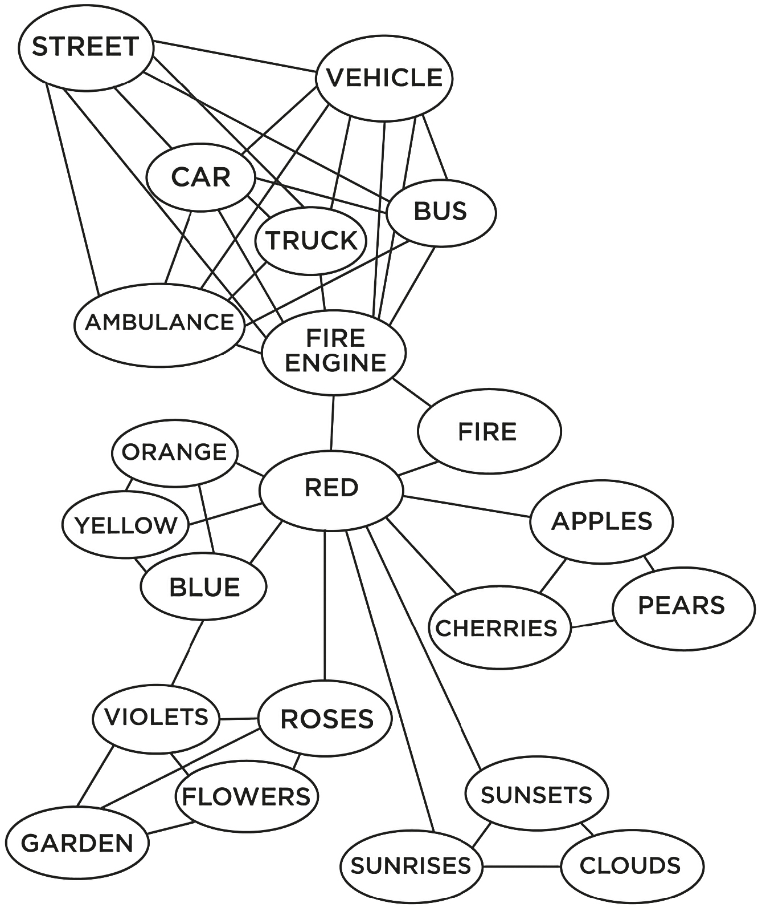
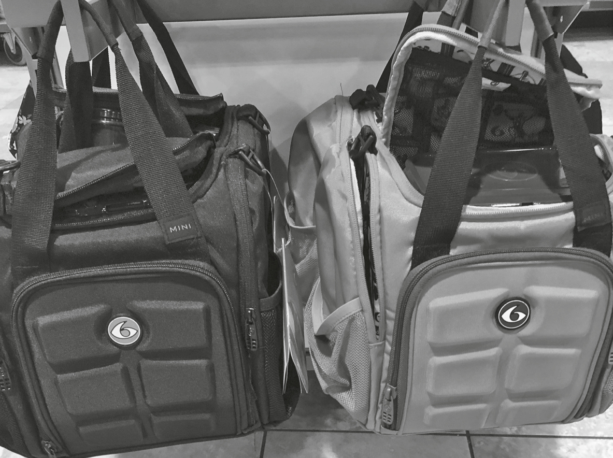
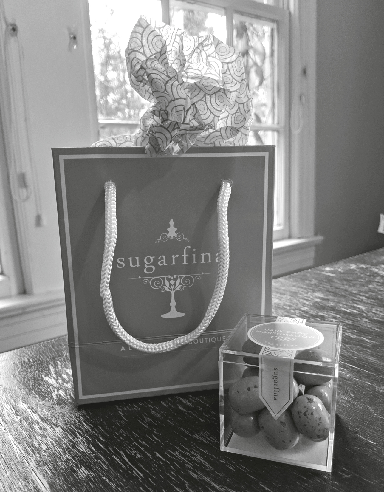

## CHAPTER 10

## Creating a Powerful Visual Presence

Let’s play a game. Imagine gazing at the moon hanging over the ocean. Really picture it in your head. It’s a clear night and the moon is floating in the sky above murky ocean waves.

Now quickly tell me the name of a laundry detergent brand. Go with the first name that pops into your head.

Did you say Tide?

When researchers asked participants about their preferred detergent after they’d been exposed to words like _ocean_ and _moon_ , they were more likely to mention Tide.

Why? Because the image of a moon over the ocean activates a **neural map** in your brain that includes other words and images related to moons and oceans like tides, water, gravity, and waves. When I asked you to imagine the moon, it brought to the front of your mind everything associated with moons and oceans. And this influenced your answer to the question about detergent.

Everyone’s neural maps are slightly different, but most people have similar underlying themes to the emotional associations behind images and ideas. This is how visual cues work best. For example, you might see a picture of a fire engine and that might bring up a neural map of _fire engine_ linked to _red_ linked to _roses_.

This happens all the time in daily life. Say, for example, you’re skimming through photos on Facebook. One potential friend has a picture of her holding a snowboard. That activates your own neural map around snowboards. You think of adventure, ice, mountains, vacation, and family. That gets you excited and nostalgic for trips you took as a kid. You click accept.

Recently, I was walking by the store in my local gym and saw these bags for sale:

Notice anything funny about these gym bags? They have abs! Like rock-hard six-pack abs. If you’re going to the gym to work on your six-pack (aren’t we all?), these bags will appeal to you.

Visual cues are one of the best ways to attract, welcome, and retain the right people. We can also use visual cues to trigger warmth or competence based on our goals. Are you using visual cues? Let’s find out.

### VISUAL CUE #1: Elevate Your Prices, Your Look, and Your Brand

“That looks expensive,” I said to my husband.

He had just placed a little blue box in front of me.

“Is it jewelry?” I asked.

“Better,” he said.

I carefully opened the powder-blue box to reveal nine perfectly nestled cases of exquisite artisanal candy. I have a passionate sweet tooth, so my husband had handpicked nine different types of Sugarfina candy tailored to my taste. I sampled pink champagne bears, lotus flower gummies, cold-brew cordials, and heart-shaped peach bellinis.

Everything about the experience felt expensive. As soon as I saw the box, I thought it was jewelry. Then it hit me: Tiffany’s. The boxes were remarkably similar in size, shape, color, and weight to a Tiffany’s jewelry box.

The candies were named after expensive things—bourbon bears, rosé all-day gummies, peach tea, and even single-malt-scotch cordials. Even their green juice gummy bears were in a miniature-sized green juice bottle—and anyone who’s ever bought green juice knows how expensive those can be. They triggered my neural maps for other expensive things—making it easier, even enjoyable, to pay four times more than you should for candy gummy bears.

From the beginning, the founders of Sugarfina, Rosie O’Neill and Josh Resnick, wanted to create an elevated candy experience for adults. The made-up name Sugarfina combines _sugar_ with the Italian word for fine (great verbal cues). Their stores are nothing like those big candy bin stores in the mall. They’re luxurious and artisanal.

Instead of bins upon bins of candy, Sugarfina created an experience like fine dining in their stores. You get your own salesperson who walks around and handpicks one candy to sample at a time. You discuss the finer notes, flavors, and texture of the various gummy and chocolate creations. It’s remarkably similar to shopping for fine cheese, wine, or jewelry. Which reminds you that each piece is expensive and should be savored.

Sugarfina uses verbal cues, color cues, and **visual metaphors**. A visual metaphor is a creative representation of an idea, person, place, or thing that creates an association, like designing a candy box after a jewelry box.

Another interesting way Sugarfina was able to get customers to swallow their high prices: visual placement. When Sugarfina started, it was available only at Nordstrom, a luxury retailer. Not in supermarkets or gas stations like other candy brands. Compared to $100 cashmere socks at the register, champagne bears seem cheap!

If you want to elevate your prices, your look, or your brand, try accessing people’s neural maps for the finer things.

The previous page shows another example of a visual metaphor from the food delivery company Caviar. Does this email remind you of anything?

It looks a lot like a wedding invitation, right? This is a clever email for a few reasons. First, timing. Caviar sent this email on May 18, 2018—the day before Meghan Markle’s royal wedding to Prince Harry. This timing (and the $0 delivery fee) makes it a no-brainer to order in food for royal watch parties.

Second, the font, style, and colors were all an immediate visual metaphor for a wedding invitation. And for most people, that’s a positive association. There’s nothing better than spending a Saturday celebrating love, bopping around the dance floor, and getting free steak. Plus: cake.

Third, it gets you excited! No delivery fee! Delicious food! Yes, please. The visual cues also encourage you to splurge and order wedding-like food. Salmon fillet, anyone?

And last, the invite makes you laugh. The location is adorable: “At wherever you eat food.” The dress code was spot-on: “Lounge wear, royal costume, YOU DO YOU.” And did you notice the RSVP code? “Hellyes” is a great verbal cue for excitement.

With a few visual cues, Caviar elevates our curiosity, need for their service, and price point.

One great way to use visual metaphor is with fonts. This is critical to the Caviar invitation above. They used what I would call “fancy font.” To me, it looks expensive and elegant.

In fact, research has found that people ascribe emotional and personality qualities to typefaces. Here are some helpful findings:[[*]](57_Footnote.xhtml#footnote_1 "footnote")

  * People find satirical content as funnier and angrier if written in Times New Roman.

  * In comparison, Arial is not funny.

  * ALL CAPS LOWERS COMPREHENSION.

  * If you want to spark creativity for your readers, make it look pretty. Yes, really. Creativity improves when text is optimized for aesthetic appeal because it reduces activation in our frowning muscles.

  * Comic Sans is good for memory. Researchers asked participants to read a story about a fictional alien creature. They remembered more when the story was printed in Comic Sans compared to Arial or Bodoni fonts.

Keep in mind people are surprisingly sensitive to font and have lots of personal preferences. If you’re interested in font science, you can find more general rules of thumb in your digital bonuses!

Colors, fonts, and visual metaphors aren’t the only things that help us decide someone or something’s quality. We take cues from _everything_ in our environment. In one study, participants had to assemble puzzle pieces that were either rough (like sandpaper) or smooth. The participants were then asked to rate ambiguous social interactions. Subjects who handled the rough pieces said the interactions were less coordinated, more difficult, and more awkward than those who had the smooth pieces. The rough pieces somehow primed the subjects to see the interactions themselves as rougher.

This was repeated in a number of different experiments. Subjects who sat in hard chairs were more likely to rate others as less flexible and harsh. When a candidate’s résumé is read on a heavy clipboard, it’s judged as more serious than when it is on a lightweight clipboard. And the most important part: Subjects had no idea that the puzzle pieces, the chairs, or the clipboards were affecting their opinions. We don’t realize how much cues affect us.

What does this mean for you? Think about all the cues you’re sending to others. Not just your words, vocal power, and body language but also the cues in your environment. How can you elevate them? I was recently looking for a new dermatologist. One dermatologist’s office felt like a spa. Plush couches, fresh flowers, cucumber water. Soft music was playing and aromatherapy candles were burning. It was all very warm.

Another dermatologist’s office felt like a hospital. It was minimal, clean, and sterile. Everyone was in scrubs. There was no music and no cucumber water. It screamed _competence._

Can you guess which one I chose? My family has a history of skin cancer, so I take my annual visits extremely seriously. I chose the hospital-like environment.

Neither of these offices are better or worse. Some people resonate more with the warm, cushy environment and want their trip to the dermatologist to resemble a spa visit. Others, like me, resonate more with a medical environment.

FUN TIP

### Temperature

Research finds that cold temperatures make people more “coldhearted” and less empathetic. Warm temperatures make people more cooperative and trusting. It’s better to bond with someone while holding a steaming mug of hot cocoa than with a cold glass of ice water. Think about that next time you offer someone something to drink.

Here are some ideas:

  * What words and visual metaphors do you use to describe yourself, your work, or your service? This is in your tag line, social profiles, marketing materials, and even the posters in your office! I once walked into an office that offered small mandarin oranges in a bowl instead of candy. That felt fresh and fun to me and immediately got me more excited for the visit.

  * What music do you play before a meeting starts, in your waiting room, in your living room, or while customers are on hold? I noticed that every company I call has different waiting music. The best match their brand. I called Apple support and they were playing “Don’t Worry, Be Happy” by Bobby McFerrin. I called my financial services firm, and they were playing calm classical music. How can you use music?

  * What’s your go-to font? My friend Judi Holler, an author and improviser, has a distinct font (Northwell) that she uses in all her posts, on her book cover, and even inside the description of her Instagram posts—I didn’t even know you could change the font in your feed! In her video studio she has a neon sign in her signature font and pink color. Now whenever I see Northwell, I think of _her_!

### VISUAL CUE #2: Images That Inspire

Quick question: What do you think of when I say the word _plumber_?

Did you think about water? Toilets? Pipes? Or . . . cracks?

Did you say the word Einstein? Probably not.

I recently witnessed a service truck with the words _Einstein Plumbing_ emblazoned on the side, with a huge cartoon depiction of Einstein himself. Their tag line was “The smart choice.” I thought this was a clever use of a neural map to differentiate themselves from competitors. They used a visual cue (and verbal cues in their name choice and tag line) that activates common neural maps of intelligence, complicated problem solving, and genius. If you have tough plumbing issues—a stubbornly clogged toilet, old pipes—would you be more apt to try Einstein Plumbing or Wezee’s Plumbing (a competitor nearby)?

I shared this story at a recent speaking event and was approached afterward by Jim, the owner of a different plumbing franchise. His company uses _pink_ trucks and sports a large picture of a woman (the owner’s sister) in an elegant white blouse on their vehicles, website, and marketing materials. Jim said his goal is to appeal to women who want a polite, clean plumber. They take extra care to wear disposable booties over their work boots, they vacuum under the sink after they fix something, and they wear impeccably clean uniforms. He told me the company had always focused on being clean and polite, but when he added the picture of his sister and used the pink branding, the company took off.

Einstein Plumbing uses visual cues to call out to people who value competence. Jim wants to appeal to people who value warmth. Visual cues, especially images, can be used to inspire the right feelings in the right people. Images can even spur physical changes in your body. If you imagine yourself sunbathing on the beach, you’ll become more relaxed and warm.

Our brain can identify images we see for as little as thirteen milliseconds, meaning that all the images we see on websites, advertisements, and profiles and in our offices affect our behavior and even our performance. In one study, some phone operators read scripts printed on plain paper, while other operators used scripts with a photo of a runner winning a race on top. Both groups of operators spent three hours dialing for dollars to raise money for a charitable cause. By the end of the three-hour shift, **the group with the image had raised 60 percent more money**. The image of the runner likely triggered neural maps of perseverance, speed, and winning.

The best way to leverage the power of visual cues is to use them as emphasizers. The words _Einstein Plumbing_ on the side of a truck is a great verbal cue. But the giant picture of Albert Einstein is more powerful.

One company very familiar with the power of images is Netflix. In one fascinating dive into Netflix’s user experience, data scientists found that 82 percent of users’ viewing choices are based on images rather than text descriptions. Better images directly translated to increased hours of streaming.

Curious which image cues performed better? Images with three people or fewer did better (even when the show or movie had a large cast). Images of villains performed better than heroes. And this one is really surprising: **Complex facial expressions elicited more views than smiling ones.**

Here are some ideas for how you can cue with images:

  * Your background on video calls. In a YouTube video of a virtual interview of comedian Kevin Hart, he had a collage of other Black comedians behind him showing positive nonverbal cues. The positive cues on display gives Hart a nice halo effect. Chris Rock is pictured with an eyebrow raise, Bernie Mac is showing a surprised expression, and Richard Pryor is depicted talking into the microphone with one hand raised in a wave. Second, seeing other famous funny comedians makes you associate Hart with their positive legacies. What does your background say about you? Make it count.

  * Images to support your presentations. Research finds students learn best when presented with images _and_ words rather than just words alone. Never-ending bullet points are the worst! Can you add visual cues to help your audience remember what you have to say? I used to teach nonverbal cues with boring stock images of each cue. Then during a presentation for the Producers Guild of America (my audience were producers and actors), I decided to swap a few stock images for ones with celebrities and athletes showing the body language gestures. Engagement with those slides shot up dramatically. The audience asked more questions and even laughed at some of the images.

  * Use image cues to support your brand or message. Someone once sent me a picture of the outside of a lawyer’s office. There was a giant shark’s head bursting out of the top of the door. It was a great cue: “This lawyer is a shark!”

  * Use cues to put people in the right mood. Last year I arrived in Cabo prepared for a torturous customs experience. And then . . . I was surprised. I arrived to a redone terminal. The walls were lined with wall-sized screens showing lapping waves and swaying palm trees. Soothing music was playing. There were plants and palms placed around the room. Curiously, the line did not move faster, but it felt more relaxing. It actually got me even more excited to be in Mexico and jump on the beach. A few visual cues made all the difference.

  * Don’t forget about hidden visual cue opportunities. What image do you use as your desktop background or the lock screen on your phone? Those images cue you and the people who see your phone or computer. Or what about the images on the back of your business card? Try adding some warmth cues, such as images of people, to humanize yourself or your products and increase sales. Or add competence cues like certification stamps, pictures of your signature at the bottom of an email, or seals of approval to your branding.

**Special Note:** Beware of confusing visual cues. A few years back, a pizza restaurant in our old neighborhood devised a terrible marketing campaign. They printed up yellow envelopes containing pizza vouchers that looked _exactly_ like parking tickets and put them on people’s cars. This cue certainly got me to open the envelope and look inside, but I wasn’t relieved, I was angry. And I was definitely not in the mood for pizza.

PRINCIPLE

Use visual cues to attract the right kind of attention.

### VISUAL CUE #3: Your Nonverbal Brand

Benjamin Franklin was sent to Versailles as the American minister to France. He wanted to stand out among the other members of Louis XVI’s court. The fashion of the time included powdered wigs, velvet coats, and silk pants. Stylish!

But Franklin decided to be different.

**“I want to look more like a pioneer than a prince,”** he told his daughter as he prepared for the trip.

He decided to go wigless and sported plain American cotton. It was a hit! He looked different, he acted different, and court members were delighted and intrigued at this strange specimen from the new world. Franklin wanted to be a walking representation of American values and pioneering spirit. He created a **nonverbal brand**.

NONVERBAL BRAND

Using visual cues to signal values, culture, and personality.

My friend David Nihill, an author and a comedian, created a nonverbal brand by accident. Before Nihill’s comedic and speechwriting career took off, he was looking for a job. He landed a promising role at one of the world’s largest private education companies in London. The day before his job started, he washed all his clothes and laid out his outfit. Then he realized he had one big problem: He had somehow shrunk all of his shirts in the dryer.

He didn’t have time to buy new shirts on such short notice. So he devised a clever way to hide most of the shrinkage. “I rolled up my shirt sleeves so you couldn’t tell the sleeves were waaaay shorter than my arms,” Nihill explained.

Every day for the first week he wore a different shirt with rolled-up sleeves. He prayed no one noticed. But they did, and in a different way than Nihill expected. “People started to call me a roll-the-sleeves-up kind of guy and started calling me a problem solver. It was amazing, it was as if the rolled-up sleeves made me look ready to work. Ready to dig my hands in. Ready to get to it,” explained Nihill.

Nihill became the designated problem solver for the company—even though that was not what he was hired to do. “I began to bypass people. I became the director of special projects, where my entire job was to fix stuff. My salary multiplied by three, and in a company of over fifty thousand people I was suddenly reporting to the CEO. And everyone just knew me as David, the Irish roll-the-sleeves-up kind of guy, all because I couldn’t solve the original problem of drying my own shirts,” said Nihill.

This visual cue changed people’s perceptions of Nihill _and_ changed Nihill’s perceptions of himself. “I started to think of myself as a problem solver and doer. I made decisions faster and asked forgiveness rather than permission, I experimented, I even took the whole staff bungee jumping, even though I had never done it before myself. I got braver. I grew into the assumption that I was a go-getter,” said Nihill.

Without realizing it, Nihill created a nonverbal brand with a simple visual cue. A great nonverbal brand is interesting enough to attract attention while also signaling values. Nihill’s rolled-up shirt sleeves cued others to think of him as a doer.

The best nonverbal brand cues also embody personality characteristics of the owner. Think Lucille Ball’s fiery red hair or Prince’s outrageous suits. Nonverbal brands also help people become instantly recognizable: Sinatra had his signature fedora, Coco Chanel wore pearls, and Mr. T donned gold chains. And there are many, many other famous examples: Charlie Chaplin’s mustache and bowler, Bill Nye the Science Guy’s bow tie and lab coat, Elton John’s quirky glasses, Paris Hilton’s Chihuahuas and little purses, or Sherlock’s deerstalker hat, pipe, and trench coat.

Visual cues can instantly tell people what you’re all about—what you do and what’s important to you. For example, the late U.S. senator Robert Byrd reportedly carried a copy of the U.S. Constitution in his jacket pocket just so he could wave it around and remind everyone who controlled the checkbook. Another favorite symbol for politicians? A flag pin. A flag pin in itself seems to symbolize political aspirations.

Visual cues are one of the fastest ways to sway people’s opinions and behavior. Researchers found that the mere presence of a backpack or briefcase in the research lab changed behavior. The backpack inspired more cooperation (a warmth cue); a briefcase, more competitive behavior (a competence cue).

Crafting a nonverbal brand is a great way to use visual cues to help you achieve your personal goals. For example, award-winning television producer and movie studio executive Lee Tomlinson wears a hospital gown onstage during his presentations—even during his TED Talk. When Tomlinson beat stage 3 throat cancer, he dedicated the rest of his life to inspiring healthcare professionals. He found that when he took the stage in a hospital gown (rather than a suit), it immediately triggered the audience’s compassion and put them in a warm state of mind. They didn’t have to visualize him as a patient, they could _see_ him as a patient. Visual cues bring ideas to life.

FUN TIP

### Glasses or Contacts?

Glasses are an instant symbol of competence. In our internal study, we asked people to rate the same person on warmth and competence with and without glasses. Warmth scores did not change at all, but when the same person wore glasses, they were rated as 8 percent more competent. A small but important boost. If you want to dial up your competence, consider ditching the contacts.

My favorite way to build a nonverbal brand is with **teaching aids**. I’ve been filming YouTube videos for the last fourteen years. Since I use YouTube for teaching, I’ve now had to get creative to make my videos stand out from all the makeup tutorials and unboxing videos. **The key is to create a consistent cue language across your brand assets.**

I use visual cues to help my viewers make decisions. I discovered I could immediately orient people in a video by using certain props. When sharing a highly competent concept, where I’m demoing or explaining a complicated idea, I pull out my whiteboard.

In my videos on presentation skills, I record from behind a podium, so my public speaking students know exactly which videos are for them.

When I give virtual webinars, I hang framed pictures of my favorite chemicals—oxytocin, serotonin, and dopamine—so they appear in the background on the wall behind me. This cues competence right from the first frame of the webinar. I also use them as teaching aids during the presentation. I’ve noticed when I don’t have these behind me, it’s hard for people to grasp the importance of these chemicals. Visual cues can help enhance understanding and reinforce your message.

FUN TIP

### Post-it Power

I’ve found Post-its are one of the easiest visual ways to encourage someone to remember something. In my presentations, I show pictures of Post-it notes on slides with the takeaways written on them. This visually cues for memory and subtly reminds people to write down the takeaway in their notes.

We can also use a nonverbal brand to **symbolize a change**. In her memoir, _You’re Never Weird on the Internet (Almost)_ , Felicia Day tells a story of how no one attended her violin performances. She decided to hook people in with a **nonverbal rebrand**. Instead of putting up boring posters with her name and photo, she mocked up a new flyer showing her in a _Xena: Warrior Princess_ outfit with the title “Felicia: Warrior Violinist.” You can bet more people started to attend her violin performances.

When I lead all-day workshops, I’ve found one great visual cue helps me mark a change of pace: a wrapped gift. I often put a wrapped present onstage toward the end of a long day to get people excited for the last section. When people see the wrapped present, it literally triggers dopamine, gets people excited, and beats the afternoon slump. And then I gift it to a stellar audience member.

FUN TIP

### Don’t Hold a Cat!

If you are single, male, and heterosexual and on a dating app, you might want to put down the cat. Research finds women rate men holding a cat as less masculine and less dateable. I’m sorry to cat lovers everywhere.

Think about the cues in your office, in the background of your video calls, or on the walls of your home. Degrees, awards, and certificates all signal for competence. Family photos, funny quotes, and mementos all cue for warmth. Our friend Judi Holler of Northwell font fame has a piñata in the background of her videos—it’s an immediate representation of her fun spirit.

**How can you playfully use more visual cues?** Can you put pins on your backpack? Stickers on your laptop or bumper? Can you get props that represent your ideas in presentations or pitches? Every visual cue helps shape people’s perceptions of you.

### VISUAL CUE #4: Color Me Confident

In 1967, a secret club opened in Disneyland. It was invite only. It was the only spot in the Magic Kingdom you could purchase alcohol. And, boy oh boy, was it exclusive. To get in, you had to join a waiting list and pay thousands of dollars. And Disney Imagineers worked hard to conceal it. In fact, many visitors walk right by Club 33’s door nestled in the heart of New Orleans Square. The door isn’t concealed or blocked, but it’s still relatively invisible. Why? It’s painted with two colors Disney created to hide things.

They call these colors “go away green” and “no seeum grey.”

Administration buildings, staff entrances, and utility boxes are all painted in these two colors. Compared to the bright and opulent colors of the park, the chosen colors make things blend into the background. Color is one of the best tools we have for calling attention to important elements (or hiding ones we want out of sight). Color is also one of the fastest ways to activate neural maps.

One study found people make up their minds within 90 seconds of their initial interactions with either people or products. And **62 to 90 percent of that assessment is based on color alone**.

Color psychology is mostly pseudoscience. We know color matters but we aren’t able to understand with 100 percent certainty how. No one has yet produced a reliable map of all colors and their associations. However, there are some promising visual cues we can use from color research. The most important cue is that color activates neural maps in the brain.

For example, in one fascinating study, researchers gave participants placebo pills in warm (orange, red, yellow) and cool (blue, green, purple) colors. Think the Matrix but less cool. They found that warm-colored placebo pills were reported as more effective than cool-colored placebo pills! Whoa. Why?

The scientists believe warm colors are associated “with a stimulant effect, while blue and green are related to a tranquilizing effect.”

The best way to use color is to think about _common_ neural maps. What does a color remind you of? What are some universal objects that use this color? What international brands use a certain color combo? Does your culture associate certain colors to certain things?

For example, in China, the color yellow is associated with royalty. The first emperor of China was known as the Yellow Emperor.

In the United States, Democrats are the blue party, Republicans are the red party. During the 2020 U.S. presidential election, Fox News, a known conservative news network, colored the word _presidential_ in the phrase _presidential debate_ red on all of their banners.

MSNBC, a liberal network, used blue for the word _presidential_ in _presidential debate_ on all of their news banners during election coverage. This subtle color change indicated preference—Fox wanted a red president and MSNBC wanted a blue one.

While there aren’t universal color associations, colors can cue us in certain circumstances.[[*]](58_Footnote.xhtml#footnote_2 "footnote") Let’s look at some of the patterns:

#### Red

When we flush with anger or blush with pleasure, we turn red. This happens across cultures, genders, and races. Researchers found that red has the greatest effect on our emotions, spurring feelings of dominance and arousal. It is a testosterone-based cue that connotes power, strength, threat, and dominance.

One research team found that competitors randomly assigned to wear red (compared to blue) were more likely to win in competitions. This was particularly the case with male competitors.

How does this help us? Red is an action-oriented color. It makes people take notice. If you wear red, it triggers attention. If you use red in your promotional materials, your office, or your profiles, it will stand out more than if you used more muted colors.

And this makes sense—when our cave-dwelling ancestors were foraging for berries, they were looking for brightly colored ripe fruit, often red strawberries or red apples. Red makes us want to take action—pick the berry or calm down an angry friend.

Below are a few tips for employing red strategically:

  * Have an important note or callout in a presentation? Consider making it red.

  * Don’t use red on unimportant items or notes in slides or graphics.

  * Want someone to relax? Feel calm? Don’t put them in a red room or a red chair.

  * Want to blend in? Don’t wear red. Want to stand out? Red might work for you.

**Bottom Line:** Red inspires action. Use it wisely.

#### Blue

No matter where you are in the world, a clear sky is the color blue. Universally, deep water looks blue. So for most people, blue triggers a neural map relating to calm. Anecdotal evidence also suggests that blue causes the body to feel more relaxed—perhaps activating the neural map when you see a clear blue sky or clean blue water. Some have even suggested that installing blue-colored streetlights can lead to reduced crime. In the business world, market research finds that when companies use blue in stores or in logos, it increases perceptions of quality and trust.

Other research finds that blue light increases alertness and performance in attention-based tasks. This has been reported in a number of studies—one even found that people are more productive when working in a blue room!

So how can you best use blue?

  * Want to look calm and collected? Consider wearing blue. I wear it onstage to keep myself calm!

  * Want to add some color to your office or desk? Add some sparks of blue.

  * Want to make your presentations more interesting? Consider using blue instead of black and white in your handouts, materials, and slides.

**Bottom Line:** Blue is a great color for triggering calm, productivity, and trust.

#### Green

Over the last few decades, green has evolved and created new neural maps. Researchers found that using the color green in branding is highly associated with environmentalism.

Green is often used to portray eco-friendly, environmentally safe, chemical-free, “clean,” and even socially responsible products and companies. We even say things like “Going green” or “Is it a green product?”

Other researchers have found that green is seen as a color associated with well-being and enjoyment. This resonated with me and reminded me that as a kid I played Red Light, Green Light. When someone shouted “Green!” it meant go, go, go, sprint as fast as you can, let loose, run wild. When you heard “Red!” you froze. To this day I still use green flash cards in an exercise to show a beginning and red flash cards to indicate an end.

Researchers also find that athletes who performed physical trials reported slightly higher levels of enjoyment when they were in a green environment than when they were in a red environment.

This makes sense from an instinctive point of view—when we’re surrounded by green, it reminds us of a lush, fertile environment with plenty of water and nutrients.

How can you use green?

  * Make it easy for people to follow rules by reminding them with color. During the COVID-19 pandemic, some companies issued red, yellow, and green armbands to employees who had to go back to work. Green armbands said, “Okay with hugs & high fives,” yellow said, “Okay with talking but not touching,” and red said, “Hi! I’m keeping my distance.” People could quickly identify others’ needs based on the color they were wearing.

  * If you have an eco-friendly idea, product, or factoid, consider putting it in green. If you want to make someone feel refreshed and energized, green might be for you.

  * Surround yourself with green whenever you can. Put a little succulent garden next to your desk. Make your desktop a background of green trees. The green colors will activate positive associations of nature and relaxation.

**Bottom Line:** Green means go . . . and eco-friendly depending on your associations.

#### Yellow

In a comprehensive study of the color yellow, researchers found that across more than fifty countries, yellow is strongly associated with joy. And this makes sense, right? Think of all the happy days you spent playing in the sunshine as a kid. The warm feeling of the sun on your back, the endless possibilities of a cloudless day—this is why most people feel that yellow signals happiness.

This is why I chose yellow as the pop of color in Science of People’s logo. We use a lot of white and black on our website, but we chose yellow to brighten everything up. However, we didn’t know this would create an unforeseen problem for us: Yellow is a fatiguing color to the eye due to the high amount of light that it reflects. It’s one of the most difficult colors to read, and using yellow as a background on a slide, handout, or computer can lead to serious eyestrain. Oops.

Yellow is great but don’t overdo it.

How can you use yellow?

  * Yellow is great for a pop of color but try not to have too much yellow in your presentations, documents, or marketing materials, as it will make them hard to look at.

  * Want something to look joyful or happy? Yellow is your color!

**Bottom Line:** Yellow is like sunshine—it makes us feel warm and lovely, but too much and you get a sunburn.

Pair this color research with your own neural maps to cue the right color for your goals. Here are some ideas:

  * Colorize all of your assets. When designing presentations or slides, pick colors that match your intention. Be purposeful when you choose a color to wear in your profile photos or headshot. Pick colors in your office or home that make you and the people in them feel welcome. What color is your business card? Can you do something more exciting than white and black?

  * Use colors that appeal to your team. Back in 2016, my company was looking to hire a marketing agency. We received several proposals but one stood out. Why? The pitch used _our_ brand colors, fonts, and images from our website. Instead of having their brand all over the presentation, they matched ours. It made the company’s ideas look like _our_ ideas because they were already using our brand visual cues.

  * Do you have a personal brand color? I use A LOT of one kind of blue. It was the color I used on the American cover of my last book, _Captivate._ So everyone on my team calls it “Captivate blue.” We have Sharpies, Post-its, notepads, and even candles in this color in the office. When we send out thank-you notes or gifts, they’re always wrapped in Captivate blue paper. Many of the dresses I wear in presentations are the same color as my book cover and slides, which are in Captivate blue. Can you pick a personal brand color?

### VISUAL CUE #5: Cues That Bias

So far in our journey together we’ve talked about cues that empower. We’ve talked about leveraging cues to connect with others and share our ideas. But some cues are a little harder to swallow. Cues that we need to know but aren’t super comfortable to talk about. Gender, class, race, and attractiveness are all cues over which we have no control but are used to make decisions about people nonetheless. And many of these cues are unconscious.

An **unconscious bias** is a social stereotype we carry about certain groups of people. A single cue might activate a neural map we aren’t consciously aware of. Sadly, researchers found that fictitious résumés with “White-sounding names” received 50 percent more callbacks for interviews compared to résumés with “African American–sounding” names.

In another study, science faculty rated male applicants for a manager position as significantly more competent and hirable than female applicants. They also offered a higher starting salary to the male applicant.

One study found that people with stereotypically “gay-sounding” voices face more discrimination and stigma regardless of their sexual orientation.

Attractive people are viewed as more competent and earn higher salaries. It’s called the beauty premium. This premium exists with both men and women.

Research also finds that women who wear makeup are seen as more trustworthy and receive larger money transfers in an economic game—and this is from both female and male transferers. Interestingly, the less attractive a woman was considered to be, the more the makeup increased her perceived trustworthiness.

Makeup isn’t the only visual cue we notice. How you wear your hair sends cues as well. Black women with natural hairstyles were perceived to be less professional, less competent, and less likely to be recommended for a job interview compared to Black women with straightened hairstyles and White women with either curly or straight hairstyles.

While these cues may be difficult to grapple with and try to change, grapple we must. Here’s the good news: Research finds unconscious biases are malleable. We _can_ take steps to minimize their impact. We have to fight our unconscious bias cues on two fronts.

First, being more aware of your own unconscious biases is a first important step to fighting them. Harvard University championed an initiative called Project Implicit. They offer free tests to the public where you can gauge your true unconscious bias on disabilities, race, age, sexuality, gender, weight, religion, skin tone, and more. If you want to see where your implicit biases lie, I highly recommend taking some of the tests so you can begin to address your negative neural associations head-on.

Second, how do you fight _other people’s_ unconscious biases toward you? Even small visual cues can help. Researchers tested whether clothing could change people’s unconscious bias toward Black men. The research team photographed five Black men in three different outfits—a championship soccer uniform, a sweatshirt and sweatpants, or a button-down shirt and trousers. They then asked participants to look at randomly assigned photos and rate the men on several characteristics.

First, participants who scored high on the Symbolic Racism Scale (which tests for unconscious racist biases) judged all the models more harshly.

However, Black men in the button-down shirt and trousers (the most formal of the outfits) got the most positive evaluations. They were rated as more trustworthy, intelligent, and warm than the men in soccer uniforms. They were also rated as more intelligent and hardworking than the men in sweat outfits.

I mentioned in a previous chapter that women tend to be seen as higher in warmth and men tend to be seen as higher in competence. As unfair as these biases are, knowing they exist is imperative. Women need to work purposefully to dial up competence if they want to be taken seriously. Men must consciously dial up warmth if they want to increase trust.

Here’s what’s key: **Know the biases that are working for you and against you, and counteract them slowly, consciously, and purposefully.**

I know that as a female speaker and an author on the younger side of the age scale, I have to work hard to dial up my competence cues, especially onstage. I do this in a few ways using all the tips I shared in this book:

  * I use more competent words—especially in my introduction. I also add more competence cues to my bio, LinkedIn profile, and intro slide.

  * I warm up my vocal cords longer so I can speak in my lowest natural register for longer periods of time. I practice my answers to the questions that make me nervous during Q&As so I don’t accidentally use the question inflection or tip into vocal fry.

  * I dress more formally than other people in the room.

  * I dial up my competent nonverbal cues during my first and last impressions.

  * I add competent visual cues to my slides, branding and teaching. The chemicals behind me in my videos, Science of People, the name of my company, and even the mini-experiments we do in our lab are all purposefully counteractive competence cues.

It would be a fairer world if we didn’t need to change the way we acted based on the perceptions of others. **And it’s especially unjust that you are the one who has to counteract someone else’s biases**. I hope one day these biases will change. Meanwhile, let’s work together to change our shared biases. What cues can you counteract?

### CHAPTER CHALLENGE

Let’s put everything we learned about visual cues into action. Look at the following nonverbal brand assets and take stock of the visual cues you use. Then brainstorm what visual cues and nonverbal branding you might like to create.

|  CURRENT VISUAL CUES |  IDEAL NONVERBAL BRAND  
---|---|---  
What does your profile photo say about you? Do you send any visual cues in your photos? |  |   
What visual cues do you send in your business card, website, résumé, or other marketing materials? |  |   
What props are in your office, home, or video background? |  |   
Do you have a signature font or color you use? |  | 
