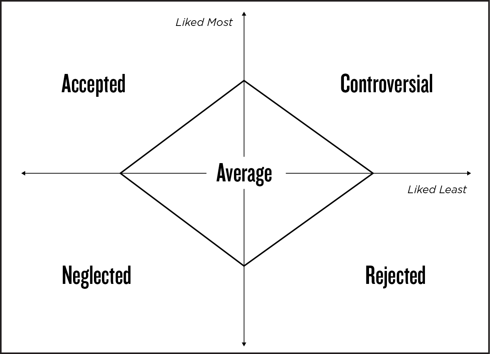

## CHAPTER 2

## Boorish Bully or Likable Leader

## There’s More Than One Type of Popularity

It was the early 1840s, and the doctors of General Hospital in Vienna were worried. For reasons no one could understand, hundreds of women who delivered babies at the hospital were developing an extremely high fever and dying. The fever occurred most often among new mothers on an obstetrics unit staffed by physicians. Those who gave birth on a second unit, run by midwives, had much better rates of survival.

The doctors carefully analyzed both units, taking note of the differences in doctors’ and midwives’ delivery practices, the units’ atmospheres, and even the women’s physical positions during labor. They systematically tested one hypothesis after another to account for the deaths, but they could not identify a determinate factor. Mothers on the doctors’ unit continued to develop what was referred to as a “puerperal fever” and die. Soon pregnant women in Vienna pleaded to be admitted to the midwives’ unit. Some even chose to give birth on the city streets. Remarkably, even those who delivered outside the hospital were more likely to survive than those under medical care.

Then a young physician named Ignaz Semmelweis began working at General Hospital. Semmelweis was a trainee from a wealthy family, and his colleagues quickly selected him as chief resident. Over time he earned respect from his associates and supervisors for his medical knowledge, his upper-class background, and his medical proficiency. His reputation spread throughout the entire city, and people wanted to meet him just to hear his opinions.

Semmelweis soon developed a theory to explain the mysterious deaths. He observed that the doctors who worked on the obstetrics unit also performed autopsies. Many of these were conducted on individuals who had died of puerperal fever, after which the attending physicians would proceed immediately to the obstetrics unit. Semmelweis hypothesized that puerperal fever in the new mothers was caused by “cadaver particles” that somehow spread the disease from the dead bodies.

He suggested that his colleagues routinely wash their hands with an antiseptic solution following each autopsy to reduce contagion to women on the obstetrics unit. He also urged doctors to disinfect all medical instruments that had been used in autopsies. In essence, Semmelweis developed a theory of infection by germs that guides medical practice to this day.

His suggestions worked. The mortality rate among the mothers on the physicians’ unit fell to around 1 percent, the same rate as the midwives’. Dr. Semmelweis was hailed as a hero, but despite all his fame and status, medical historians report that people did not especially like him. Howard Markel, a distinguished professor and director of the Center for the History of Medicine at the University of Michigan, reports that Semmelweis frequently “hurled outrageously rude insults to some of the hospital’s most powerful doctors who deigned to question his ideas.” He “publicly berated people who disagreed with him,” according to another account, and loudly branded those who challenged his ideas “murderers.”

His supporters pleaded with him over many years to publish his findings, so others could review and promote his practices. Yet he refused, stating that his discoveries were “self-evident,” and that there was no need to defend them to those who were “ignorant.” When he did eventually agree to publication, after a decade of resistance, the piece was filled with hostile rants that personally attacked his critics, their intelligence, and their character. He stated that his peers did “not even understand the limited truth,” dismissing them as “wretched observers” of medical conditions, and judged that Germans’ disagreement with his principles rendered “the obstetrical training in Berlin worthless.”

Dr. Semmelweis had high status and influence. He was well respected, revered, and powerful. He was popular. But he was also a bully, and thus loathed by many of his peers.

—

One hundred fifty years later, three girls walked into the library of a small suburban high school in southern Connecticut. All had blond hair and all were dressed impeccably, if not a little provocatively for fifteen-year-olds on a school day—tiny T-shirts, short skirts, and matching sneakers with bulky pink socks. Their arrival was noticed by just about everyone.

The tallest girl, Alexandra, entered the library first, while her two friends followed dutifully a few paces behind. Alexandra moved with the confidence of a star, without a trace of adolescent awkwardness. The aisle between the study carrels was her runway, and she walked it erect with long strides and a gaze fixed toward nothing specific ahead. When one of her friends asked her a question, she responded without turning to face her. Occasionally she offered a passing glance or wave to a classmate, who stared up at her with wonder.

Alexandra had come to the library to participate in a research study on popularity conducted by my lab. My assistants stood in the doorway of a private room, waiting for a dozen or so participants, a few of whom were already working diligently at a large conference table. Before my assistants could ask for her name, she entered the room and announced, “I’m Alexandra Cort.” The other students looked up immediately.

Alexandra’s friends, meanwhile, seated themselves on chairs outside the private room, staring aimlessly at the stacks around them. When my assistants informed them that they were free to leave, one replied, “No, we’ll stay here. We’re here with Alexandra Cort.”

“Yeah,” the other boasted. “We’re her best friends.”

“She will be here all period,” an assistant pointed out. “Don’t you want to get some lunch?”

“No, we want to wait for her. We’ll skip lunch.”

“Actually,” the assistant explained, “it’s important for our study that the participants are not distracted. Would you mind waiting for your friend in the cafeteria?”

Rolling their eyes, the girls slid their chairs some twenty feet away from the room, sat down again, and began to whisper to each other.

Our data eventually revealed that Alexandra was the most popular girl in the tenth grade. In fact, she was the first person selected by almost every single participant when we asked them to name the most popular kids in their school.

But she also was one of the most despised. About 65 percent of her classmates—by far more than anyone else in her grade—picked Alexandra as the student who was most likely to gossip about others, use her friendships as a way of being mean, give others the “silent treatment,” and say hurtful things behind others’ backs. About half of her classmates identified her as one of the students they liked least.

Even her friends obediently waiting for her to complete her participation in our study were overheard whispering about her. “Alex is so conceited,” one remarked. “I know,” replied the other. “Like, I don’t even want to go with her to the mall this weekend.”

Anyone who is popular is bound to be disliked.

—Yogi Berra

How can someone be popular when they are not even liked? The very idea seems like a contradiction.

Yet when we think about “popularity,” we tend to immediately think of people who have an outsized reputation—people like Ignaz Semmelweis and Alexandra Cort. Anyone who has been to high school remembers exactly who the popular types were: the cheerleaders, the athletes, the wealthy kids, or those whose parents held high-profile positions in the community. Even as we disliked them, we grudgingly emulated them. In my high school, no one would be caught dead without an Ocean Pacific T-shirt and everyone talked about the latest Duran Duran video, because those were exactly the things the popular students told us were cool. But in most cases, these kids weren’t even our friends.

If we consider someone we don’t like as being popular, then what does “popularity” really mean?

This is a surprisingly difficult question to answer. Bill Bukowski, a Canadian psychologist who has studied popularity among youth for decades, traces the etymology of the word “popular” to the Middle French (_populier_) and Latin (_popularis_), which originally referred to ideas or politicians that were “of the people.” A “popular movement” was thus one that rose from among the masses, rather than from their leaders. By the sixteenth century, the word “popular” was adopted by the English to refer to prices or resources that were “accessible to commoners,” such as the “popular press.” But in the past four hundred years, the term “popular” began to blend the concept of plurality with the idea of something valued and preferred. By the seventeenth century, “popular” referred to anything widely adopted but also “well regarded.” Today, of course, this usage is reflected in the ubiquitous online lists that have co-opted the phrase “most popular” to rank anything and everything—baby names, vacation destinations, dog breeds, diets, YouTube videos, stocks, ice-cream flavors, and so on. There are even lists for the most popular Nobel Prize Laureates, sexual fetishes, Catholic saints, cat names—it’s endless. I assume that the criteria for what makes sexual fetishes and Catholic saints most “popular” differ considerably. So what does “popularity” really mean?

This contemporary notion of “popularity” as anything or anyone that is favorably viewed by many others is more complex than it appears, because there are different ways that we may feel approvingly toward something. Even in the 1600s, popularity could refer to that which was “well liked,” “admired,” or “desired,” which all express different sentiments. Consequently, there are various kinds of popularity that are now studied in the social sciences.

When we remember what “popular” meant in high school, we are invoking the type of popularity that social scientists believe more accurately reflects _status_. Status is not a measure of how well liked a person is, but rather of his or her dominance, visibility, power, and influence. Interestingly, status does not become salient to us until we reach adolescence, but it tends to establish itself as a meaningful kind of popularity for the rest of our lives.

A second type of popularity reflects _likability_. Based on findings from social science, it is this type of popularity that we should genuinely care about. Even very young children understand likability. Research shows that as early as the age of four, children can report exactly who their most popular peers are and can do so reliably. But these popular toddlers are not necessarily powerful, dominant, or highly visible. They are, rather, the kids that everyone likes the most. Likability continues to be relevant to us throughout our lives and has been shown to be the most powerful kind of popularity there is.

—

In 1982, John Coie, a psychologist at Duke University, conducted a now-seminal series of experimental studies that began by giving children a list of all of their classmates’ names and asking them two simple questions:

“Who do you like the most?”

“Who do you like the least?”

Psychologists refer to this procedure as a “sociometric assessment.” For each of these questions, participants can nominate as many people on the list as they wish.

Coie and his then-assistants, Ken Dodge and Heide Coppotelli, asked over five hundred children to answer those two questions. The results were interesting for a number of reasons. First, Coie found that children who were very well liked might also be just as strongly disliked. In fact, likability and dislikability are independent measures of regard. We can be both liked and disliked at the same time. We can also be neither.

Second, the scientists found that children differed greatly in the number of times they were named at all, regardless of which question was being asked. Some children seemed to be especially visible in their classrooms—they were cited often when their peers were asked to name the kids they liked _or_ disliked. Other children were just the opposite: it was as if their classmates barely knew they were there.

This study was not the first time researchers had asked children these questions. But Coie and his team were the first to use the answers to create five categories, or “sociometric groups,” that are the foundation for how we now think about the different faces of popularity. Their results have been replicated in hundreds of research studies among children and adults all over the world.

Coie’s groupings can be pictured in a two-by-two matrix. “Likability” is plotted on the vertical axis, while “dislikability” is plotted horizontally. The more times a child is picked as “liked the most,” the higher his or her name would appear. The more times a child is nominated as “most disliked,” the farther to the right his or her name would go.

Figure 1. Sociometric Groups

Coie and his colleagues found that some children received an unusually high or low number of nominations, and this qualified them for one of four sociometric groups in the corners of the matrix. Children in the top left quadrant were highly liked and rarely disliked. Coie described this group as “Popular,” but they also can be designated as “Accepted,” because the type of popularity they enjoy is based purely on who is most likable. The opposite quadrant, at the bottom right, included those who were “Rejected”—liked by few and disliked by many. Children who rarely were nominated as liked _or_ disliked, the invisible children, gathered in the lower left box and were referred to as “Neglected.” By contrast, the group in the upper right box—those who were widely liked and disliked in roughly equal measure—were among the most visible members of the group, and make up the “Controversials,” the peers we either love or hate. Controversials are relatively rare and make up the smallest of the sociometric groups. Taken together, Accepteds, Rejecteds, Neglecteds, and Controversials total about 60 percent of all youth. The remainder of his subjects were classified by Coie as “Averages”—the largest single group. Note that although they do not get an extreme number of nominations as liked most or liked least, most Averages tend to veer toward one of the other categories.

These labels may feel reductive, I know. Especially in today’s society, when we try so hard to adapt any environment to meet individuals’ needs, describing anyone as “Rejected” or “Neglected” can seem harsh. Such characterizations assume that these sociometric groupings reflect an attribute of each child and not merely a mismatch between the person and her particular peer group. Might a Neglected child be better liked if he was placed among different peers? Might someone who is Rejected become popular if given a fresh start?

This is exactly what Coie wondered, so he designed a follow-up study to test whether children’s groupings would stay the same if they were placed in a new context. He started by inviting ten-year-old children to his research lab to participate in playgroups. These groups were not randomly composed: each included four children from four different schools, none of whom had met before. One child in each group was Accepted in his originating school, one was Rejected, one Neglected, and one Average. (Coie excluded Controversials, since they are uncommon.)

For one hour each week, the children met to play together in much the same way they might in class or at recess. They gathered in a room that had been stocked with games, Legos, toy cars, inflatable boxing gloves, markers, paper, and so on. First, each group engaged in a structured activity supervised by an adult. Next, they had unsupervised time for free play. Then, once playtime was over, it was time for the researchers to unobtrusively measure each child’s popularity. They did so in a particularly clever way.

Rather than make the point of their experiment too obvious, they asked one of their trained research assistants to drive each participant home at the end of every weekly session. During the ride the researchers first engaged in normal conversation about the child’s interests and hobbies, but before they reached their destination, they asked him whom he liked the most in his playgroup, followed by whom the child liked next best, and so on, until all their playmates had been named, including the child they liked least.

At the end of Week 1, Coie and one of his graduate students at the time, Janis Kupersmidt, examined the compiled results of these interviews and discovered that there was absolutely no relationship between how well liked children were at their own schools and how well liked they were within the group of unfamiliar playmates. The new configurations truly offered a fresh start. A week later, the researchers conducted the interviews again and still found no correspondence between the children’s likability in the playgroup and at their respective schools.

But by the third playgroup session, a remarkable similarity emerged between the popularity of each child in his group and at his original school. It only took three hours of play for Accepted children to become accepted again. Rejecteds were once again the most disliked, and Neglecteds again proved themselves unlikely to be picked as most _or_ least liked. The study continued for another three weeks, during which the patterns grew even stronger.

Subsequent research has revealed that the factors that cause us to be accepted by peers are fairly universal and enduring—they have the potential to make us liked or disliked again and again, even as we change settings, for the rest of our lives. When Coie and Kupersmidt reviewed the videotapes from the first two weeks of their experiment, they noticed that in their new playgroups, the Accepted and Rejected children had already begun talking far more than their Average and Neglected counterparts. When Accepted children spoke, they were setting the norms for the group, gently reminding others of the rules, suggesting new games, and coming up with innovative ideas for how to make toys more interesting. But when Rejected children talked, they were more likely than the others to insult, threaten, tease, and boss around their peers. Rejected children also were the least likely to listen to directions when participating in the adult-structured activity. It was no surprise that children attained the identical level of popularity so soon after meeting brand-new peers. They behaved in the same ways that had determined their likability in their original schools.

Shortly after I began teaching my first college class on popularity, I had an opportunity to witness this phenomenon for myself. It was about midway through the semester when I got a call from an ABC News producer who wanted to film a replication of Coie and Kupersmidt’s classic experiment. My students and I received permission from parents at a local day-care center to film a group of three-year-olds who had known the peers in their respective classrooms for only a few months. Interviewing each child just as Coie and his colleagues did quickly revealed who among them was Accepted, Rejected, Neglected, and Average. We invited one child from each sociometric group, kids from different classrooms who had never played together, to gather in the school gymnasium. We then began to observe their interactions for what was expected to be a few weeks of play sessions.

But in this case, it took only about thirty minutes before the children’s previous popularity was revealed. In less than an hour, the child whose classroom peers had nominated her as Accepted had begun leading the others in a game with an oversized ball, and the child who had been picked as Rejected was excluded. I did not continue to study this group, but researchers who have worked with children over many years have found that over half of those who are categorized as Accepted, Rejected, Neglected, Controversial, or Average in elementary school continue to fall into the same group over five years later in high school, even those who have switched schools and become part of a brand-new group of peers.

Does the type of popularity we experience in our youth remain constant for the rest of our lives? Some say that we can hit the popularity reset button when we go to college, where we are suddenly surrounded by a far more homogeneous group of peers, at least in terms of academic achievement and ability to follow adults’ directions. In many European nations, this occurs in secondary school, where teens are already grouped by educational tracks.

But for most of adulthood, we find ourselves again in groups that are involuntarily assembled—peers who have been placed together for reasons other than common friendship, educational level, or familial relation. Then it is like grade school all over again. It doesn’t take long until groups of Accepteds, Rejecteds, Neglecteds, Controversials, and Averages begin to emerge. Often, the group we land in as adults is the same one we were in as youths, and this can have remarkable implications for us.

—

It was not long before the holidays when employees of a large international tech company learned of an upcoming corporate “reorganization”—in other words, a major round of layoffs. In all, about 30 percent of the workforce would be let go by the end of the year. Three weeks after the announcement, forty-five hundred employees drove to work on the day that most would learn their fate.

One of these employees was a guy named Billy. I know him quite well. Billy had started working at the company about five years earlier, shortly after he finished graduate school at Harvard. Billy has two kids, a son who looks exactly like him and a daughter who is a clone of his wife. They had just agreed to buy a new house, and before they knew anything about the reorganization in Billy’s company, they had scheduled their closing on the day after layoffs would be announced.

Billy’s unit within the company is located in a building that has adopted an open floor plan, a well-lit bull pen of conference tables, stand-up desks, and free-floating file cabinets, with occasional cubicle dividers that reach only chest high. Everyone can hear their colleagues’ conversations, and there is no mystery about who is meeting with whom. It might as well be the school cafeteria all over again.

Billy usually chooses a desk close to the perimeter, alongside a wall of full-length windows that overlooks the parking lot. No matter where he sits, however, Billy experiences a lot of traffic at his workstation. People come by to say hello in the morning, congregate after difficult meetings to debrief and commiserate with him, and gather at lunchtime to decide where to eat. Even a casual visit to the office would reveal that he is one of the most well-liked people on his floor.

On the morning of the layoffs, Billy sat nervously at his desk waiting for a representative from human resources. He tried hard to focus on his work, but it was almost impossible to ignore the chatter of his coworkers as they paced and gossiped down the hall. Once his colleagues saw that he had arrived, Billy’s desk was surrounded by peers who wanted to hear his predictions, and for the next hour, no one got any work done.

Sitting across from Billy’s desk was Carl, a tall, lanky man in his mid-forties who had been working at the company for twelve years. Carl did not take part in the chatter. In fact, he rarely talked at all. Billy describes Carl as one of the “heads-down” people in the office. He is quite good at his job—his work is always on time and carefully completed—but he just isn’t very showy about it. He stays at his desk, he rarely eats lunch with others, and while he always pays attention in meetings, he rarely participates.

Carl’s workstation is well ordered and uncluttered. His desk has a few neatly labeled file folders tucked in the corner and a mug filled with about a dozen identical pens. On most days, he offers a brief nod and courteous smile to everyone as he walks through the break room to get his coffee, then sits at his desk and works undistracted until lunch. But on the day the layoffs were announced, Carl seemed agitated. He kept his cell phone close at hand, sending periodic texts to his wife as he overheard rumors. Occasionally he got up from his desk and disappeared for fifteen minutes at a time, but no one noticed.

On the far side of the room, sitting by himself, was Dan. Dan is in his late fifties. He is pleasant enough, generally gregarious and enthusiastic, but something about him seems a bit off. In dozens of little ways—none remarkable on their own, but collectively quite noticeable—Dan doesn’t seem to be tuned in to others. While his peers share minor details of their personal lives as they chat in the break room, Dan discloses just a little too much information about his marital woes, making others uncomfortable. When friendly banter leads to a volley of quips around the conference room table, Dan hogs the ball, getting carried away with his own story. He even looks like an outsider, wearing wrinkled khakis and white sneakers in an otherwise preppy-dressing office. It’s not a difference he seems to notice.

Dan had no idea whether or not he would be laid off, he told me, but he certainly was curious what others thought about his fate. He roamed the floor peering over the shoulders of colleagues who huddled together to make predictions. In most cases, they continued their conversations without widening their circle to include him, and he continued to walk from group to group.

The one person in the office who didn’t seem nervous at all was Frank, the slick, well-groomed assistant whom Billy calls one of the “manage-ups” of the firm. Frank is in his mid-twenties, far junior to most of his colleagues but well known by all. He is the epitome of charm and polish—smooth and funny but never really offering much of substance. He is quite helpful to any superior who needs his help (“Sure thing . . . happy to do it . . . no sweat”), but when a fellow assistant asks for a favor, Frank is downright rude (“Your problem, not mine”). As he walks to his desk, Frank offers an eager nod to almost everyone he passes. Some greet him back enthusiastically, while others nod curtly. While his colleagues fret over the upcoming layoff announcements, Frank sits back calmly and plays a game on his phone.

In this company, Billy is Accepted, just as he has been for most of his life. He describes himself as an introvert—he would prefer to play golf alone than to network at a company party. But likability is not necessarily related to either introversion or extroversion. Like many Accepted people, Billy is likable because he has the ability to read the room—any room. His ideas aren’t always better than others’, but he knows exactly when in a meeting to offer them, and he often gets the credit. Just slightly faster than his colleagues, he recognizes when there is an emerging consensus or conflict. He’s good at tuning in to the emotional underpinnings of his coworkers’ statements. But perhaps most important, Billy is adept at using his social skills to help others feel connected to him.

He does so in a number of ways. First, Billy is great at asking astute questions. Studies show that people who ask many questions of each other when they first meet—a highly effective way of scanning for an emotional connection—are more likely to have high-quality relationships even months later. When you first meet Billy, his questions clearly communicate that he wants to know more about you, and he finds most everything you say to be interesting, important, and relatable. Billy’s social behavior signals that he cares about the herd. People want to talk to him because they believe that Billy wants to talk to them. That makes him likable.

Second, Billy has a terrific sense of humor. This trait also is a function of reading the room well, because a good joke requires understanding the current mood or sentiment, and exaggerating or twisting it for comic effect. More fundamentally, humor offers biological benefits. Laughter is associated with the release of dopamine and endorphins that promote euphoria and improved immune response—and people like others who help them feel good.

Third, just like the Accepted children in Coie’s studies, Billy is described by others as someone who is trusted, has many friends, seems fair, happy, polite, patient, and knows how to share. And as research on Accepted children would predict, Billy generally has had a very successful life. Studies show that when Accepted children become adults, they have higher self-esteem, make more money, and have better-quality relationships with friends and romantic partners. They even grow up to be physically healthier than their less accepted peers. The power of likability persists above and beyond the effects of all kinds of factors that we usually think are most important, like intelligence, socioeconomic status, and healthy behavior.

Carl is Neglected. In childhood, the Neglecteds watch their peers play from afar, remaining behind a fence poking a worm with a stick, rather than joining the others. Or worse, they attempt to take part in a game of hide-and-seek, but no one tries to find them. Some Neglecteds are anxious—desperately eager to be a part of a group but rarely confident enough to initiate interactions with others. Studies show that as adults, Neglected people are a bit slower to begin dating or establish secure, committed relationships, and they usually choose professions that do not rely heavily on interactions with others. They are unlikely to become public speakers, salespeople, or recruiters.

Still, many Neglecteds do very well in adult life. Some manage to quell their anxieties, while others simply prefer to spend a great deal of time alone. There is also evidence that being Neglected may be more associated with one’s particular environment than it is for other groups. In Coie’s studies of children’s sociometric groups over a five-year period, the Neglected category was the least stable. While most Rejecteds and Accepteds remained so over time, Neglecteds were just as likely to ultimately land in almost any of the sociometric groups six years later, though they almost never became Controversials.

Dan is Rejected. The Rejecteds have been the category most studied by clinical psychologists, because peer rejection turns out to be a very important predictor of mental health difficulties throughout our lives. Research has found that Rejecteds can be divided into two subgroups. One includes those who are highly aggressive. Rejected-Aggressives become angry, rude, or defensive when upset. On the playground, the Rejected-Aggressive child is the boy who hits someone who took his toy without asking, or the girl who excludes just one classmate from her party. In a business meeting, it is the person who is so desperate to be heard that he or she cuts off and undermines others. In the community, it is the individual who gossips about neighbors when he or she feels wronged.

A key characteristic of the Rejected-Aggressives is that they often don’t realize that their behavior is inappropriate. Many do not even know they are rejected, and in fact, Rejected-Aggressives often believe that they are the group’s favorite. Many aggressive people are not rejected. But about half of those rejected are also aggressive, and these Rejected-Aggressives have far worse outcomes than those who are only aggressive or only rejected.

Dan is actually a Rejected-Nonaggressive, a group that violates the social norms in any number of nonhostile ways. Some Rejected-Nonaggressives are disliked merely because they look unusual or come from a different background than most of their peers. Others are rejected because they engage in odd behaviors. Still others have not matured as quickly or in the same way as others. In Dan’s case, his problem was being too smart in a world where being smart can be very uncool.

Dan’s intelligence wasn’t always an obstacle. In elementary school, he was his teachers’ favorite, often called on to tutor classmates who had difficulty with math. By third grade, he won a district-wide math tournament and remembers receiving a standing ovation from his peers at an elementary school assembly. He was the first to be singled out by the principal whenever she visited Dan’s classroom, and his peers, recognizing his special status among their teachers, were always eager to play with him on the playground.

Of course, this all changed for Dan by middle school. Suddenly the same low-achieving classmates whom he used to tutor started to call him names, and Dan became a nerd, a pariah. It seemed as if every academic award he received only further branded him a geek in the eyes of his peers, and by tenth grade, he became so mercilessly teased by his classmates that it became easier for him to live in his own little world—deliberately oblivious to whatever his peers thought was cool.

Dan’s story is typical of what I have found in my own research. Following over two hundred children until they reached adolescence, Annette La Greca and I found that at age nine, high-achieving children are typically the best liked of all. Teachers love them, they are terrific at solving social problems, and their peers are excited to play with them. These children enjoy high self-esteem and the lowest levels of depression, anxiety, and loneliness compared to their peers. But six years later, these same kids reported precipitous declines in their emotional well-being. As a group, they were the most depressed, socially anxious, lonely, and insecure of all adolescents.

What changed? Not their intelligence—they were still the smartest kids in class, achieving the highest grades. But by their early teens, their peers’ attitudes toward high achievement transformed, and the smart kids suffered the social and psychological consequences. Getting good grades and trying hard in school is exactly what adults want kids to do. In other words, these kinds of behaviors reflect adults’ values. In childhood, kids think adults are “cool,” so acting in accordance with adult values is cool, too. In adolescence, however, we are programmed to look toward our peers more than our parents. And there could be nothing more “uncool” than doing what your parents want. So among teens, getting good grades or trying really hard to achieve suddenly attracts ridicule and scorn.

Of course, many highly intelligent people like Dan find a place to feel comfortable in adulthood, when there is a bit less stigma to being smart. Others lose the US presidency to George W. Bush, who may have been the less qualified candidate in 2000 but seemed more likable to the American people than Al Gore. Still others feel alienated for the rest of their lives and find a way to simply ignore their peers, because it is too painful to feel so different.

In adolescence, this latter strategy worked well for Dan. By deliberately disregarding what others thought was cool, he could evade the sense of inferiority he felt among his classmates. He decided that he didn’t care what his peers valued, because they didn’t value him. By adulthood, however, this strategy started to backfire. On performance reviews, Dan was rated as competent, loyal, and timely, but also judged to be “not a team player” and “difficult to work with,” and to have poor “agility.”

How about other Rejected children, who may have been disliked for any number of reasons other than being too smart? Research findings tell us that being rejected is one of the most consistent risk factors for a whole range of later psychological symptoms—depression, anxiety, substance use, even criminal behavior. Of course, not every Rejected individual experiences mental illness. But many such children do continue to feel shut out even as adults. Somewhere—at work, in their communities—there is a group that they try to avoid or feel uncomfortable being around. They may opt out of dinner parties or social events, for instance, if there’s a risk of being made to feel inferior again. Like Dan, they may find a spouse and have a few close friends, but they perpetually fear being marginalized. Alternatively, many find a vocation or a workplace populated by others who themselves were Rejected or Neglected. Some become so skilled at engineering their contacts with others that they report no longer feeling very rejected at all. But old feelings of insecurity continue to haunt them when they are thrust outside their comfort zone.

Rejecteds also may feel innately unworthy, anxious, or angry. These feelings can manifest themselves subtly, through a continual need for reassurance from loved ones, a sensitivity to signals that they’re being teased or excluded, or fear when meeting people who remind them of their childhood tormentors. It’s common for Rejecteds to develop a push-pull relationship with the world around them, often judging others as a way to feel superior, yet all the while dependent on positive feedback to gird their own fragile self-esteem.

Frank, the social-climbing assistant who manages up so persistently, is a Controversial. In childhood, the Controversials are often the class clowns—everyone’s favorite peer when part of a large group, if not necessarily someone whom people are eager to invite into their circle of close friends. These individuals can be very adroit socially but are also quite aggressive. Many describe them as Machiavellian—strategically using their social skills when it serves them, but also willing to knock others down to get what they want.

We don’t know a great deal about how Controversials fare over time. They are relatively difficult to find and as such are often excluded in research studies. But available evidence suggests that although they achieve short-term gain, they do not do well in the long term. One study revealed that out of almost three hundred girls who were categorized as Accepted, Neglected, Rejected, Controversial, or Average in the fourth grade of a low-income community, it was the Controversials who were most likely to become teen moms. In fact, compared to all teenage mothers, the Controversials were youngest when they gave birth.

Research also has shown that Controversial children grow up to be especially likely to have high _status_ in adolescence—that’s the other type of popularity we will explore in this book.

—

It was nearly noon when a representative from human resources finally stepped off the elevator and onto the floor where Billy, Carl, Dan, Frank, and almost a hundred other employees sat in gloomy anticipation. As if in a scene out of _American Idol_ , the representative read off three lists of names, directing employees to separate rooms to learn their fate. Billy and Frank were sent to the same room. Carl was in another, and Dan was in the third.

After about twenty minutes of waiting, the workers in Billy and Frank’s room began to whisper, and soon rumors were circulating. Finally, the human resources director entered, shut the door behind her, and informed them that they were all safe. They were expected to return to work immediately.

She next entered Carl’s room and notified this group that while their positions were being eliminated in the corporate reorganization, they each would be offered one-year contracts with a subsidiary. It was not a great outcome, but it was better than unemployment.

“I knew I was in trouble,” Carl recalled. When the executives debated who would stay and who would go, he said, he understood that “I wasn’t anybody’s boy.” Others hypothesized that Carl was among those who were asked to move because he was connected to so few others, which meant that his departure had the lowest likelihood of upsetting the office network.

Dan’s room held the fewest workers. All were told that their duties had been reassigned, and they were expected to vacate their desks by the end of the week. Although Dan was smart and did his job well, there was no question that he would be laid off on that grim day. He just never seemed to fit in among his peers.

Of course, the decisions made regarding Billy, Carl, Dan, and Frank were based on a complex array of factors. Work performance, seniority, organizational needs, and future projections were taken into consideration. But were they all that mattered? Substantial evidence suggests that it is our likability that can predict our fate in so many domains of life. Likable people continue to have advantages, and dislikable people will almost always suffer.

—

Likability is an important type of popularity, but it is not what we typically think of when we judge who is most popular. What we usually imagine has much more to do with status. For some people, it is possible to be popular in both respects—to have power, influence, prestige, dominance, and also to be a person that everyone likes. But this is rare. Research studies measure status by using a different type of sociometric assessment, asking subjects to identify peers who are “Most Popular” and “Least Popular,” rather than whom they like the most and least. Findings reveal that only about 35 percent of those who are high in status are also highly likable. Many of the rest are Controversial.

Ignaz Semmelweis’s high status afforded him the opportunity to investigate a major medical crisis and ultimately propose a theory that had the potential to advance knowledge and save lives. When his peers adopted his new methods—washing their hands and disinfecting surgical instruments between procedures—hundreds of mothers were saved.

During his lifetime, however, Semmelweis never received the credit he deserved for his major medical breakthrough. Howard Markel, the University of Michigan historian, writes that Semmelweis’s shrill, harsh behavior ultimately led doctors in Vienna to stop washing their hands following autopsies. Soon mothers began to die again, at an even higher rate than earlier. In 1850, Semmelweis quietly resigned from General Hospital. It was not until over a decade later that Louis Pasteur conducted a series of experiments revealing the existence of specific disease-causing bacteria, which changed medical practice forever. In the meantime, thousands of women and babies died in Vienna, and Dr. Semmelweis himself passed away at the age of forty-seven—purportedly from an infection.

Alexandra Cort’s story similarly suggests a troubling outcome for those high in status. As part of our research, we continued to follow her and her peers for a few years after our first meeting. On measures of status, Alexandra was by far the most popular student in her grade all the way up to graduation, even as she continued to be rated by many as someone they liked the least.

But that was her downfall. It was because of her high status that she was invited to every party, where she drank, smoked pot, used ecstasy, and even experimented with cocaine. Her grades dropped, and while her friends from the library were admitted to four-year universities, Alexandra was left behind. Her friendships eventually became strained, and her boyfriend broke up with her as he prepared to leave for college.

When we last collected data for our study, the most popular girl in school was lonely.
