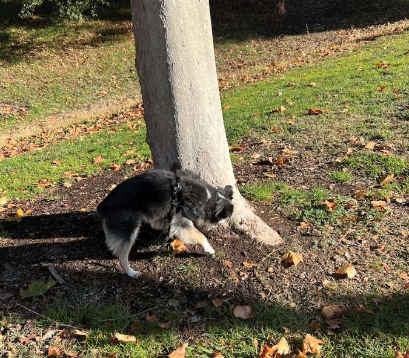

Introduction 

The Dog Walking Reframe

For years I found it annoying to walk my dog. All she ever wanted to do was sniff the grass and trees upon which other dogs had left their scent. Neither of us got much exercise. It was like tug-of-war to get Snickers to move at all.

One day, I saw an Instagram video in which a self-designated dog expert explained that dogs might need the sniffing more than the walking. Their brains light up when they sniff, and it can tire them out when they engage in vigorous sniffing. I had noticed how happy Snickers looked when sniffing, but my brain couldn’t connect the dots because sniffing dog urine sounds inherently unpleasant to my human brain. But to the dog, it was the equivalent of checking her social media. I started naming the trees and shrubs in the park accordingly: Muta (formerly known as Facebark), Twigger, LeafedIn, Instabush, and Treemail. Obviously, the garbage receptacle into which people flung their dog poop bags was TikTok. 

Once I understood the importance of sniffing, I reframed my experience this way.

Usual Frame: Taking the dog for a walk and failing.

Reframe: Taking the dog for a sniff and succeeding.

That reframe completely changed my subjective experience. Instead of failing at walking, I was succeeding at being a sniff-assistant. Snickers loved the new arrangement, and sure enough, twenty minutes of outdoor sniffing set her attitude right for the rest of the day. 

But then I had a new problem. Standing around holding a leash is boring compared to walking. It’s boring compared to most things. But then I reframed my boredom this way.

Usual Frame: I have nothing to do. I am just standing here.

Reframe: Perfect time to practice proper breathing and posture.

Now I spend twenty minutes a day enjoying the outdoors while breathing properly and practicing my posture. It feels good, which is enough to lock in the new habit. Now I am delighted to take my dog to the park. The only thing that changed was how I thought about the point of it all.

If you’re like most people, you spend a lot of time standing in line or waiting for one thing or another. It feels like a gigantic waste of time. Maybe you check your phone, but that probably isn’t as useful as it is anxiety-making. As you can tell from the Snickers story, I found a way to turn all mindless waiting time into one of the most productive parts of my day using the good-time-to-breathe reframe.

Usual Frame: I am waiting in line, which is a waste of time.

Reframe: I have time to breathe properly.

For decades I had heard about the benefits of proper breathing such as lowering anxiety and boosting positive energy. My problem was finding a consistent time of day to practice. My personality isn’t compatible with anything that involves sitting and doing what feels like nothing, even if it’s important. But breathing, you can do anywhere. You can be standing, sitting, driving, or walking. 

I recommend trying the breathing method described by Dr. Andrew Huberman. This involves two sharp inhales through your nose, one after another, followed by a long exhale through your mouth. Apparently, there is science behind the method, but in my experience, you can feel the difference so quickly and profoundly that you won’t need any convincing that it works. You’ll know in under a minute the first time you try it. I was surprised how different I felt after a few repetitions. I was relaxed in both mind and body.

By pairing the intolerable boredom of waiting in line with the habit of breathing properly, you can solve two problems at once. Your wait will become more tolerable, and your health and attitude will get a boost that will quickly addict you to replacing boredom with breathing. Lately I find myself looking for opportunities to do the breathing exercises because I like the immediate upgrade in calm energy. Now any boredom I experience from waiting—for anything—reminds me that it’s a perfect time to work on my mental and physical health. No one around me notices. 

An Odd Story

In the spring of 2022, I cured the common sneeze with some help from friends. I’m not talking about the kind of sneeze that catches you off guard. I mean the kind you feel building up. I discovered that if I did a pretend sneeze, it somehow deactivated the real one. The first time I tried it, I thought it was a fluke. After the second time I used it successfully, I alerted my followers on social media and asked them to try the method. It worked! At least for many of them.

One person—I wish I remembered who—discovered you didn’t need to act out the sneeze with a fake “achoo,” as I had been doing. You can simply imagine sneezing. I tried that next. That worked, too! And it was a better method for public places.

And so it came to pass that the creator of the Dilbert comic strip and his friends cured the common sneeze. Or at least one type of sneeze. 

I tell you the sneeze story to demonstrate how much power our thoughts have over our bodies. And more importantly, how quickly those thoughts can work their magic. It can happen in seconds. I will teach you how to reframe your ordinary experiences in ways that get you more of what you want—in every domain—and less of what you don’t want. Often it happens quickly—as with the sneeze cure—but other times you might have to reinforce the message with repetition. 

If you have a chance to try suppressing a sneeze using the method described—and you discover it works for you—the experience will give you goosebumps. It will feel as if you just discovered you have some sort of superpower.

You won’t be wrong.

If the sneeze cure doesn’t impress you, that’s okay because it was only the teaser. In the late summer of 2022, I saw a message on X claiming a video I had created in 2020 to reduce anxiety—using only reframing and hypnosis—had cured someone’s daughter of debilitating anxiety. The father explained that prior to viewing my video, his daughter had tremendous trouble leaving the house because her anxiety was so oppressive. But her father reported that she not only managed to get out of the house, she had also recovered so well she was about to be married. The father credited my video for her turnaround.

During my daily livestream show—called Coffee with Scott Adams, at 10:00 AM Eastern daily—I asked my followers on YouTube and on the Locals subscription service if any of them had a similar experience of reduced anxiety after viewing that video. A wall of “Yes” responses streamed down the live comments, with a smattering more on YouTube. (Locals subscribers were more likely to have watched the video.)

I was stunned.

If the commenters were right, I had “cured” dozens—maybe hundreds—of people of a lifetime of anxiety. And I did it using nothing but a series of reframes strung together to cancel the anxiety program running in people’s minds. 

I’m a trained hypnotist with decades of experience in persuasion and brain-hacking, so I had a strong hunch I could flip off the anxiety switch in some people. Probably not most people because people are too different. But I thought it was worth an hour of my time to test it by creating an anxiety reduction video in 2020. 

It was time well spent.

I’ll include in this book in text form the reframes I used in the anxiety cure video so you can try them out yourself. Don’t skip ahead to them. You’ll find out why. 

If you’re not excited about this book yet, here’s my favorite reframe success story. If my feedback from social media followers is to be believed, this reframe has helped hundreds—perhaps thousands—of people stop drinking alcohol. I invented this reframe in 2013 for my book How to Fail at Almost Everything and Still Win Big. Here’s the simple reframe.

Usual Frame: Alcohol is a beverage.

Reframe: Alcohol is poison.

Some readers of that book lost all interest in alcohol and quit drinking forever because they read those three words “alcohol is poison.” 

Really.

How do I know that reframe will work on some (smallish) percentage of readers? Because several times a week I receive a thank-you message from yet another internet stranger who embraced that reframe and removed alcohol from their lives. I don’t have to wonder if it works—I hear about it first-hand from people who quit a lifetime of overdrinking and credit three words: “Alcohol is poison.”

You have a few questions. I know. Here are your answers:

  1. This reframe is not for alcoholics. Addiction is a different problem. Reframes work for breaking normal habits such as drinking socially or having a glass of wine each night.
  2. No individual reframe works for 100 percent of people. Some work for only a few. Others are closer to universally useful. But if only 10 percent of the suggested reframes in this book work for you, your life will be transformed.
  3. Perhaps you protest that it isn’t TRUE that alcohol is poison like arsenic or cyanide! Correct. Reframes don’t try to be “true” in a technical or philosophical sense. Reframes don’t even need to be rational or logical. We judge reframes by how well they work. Period.

REFRAMES DON’T NEED TO BE TRUE.   
THEY DON’T EVEN NEED TO BE LOGICAL. THEY ONLY NEED TO WORK.

Is alcohol literally poison? No. Or maybe. Sort of. Depends. It doesn’t matter. Your brain will process a lie—or any form of fiction—the same way it processes a truth. That’s why a movie can make you laugh, cry, or feel inspired even while you know the story is made-up. 

Our imaginations—whether driven by fiction or our own thoughts—have the same power as real experiences when it comes to rewiring our brains. You already know a dramatic experience in the real world can instantly rewire your brain to make you forever fear or love something that reminds you of that experience. But imagination—including reframing—can also rewire your brain over time. You simply need to focus and repeat the reframe in your head long enough for the hack to work.

In my case, every time someone offers me alcohol or asks why I don’t drink, I say, “Alcohol is poison,” either aloud or in my head. I have repeated the reframe so many times it has become my truth in this subjective reality in which we live. 

Is it hard for me to resist drinking? It used to be. Now I am puzzled by why anyone would drink poison for entertainment. My story that alcohol is poison has become my reality. But is alcohol poison? Yes, definitely. And by that, I mean maybe. Or not. Doesn’t matter. I’ve reframed alcohol out of my life. That was the plan.

By the way, I’m not suggesting you need to stop drinking. That’s not what I do. I’m here to give you the tools to reframe your brain however you like.

Reframes Are Safe

I won’t ask you to trust me on the topic of reframing. I don’t need to. The nature of reframes is that they are so safe, you can try as many as you like. See for yourself which ones work. When we get to more reframe suggestions in this book, you’ll see they are all as safe as, “alcohol is poison.” 

Don’t worry about accidentally breaking your own brain. We reprogram our brains all the time, to good effect. I’m just teaching you some ways to do it better.

For example, you wouldn’t worry that learning to play a musical instrument will harm your brain, but you know it’s rewiring your neural circuitry to develop those skills. Reframes are no more dangerous or exotic than learning a new skill. I’ll trust you to know if any of these reframes feels risky to you, just as I would trust your decision to play an instrument, learn a new language, or take a college course. Everything you experience rewires your brain. I’m teaching you how to do it strategically instead of randomly.

The Technique

The simplest way to get the benefits of a reframe is to expose yourself to it. That’s all it takes. And you’re doing it right now by reading this book. You’re doing a great job.

Any reframes that don’t seem relevant to you will be soon forgotten, but a few are likely to become sticky in your mind. That stickiness is all you need. It creates focus and repetition—with no effort at all—and that’s all it takes to rewire your brain. Adding some emotion helps, but it’s optional.

The “alcohol is poison” reframe works because some people had a profound reaction to it from the start, and their minds kept returning to it when thoughts of alcohol popped up. That was enough focus and repetition to hack their brains. Others—especially non-drinkers—heard the reframe and probably never thought of it again. It wasn’t important to them.

As a rule, the reframes you need will probably be sticky from the first exposure. The reframes you don’t need will rapidly fade from memory. 

Reframes You Already Know

It won’t be hard to convince you how powerful reframing is because you’ve already been doing some version of it for years. Are any of these familiar?

In chaos there is opportunity.

It’s darkest before the dawn.

The customer is always right.

Those are reframes. Note that none of them are “true” in any total sense, but all of them are useful. That’s why they survive as old sayings; they work.

As I will often mention—no matter how much you hate it!—good reframes often have the weird quality of being untrue literally while still being useful. Take the first example on my list. It isn’t true that chaos necessarily creates opportunities for any specific person or entity, but accepting it as true (enough) is a great way to improve your attitude and your odds of success in the long run.

If you learn to look for opportunities in chaos or in bad news of any kind, I guarantee you will spot some sooner or later. All you need to do is train yourself to look for the opportunities. I use this reframe a lot. The first thing I think when something falls apart is that an opportunity has been created. I still deal with the problem, of course, but I’ve rewired my brain via repetition to automatically look for the upside. I always find it.

Similarly, I’m sure it’s not always darkest before the dawn in any real sense except that one of those things must always follow the other. But it predicts nothing about your specific situation. Nevertheless, rewiring your brain to think in that positive way can help you anticipate good news others do not see coming. It also keeps your anxiety in check when everyone else is saying the world is about to burn. It hasn’t burned yet. 

On to the third reframe, is the customer always right? Heck, no. A McDonald’s employee recently told me about an elderly man at the drive-thru window who complained about McDonalds having an app. He said, “Why does McDonald’s need an app now??? Is McDonalds planning to build an airport???”

It’s not entirely clear what an airport has to do with the McDonalds app. That customer was not “right” in any coherent way. But that’s not the point of “the customer is always right.” It is not meant to be literally, universally true. It is meant to rewire your brain toward fixing problems instead of debating them. And it works.

This book introduces new and more powerful reframes, but they all have the same qualities as the old reliables: They aren’t necessarily true, but they work. Once you understand why that apparent contradiction can exist without any downside, you’ll know how to make your own reframes.
