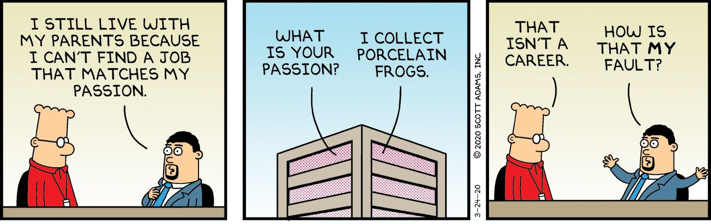
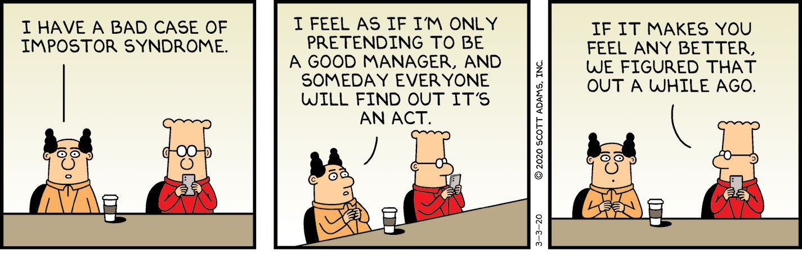
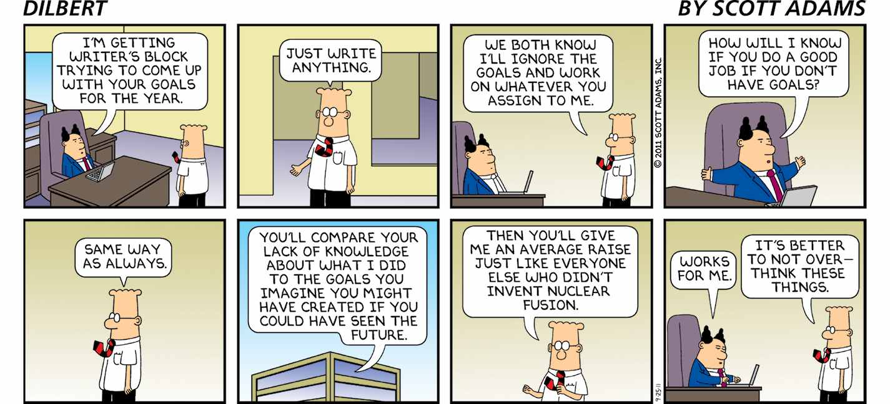
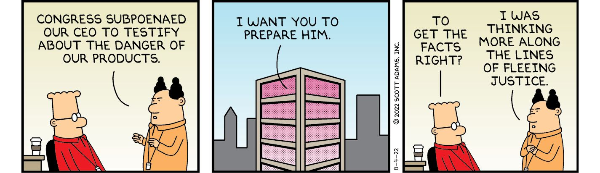
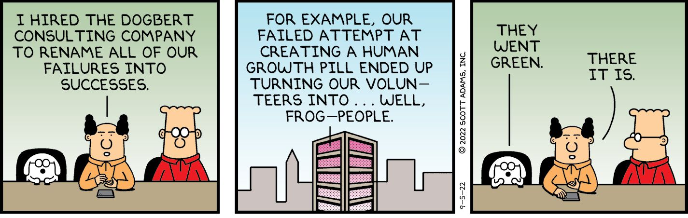
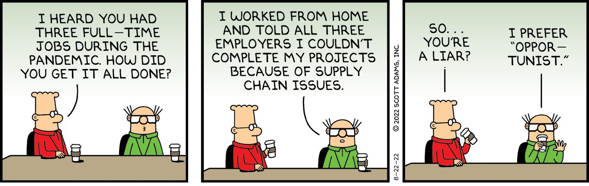
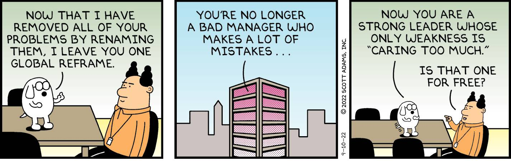

Chapter 2

Success Reframes

The Odds of Success

Have you ever noticed how surprised some people are by their own successes? For every person who “knew they would be great” and succeeded, there are twenty who exceeded their own expectations. And that has always suggested to me that humans are bad at predicting their own success. 

Personally, I’ve failed at most of the things I’m qualified for while succeeding at many thinGs I’m not qualified for. My education includes a degree in economics and an MBA from a top school. But I’ve had no luck as a banker or entrepreneur for a variety of reasons. On the flip side, I’ve done great in areas in which I had no experience or training whatsoever.

Qualified: Banker, entrepreneur

Unqualified: Cartoonist, author, public speaker, political pundit

That teaches me I’m terrible at estimating my own odds of success. So-called common sense didn’t help me a bit. I suspect many people reading this book are in the same situation; you think you know what you would be good at, but you could be wildly wrong. 

Usual Frame: My odds of success are low.

Reframe: Maybe I’m bad at estimating the odds.

Once you realize you’re terrible at estimating the odds of your own success, you’re free to try things you might otherwise not consider. You are allowed to expand beyond your comfort zone without pressure because the only way to know what will work is to test it for yourself.

I won’t try to tell you that anyone can succeed at anything they want if they approach the challenge with enthusiasm and passion. That would be nuts. I probably succeed at about 10 percent of what I try no matter how hard I try, but I generally try a lot of long-shot ideas that could be huge if they work. I only need one-out-of-ten to win big and I’m in good shape. This book, for example, is one of several projects I will have worked on this year. I might try adding an interview feature on my YouTube channel. Recently, I began testing my own funny-but-useful cooking show for people who don’t know anything about at-home meal prep. I’ll test several content ideas to see what catches on. A year from now, I’m sure I’ll be able to say I tested ten different content ideas to see what created its own energy in my mind and among my audience. I’ve been testing ideas at about that rate of ten per year for decades, and I still have no idea in advance which will work out. I’m bad at estimating my own odds of success in any specific domain, so I compensate with volume. That’s what I recommend for you, too. If the first thing you try doesn’t work, try something else. You never know for sure what will click. 

For example, you might go on ten dates before finding a good romantic match, or you might try ten side jobs before one fits and becomes your career. Think of it this way.

Usual Frame: I fail at 90 percent of the things I try.

Reframe: I only need to succeed 10 percent of the time.

You can choose to feel like a loser every time something doesn’t work out, or you can reframe your situation as a winner’s journey that might take some time. I recommend the winner’s reframe. 

Wanting Versus Deciding

If you want something, you might be willing to work hard to get it within reason. But if you decide to have something, you will do whatever it takes.

Usual Frame: I want to do (something).

Reframe: I have decided to do (something).

If I were to make a list of all the business startups and other money-making schemes I’ve worked on during my career and then divide that long list into what worked out well and what failed, there would be a pattern. You wouldn’t notice the pattern, but I would. The efforts that failed were all ones I wanted to succeed. And I worked hard to try to make them succeed. I wasn’t doing all-nighters or risking money I couldn’t afford to lose, but I put in great effort and yes, some cash. None of those wants worked out.

Luckily, several business projects did work out. Dilbert became an international sensation, I wrote several bestselling books, and I was one of the highest paid speakers in the country for several years. To be fair, I was only able to do all of that because the original Dilbert comic strip took off. And there is one thing that stands out about that initial Dilbert success: I didn’t want to be a successful cartoonist; I decided to be one. When I was offered a syndication contract in 1988—the ultimate big break for a cartoonist—I made a promise to myself that no matter what happened, I would never allow myself to look back and say I didn’t work hard enough to make it a success. 

I knew I was entering a field in which the odds of making it big were around 1 percent even after getting the syndication contract, which was already insanely unlikely. The syndication company sells comics to newspapers and web platforms and splits the money with the cartoonists. I had a contract but zero newspaper clients on day one. By the end of the first year of selling Dilbert comics to newspapers, only a few small newspapers were carrying the strip. At that point, seeing no hope of a big hit, the salespeople moved on to the next comic that was being launched. If Dilbert was going to succeed, I would need to make it happen on my own.

And so, I worked my day job while also writing and promoting the Dilbert comic for several years. I later wrote books and did licensing. For over ten years, I had the equivalent of three full-time jobs. I worked seven days a week, including holidays. I did everything I could do to promote the comic, putting 100 percent of my mind and body into it. For many of those years, I answered hundreds of emails per day from fans. I traveled the country for book signings and autograph sessions that would last hours. I did photoshoots and interviews several times per week for a decade. Dilbert was the first syndicated comic to be published on the Internet, which also took a lot of work.

On paper, my workload from those years looks impossible. If I had merely wanted to succeed, I don’t think I could have lasted. But I didn’t merely want to succeed, I decided to succeed. And once you decide, the psychology of the situation changes. My crushing workload felt like a privilege. I reminded myself that almost any cartoonist would want to trade places with me. It was never easy, and it was never painless, but I was unstoppable because I had decided. 

If you are wondering how you can know if the thing you desire is a want or a decision, I can help with that. It’s easy. If you are not sure, you have not decided. If you decide, you won’t have any doubt. That’s what makes it a decision.

Managing Energy Instead of Time

I’ve written approximately 11,000 comic strips since the beginning of my cartooning career in 1989. Nearly every one of those comics was written before 9:00 AM. If I write a joke at 5:00 AM, I usually like how it turns out. If I try writing a joke at 3:00 PM, I’ll probably end up tossing out whatever I produce.

I think of this as managing energy, not time. I have exactly the right kind of energy for coffee-fueled creative writing in the morning. But a caffeine buzz is exactly the wrong kind of energy for drawing comics, as that requires a more relaxed vibe. So I write in the morning when writing is easy, and I draw in the evenings when drawing is easy. That’s managing energy, not time.

Usual Frame: Manage your time.

Reframe: Manage your energy.

In my experience, the energy I have for a task is more important to the outcome than the amount of time I have allocated to do it. I can produce more in fifteen minutes with the right energy than four hours with the wrong energy.

Most creative people will tell you something similar. There is a time of day that works best for creative work and other times that do not work at all. The same holds for exercise. I have the right energy for exercise at about noon each day. So that’s when I do it. And I assume I get better outcomes compared to exercising when I’m at low energy.

The secret to managing energy as opposed to time is to gain as much control as you can over your own schedule. If you have a boss, you might not have options about when you do what. If you have a spouse or family or pet or other obligation, those, too, can force you out of the more productive and happy energy management mode into time management mode. That’s why I say you should favor life choices that give you schedule flexibility. For example, if you get two job offers that seem equivalent but one gives you more schedule freedom, take the freedom. Likewise with relationships. If you are equally attracted to two people and need to choose, consider picking the one who gives you the most schedule freedom. Freedom is a good tiebreaker for decisions with unpredictable outcomes. (The other good tiebreaker is how much you will learn in one situation versus the other.)

When you manage energy instead of time, you might not get around to all the tasks that need to get done. The solution to that: Don’t do those tasks. At least not today. If that sounds irresponsible, think of all the things that ever went wrong because you didn’t get something done that was in the bottom 20 percent of your priorities. I’ll do that exercise, too, right now, and if either of us thinks of even one example, I’ll be amazed.

Okay, begin.

I’m done.

I got nothing. Neither did you, I’m guessing. The least-important 20 percent of your tasks are unlikely to have made a difference in your life. Let them go. It’s hard at first, but you get used to it. There might be some blowback when certain tasks get postponed, but you can more than make up for that by being able to do your creative and important work when your energy is at its best.

The time-versus-energy tradeoff is embedded in most of your decisions, but perhaps you never thought of it that way. For example, your diet and fitness systems might take extra time out of your day, but you get that back in healthy energy. 

Or perhaps you’re lucky enough to have two potential romantic partners, and there’s a difference in how much energy you feel with each. Follow the energy. That’s a good signal. 

If you’re trying to decide between two career paths, you probably feel a distinct energy difference when you think of one versus the other. Don’t ignore that.

When you’re buying a car, most of that decision is practical and focused on your needs, but some car models give you a feeling that boosts your energy. Some don’t. Sometimes, that feeling hits you every time you get near the vehicle. That’s energy. Take the car that provides it.

And so it goes with most decisions in life—one path energizes you more than the other, no matter how they stack up in other dimensions. Energy isn’t the only variable—I don’t want to leave that impression—but after health and safety, it’s near the top. Treat it that way, and life will surprise you on the upside.

Knowing What Your Job Is

We are trained to believe our “job” is the set of tasks we accomplish for an employer in return for money. That’s how I saw it until a CEO shared with me his approach to business. He viewed his career as a non-stop search for a better job and because of that changed jobs and companies often. Apparently it worked because he was the head of a company when I met him.

Usual Frame: Your job is what your boss tells you it is.

Reframe: Your job is to get a better job.

Don’t confuse your job with the work your employer wants you to do. The boss might want you to process all the pending orders by quitting time, but your job is to get a better job. Everything else you do should service that reframe. If it doesn’t help you leave the job you are in and upgrade, it might not be worth doing. But don’t worry that this line of thinking feels sociopathic—doing a good job on your assigned duties is one way to look good for promotions. 

The reframe reminds us to be in continuous job-search mode, including on the first day of work at a new job. If that sounds unethical, consider that your employer would drop you in a second if the business required it. In a free market, you can do almost anything that is normal and legal. Changing jobs—for any reason you want—is normal. Your employer’s job is to take care of the shareholders. It’s your job to take care of you. That doesn’t always mean acting selfishly. If being generous with your time and energy seems as if it will have the better long-term payoff, do that.

Your employer might want to frame employees as “a family,” which is common, but that’s to divert you from the fact that they can fire you at will. They don’t want you to know you have the same power to fire them. Part of the job of leadership is convincing you that what is good for the leader is good for you. Sometimes that is the case but keep your priorities clear. You are number one.

When I recommend being selfish in the job market, I expect you to know that approach works best when dealing with a big corporation. A small business might require a more generous approach.

When your workplace reframe is that your job is to get a better job, that helps you make decisions that work in your favor. For example, if you’re offered a choice of two different projects at work, pick the one that teaches you a valuable skill, lets you show off what you can do, or lets you network with people who can help you later. Don’t make the mistake of picking the project that has the most value to the company if doing so has the least value to you. Sometimes your best career move is to do exactly what your boss asks, especially if it’s critical to the company. You’ll know those situations when you see them. Don’t lose sight of your mission: Get a better job.

Boredom

Boredom is an underappreciated asset for success. We think of it as a lack of action, and it is. But it is a far better starting point for your journey to success than having too much fun to get serious about your future. Life rewards action over inaction, and boredom is exactly the kind of mental state people need to organically trigger them into acting.

But what kind of action? That matters.

When you’re bored with life and directionless, the fastest way out is to ramp up your risk of embarrassment. After all, what do you have to lose? The simplest way to embarrass yourself is by trying to do something you know you don’t do well . . . in front of witnesses. 

A recreational ax-throwing business recently opened near where I live. Throwing an ax at a target isn’t as easy as it looks. You must judge the rotation of the ax just right or the handle hits the target with a humiliating thunk before falling to the ground in disgrace. If it’s your first time with an ax, you’re guaranteed to look like a boneless chicken trying to juggle bowling pins. Invite some friends and embarrass yourself. You won’t be bored. 

If you’re single, ask out someone you believe is above your self-assessed pulling power. If they say no, you lose nothing but your boredom. Take a chance and let yourself flame out and fail if that’s what fate has in mind. You might be lucky and find the love of your life. Or you might get slapped down so hard it makes a funny story. But you won’t be bored, and you’ll be hardened for the next pothole life presents you. I’m already proud of you in advance for the smart risks of embarrassment you will be taking.

If you’re looking to advance your career, this is the time to scare the bejeezus out of yourself by asking for a raise that is so aggressive you worry your boss will either laugh or fire you on the spot. That’s not boring! Or see if you can get partners to invest in you or work with you on a new business. Or sign up for a training class that could change your life. You have many options for scaring yourself in productive ways. Boredom is nature’s way to remind you to do that.

Usual Frame: I am bored with life.

Reframe: I am not embarrassing myself enough.

I sometimes think of this reframe as a “game mode” in which I can practice doing awkward or embarrassing things I would ordinarily avoid. And it’s all “free money,” as I like to say, because almost anything is better than being bored. 

Have you ever caused trouble just because you were bored? If you have, you know exactly what I mean. But I recommend being more strategic about your troublemaking. Don’t pick the kind of trouble that benefits no one. Pick the kind of risks that will have a good payoff if things work out.

If I haven’t yet persuaded you to take on more risk of embarrassment, here’s another reframe.

Usual Frame: Embarrassment is something to be avoided.

Reframe: Embarrassment is an investment.

In the short run, embarrassment can sting. In the long run, you will be tougher for the experience, and you might have a funny story to tell. You almost always come out ahead when you take a hard shot to your ego and survive to play again. And some of those potential embarrassments turn into life-changing victories that couldn’t have happened without putting yourself out there. So the next time you see an opportunity to embarrass yourself, repeat “cha-ching” (the cash register sound) in your mind instead of “oh-no.”

Learning to laugh at your own embarrassments is one of the most useful skills a person can develop. It can help you financially, socially, and mentally, as the next reframe explains, by helping you better understand reality and deal with it more successfully.

Cognitive Dissonance

Cognitive dissonance is an illusion your brain generates to explain a discrepancy between who you think you are and how you act. For example, if you think you’re smart but you observe yourself doing something dumb, you’re not likely to revise your belief about yourself. Your worldview is linked to your understanding of who you are in relation to the rest of the world. Revising your entire understanding of yourself would be a huge mental expense, and it wouldn’t be fast or painless. By comparison, it takes almost no energy to hallucinate that your dumb actions were really brilliance in disguise because, as you will explain it to friends, “frogs are basically dogs.”

That last part about the frogs and dogs is just an example of the type of “word salad” nonsense a person experiencing cognitive dissonance typically exhibits.

Now here’s the fun part. How often do you think normal humans experience this weird phenomenon? If you’re not a hypnotist and not a cognitive psychologist, you probably think it’s rare. But if you have some experience in this domain, you see it as a fundamental human experience. We are always in a subjective bubble of reality of our own making, one which requires cognitive dissonance. So it isn’t rare. It’s the opposite—closer to universal. Understand this and you understand people.

On social media, common sense suggests that political disagreements emerge from different priorities, different information, and sometimes different levels of reasoning skills. Sometimes political debates look like pure teamplay with no regard to reason. But once you learn to spot cognitive dissonance, you realize it explains about 60 percent of all the “crazy” opinions you see. 

If you want to burst out of the cognitive dissonance bubble so you can see the world as it is—yourself included—I have a reframe that can help. I wrote this as an absolute to keep it simple, but let’s agree you are not always wrong or always hallucinating.

Usual Frame: Being wrong is embarrassing and should be avoided. 

Reframe: Fear of embarrassment forces you to be wrong.

Notice we harken back to the previous reframe about boredom and embarrassment. Fear of embarrassment is the main reason people don’t like to admit they are wrong. And that’s what causes cognitive dissonance. When you discover you were wrong about something important, your brain fixes that for you by hallucinating you were right all along—for reasons that will sound to others like word salad. But imagine if you were never embarrassed in life, about anything. If you were wrong about something, you would simply say so and never fret about it again. If your friends mocked you for being wrong, you would join in the fun. 

The opposite would happen if you were susceptible to shame and embarrassment. In that case, your brain might insta-generate a hallucination that you were right all along, despite overwhelming evidence to the contrary. For example, if you imagined you were a subject matter expert and some non-expert annihilated your opinion in an undeniable way, that would trigger a hallucination. You might hallucinate that your critic is a foreign spy and dismiss them as a troublemaker. You might hallucinate that you “keep answering the question” while never doing anything of the sort. A hallucination can take any form, from a false memory to the false belief that the words you’re saying make sense.

I have a lot of experience identifying cognitive dissonance because I intentionally trigger people into it on X as a demonstration for my followers. I’ve started telling my audience in advance when my debate participant will start the word salad phase, and sure enough, it happens on cue. All I need to do is point out an obvious flaw in an argument. When I’m wrong, the response is a normal counterpoint that sounds sensible, even if I don’t agree. When I’m right, the response reads like a jargon-generator having a meltdown. Very different and easy to spot. A public display of cognitive dissonance is far more embarrassing than admitting you were wrong. Between the two, the latter is easy. It just takes some practice. I recommend putting yourself in potentially embarrassing situations until it becomes easy to ignore the sensation, the same way you hone any skill—you train. You test. You experiment.

I use another hack as well, which you might be able to replicate in your own way. I repurpose my “mistakes” into content for my daily livestream shows, which makes me more relatable to the audience. They also create a learning opportunity. Why was I wrong? What illusion bamboozled me? What gap in my reasoning skills caused the problem? By turning my mistakes into content, I can welcome them instead of hiding from them. Cognitive dissonance gets no problem to solve in my case—I need no illusions to explain my place in the universe because I know everyone makes mistakes. My self-image stays intact, so there is no trigger for hallucinating.

You don’t have a livestreaming show (probably), so that specific hack won’t be for you. You can still generalize the concept for presenting yourself to others. Do you have an “always right” brand that would make you vulnerable to a better argument or better data? When the “always right” are proven wrong, they hallucinate. But if you can, for example, cultivate a reputation that can handle being spectacularly wrong without offending your sense of self, do that. It will make you the only person in the room who can see the whole field. Others will be obsessed with being right, and that becomes the fuel for their own hallucinations. 

I also recommend detaching your sense of self from any “team” in politics. The moment you join a team, your brain will start feeding you one hallucination after another about the wonderfulness of your side and the horribleness of the other. That’s why I don’t identify as Republican or Democrat, conservative or liberal. If any group comes up with a good idea, my brain won’t fight it. That means no trigger for cognitive dissonance.

I can almost hear your thoughts as you read this, screaming at me in your head that I have no way to know if I have reduced my cognitive dissonance with the techniques I described. Maybe I am having the sort of hallucination I keep assigning to others. How would I know?

You get an A+ for that insightful criticism. By definition, a person experiencing cognitive dissonance does not know it is happening. I would be no different. It’s within the realm of possibility that I wrote this entire chapter while hallucinating. 

See what I did there? I admitted I could be hallucinating. That’s a hack for reducing the odds of it happening. When you accept your human nature, you remove the need to defend yourself to avoid embarrassment. 

If you have a strong opinion about something and see a trigger for your own cognitive dissonance, don’t ignore it. And if you disagree with someone spewing word salad and see the trigger for them, you’re probably right about who is hallucinating.

My final note on this is that I have never seen anyone get talked out of cognitive dissonance. The best you can do is put a crack in the wall and hope that someday makes it easier for the sufferer to break out on their own. I mention this so you don’t get frustrated by thinking you are in a debate with a reasonable person when nothing of the sort is happening.

How to Start Something Big

Have you ever wanted to do something substantial in your personal or work life but couldn’t motivate yourself to start? A reframe can fix that.

Usual Frame: The effort is so big and daunting I can’t even start.

Reframe: What’s the smallest thing I can do that moves me in the right direction?

Momentum can often create more momentum, especially if you find “fuel” along the way, like the way some video games work; you can only complete your mission if you find energy sources as you go. I treat the real world as if it’s that kind of video game—by starting journeys without knowing how I’ll get the fuel to complete them. I have faith that good projects become somewhat self-fueling, so after an initial nudge, they will start dragging me along for the ride. Instead of draining my energy, they become suppliers.

Take the writing of this book as an example. Do you have any idea how hard it is to write a book? IT’S REALLY, REALLY HARD. It’s so hard I generally take a few years off after writing one. And I suspect I never would have written a second book if I had accurately remembered how hard the first one was. I’ve written a dozen books or so, not counting the fifty(ish) Dilbert comic reprint books. At this point in my career, I have a full understanding of how hard the book-writing process is—in the sense that I could explain it to you—but I still have partial amnesia about HOW BAD IT FEELS when doing it. Instead of treating that memory problem as a defect, I reframe it as an advantage. It’s how I trick myself into succeeding. It’s a two-step scheme:

Step 1: Forget how unpleasant it is to write a book.

Step 2: Take the first tiny step of writing a new book and see what happens.

Here is how my project to write this book unfolded, which is a typical scenario for me. Notice how I found fuel along the way.

I jotted “reframing book” on the whiteboard in my man cave after thinking about the topic for months. For me, writing down an idea is the first step in manifesting something out of nothing. Progress feels good, no matter how small. It fueled me to talk about the idea with others.

I mentioned the book idea on livestream to get feedback. The overwhelming positive replies fueled me to the next step.

So I talked to my literary agent about the idea. My agent’s enthusiasm for the idea fueled me further.

My literary agent talked to my first-choice publisher. The publisher’s enthusiasm fueled me.

Then I started turning my rough notes into chapter ideas. When chapters start forming out of nothing, it feels like progress. That fueled me, too.

As I write this sentence . . . hold on, let me take a photo. 

After a few months of not finding enough time to write in the rolling chaos that is my home, I decided to go on a solo writer’s retreat and make the work as painless as possible. I’m sitting in that chair now, and I must tell you this isn’t a bad experience. I’m being refueled by the insane beauty of Hawai’i as I write. The summary of my creative process looks like this: 

Take a tiny step, look for fuel. Take another step, look for more fuel. Keep going until you are done. 

The next time you have a big project or challenge, ask yourself what is the smallest thing you can do today to move it forward. Then do it and see if you find more fuel. If not, it probably isn’t your calling, or at least not yet. But I would still try a few more tiny steps to see if something brings you fuel. If not, move on.

Systems Versus Goals

In my 2013 book How to Fail at Almost Everything and Still Win Big, I introduced two reframes that changed the world. That’s a big claim, and I invite you to be skeptical about any claim of that scale. But it happens to be true. Once you see these two reframes, you will start noticing them incorporated in the advice of nearly everyone in the business of giving advice. Here is the first one.

Usual Frame: Success requires setting goals.

Reframe: Systems are better than goals.

According to my reframe, a system is something you do every day to create good options for yourself in the future. Some people conflate systems with “practice,” which is also a type of system, but not the whole story. The best systems give you many options. Ordinary “practice” might be preparing you for exactly one thing, which may be the right thing to do (or not). So practice alone is not nearly as useful as a system that prepares you for multiple opportunities. Being flexible and prepared for anything is a good position to be in if you live in a rapidly evolving world. 

A few examples will help you.

Getting a college education is a system because it gives you multiple career options. You might have a general sense of where your career will go, but you are (usually) not over-specifying it. And that’s good because your preferences and your opportunities change all the time. It’s safest to develop skills that can fit a variety of situations. 

Learning to be a plumber might be a great career path, but it isn’t an ideal system because it limits you to that one profession. Systems increase options; they never limit them. To fix a plumber’s career path with a better system, I would advise them either to learn business skills to grow by hiring employees, or to acquire other trade skills with the long-term goal of being a general contractor. In my example, if the plumber ends up renovating and flipping houses instead, using the full set of skills to get it done, that was not necessarily contemplated as a goal, but the plumber prepared for a variety of opportunities and selected this one when it became an option. By way of contrast, a plumber who achieved the goal of learning the trade probably has a boss and a paycheck, but not much else.

A big downside of long-term goals without systems is that every day you do not meet the goal, you are in a mental state of something like failure. But when you have a system, you can feel success every day. For example, if your system involves exercising daily, you are successful if all you did was take a walk. But if your goal is to lose twenty pounds, you will feel like less than a winner every day until you reach the goal. And that’s only if you don’t get discouraged first. Compare that to a system of being active every day and continuously learning what foods are good for you. You can work your system every day, confident it will produce results. That’s continuous winning. It feels great.

Goals are not worthless. They come in handy for any situation in which the objective is clear and there are no just-as-good options. Examples include scoring high on a test, winning a sporting competition, and running a marathon. But when it comes to career, love, and health, you want to prepare yourself to embrace the best opportunity that pops up. It’s a fast world. Be a fast learner and a fast mover.

For a deeper dive into systems—for everything from career to fitness to romance to diet—see my book How to Fail at Almost Everything and Still Win Big.

Talent Stacks

I mention Talent Stacks in this book several times in connection to other reframes, but it is a major reframe itself. The Talent Stack reframe is the second world-changer I introduced in How to Fail at Almost Everything and Still Win Big. A talent stack is a collection of skills that work well together to make you valuable and rare in a wide variety of ways. This is far different from the classic advice about focusing on being the best at some specific skill. That might have made more sense in an earlier time. But in a fast-moving world, you can’t predict what next year looks like. That means your best odds of happiness are closely associated with how flexible your talent stack is. 

Usual Frame: Focus on being excellent at a skill that has commercial value.

Reframe: Acquire skills that work well together and make you rare and flexible at the same time.

The simplest example of building a talent stack that meets my specs is adding public speaking skills to any big-company job. That one skill set makes you the obvious choice for promotion to manager. It also makes you a better candidate for a variety of lateral and upward career moves. 

If you also add effective listening skills, business writing, contract negotiation, and some people skills, not much can stop you. And you could learn that entire stack of skills in a month without breaking a sweat.

On my Locals subscription site—scottadams.locals.com—I have recorded over 200 micro lessons, most of them less than four minutes in length. Each teaches you a new useful life skill. In a few weeks, you could rewire your brain with over 200 new skills, building upon your existing awesomeness. Would you want to compete with someone who had developed 200 skills in one month? I wouldn’t, and I’m the one who created the lessons.

I have consciously followed a system of acquiring complementary skills my entire adult life. When my corporate employers offered to pay for a class, I took it. When I saw an article purporting to teach me how to sleep better, or do anything better, I read and absorbed it. 

Here is a snapshot of the most useful entries in my talent stack so you can see how they have guided my strange career path:

Economics degree

Business degree (MBA)

Hypnotist

Computer programmer (minor tech skills)

Writing

Drawing

Humor writing

Banker

Manager

Entrepreneur

Public speaker

Drummer (work in progress)

Livestreaming (podcasting)

Touch-typing (a bigger advantage than it sounds)

Design skills

PR skills

What I hope you notice about my collection is how well they work together to make me more than the sum of my parts. With my unique talent stack, I can become a cartoonist who has many windows into life, or I could be a podcaster who analyzes the news, or I could go on the speaking circuit, or I could write books on a variety of topics. I do all those things. 

Did one item on the list—drumming—seem as though it doesn’t work with the rest of the skills on my list? I’m learning to drum because I believe it will give me another window into persuasion. I might incorporate it into my podcasting. All I know for sure is that few things are as persuasive as a dance beat, and I want to see what I learn from figuring out how to create one.

I don’t recommend replicating my talent stack. You should start with your natural talents and interests and figure out what else plays well with them. Here are some examples:

If you like finance, learn to be a good communicator and your options multiply. 

If you speak a second language, start a business (or work for one) that puts your linguistic advantage to use. 

If you have a real estate license, learn to manage rental properties. Those work well together.

Some years ago, a young man sat in my kitchen and asked me how I would go about designing a career for him. I knew he had artistic talent and an interest in tech. So I told him to learn user interface design and build up his graphic arts portfolio. Combine those skills, and you can add value to big companies and startups alike. I didn’t hear from the young man for several years. When I finally did, he reported that he followed my talent stack strategy—Apple had just hired him for lucrative contract work in his field. He has since moved on to an even better job because he could. Last time we spoke, he was learning how to code. He will never have trouble finding good work that pays well.

Burdens and Puzzles

Life likes to toss problems at us with such regularity it sometimes feels as if we signed up for the Burden-of-the-Week Club. Each of these challenges requires some cleverness, hard work, or some other discomfort to handle. I’ve learned I can change my cranky “why me???” attitude by reframing my current burden as a puzzle in need of a solution.

Obviously, it is harder to be playful when your problems involve life and death. But most of the time, we are just figuring out how to be in two places at the same time and other ordinary impossibilities of life. Usually, we surprise ourselves by how cleverly we work through one problem after another, but it all seems like a huge bother. 

Usual Frame: Another problem! Why me???

Reframe: Ooh, a new puzzle to solve.

Amazingly, this absurd little reframe almost instantly makes me feel less bothered by my problems. In effect, I gamify my burdens and challenge myself to find smart solutions. 

Humans are good at solving problems. Otherwise, we wouldn’t be here. Some of us are better than others, but we all seem to get through the challenges of the day. Today is unlikely to be different. Tell yourself your burdens are puzzles to solve—see if that changes how you feel. Remember, not all reframes work for all people. I wouldn’t have imagined this one working for me if I hadn’t tried it so many times with success.

I also recommend gamifying your repetitive tasks such as folding laundry, straightening up the house, or making the bed. You do this by treating the “skill” involved as a serious endeavor. For example, I can fold a bath towel so quickly and capably I feel like a circus performer. Every folded towel gives me a little dopamine release. And that’s what makes it a game. I chase the tiny dopamine releases. A good fold literally feels good. By the time I fold six towels, I’m delighted with my own hand-eye-coordination. Strange but true. 

I do something similar with straightening up the house. Instead of picking up one item at a time or maybe a few and putting them back in the rooms where they belong, I survey the space and calculate the shortest distance to each item. Then I scoop them up and put them at the exit points to their destinations. But I don’t deliver them to their destination until I have a reason to be walking in that direction for some other reason. By bedtime, all the little piles have been redistributed to their homes, and I feel a dopamine release associated with my pride of minor competence.

Humans evolved to be happier when moving and doing. Household chores satisfy that need, and with a little gamification, they can be sources of dopamine. It simply feels good to do a necessary task efficiently. I don’t think people are too different in that regard.

Usual Frame: Ugh, I hate this repetitive chore.

Reframe: I can do this chore so gracefully and efficiently it feels like a game.

Passion

When you ask successful people about their secrets for success, they often say “passion” is the key. That’s only because successful people don’t want to tell you they are smarter than you, took bigger risks, got lucky, inherited money, broke the law, or had some other advantage not available to you. This is how rich people like me prevent the public from killing us to take our stuff. We create a fictional story about how you, too, can get everything rich people have—if you just dial up your “passion” a bit.

It’s total baloney. You do need enough energy and enthusiasm to push through the hard times to succeed. But that’s obvious. Energy and enthusiasm don’t have the same “zing” passion does even though they’re both orders of magnitude more important for making something of yourself. Personally, I’ve never NOT been aggressive about my career, no matter what direction it took. I wouldn’t call it passion. I simply tried different things until something worked. I was lucky my big break was cartooning because that also gave me a good lifestyle without commuting. But I would have been happy working at a startup and probably equally successful in the long run. Passion has never been part of my process. 

Usual Frame: Passion is the key to success.

Reframe: Passion is nice but not required. 

If you succeed at anything, passion is likely to find you after the fact. It feels good to succeed, especially if there are witnesses. In my experience, success is most related to your systems, your talent stack, and your ability to go where the energy already is. You also must check the obvious boxes like work hard, stay healthy, and avoid jail. I’ll trust you to get the easy stuff right. Then get your systems and talent stack in order, and you’ll do fine.

Making Something out of Nothing 

A common truism is that it takes money to make money. If you already have a million dollars, your odds of making a second million are much higher than the odds of someone with zero dollars making their first million. I have lived that truth for decades. When I got rich making the Dilbert comic strip, all kinds of other business opportunities popped up. I got offers for speaking engagements, book deals, licensing, movies, and more. Success breeds success, and monetary success breeds more monetary success. Money makes everything easier. 

If you don’t already have money but you have ambition to be more than a wage slave all your life, there are some well-worn paths for turning the “nothing” you have into real money. It starts with this reframe.

Usual Frame: It takes money to make money.

Reframe: I can turn energy into money.

Obviously the energy must be applied in the right places, and I don’t mean working for a paycheck. I mean working on yourself until others see you as money. Here are some methods for doing just that.

Reciprocity

If you can find a way to provide value to someone at a low or reasonable cost to yourself, you can create an asset out of “nothing.” Humans are wired to reciprocate. Do a favor for someone who has access to many resources, someone who hires people, or someone who knows a lot of people, and your odds of someday getting something tangible in return are good.

Usual Frame: Don’t give something for nothing.

Reframe: Giving triggers reciprocity (on average).

Give More Than Expected 

If I could only give you one piece of career advice, it would be to always give more than is expected of you. When you do that, you instantly stand out as a person of character. And doing more than expected is almost always doable. For example, you might go out of your way to thank someone for a job well-done, or you might offer to stay late to help a coworker finish a project. Whenever an expectation about your actions is established, ask yourself what it would take to exceed it. There is no simpler formula for social and career success.

Who is the first person you think of when you think about people who give more than expected? Ask yourself how much you respect that person. I’ll bet you have a favorable opinion, and that’s the point. You can create an asset out of nothing by creating a pattern that says working with you is always a good deal.

Usual Frame: Do your job.

Reframe: Do more than your job.

Networking

Who you know is almost as important as how much value you can add to the world. The more people you know, the more likely someone will recommend you for an opportunity you didn’t know existed. Meeting people and forming connections is a skill, and it won’t cost you much to do it. This book is not a how-to on networking, and frankly I’m not especially good at it. But many people have added me to their networks over the years, and more than a few ended up happy about it. Networking doesn’t guarantee success, but it is by far the strongest way to create something from nothing. You might need to work on your social skills before tackling this. I always recommend the Dale Carnegie courses for that. You can probably find a local class.

You can’t know for sure if you have met all the people who can ever help you in your career, so compensate for that by meeting as many people as you can. Networking is a numbers game. Get your numbers up.

Usual Frame: Success depends on who you know.

Reframe: Success depends on how many people you know.

Working Late

If you have bosses, make sure those bosses see you at work when they arrive and see you still working when they leave. This is especially important for a first impression. Make sure your new boss sees you as the “whatever it takes” person who isn’t afraid of hard work. You might be getting to work five minutes before your boss and leaving five minutes after. That’s all it takes to be in the top 10 percent of most work groups. No one likes to work extra hours for no extra pay, but doing so is free and has a high likelihood of making you stand out.

Usual Frame: Your hard work will be rewarded.

Reframe: The illusion of hard work will be rewarded.

I’m not suggesting you cheat your employer. I’m only saying you will benefit by making sure your employer has the impression you are a superstar worker. Avoid being a self-assured employee who needs no external validation. That can get you fired first in any rounds of downsizing.

Taking Initiative

In a world of followers, leaders stand out. Take initiative any time people are around to notice. It won’t take that much extra work, and it puts you at the top of the promotion list.

Years ago in my banking career, I put together a visual timeline of the bank’s mainframe computer lease expirations to make it easier for management to do capital budgeting. My boss chastised me for spending time doing something outside my job description, but I convinced her to show it to the big boss, a Senior Vice President. His feedback was that it was terrific and solved a big problem, and he wanted to see more like that.

Obviously, the initiative you show must appear valuable or else it is a waste of time, but you can generally predict what will appear valuable. 

Usual Frame: Do what you are told.

Reframe: Do what you are NOT told but maybe someone should have.

When you take initiative in front of others, they will trust you are the kind of person who takes care of business when no one is watching. Everyone wants to hire that person. Doing what you are told gets you a paycheck. Doing what you are NOT told (but is useful) gets you promoted. It also prepares you to be an entrepreneur if you want that in your future.

Continuous Learning

As mentioned earlier, a powerful way to make something out of nothing involves building a talent stack—a set of skills that work well together. Learning isn’t free, but it can be close to free if your employer pays for career-advancing classes or if you learn on your own online. Developing valuable skills is the main way any adult turns nothing into something. If you are not actively learning something of potential commercial value—all the time—you might be leaving money on the table.

Usual Frame: Learn what you need.

Reframe: Learn continuously, especially skills that work well together.

Honesty

Honesty is a rare superpower. Outside of family members, you probably only know a handful of people you trust to do the right thing when there are no witnesses. 

Keeping your word and being consistent about it creates an asset that is hard to compete with in today’s sketchy world. I have a handful of friends I trust completely, which is an incredible resource for them to have. If any of them asked me for a favor, I would say yes before hearing the details. Each of them created that asset—my potential assistance on some future endeavor—by being high-character people. It cost them nothing.

Fitness

Fitness is one of the most controllable variables for success, so control it completely. It’s like free money. Fitness has a ripple effect that benefits everything from your career to your personal life. We humans are shallow, and we automatically respond to the fitness of people we meet. Get in shape and you will see the difference in how people treat you. When you feel strong and healthy, you can take on bigger challenges, too.

Last night, I accidentally got enough sleep for the first time in four decades or so. I woke up ready to conquer the world, break down any door, slay any monster. Fitness, sleep, and diet are all power boosters if you do them right. And when your personal energy is high, you feel confident you can take on bigger challenges. People will notice and want to be around you.

That’s an asset you built from nothing—all by maintaining your body in a smart way.

Be Dependable

It doesn’t cost you anything to show up to work when you say you will or to complete assignments on time. When you call in sick on too many Mondays and Fridays, you do the opposite. Dependability is an asset you can acquire with a little bit of effort. It’s worth it.

By the time I was fourteen, I had already developed a work habit of showing up early, working hard, not complaining, and not causing trouble in any way. If someone needed a hand, I happily pitched in. None of those things are hard to do. I would have happily hired my fourteen-year-old self for just about any job a teen can handle. Being among the best teen workers for your employer is one of the easiest things you can do. And being among the best adult workers in your group isn’t that much harder. You don’t need to be perfect to succeed. You only need to be better than most of the people with whom you work. And the bar for that is low.

If you are starting with nothing but your energy and character, that’s enough to launch a successful career—if you follow the recipe in this chapter to build your value, especially through the acquisition of compatible skills.

Binary Thinking

King of late-night television, Greg Gutfeld, calls this the Prison of Two Ideas. In politics, on social issues, and in our personal lives, we tend to pick sides as if there are only two. If someone proposes an idea, we treat it as either bad or good. It will either work or fail. Yes or no. 

In the real world, things are messy. Often the best you can do is create friction to reduce some behaviors while adding incentives to increase other behaviors. In both cases, you’d be lucky if you can nudge the problem a little bit. Rarely can you solve a problem 100 percent.

So lose the yes-no framing for all your political, personal, and business decisions. Look instead for the friction (penalties) or the incentives to make your decisions.

Usual Frame: A plan will either work or not

Reframe: Friction and incentives always work. We just don’t know how well until they are tested.

You might be scratching your head and wondering who needs to learn this reframe. Doesn’t everyone already know friction and incentives change behavior?

Yes, but reframes don’t care what you already know. They don’t care what is true. They don’t care what is logical. They work mindlessly to tune your brain for better performance. The need for this reframe arose because society has become so polarized we take sides reflexively and lose our ability to appreciate risk, friction, motivation, and everything else that requires nuanced thinking.

“Friction and incentives always work” is a strong high-ground position to take when you are judging a plan, especially combined with a call for testing to find out. It’s hard for anyone to have a stronger take than that, so capture that high ground first before someone else gets there. You’ll look like the smartest person in the room.

Planning

It was once common sense to be super-careful about how you spent money or used other resources. That made sense when resources were limited and hard to replace. Today, if you have a startup, for example, it may make sense to spray some ideas into the world and use up some resources to see what happens. You can learn by failing fast and cheaply. Every situation is different, so I’ll trust you to know when “measuring twice and cutting once” makes sense and when it doesn’t.

Usual Frame: Measure twice, cut once.

Reframe: Just start. See if you can figure it out as you go.

Doing your research before acting will always make sense. But like most good things, there can be too much of it. If your caution and research prevent you from acting and the consequences of tiptoeing into a project are not dramatic, you might be better off jumping in to see if you can sink or swim.

For example, I became one of the highest paid speakers on the professional speakers’ circuit for years. I got there by being terrible at the start and learning by failing until I achieved some baseline competence. It helped that I am immune from embarrassment, but that’s a separate topic.

If you saw the batch of Dilbert comics I submitted to comic syndicates to start my career, you would be amazed how poorly drawn they were. And I doubt you would find them funny. Luckily for me, one editor—Sarah Gillespie, editor at what was United Media—spotted some kind of “voice” in my writing that she believed she could tease out. And she did. In other words, I started before I knew how to finish, and I figured it out.

The universe rewards action over inaction. The exception is when you need to invest more money than you can afford to lose or take some other drastic risk. In those cases, I don’t recommend jumping in before you know what your plan is. But for most decisions in modern times, you can test the first step and see what happens before going any further.

A simpler way to make this point is that you should favor action over caution when the cost of taking the wrong action is low. Drawing some bad comics and embarrassing myself at a speaking event are low-cost risks. It made sense to take them.

But don’t take out a second mortgage on your house to open a cat-petting cafe unless you have done a lot of research first. You’ll recognize the situations in which more caution is appropriate.

Schoolwork

I don’t know anyone who enjoys studying. It’s boring and painful. The reframe that I found useful in my school days involved treating tests as competitive events. I didn’t mind doing work to win a competitive event. But I hated studying on the promise it would be useful someday in the future. That wasn’t motivating. 

The following reframe can only work for someone who is competitive by nature. If you tell me doing something hard and boring will help me win a competition, I want to get going on that hard and boring stuff right away! 

Usual Frame: School is boring but necessary.

Reframe: School is a competitive event. Game on.

In my school days, it was common for teachers to let the rest of the class know who did the best on tests, which motivated me to compete for the honor. To be honest, I wouldn’t have competed if I didn’t think I could win often enough to make it worth trying. So the competition has to be realistic. I recommend competing against someone specific in your class—a friend or even a nemesis—but choose someone you have a chance of beating on a good day. You don’t need to tell anyone you are competing. Just compete.

Usual Frame: Compete against yourself and try to improve over time.

Reframe: Compete against others even if the others are unaware of the competition.

It isn’t an accident that sports and politics attract so much energy. Apparently, we evolved to compete for resources and mates, an instinct we can’t turn off. We want to look capable compared to those around us because that’s the best way to attract both resources and mates. If you tap into that primal energy—the driving force of all human evolution—you will give yourself far more energy to study harder and longer than if you are studying because someone once told you it would help you later in life.

I’m not recommending a win-at-all-costs mentality. I don’t think that’s healthy for most of us. I’m making the mundane observation that all managers know: If you don’t measure, you are not managing. It’s fun and healthy to watch improvement in your own performance, but if you want enough energy to operate at your highest potential, consider a real or imagined competition with someone close to your abilities. Competition is what gets your energy up. Good intentions and discipline are not enough. 

Motivating People

If you see someone do something wrong, the normal impulse is to point out the error and explain how to do it right. In a life-and-death situation or for anything critical, that’s exactly the right thing to do—get to the point. 

But most things are not urgent. Much of life involves teaching people how to do something you know how to do but they do not. That could involve instructing kids, coworkers, customers, whoever. If you’re good at it, people want you to be the boss, or at least have more responsibility. So become good at motivating people. It gives you options.

My first comics editor was a genius at criticizing the work of artists without hurting their feelings. My favorite saying of hers was, “Your other work is stronger.” It was a compliment and a criticism at the same time. I laughed when she used it on me. And that was a good outcome, too. This reframe starts with that gem and adds some examples you can build from.

Usual frame: You did this wrong.

Reframe: Your other work is stronger.

Alternate: I think you can top that. 

Alternate: I’m not sure it’s possible to do this better, but let’s find out.

Alternate: May I show you a shortcut/trick?

Alternate: Let me show you how some people do it.

People generally want to do good work. Showing someone a better way is often all you need. Don’t ruin it with a judgy attitude. If you have the luxury of time so people can work out the right way to do things mostly on their own, your best strategy is to compliment what they do right and avoid any criticisms at all. 

Most criticism falls into the obvious category, meaning the subject of the criticism is aware of what they did wrong. People usually know when they mess up and why. What they need is extra energy and mental strength to get past the mistake. For that, be the motivator who ignores mistakes as if they don’t exist and serves up dopamine treats in the form of compliments for what has been done well. This is a Dale Carnegie method, and I have observed it work wonders for all types of people.

Usual Frame: Tell people what they did wrong so they avoid it next time.

Reframe: Tell people what they did well so they are motivated to continue improving.

Luck: Reversing a Losing Streak 

Have you ever experienced a losing streak in life that seemed to be a message from the universe that success and happiness are not for you? If so, I can help.

It’s easy to get stuck in negative thinking when events in your life keep going wrong. You might come to believe the universe is conspiring against you (it’s not.). That alone is certain to translate into less happiness and success. So what do you do? 

I recommend the following reframe, which I have used all my adult life.

Usual Frame: The universe is acting against me.

Reframe: The universe owes me.

If you flip a coin and it comes up heads ten times in a row, the universe owes you some tails. And if everything we know about physics and statistics is true, you will eventually end up with the same number of heads and tails if you keep going.

People are not coins, but the general idea is that one person cannot be continuously lucky or unlucky for an extended period. That isn’t a thing. Bad luck can certainly arrive in clusters, but like the coin flips, the odds must revert to something normal over time, and that means the universe might owe you some good luck.

The strange thing about feeling lucky or unlucky is that your experience so often matches your expectations. Yesterday, as an experiment, I started repeating to myself and people I encountered that “everything is going my way today.” And sure enough, my day turned out to be spectacular. Did I create my own good luck that day, or did I adjust my filter so I noticed the good and ignored the bad? Or was it pure chance?

I have no idea. All I know is that acting as if you expect good luck seems to produce more of it, whether you are writing affirmations, praying to a God, or simply using the power of positive thinking. 

If acting as if luck is coming your way doesn’t produce any luck for you for a few weeks in a row, should you discontinue being positive? No. Your loved ones probably noticed the change and liked it, as did your coworkers, boss, and everyone else you encountered. And it probably helped keep you in better spirits than if you expected doom. In other words, this is a “can’t lose” reframe. Your payoff will either be good or great, and it might be either real or imagined, but none of the outcomes are bad.

This reframe is extra powerful for those of us who had suboptimal childhoods or a bad adult life so far. The feeling that the universe owes you some luck will be strongest when you feel the most wronged.

Don’t make the mistake of sitting on the couch waiting for luck to hunt you down. Luck needs you to do your part, and that generally looks like this:

  * Work on your fitness and health.
  * Build your talent stack.
  * Meet more people.
  * Go where there is more energy.
  * Create systems for your success.

If you follow that recipe all your life and keep telling yourself the universe owes you some luck, I like your odds.

Few things are more important to our happiness and success than pure luck. Luck is real in the sense that some people win lotteries and others do not, and some are born smart and attractive while others are not. But if you think luck is something that you cannot control, you are wrong. You can control the heck out of luck. I do it all the time. It involves moving from a place in which luck can’t find you to a place where it can.

I’ve written this book while hoping—as authors do—that it performs well in the marketplace. Luck will play a large role because it might only take one major book review or recommendation to light the fuse on it. Or maybe events in the world will line up to make this content more appealing through no effort of my own. But there is one thing I know for sure: NOT writing a book gives me a smaller chance of luck finding me.

The first rule of luck is that you need to “do something” to have a chance of luck noticing you. Closely related to that rule is the recommendation that you go where the energy is highest, i.e., a densely populated place rather than a rural area. You want commerce and life in general to be bustling around you. That gives you your highest odds of something lucky happening. Likewise, joining the fastest-growing industry that will hire you probably creates more opportunity for luck than a mature business. Follow the energy to the places in which luck can more easily find you.

Usual Frame: Luck is random and can’t be managed.

Reframe: You can go where there is more luck (more energy).

Some of us have a hard time dealing with our own bad luck. “Why me???” you ask. If you think the universe targeted you unfairly, that adds psychological pain on top of whatever else is bugging you. So I use the following reframe to avoid the “why me?” problem.

Usual Frame: I am unusually unlucky this happened to me.

Reframe: Everyone has problems. No exceptions.

We humans can be petty and jealous and vengeful and small. That’s probably why it can make you feel better to know others have big problems, too. No one gets through life without their share. The reason this reframe works is probably related to the fact that you don’t mind working as much when you know everyone else is. But if you think you are working while others play, you will hate life. So take some comfort that your problems—no matter how big—might be no bigger than other people’s issues you haven’t yet heard about.

Fairness

The concept of fairness is useful in sports, relationships, and other situations, but it is a big obstacle to success. This takes some explaining because we are wired from birth to recognize and prefer fairness. For example, if you have siblings, you probably tried the “fairness” argument with your parents to make sure you got an equal or better portion of whatever generosity was being dispensed. As a kid, I tried that approach exactly three times. Each time, my mother check-mated me with this reframe.

Usual Frame: Things should be fair. (me)

Reframe: Life isn’t fair. (Mom)

At or around the third time you hear “Life isn’t fair,” from a parent, you realize you will never come up with a good enough argument to break it. Could I argue that life was fair? No. Was there some law requiring fairness in this situation? No. Did the Constitution demand it? Sorry. Did the Ten Commandments address it? Probably not.

“Life isn’t fair” is a debate-ending reframe. I used this reframe in my limited step-parenting experiences to good effect. I often added that fairness is not measured in units of one day. One must look at a multi-year period to know if something such as fairness was approached. It’s hard to debate an unknown future from the perspective of right now. That’s why it ends the debate.

I once explained the “life isn’t fair” reframe to my stepson this way: If your first impression is that it means you will get less stuff, you are missing the bigger picture. The existence of so-called unfairness means you can (usually) find situations in which the unfairness is in your favor. Be strategic. Go where you have an “unfair” advantage. And if you can’t find an existing natural advantage, create one by assembling a stack of talents that make you both rare and commercially valuable. Or move to someplace that doesn’t already have enough people who do whatever you do. 

Usual Frame: Fairness is a desirable social goal.

Reframe: Fairness is the enemy of success. 

The free market rewards people who solve the biggest problems, to paraphrase Elon Musk. If you solve the world’s biggest problem, you won’t want to be paid the same as your neighbor who has a perfectly respectable job in the cubicle economy. That would not seem fair to you, and it would probably prevent you from trying to solve any big problems that require grueling work and great risk. The existence of unfairness is what drives the entire economy. Once you embrace that truth, it will be easier to find your own little island of advantage and exploit it. 

Creativity

An odd feature of my career is that people quote me a lot. Do a Google search for “Scott Adams quotes” and a flurry of them pop up. The most viral of my quotes—by far—is this one from my book The Dilbert Principle, published in 1996:

Creativity is allowing yourself to make mistakes. Art is knowing which ones to keep.

That’s a reframe, but it takes a bit of explaining. The first half of the reframe gives you permission to imagine the broadest set of ideas because you are intentionally inviting the ones that have “mistakes” in them. But art is not about the expected. Art lives in the so-called mistakes, the imperfections. For example, my comic character Dilbert has no mouth. That’s a “mistake,” but for some reason, it works. And so it becomes art. 

Usual Frame: Avoid mistakes in your art.

Reframe: Invite mistakes into your art and keep the “good ones.”

The way I experience creativity is as a river of ideas flowing through my consciousness. Nearly all of them are bad or incomplete ideas, and my brain flushes them as quickly as they arrive. But every now and then, I get a physical sensation from an idea. It might cause me to laugh, get goosebumps, or get excited about a project. That’s the good one.

To put it another way, I don’t “create” ideas, I simply select the best from the stream as it passes. And I identify the good ones by how they make me feel. I ignore the ideas that have intellectual appeal but don’t register in my body.

Your brain doesn’t have the ability to stop thinking. That means you don’t need to summon ideas; you only need to tell your brain what problem you are trying to solve, then watch the ideas flow past. Pick the best ones based on how they make your body feel. 

My creative process depends as much on releasing the bad ideas as it does on identifying the good ones. Releasing bad ideas is harder than it sounds. We tend to fall in love with our ideas, and they become sticky. The best way to delete a sticky-but-bad idea is reminding yourself that the active part of the creation process is releasing the bad ideas. And if you don’t “feel” the idea—literally feel in some part of your body—it’s not worth saving. This reframe helps you do that.

Usual Frame: I need to come up with a good idea.

Reframe: I need to release all my bad ideas as quickly as possible.

I won’t pretend creativity is something anyone can do if they use the right technique. Creativity, like most human skills, is a genetic gift. Most humans have some degree of it. What these two reframes do is give you an active way to brainstorm. Instead of trying to summon ideas, you scan a huge number of bad ones—focusing on speed more than analysis—until one of the ideas moves you physically.

Impostor Syndrome

Starting a new job can be tough on your ego. You won’t understand the company-specific jargon for weeks. You won’t know who to ask for help. And you won’t want to continuously ask questions of the one person who might have all the answers. In that situation, it’s normal to feel as if you are the only incompetent person in the company. And that feeling can last.

The way to upgrade that experience is to change your frame of comparison. Don’t compare yourself to seasoned employees with years of experience. Compare yourself to where you were yesterday or to when you started. Focus on what you have learned already and how quickly you learned it. As you watch the imaginary pile of “what you learned” grow in your mind, your confidence will come back online.

Usual Frame: You feel like a fraud. Everyone else is competent.

Reframe: You are learning fast. Look at all you learned!

To be fair, I can’t rule out the possibility that you feel like an impostor because you are bad at your job and always will be. But if you have read this far, I suspect you have some skills or will soon.

I would also like to offer you a helpful observation from my decades of experience in the business and entertainment worlds: Everyone is faking it (at least some of the time). Thanks to my odd career, I’ve spent a lot of time with experts of all kinds: scientists, CEOs, entrepreneurs, billionaires, doctors, lawyers, you name it. And they all have human biases and knowledge gaps. If you don’t believe me, go to any expert with a problem that isn’t like the normal ones. You’ll lose all faith in humanity, but at least you won’t feel you are the only “impostor” in the game. Everyone in a new job is an impostor, and every experienced person encountering a novel situation is an impostor, too. You are in good company.

If you can’t shake the sensation that you are an impostor at work, it might make you feel better to know how successful you can be with that mindset. I felt like an impostor at every job I’ve ever had, and I wasn’t wrong. Behold the following experiences:

In my banking career, I was offered a job as a computer programmer and accepted. I did not know how to program anything. I signed up for classes at night and figured it out.

In my phone company career, I was promoted to the job of engineer despite having a degree in economics. I muddled through with the help of coworkers who were capable.

I was offered a contract to be a syndicated cartoonist before I had ever created a commercial-grade comic. With the help of the syndication company, I figured it out.

I was offered a book contract despite having zero professional writing experience outside of comic strips. That book, The Dilbert Principle, became the #1 bestselling nonfiction book in the country.

I was offered professional speaking opportunities despite having only some corporate presentation experience. My first outing was a disaster. I improved steadily and became one of the highest-paid speakers in the country.

If you saw the beginning of my livestreaming career that started on a buggy app called Periscope and branched out to YouTube and the Locals platform, you know how low-quality it was. I experimented for years to get the show, Coffee with Scott Adams, to the level it is today. (Still low production quality, but much better than where it started.)

You can see from the examples that being relatively incompetent—certainly at first—had surprisingly little impact on where things ended up. What mattered more were the skills I was amassing while struggling on each of those new adventures. If you feel you are taking on a bit more than you can handle, that’s probably the perfect place to be. You can generally do more than you believe you can, so staying in the “impostor zone” while you build your skills is necessary for success.

If you discover a reframe that makes you feel less of an impostor—in this book or anywhere else—go ahead and use it. If that doesn’t work, try the other side of the sandwich and reframe everyone else as impostors. You won’t care so much about being an impostor when you realize you’re surrounded by them. 

Usual Frame: I feel like an impostor at my job.

Reframe: Everyone is an impostor.

I use this reframe a lot. I think it’s easier to embrace the idea that everyone is an impostor as you get older, after you have watched countless experts and leaders unwittingly reveal their impostor sides. 

Dopamine Faucet

You probably know dopamine is a chemical in your body associated with making you feel good. But you might not know it’s essential to making you physically move. If you wanted to move but had low dopamine, you would just sit there wanting to get up but not moving. I’m oversimplifying, but that’s the basic idea. 

Another way to look at dopamine is that it is the “currency” your body uses to transact business. You want your body to go do some work? You’d better have enough dopamine to pay for it.

The dopamine frame is more than just interesting. It is also a prescription for what to do if you find yourself low on motivation, energy, or enjoyment of life: Go get yourself some dopamine.

As luck would have it, you are alive in an age in which we know how humans create dopamine. Apparently, we evolved to reward ourselves with a hit of dopamine when we complete meaningful tasks. And those tasks could be anything from cleaning the house to taking a class to improving your career options. When you recognize your own small successes, your brain releases dopamine to reward you. That dopamine can propel you to greater success by keeping you interested and energetic toward your long-term desires. 

You’ve probably heard it said that success leads to success. That’s true for a variety of reasons, one of which is dopamine production.

When I first entered the cartooning business, I kept my corporate day job for years. That meant waking at 4:00 AM seven days per week to do the comic, working all day during the workweek, and working again at night when I got home. As hard as all that sounds—and it was plenty hard—it was easier than you might think because of the dopamine feedback loop. Every day without exception, I produced a comic that would run in newspapers around the country. It was a task with a start and a finish, per comic, and the satisfaction each day was wonderful. By the time I arrived at my day job, I was high on dopamine. Compare that to corporate projects that have no end, drag on forever, and get canceled in the next reorganization. The corporate world doesn’t offer much in the way of completed tasks that boost dopamine.

According to Dr. Andrew Huberman, you can hack your dopamine reward system by reframing your work today as essential to the kind of future you want. That gives you a reason to be happy every day. I call it preferring systems over goals. If you are following a good system, the reward is that you followed the system.

My best example of systems over goals is my gym-going habit. About five times a year, the following scenario plays out: I put on my workout clothes, drive across town to my gym, realize I don’t have it in me that day, then head home without exercising. But I declare success because I focused on the system, and that gives me a dopamine hit for successfully maintaining a useful habit.

Usual Frame: Your mood is determined by your internal thoughts.

Reframe: You can improve your mood by completing meaningful tasks.

Managing Versus Reacting

By managing, I mean managing any part of your life, from fitness to income to employees if you have them. It can be an illusion that you are managing things when you are making decisions (even smart ones!) in any situation in which you have no way to measure what is working and what is not. That isn’t managing. That’s guessing plus wishful thinking.

Usual Frame: Whatever managers do is managing.

Reframe: If you are not measuring, you are not managing.

In the workplace, you might be measuring profits or expenses to see how they change based on your decisions. Businesses measure everything they can measure because that gives them the most leverage over their situations. You should do the same in your personal life. 

Are you trying to maintain or lose weight? Weigh yourself every day at the same time. (Ignore the “experts” who tell you otherwise. If you aren’t measuring, you are not managing anything.)

Are you trying to get more fit? Count the number of times you make it to the gym each week.

Are you trying to meet more people? How many times did you “put yourself out there” this week?

If you can measure it, you have a chance of managing it. To be fair, you also must make lots of decisions without the benefit of measurement. That’s okay so long as you are measuring the big stuff. 

Art

One of the gripes I most often hear from my critics is that the Dilbert comic is “not funny.” I don’t know how they explain the tens of millions of loyal readers who have purchased my books and calendars and laughed out loud when they read them. My explanation is that art is subjective. The only objective measure of art is commercial appeal. If people want to pay for it, that’s good art. Everything else is just opinion. 

I’m not a fan of opera, but I observe that people buy tickets to experience it, so obviously the opera-makers are doing something right. I don’t judge opera beyond observing that some people like it. And that’s what I recommend for you. Stop judging art as good or bad. Simply observe whether people like it and let that be your guide to its quality.

Usual Frame: Some art is good, and some is bad.

Reframe: If there is a market for the art, it is good art.

How to Spot a Winner

If you create a new product or perhaps some type of art, you might want to ask others for their opinion to see how much potential it has. If the people you ask have glowing praise for your creation, that might make you feel good. But in my experience, friends and family are liars—they care more about supporting you than making accurate predictions.

The most reliable way to spot a future winner is when people volunteer to extend or modify your product on their own. For example, if you wrote a clever blog post for your industry but someone in another industry copied and modified it for their own use, you probably have commercial-grade writing skills. That’s how I learned I could be a writer and cartoonist for a living. Long before I monetized those skills, my coworkers were taking my corporate slide decks with my earliest comics and faxing them around the company. (Yes, it was pre-email.) And when Dilbert came out as a comic strip, people were cutting them out of newspapers and organizing them by topic into their own binder-books. That’s how I knew Dilbert would be big, long before it was: People proved it by their actions, not their words. Something about that little comic made people move. Here’s the reframe.

Usual Frame: Praise for your creation predicts you have a hit.

Reframe: Only action predicts a hit, not words. Watch for people to extend or modify your creation.

The Bad Version

Another strong indicator of future success is a product that is terrible yet popular as soon as it is released. Mobile phones, the Internet, and fax machines all followed that path. Each one was a user nightmare in its early form, yet people craved those experiences so much that the early versions’ low quality did not predict where they would end up. 

In the artistic world, the first season of The Simpsons had low production values. Yet its popularity allowed it to evolve into one of the most well-constructed shows of all time. The first episodes of Seinfeld were similarly awful, but something about the show brought people back, which gave the creators time to develop a TV masterpiece. 

To spot a future winning product, look for the bad version to be almost irrationally popular—and for consumers to be extending or modifying the product for new uses. 

People often ask me to predict the future of Bitcoin. I don’t make financial recommendations, but I do own a small amount of Bitcoin because although the user interface is a masochist’s delight, a global fan base has rallied around Bitcoin. And every day, people are finding new ways to use it. Perhaps Bitcoin already had its big run, but that big run was predicted early on. You would have made money betting on my two rules for spotting a winner.

Writer’s Block

My job these days involves writing at least one commercial-grade comic strip per day, writing several pages for a book per day, and creating a live one-person show on the Internet every day. Sometimes I film a micro lesson on some topic of interest for my Locals subscribers. That’s a lot of creating. I can do all of that because I don’t have the thing you might call writer’s block. But to be clear, I didn’t overcome writer’s block; I reframed it out of my existence. My reframes for writers will not turn an uncreative person into a creative one, but I can unleash whatever creative potential you have with a few reframes that have benefited my career. Here’s the first one.

Usual Frame: I can’t think of anything to write.

Reframe 1: I’m in the wrong environment for writing.

If I were sitting on my couch trying to write this chapter, I would be shooting blanks. My cute dog would be pestering me, my refrigerator would be whistling my name, and I can usually depend on some major electrical, plumbing, or other disaster to pop up when I am within the same zip code as my house. If I were less experienced as a writer, I would be cursing my writer’s block.

But it wouldn’t be writer’s block at all. It would be a case of the wrong setting. I am now writing as quickly as I can type while sitting in the snack bar of my health club. I am surrounded by noisy toddlers, chatty diners, a TV, and every manner of gym noise and distraction, also known as “perfect for writing.” Weird, right? Seems the opposite of common sense, but science and experience confirm that the best environments for writing are where you can actively ignore the people around you. Later today I will go to Starbucks because it is busy and noisy. I will choose the busiest and noisiest Starbucks location from a choice of four near my home. The writing will come easily, even with decaf.

I once wrote an entire book in a restaurant booth during the busy meal periods. (I owned the restaurant so they couldn’t kick me out.) Not only was it easy to write the book, but it was also enjoyable. The environment was so perfect for writing, work became play. 

I can’t guarantee that writing in public places will be better for everyone, but I strongly recommend experimenting to see if it works for you. If not, keep searching until you find a physical environment that does work for you. 

In a similar vein, you also need to find the time of day when your brain is naturally creative. For me, that time is 4:00-10:00 AM, which is not unusual for writers. We tend to write best after midnight and before noon. Earlier in the book, I discussed the reframe of managing your energy, not your time. Writing is the best use of that reframe. If you are trying to write when your energy is not matched to the task, you’re begging for writer’s block. Here’s a reframe that calls it out.

Usual Frame: I have writer’s block.

Reframe 2: I’m trying to write at the wrong time of day.

Writing Something Bad

Let’s say you found a good place to write, and it’s the right time of day for your creative juices to flow. If you can’t think of anything good to write, never leave the page blank. The better alternative is to create something bad and see if you can fix it. And if you can’t fix it, maybe another idea will hit you while you try because life rewards action. The only bad writing is no writing at all. Everything else is either good or under-edited. And editing is easier than writing, so putting something on a page moves you to an easier phase of work. That’s why you do it.

Usual Frame: I can’t think of anything good to write.

Reframe 3: I can write something bad and fix it.

I am modeling that technique as I write this paragraph. Below the sentence I am writing are three bullet points you won’t see by the time this book is published. Each bullet point makes a point that I think is likely to have a place in this chapter. The next step will be to delete the weakest points, put them in order, and write the top one as a full sentence. Next, I apply these filters to my new sentence:

Is It a Direct Sentence? 

It is better to say the boy hit the ball than the ball was hit by the boy. Brains process direct sentences faster. Tell me who is doing the thing before telling me the thing. 

Too Many Adjectives?

Don’t say it was very hot. Say it was hot. Neither sentence is specific, but one uses too many words. Brains like fewer words.

Nuke the Adverbs

There might never be a right time to use an adverb. 

Write at a Sixth-Grade Level

For most kinds of writing—from humor to business—the best sentence is the simplest one that gets the message across. If you use words that a twelve-year-old would understand, you will sound like the smartest person in the conversation. As a bonus, your ideas will stand out more since they’re not buried in word debris. Simple sentences are better in every way. They are more persuasive, easier to remember, and easier for others to consume. Don’t fall into the trap of mistaking long sentences and brainy jargon for genius-level insight. Save that nonsense for dating a librarian.

Here is the sentence stub I mentioned earlier that expanded to the paragraph above:

Bullet point: Simpler is better for writing.

How to Get Those Bullet Points

If you have no ideas worthy of becoming bullet points and want to generate some, I don’t recommend sitting in front of a blank page. That’s a form of torture. Most of my writing happens when I am taking a walk, folding laundry, getting in the shower, or enjoying the luxury of my Man Cave (my garage). These are all part of the writing process, and science backs me on this. It isn’t a coincidence that your best ideas pop into your head when you are doing something mindless and pleasant. 

Funny Words

If you are trying to make your writing style interesting or humorous, add a funny word substitution. All you do is look at your completed sentence and ask yourself what word substitution would sound funnier.

For example, if your sentence said you took a quick detour to avoid trouble, you might instead say you “scampered away” or “took a hasty detour” to add some energy to the sentence. Look at every word in your sentence and ask yourself what word means the same as what you have on the page but sounds funny or adds flavor or energy. Words that have embedded intentions are often the funniest. That’s why the word yank is funnier than the word pull. Yank implies some anger or frustration. Pull is just a functional word. Language is full of lively, attitude-driven words you can use instead of dead words. Here are a few examples:

Did you leave the room, or did you flee?

Did you eat french fries or did you inhale them?

Did the customer act unusual or squirrely?

For humor writing, you can saturate your sentences with interesting words. For business or professional writing, you might want to use one interesting word in an entire document. It will be noticed. In a good way. For example, in the section above that talks about writing like a sixth grader, I used the word “debris” as my interesting word. One interesting word is all that section needed because I was gunning for comprehension over humor.

Pssst: Gunning was my interesting word in that last paragraph. Did you notice it?

Find the interesting word in this comic. 

Use your Body as a Sensor

Good writing makes the reader feel something. This is especially true for humor. That’s why I use my body as a sensor to know when I wrote something funny or emotionally persuasive. When I use my intellect to guide my writing, I write like a soulless professor. But when I let my entire body experience the words as I juggle them in my mind, I can use my physical response to pick the ones with the best kick. 

For example, I often write a joke that my intellect tells me hits all the notes to be a proper joke, but my body has no reaction. I don’t laugh, twitch, snort, or react in any way. I delete that joke. Other times I write something that makes no logical sense, but it makes me giggle no matter how many times I reread it. That’s a keeper. My body is a better sensor than my brain when I’m writing for emotional impact. If you don’t feel it, you are not done.

Strangle Your Babies

It’s easy to fall in love with your own sentences. They are like your babies. But if you are not willing to strangle a boatload of your own babies to create a paragraph, you are not yet a writer. The first fifty-thousand babies you strangle will be hard on your brain. But you get used to it. Be aware of this obstacle to good writing and remind yourself to be brutal to your babies. Sometimes you work on a sentence for an hour and delete it. That’s writing. You’re doing it correctly.

Writing as a System

If you see writing as a process of conjuring up beautiful sentences out of thin air and writing them down, you are likely to experience a lot of so-called writer’s block. But if you use the method I described, you will be getting something on the page right away and improving it from there. When I say I reframed writer’s block out of my life, I mean I can always write a bad sentence. And once written, that bad sentence moves me into editing mode, which is already progress. As I fix my most recent sentence, I am likely to have thoughts about related points. I immediately stop and capture those related thoughts in bullet points at the bottom of my working page. Maybe I use those thoughts later, maybe not. But writing them down gets them out of my head so I can get back to my sentence.

And that’s how you beat writer’s block—you reframe it out of existence.

Reframes in Business (The Bad Kind)

I can’t talk about reframes for success without addressing the way people in the business world abuse language in the pursuit of sounding smart, disguising bad intentions, and covering up their mistakes—that sort of thing. 

Sometimes the renaming happens in the context of brand management or marketing in general. Other times it happens in the context of bureaucratic weaselness. Everyone wants their job title to sound impressive. And everyone wants their project name to give off a vibe that anyone associated with such a thing should be promoted. 

But none of that is the type of reframing I discuss in this book. When you use a reframe on yourself, you are both the therapist and the willing patient. That is an ethical situation. When a company renames a product or service, that can be more like a con artist preying on an unwilling mark. You didn’t agree to be influenced by their wordplay persuasion, but they might impose it on you anyway. That isn’t illegal, of course, but you can make up your own mind about the ethics of it. I would say it depends on the specifics. I don’t mind when a company with a good product goes out of its way to make me like it. But if the renaming and reframing is intended to deceive, that’s another matter.

You will not be surprised to learn that when companies attempt to deceive by renaming and reframing, it is ideal material for Dilbert comics. 

