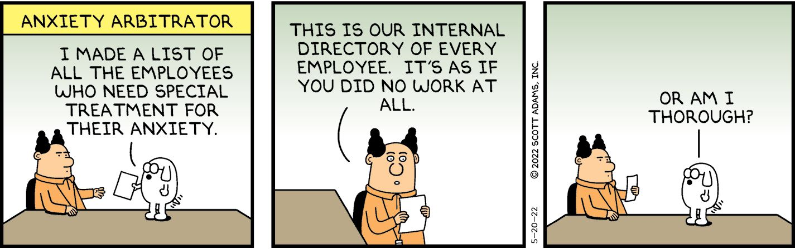
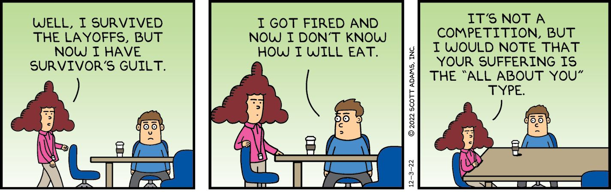
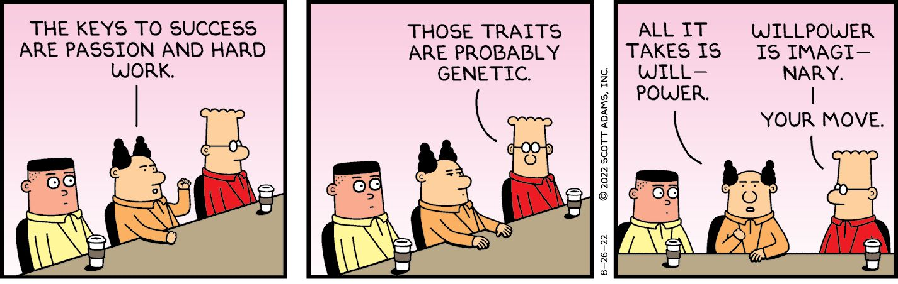
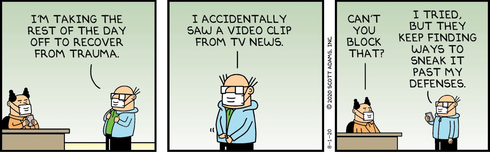

Chapter 3

Mental Health Reframes

As I often say, you don’t want to get medical or financial advice from cartoonists. With that in mind, and with uncharacteristic humility, I present reframes in the mental health domain that people tell me have worked for them, some that work for me, and some that have potential. It isn’t science. But it also isn’t dangerous. Let’s jump in.

Knowing Who You Are

I often hear people say they are trying to figure out “who they are,” whatever that means. If it helps, I can think of at least four potential ways to describe who you are.

Are you . . .

  1. Your inner thoughts?
  2. Your preferences?
  3. Your history?
  4. Your current actions?

I suspect most people think of themselves as being inseparable from their secret thoughts. If you privately harbor negative or positive feelings about something in the world, you think that’s who you are. And that’s unfortunate because your secret inner thoughts are probably mostly terrible. Why would you want to be terrible? You have options. This reframe reveals them.

Usual Frame: I am my inner thoughts.

Reframe: I am what I do.

Sometimes you hear people talk about finding themselves, staying true to themselves, and otherwise finding some magic core “self” that needs to be respected and protected. You don’t have a core self. You are what you make of this life, meaning the sum of your actions. Another way to reframe this way of thinking goes like this.

Usual Frame: Find yourself.

Reframe: Author yourself.

You are a blank canvas. You get to paint your life by changing your actions. If you want to become a kind person, do kind acts. If you want to be capable and successful, build a talent stack, and so on. If you see yourself as the ball that is batted around by life, that’s how things will play out. But if you take authorship and design systems for improving yourself in key areas, you can carve your name on reality in ways you probably never imagined possible. 

Judging People

You might think that privately judging people doesn’t hurt anyone. We humans judge reflexively; it’s simply something that happens in our heads. Maybe you even share your judginess with a friend. No big deal, right?

Well, there is a downside. The frame you use to judge others is likely to be the frame in which you come to see yourself, and worse, the way you imagine others see you. That can rot you from the inside. Ask any teenager. They live and die based on what they imagine others are thinking of them. 

The best way to talk yourself out of feeling judged by others is to stop judging others. Lose that frame. When you judge others on a subjective scale of goodness and badness, you are buying into your own destruction. The more you think of others as good and bad, the more you will suspect people are judging you because that will become your go-to frame. Once it becomes how you think of others, you will become obsessed with how they are judging you. It’s unavoidable. And toxic.

To be clear, others ARE judging you. You are not imagining it. What I am suggesting is that their judgment about you isn’t important (even to them) and won’t affect you if you never buy into their frame in the first place. 

You’re probably good at some things. The person judging you is probably good at some things, too. If you take it further, you are inviting unnecessary pain into your life.

Usual Frame: Some people are good, and some are not.

Reframe: We’re all flawed, and we’re all good at different things.

A healthy habit for staying out of the judging mindset involves gratitude. Appreciate the skills and qualities of the people you find the most annoying. There’s a person in my extended social world that I dislike and for good reason. But I must admit he’s excellent at his job. 

Every time you judge someone harshly, you buy into the idea that judging is a thing worth doing. It isn’t. Stop judging others so much and watch how much less you worry about being judged. 

The Danger of Art

People who view art as entertainment often make the tragic mistake of accidentally injecting themselves with sadness medicine. And by that, I mean they consume anxiety-inducing movies, books, and music about loss and tragedy to make themselves feel good. That makes perfect sense to anyone who sees art as entertainment. What do you do when you feel blue? One good idea is to find some entertainment. How about rewatching the movie Schindler’s List? That’s entertainment, isn’t it?

No, it isn’t. It’s more like a drug that gives you PTSD for the rest of your life. If the message of it keeps the world safer, I’m in favor of it. I just wish it had a proper warning label. I think Spielberg should have paid me to be a test animal for his mind-altering product. Here’s the reframe of this.

Usual Frame: Art is entertainment.

Reframe: Art is a powerful, mind-altering drug.

I recommend removing from your life all art that makes you sad or anxious, even if it redeems itself with some sort of happy ending. Find art that moves you without the bad parts. There is plenty of it. 

Handling Criticism

As a public figure who is reckless enough to use social media, I am viciously criticized many times a day. A few times per year, I wake to see my name trending on X. That is rarely a good thing. It usually means the trolls have already begun their assault on my timeline. And yet I generally have a good day. Do you think you could handle a daily hellscape of insults about your work, your character, your mind, and your appearance? After reading this chapter, it will be a lot easier. I’ll start with my favorite reframe for critics.

Usual Frame: Your critics are evil monsters.

Reframe: Your critics are your mascots.

Years ago, when I co-owned a local restaurant, one of the employees decided to do a one-person picket line in front of our entrance every day during peak meal periods. I forget what his complaint was, but no one else on the staff seemed to have a problem except for their complaints about the picketer, as they believed he was driving away their future tips. Tensions were high between the staff and my co-owner, Stacey. At first, I advised them to wait it out, assuming the disgruntled worker would get tired of it after a few days. But he was feisty. He leaned into it, day after day.

One day I stopped in and watched the show. It was comical because we didn’t regard his complaint as valid (whatever it was), and he was all alone putting on a show. So I decided to reframe him. I turned to Stacey and told her I liked her new mascot. She laughed. I laughed. She shared it with the servers and kitchen staff. They laughed. 

And just like that, our biggest critic became our mascot. We weren’t mocking him so much as reframing our experience. We could let him bother us. or we could let him be our mascot, which we all agreed was sort of hilarious. It was an easy choice. A few days later, he gave up.

I’ve had success reframing several of my most energetic critics and trolls as my mascots. I have no idea what impact that has on the critics or if they even know it happened. All I know is that the moment I mentally reframe a critic as a mascot, I feel better. Sometimes I even feel great. 

Reframing How Criticism Feels

A good way to take energy out of any criticism that is using your self-esteem as a speed bag is by imagining the situation in its most basic scientific form. Particles and chemistry. Physics. Things bumping into other things. Most of that interaction is happening outside your zone of giving-a-darn. The random electric signals in the brain of another person need not be your concern.

Usual Frame: Criticism feels like a dagger to your heart.

Reframe: Criticism is a chemical reaction in the skull of someone who isn’t in the room. 

Criticism stings. No one is immune. But reframing criticism as tiny changes in the wet and foldy brain of some walking-and-talking clump of carbon doesn’t feel so much like it is your problem.

The Go Eat Fudge Philosophy

This is the family-friendly version of a philosophy I heard as a young man. You can substitute naughtier words for “Go eat fudge,” and it will work just as well if not better. This reframe is NOT meant to be spoken aloud.

Notice how the reframe feels.

Usual Frame: You should do what I think you should do.

Reframe: Go eat fudge. (Spoken only in your mind.)

I learned this reframe in my freshman year of college, and it has served me well. Every time someone tried to control me with their opinion of what I should or should not be doing with my life, I dismissed them with one mental thought: Go eat fudge. (I might have substituted spicier words.)

This might be the best example of how reframes can be useful while also being nonsense. The three-word mental dismissal doesn’t seem as if it would be helpful, but I can report that it was. Not only for me, but for several of my college friends who tried it.

The essence of the reframe is that other people are not the authors of your experience. Sometimes you need to work with people you don’t like, and in that case, you will have to fake it as best you can. But for everyone else, they can go eat fudge. Not your problem.

Movie Reframe

Here’s a reframe I heard the other day. I tried it, and it worked right away.

Usual Frame: Everyone is thinking about me.

Reframe: You are only a bit player in their movie.

Outside of your immediate friends and loved ones, how much do you think about the imperfections of other people? Probably not much. You notice them sometimes, but they do not stick in your mind. It’s the same way they think of you—most of the time, they don’t care.

Our egos cause us to think everything we do is important. It isn’t. And that means your friends and loved ones will understand when you mess up. The rest of the world will never care one way or another.

The next time you feel like you’re being watched, or people are just waiting for you to make a mistake, remember how rarely people care about anyone but themselves. It’s weirdly comforting.

Social Media

When I was a young man, life would sometimes be stressful, but at least I could relax between the stressful situations and recharge. Today when I am between stressful situations, I take out my phone and browse social media—which makes me angrier and more anxious. Maybe later I turn on a movie and watch dozens of people getting slain for my entertainment. This is not relaxing.

I use social media because it is an essential element of my job. That might be the case for you, too. But for most people, social media is an addiction. They come for the dopamine hits, and if that has some long-term detrimental impact, it isn’t obvious enough or big enough to stop the addiction. The immediate concern is getting the next hit of dopamine. Addicts learn to think short term.

If I tell you something is a form of entertainment, you will have a natural attraction to it because we like to be entertained. But if I label that same situation as addiction, no one wants an addiction. And that helps you break the habit.

Usual Frame: Social media is a form of entertainment.

Reframe: Social media is an addiction.

You’re not entertained; you’re addicted. Once you accept that frame, you have a chance of breaking free. I should note that social media “addiction” is not equivalent to drug, alcohol, or cigarette addiction. Substance addictions will not budge with reframes because addiction is outside mental control. Breaking a bad habit is easier. Social media is more like a bad habit than an addiction, but reframing it as an addiction is the stronger play for reprogramming your brain. You don’t care so much about breaking a bad habit as breaking an addiction. Addiction just feels worse. Use that to your advantage.

Internet Insults

Every day on social media, trolls and critics attack me over my appearance, age, intelligence, personal life, character, and talent. I’ve become an accidental expert on how to reframe deep insults into my own entertainment, and I recently came upon a reframe that helps a lot. 

Usual Frame: An insult is damaging to my mental health.

Reframe: An insult is a confession that your accuser can’t refute your opinion and/or has personal problems of some sort.

This reframe won’t fit every situation, but people who enjoy good mental health are not spending much time insulting people on social media or anywhere else. Likewise, when people have a strong argument, they stick with facts. You only get triggered to insult someone when your argument has been dismantled and you feel the need to act out.

On X, I use the reframe this way:

Critic: “Of course you have that opinion, Dilweed, it’s because you are uninformed and stupid.”

Me: “I appreciate your confession.”

Then I excuse myself from the conversation without explaining what I mean by “confession.” Sometimes I mean my critic has lost the debate because they resorted to personal attacks. In that case, I claim victory and scamper away to happiness. Other times, the personal attacks are not associated with an argument. In those cases, I mean the “confession” to be about the person’s poor mental health. I’m no mental health expert, but insulting strangers is rarely a sign of good mental health. 

When a critic (a jerk) enters “fight mode” by hurling a personal insult at you on social media, they expect an insult in return or perhaps a blocked account. What they don’t expect is a puzzle. What the heck does it mean when someone says they appreciate a confession you never offered? It instantly changes the tone of the exchange and puts you in charge because you know what you mean, and your critic wants to know because it is about them.

Don’t tell them. Walk away. That’s how you win.

I’m also testing another reframe I borrowed from a Twitter follower that goes like this.

Usual Frame: An insult hurts because it means someone dislikes or disrespects you.

Reframe: A stranger’s opinion of you—even if it gets published in The New York Times—is little more than their personal diary entry.

No one cares what you write in your diary. That’s between you and yourself. If you choose to make your opinion public, that doesn’t suddenly make it matter. Think of all the dark thoughts you keep to yourself. Do they matter to anyone else? Nope. Saying a dark opinion in public doesn’t suddenly make it matter. It’s still just a diary entry in a different form—boring and unimportant.

For completeness, I must explain why you might see me engaging my critics more than my reframes suggest would be wise. I direct energy to a critic when they make a defamatory and untrue claim of fact that would live forever as truth on the Internet unless I deal with it. In those cases, I want any future sleuths to know the false claim is disputed and why. So I create an “interesting” body of semi-abusive content to draw attention away from the false claim and toward my often-funny debunking of it. 

For example, a prominent attorney on X accused me of being wrong on my pandemic commentary because I tend to “trust institutional data.” I saw a need to remind his followers that I’m the creator of the Dilbert comic and have been mocking institutional data for more than three decades. Sometimes I think no one on the planet distrusts institutional data more than I do. A recurring theme of my daily livestreams involves reminding people to distrust data from any source and why. The attorney’s post got a lot of attention and amplified existing misconceptions about me that were, in my opinion, an obstacle to my good intention of being a useful public voice. So I sprayed some insults in his direction on X along with some debunking to make sure as many people saw the correction as saw the initial claims. Fake news can get twenty times the attention of a correction, so I try to solve for that problem by creating more of a spectacle and sometimes being more of a jerk than observers feel is appropriate.

Don’t be like me! My situation is unlikely to be relevant to people who are not public figures. I only mention it because my actions will seem inconsistent if you don’t have that context.

Germaphobe Reframe

I was a bit of a germaphobe until I learned that exposure to germs, bacteria, and the ordinary “ickiness” of living makes your immune system stronger. The worst thing you could do is avoid all of that until one day something gets you. 

Now I think germs make me stronger. Because they do. But it isn’t the truth of the claim that makes the reframe work for me. The power comes from the programming that is embedded in the words. 

Usual Frame: Germs will harm me.

Reframe: Germs make me stronger.

This isn’t the sort of reframe that is likely to work instantly. It might have an immediate impact for a few readers—maybe you—because people are so different, but that would be unusual. For most, it will take time and repetition. Start by doing all the same cleaning and precautions you would always do, but over time you might find yourself getting a bit more flexible about the vigor you put into avoiding germs. You’re not in any rush. Just repeat the reframe whenever you feel yourself worrying about germs. Give this one a few months before you know for sure if it’s working or not. 

It might seem crazy that a person can reframe a bad feeling into a good one using nothing but the power of words. But it’s more common than you’d think. The next reframe is my best example of that.

Coldness

Recently, I watched a friend assembling a fire pit in near-freezing weather conditions during a party at his mom’s home. Everyone who saw him toiling away in the backyard asked if they could get a jacket for him. He waved them off, completely comfortable in his short sleeve shirt. I was wearing full Antarctica protective gear as I chatted with him to ask how he was able to handle the cold.

He told me he once had a psychedelic experience in which he realized the sensation of cold was nothing but a signal from his body to his brain, and unless there was a risk of frostbite, it was nothing to fear. Now he simply disconnects the signal whenever he wants, and the cold registers as a sensation, but it is not alarming or uncomfortable.

I didn’t believe him, of course. It sounded like a prank. 

Time passed, but I couldn’t stop thinking about his story. One day, a friend invited me to join him to try cryotherapy—the sub-zero chambers you stand in for a short time to summon a variety of alleged health benefits. I declined because I don’t handle the cold well. A few weeks later, another friend messaged me to say he started a cryotherapy business, and he invited me to try it. I declined because, well, you know.

I’m sold on the potential health benefits of cryotherapy. Everyone I know who has tried it raves about it. But as I said, it isn’t for me. I prefer cool temperatures to hot, but I can’t handle that kind of cold. 

Time passed, and one day I was taking my garbage receptacles to the curb, four of them in total, counting green waste and recycling. The entire task takes maybe five minutes, and I was debating getting a jacket versus toughing it out for five minutes in my t-shirt and jeans while temperatures were in the high forties. It wasn’t going to hurt me, but history suggests that after two minutes I would be shaking like a chihuahua in a gunfight.

Suddenly, a thought popped into my head that connected the stories in this chapter. If cryotherapy is good for your health, wouldn’t exposure to ordinary cold weather give you some portion of benefit? For my story, it doesn’t matter if that makes sense because you know a reframe is coming and reframes don’t care about facts or logic. 

As I opened the garage door for my five-minute suffering in the cold, I wondered what would happen if I reframed my sensation of cold as a signal of getting healthier and stronger instead of as a signal to flee. And so I did. I told myself the blast of cold air would be good for me, like a poor man’s cryotherapy. It would make me stronger. The colder, the better!

I walked outside. It was cold. I think. But I didn’t feel cold. I . . . felt . . . stronger.

What???

I would never suggest this reframe will work for you. It’s too weird even for me, and I’m literally a hypnotist. This is right in the middle of my strike zone, and still my mind was blown.

It was the last time I experienced feeling cold.

Okay, okay, some context. I live in Northern California, so my definition of “cold weather” won’t necessarily match yours. I know that because I grew up in upstate New York. You adjust to your environment.

I won’t suggest this reframe will work below 45 degrees Fahrenheit, or somewhere in that range. But if you have a normal life, you will find yourself in these too-cold-for-comfort situations all the time. Next time it happens to you, consider this reframe.

Usual Frame: Coldness is pain and a signal I am in danger.

Reframe: Coldness makes me healthier and stronger.

If this reframe works for you, it might change your life in an unexpected way. You always knew reality had a subjective component, but it is hard to grasp how deep that subjectivity goes. If you learn to turn coldness into a positive experience with one reframe, you will—perhaps for the first time—understand your power to author your entire life. 

Tragedy and Recovery

When someone close to you dies, it is normal to feel a great sense of loss. But once you think you have suffered enough, and you want to feel better, a few reframes will help.

The first reframe involves asking yourself if you are feeling bad about the deceased or yourself. It probably isn’t entirely clear in your mind. 

Usual Frame: Death is a tragedy, and I need to feel bad about it.

Reframe: The deceased has no more problems. How did I make this about me?

Easier said than done, of course. I don’t suggest this works as well when a child passes as it does when your grandfather finds his way to the beyond. It’s easier to get over the so-called natural kind of passing compared to anything unexpected. But the reframe helps in both cases.

Don’t fight with the logic of the reframes should you decide to try them. Let the words do what words do—influence you whether you like it or not. Every non-trivial word carries a little program with it. 

Here’s another reframe I have found useful, having experienced more than my fair share of family and pet deaths. The reframe involves accepting that which can’t change (death) while finding value in your final service to the deceased. Here’s how I play it.

Usual Frame: Death is a tragedy.

Reframe: It is an honor to help another pass.

The United States military uses this reframe. When a soldier dies, we are all trained to honor the passing in the most respectful way we can. There is a ceremony and a set of rules that serve to siphon off some of the pain and repackage it as service to the deceased. 

When you experience the death of a loved one, your instincts push you into feeling tragedy, loss, and pain. Once you have had enough of that, and when you are ready, start tossing these five words around in your mind to release some of the pain: Gratitude. Respect. Honor. Privilege. Service.

There might not be a greater honor than helping someone pass to their next state of being.

Death and Afterlife

Depending on your religion, you might find comfort in imagining your deceased friend or loved one enjoying the infinite comfort of eternal life in some other dimension. If that doesn’t fit your worldview, I have a reframe that might help. Unfortunately, I have had plenty of opportunities to test this one, and it helps me a lot.

Usual Frame (for some people): Death is the end of this person.

Reframe: Energy can change form, but it never disappears.

You are not the person who was born to your parents with your name and identity. Your body has changed over time, your personality has changed, and most of the cells in your body have died and been replaced. Yet there is still a coherent “you” that we all recognize. Additionally, you are a social being, meaning part of “you” includes your impact on others, especially family and close friends. One way to view the “you” that is smeared across time and has entirely new body parts is that you are a continuation of some original energy that was in part guided by your DNA. The chain of cause-and-effect that started with your parents and led to the creation of baby-you continues through life but also extends beyond it in a physical sense as well as conceptually. 

For example, my deceased mother, Virginia Adams, is the creator of not only three children but also some of the strongest material I have included in my books. She is deceased, yet she is permanent. The impact of her life continues to reverberate.

If you are generously thinking my mom got lucky by creating an author who could amplify her essence after she was gone, that’s true, but her impact on me is no more than my deceased step-son’s impact. I see him in every young man. And one of my greatest joys now is learning to play drums, which is an extension of his interest in playing. He’s always with me when I am drumming, if you know what I mean.

People don’t disappear when they die. They become part of the forever. Energy can change form, but it never disappears. If you do things right, your specific energy will have a pay-forward quality to it, and that is something you can feel good about today.

Who Controls Your Feelings

Most of us grow up believing our feelings are the product of whatever is happening to us. It sure seems that way. When you can control your schedule, where you go, and who you are with, you generally feel happy. When you have no control over those environmental variables, you are less likely to feel happy. Therefore, logically, your environment and your situation are controlling how you feel. By that view, you are nothing but a victim of a random and often cruel universe. That’s no way to go through life. I recommend flipping that worldview using this admittedly weird reframe.

Usual Frame: My feelings are the result of my situation.

Reframe: How I feel is my choice.

The first time I heard this reframe, it hit me as both ridiculous and powerful. I’ve since used it often to clear my mind of junk feelings. I simply told myself I could choose not to be bothered . . . and it worked. Or at least it took off the edge. 

I would love to tell you the logical reason this reframe works, but I don’t think there is one. Maybe it works because the sensation of taking control is generally good for most people. Maybe it works because it gives you permission to feel good. Perhaps it works by triggering you into cognitive dissonance. Or maybe it just yanks you out of a mental prison you put yourself in and returns you to the present. I don’t know. All I know is that it has given me comfort. Maybe it can work for you, too.

Don’t be surprised if a reframe works one day and then never again, or that a reframe that didn’t work for you before starts feeling profound. Try several reframes on the same topic and see what works that day. Reframes are quick and cheap, and you know immediately if they will have an impact; you can feel it. If you don’t feel it, try another. 

Hate and Anger

I recently saw a wise man on Instagram explain that hate makes no sense because you are punishing yourself for the misdeeds of someone else.

Whoa! Profound. 

Or is it? It sounds so clever when you first hear it that you think the universe tapped you on the shoulder and whispered in your ear a truth that only you are ready to receive. And you can almost feel it work! The moment you realize you can imagine hate as the absurd act of punishing yourself for the misbehavior of someone else, you can easily release the hate.

That’s some powerful wisdom, right?

Not exactly. It’s more like a terrific reframe. And by that, I mean it isn’t logical, but it still works like a charm because it feels true. It isn’t literally true that feeling hate means you are punishing yourself for the misdeeds of another because there is no intention on your part to do that. It just ends up in the same place but for a different reason. That’s what makes the “magic trick” of the reframe seem true. And that’s good enough to get the benefits out of it.

Usual Frame: I hate someone who deserves it.

Reframe: Hate is nothing but punishing myself for the misdeeds of others.

I realize I have accidentally made you think past the sale about hate and anger. I didn’t mean to imply you need to lose either of those things. Personally, I have found both to be empowering at different times. If a bully confronts you, some hate and anger might be exactly the fuel you need to balance out the situation. 

On most days, I’m 5’8” and 157 pounds of wise-cracking sex appeal. If a bully encountered me, he’d be tempted to give me the wedgie I appear to deserve. However, if that bully triggered me into a different state of mind—let’s say intense anger—I have an angry facial expression that can clear a city block. I have no idea how physically dangerous I am because no one has ever stuck around to find out. 

My point is that both hate and anger can be superpowers if you learn how to harness their energy. I don’t recommend inviting hate and anger into your life, but in the normal course of being interesting and awesome, you are likely to attract some of it. I’m suggesting you don’t always want to reframe it away. Sometimes you want to use it. You can use that anger to end a relationship that needs ending, to stand up to someone who frightened you before, to embrace a deep challenge, or to accomplish anything else that requires your maximum effort. I like to convert my negative energy into muscles. I can run farther and lift heavier in an angry mood than a good one. And once that energy is turned into muscle, I can go home relaxed.

Usual Frame: Hate and anger are toxic feelings you hope will wear off.

Reframe: Hate and anger are a superpower level of energy you can use for gain.

Enduring Bad Things

If you have a problem you know how to fix, go ahead and do that. But life is full of suboptimal situations you can’t exactly “fix” for one reason or another. Or at least not quickly. You can make yourself crazy wishing things were different or replaying events in your mind as if they will change next time. That’s living half in the real world and half in a dark fantasy world of what-ifs, regret, and self-flagellation. Here’s a reframe that wants to help, but it’s so crazy it couldn’t possibly work.

Could it?

Usual Frame: Why can’t my problems go away?

Reframe: Everything has a right to exist, including this problem.

I first saw this reframe on Instagram from the Adyashanti (Official) account. The bio says Adyashanti is a spiritual teacher. My first impression was that it sounded like new-age nonsense. My second impression was that it instantly made me feel more at peace. That’s a strong reframe. But remember, we are all a bit different, so the reframes that work best for you or me will not necessarily be as powerful for anyone else. This one blew my socks off. I could feel its power when I repeated it in my mind. 

I think this reframe works because it pulls you out of the imaginary world of what-if and gives you a “fake because” to accept your problems. They have a right to exist. It’s a “fake because” in the sense that it sounds like a reason but isn’t. It’s complete nonsense. But it works for me.

Next time you have a problem that isn’t going away soon, just remind yourself that the problem has as much right to exist as you do. 

And don’t worry that it doesn’t make sense. Instead, ask yourself how it feels when you do it. You might be surprised by this one.

Anxiety

One of the greatest keys to happiness and good health involves managing stress and anxiety. It won’t matter to your happiness how many skills you acquire over the course of your life if you don’t also learn to control how you feel. Feeling stressed and anxious is a terrible experience. The good news is there are several reframes that can help you, and quickly. I use all of these reframes, to good effect, in my own life.

Your Ego

In the Success Reframes chapter, I told you that conquering embarrassment is like a superpower for success. It also has a direct benefit to your mental health. 

Let me tell you about an embarrassing experience that was so awful I still cringe and perspire when I think about it.

Just kidding. I have no such experiences. I do recall feeling embarrassed at various times in my youth, but from today’s perspective, all those stories are humorous. The horrible “embarrassments” of adolescence either faded into dust or transformed into my funniest stories. None lasted.

Eventually, the pattern was too obvious to ignore—embarrassments don’t last. And that makes it easy for me to ignore the next potential embarrassment. Worst case, it lasts a little while. Then I get distracted and think of something else. 

I can’t remember the last time I experienced embarrassment. But I wasn’t born this way. It is learned behavior, and it took work. This reframe, which I often repeat in my mind, helped me a lot. 

Usual Frame: Your ego is “you,” and it must be protected.

Reframe: Your ego is your enemy. 

The reframe tells you what to do: Kill your ego. And to do that, you need to beat it to death with actual and potential embarrassments that have one important quality: They don’t have a huge downside. Don’t be reckless about it. Be strategic. Refer back to the Success Reframes chapter for a refresher on becoming immune to embarrassment.

My career puts me in lots of public situations—interviews, speeches, posts, podcasts, and more. All of these have the potential for massive embarrassment—the kind that follows you forever. I suppose I’ve blundered into a healthy number of those forever-shames over my career. I seem to rack up a new one every few months. Sometimes they come out of nowhere in the form of hit pieces from political partisans and culture terrorists in the media. When I see them, I repost them. They’re attacking my ego, and I banished that useless ghost from my life years ago. None of the hate feels as if it is about me. It’s just noise. 

The ego reframe works best when you reinforce it with real-life experiences that keep your ego in check. I found the following strategies useful.

Develop a Skill

Get good at something. Anything. Even one skill is a safe space for your mind in case you drift into the “I’m worthless” lane that haunts so many. If you know you can become good at one thing—generally because you practiced it a lot—then you know the differences in skills across humankind have a lot to do with who practiced what. And who-practiced-what has nothing to do with your worth. 

Take Some Chances

I talked about conquering embarrassment in the Success Reframes chapter because immunity to shaming is one of the most useful business and professional skills you can acquire. If you are lucky enough to succeed at anything meaningful, bad people will appear from nowhere and shame you for the way you did it. That’s guaranteed. People who are immune to embarrassment have more options in life, and those options are often the high payoff kind. But hardening yourself against shame and embarrassment also has an immediate benefit in maintaining your mental health. No one feels good when they also feel shame. That’s why it makes sense to reframe it out of your life. 

As I mentioned earlier, a reliable way to become immune to embarrassment is to intentionally put yourself in embarrassing situations. For example, volunteer to give a speech, sing karaoke in front of coworkers, experiment with your fashion and hairstyle, chat up an attractive stranger—that sort of thing. Don’t try to avoid embarrassment. Invite it. You’ll get some good stories out of it, and each mini-shame toughens you up for the next one. So take some social risks. Flame out in front of witnesses. Repeat. You’ll be amazed how quickly you can murder your ego by ignoring its screaming needs. 

Usual Frame: Avoid embarrassment.

Reframe: Invite embarrassment and use it as a club to kill your ego.

If someone asked you to deliver a priceless work of art across the street, you might balk at the suggestion. If you were to slip, trip, get robbed or assaulted, that priceless art might get damaged. How comfortable would you be carrying it? It makes sense to be on high alert to focus on protecting the valuable art. That pressure creates a feeling of anxiety.

Now suppose I asked you to deliver an ordinary potato across the street. If you drop it or damage it, no big deal. It was only a potato.

Think of yourself as the potato and not the priceless art. Only your ego makes you think you are worth protecting. And being worth protecting is what makes you anxious. If you can abandon the notion that every speck of harm that comes your way must be avoided at all costs, you can better relax.

Usual Frame: I am a priceless work of art that must be protected.

Reframe: I am a potato that is easily replaced.

Be the potato.

Worry Versus Curiosity

For many of us, worrying feels like a full-time job that sacrifices quality of life now, no matter what happens later. And often there’s not much you can do about how things turn out, assuming you have done all the obvious things one should do in each situation. For example, you intend to study for a test in a subject at which you normally excel. There’s no obvious reason anything would go wrong, but we humans can get twisted up thinking about small risks that loop in our minds for no good reason. A reframe might be just the thing you need to break that loop. 

This reframe is one I have used with great success. Like many of the reframes in the book, it looks too easy to be true. I don’t mean to make any of this sound like magic—because any one person’s success with a reframe is hard to predict—but in the unlikely event your brain is wired like mine in this specific respect, you might be surprised how well this reframe works.

Usual Frame: I worry something will go wrong.

Reframe: I’m curious what will happen.

If you succeed in switching your thoughts from your past to your imaginary future, you run the risk of generating anxiety about how things might turn out in your future. I advise you to only imagine positive outcomes, but being human, you will have some worries about the future as well. Instead of focusing on what could go wrong, accept that you live in a world where things usually go wrong—at least a little bit—and instead try to treat the future as a curiosity. What will happen if I do this versus that? You can quickly gamify (turn into fun) the ambiguity of the future. Just keep telling yourself it will be interesting, and you can’t wait to find out what will happen.

Can you really gamify something just by wanting to? Yes. It’s a thing. For example, with the advent of streaming TV apps, I found myself angry and frustrated every time I wanted to watch something. The chosen app would need an update, or it wouldn’t work on the device I wanted to use, or it would say I am already logged in, or my password wouldn’t work. After a few years of that nightmare, I reframed watching TV as “hacking into my own account.” I’m no longer a frustrated consumer with several streaming apps that have poor user experiences. Now I’m a skilled hacker who will use every resource at his disposal to break through the user interface of the sign-in process. My dopamine hit comes from successfully opening an app and using it. I generally find nothing worth watching and call it a night. But at least I got my hacker hit of dopamine. 

Aren’t you curious if the curiosity reframe will work for you?

What You Can Control

Humans are built for worry. If we didn’t worry about the future, we wouldn’t work so hard today to make it better. You can’t turn off your natural impulse to fret about the future. But you can reframe it to give yourself credit for “doing everything you can do.” That’s comforting. Having worries is bad enough, but if you compound the worries by worrying you are not doing enough to make yourself safer, your subjective experience will be doubly bad. You might find comfort in reframing your situation from double-bad to single-bad. And by that I mean removing the concern that you are not “doing enough.” Here’s the reframe.

Usual Frame: Worry about all potential bad outcomes.

Reframe: Control the heck out of things you can control. Accept all outcomes.

I won’t be able to persuade you how much better you will feel if you “do everything you can do” to solve a problem. You must experience it. Look for situations in your life in which you can reasonably “do everything you can do” to improve the situation. Notice how much better you feel no matter if things go wrong or right from that point on.

The cleanest example of “doing all you can do” involves your physical fitness. Let’s say you are worried about your ability to attract a mate, get a job, or be healthy in general. If you get serious about your fitness and do everything you can reasonably do to make it better, you’ll feel a lot better even as you hit rough patches in your life. Fitness is a gift that keeps giving. It touches all aspects of your life. And it is highly controllable. So control the heck out of it and see how much better you feel. Same argument with diet. Eating right and exercising are not easy. But they are 100 percent available to all interested takers. Get control of your diet and exercise and watch how the benefits start solving your other problems. 

History Is Imaginary

Are you plagued by events from your past? Most of us are, to some degree. The ugly memories that lurk in the dark corners of our minds tend to emerge on their own schedule and inject anxiety into our lives. If that describes you, I can help.

History does not exist in any material way. You can’t grab a handful of history. You can’t eat it, punch it, kick it, or photograph it. If your past is causing you anxiety, put the past in its place. It doesn’t exist. It never will. It can’t touch you. 

Usual Frame: History is important.

Reframe: History doesn’t exist. 

I use this reframe often, and it works instantly for me. It doesn’t last, but it can take you out of your negative loop right away. After all, how can I be anxious about something that doesn’t exist?

The Virtual Reality Reframe

Try this one right now. Observe the objects in your immediate vicinity and imagine them being some sort of computer-generated creation—like a video game or an animated movie—that looks exactly like what you assume is reality. The point of this reframe is to bring you into the present. And that’s all you need. You are only trying to break the mental loop you’re in. Any distraction will do, but this one you can do anywhere and anytime.

Usual Frame: Reality is exactly what you see and feel.

Reframe: Imagine the objects around you as virtual objects.

It takes a fair amount of mental processing to reimagine your environment as computer generated, and that’s another reason it works. You want your brain distracted with a challenge—otherwise it will drift back to its default loop of negativity.

If you are not a visual person, you might discover some other type of distraction works best to pull you out of a negative headspace. Experiment. Pick a distraction that interests you and engages your brain and see for yourself if it reliably puts you in a different frame of mind. I recently learned how to play drums (poorly), and I discovered it is completely absorbing. My brain must coordinate four limbs working independently plus a brain that is keeping a beat and anticipating the next fill (a drummer word for the interesting flourishes). There is no brain power left to think about any problems. So I don’t. And when I’m done drumming, I almost always feel great.

Find the activity that takes over your entire mind. That’s your escape hatch.

The Death Bed Reframe

This one goes like this.

Usual Frame: My stress and anxiety are caused by events in my life.

Reframe: I won’t care about any of those events on my deathbed.

If you know something is too small to be remembered in your final days of sentient existence, what are the odds your problem is important today? We evolved to care most about what is happening to us here and now. But that frame can make your problems feel worse because “right now” does not include a future time in which those problems are (usually) resolved or at least diminished.

When you use the deathbed reframe, you see your life as bigger than your current problems. That can make the importance of today’s problem shrink, at least in terms of how you process it in your mind.

Whenever my young stepson got a scrape or cut, I discovered his attitude would immediately improve if I told him how long the pain would last. I’d look at his cut or scrape with a knowing expression and confidently tell him, “This one is a four-minute situation.” It always helped. 

I don’t think adults are much different from kids when it comes to how we process pain. The degree of pain matters, but you also care how long it lasts. If you don’t know how long it will last, that’s an extra mental burden on top of the pain. If you know the pain will be done in a minute, you can ride it out with far less mental friction.

Usual Frame: I am in pain.

Reframe: I am in pain for a minute.

When you shift your mind from your immediate pain or problems to some imagined future in which the pain is gone or forgotten—no matter how near or far in the future—you weaken the power of your current discomfort. Try it. You’ll be surprised how well it works.

The View from Space

This reframe makes no logical sense but works for me anyway.

Usual Frame: You are the center of your universe and the highest priority.

Reframe: Viewed from space, everything looks small, including your problems

How could imagining yourself looking at Earth from space improve your attitude? Because any kind of perspective shift can interfere with your looping and cascading negative thoughts. It’s like taking a walk in the woods or going on vacation to help you forget your troubles and reduce your stress. When the vision-handling parts of the brain are involved, it’s hard to hold any other thought at the same time. Looking at the scenery outside or imagining Earth as viewed from space both call on parts of the brain that can absorb all your attention at least temporarily, and that can be enough to take the edge off your worries.

Mental Shelf Space

This next reframe is an all-star in my book. (Literally, in this book.) And by that, I mean it has the most potential for immediately improving your life. It goes like this.

Usual Frame: You need to stop thinking negative thoughts.

Reframe: You can’t subtract negative thoughts. But you can crowd them out.

I call this the mental shelf-space strategy. If something bad is happening in your life, it makes perfect sense that you think about it a lot. But there comes a time when obsessing over a negative thought becomes so corrosive you need a mental vacation. You need to get rid of the negative thoughts looping in your head. 

Unfortunately, you can’t subtract thoughts. Brains don’t work that way. You can, however, stay so busy that you don’t have time to ruminate on all the bad news. Over time, the memory of the bad thing will fade. You might need to create some new experiences that thrill you so much you can’t think of much else. But hey, wouldn’t that be fun anyway?

Our brains evolved to solve our problems. If you have problems, your brain will pounce and—for many of us—never release. That’s what you want if your problem is one that can be solved—you want your brain to automatically attack the problem and find a solution. But reality is too messy for that. Many of our most vexing problems exist entirely in our minds, like this one:

I worry that my friends stopped liking me because of that thing I said.

For that kind of problem—the usually-irrational worries—your best bet is to bury it with new thoughts and experiences. Fill your shelf-space. Make yourself busy. It works.

For example, as I mentioned, I have discovered that learning a musical instrument takes up so much brain power, I crowd out any competing thoughts while I practice. Compare that to walking or running, which invites stray thoughts. Pick hobbies, tasks, and social interactions that demand your full attention. If you’re only using your legs such as taking a walk, that probably isn’t good enough. You must get your mind involved.

When I go to bed, I direct my thoughts toward wonderful things that happened to me recently as well as to incredible things I fantasize about happening later. You can’t prevent bad thoughts from trying to sneak in, but you can crowd them out with stronger, more addictive thoughts. 

The shelf-space concept differs from the mental exercises I described earlier such as imagining yourself from space, imagining your deathbed, or imagining a virtual world. Those hacks also crowd out negative thoughts, but they are entirely mental exercises. The mental shelf-space idea is more about real world actions of all kinds that keep you too busy to think about your worries.

Philosophy Reframes

When you remind people that life is short, they automatically become more flexible because no one wants to squander the precious gift of time on whatever nonsense is making us angry now. The reframe works as well when you remind yourself you won’t be here forever.

I don’t recommend using this reframe to talk yourself into doing something dangerous. Use it to get moving on something you want to do but worry is holding you back.

Usual Frame: I’m afraid to do the thing I know I should do.

Reframe: Life is short.

The life-is-short reframe can help you get off the couch and make some decisions you keep putting off due to one worry or another. I include this reframe in the Mental Health chapter instead of the Success chapter because the greatest benefit is how it makes you feel. When you frame your life as a limited opportunity, your mind automatically puts more value on each minute of it, and the value of variety, adventure, and curiosity seems greater—much like how you approach a vacation. Your vacation days are limited, so you have an instinct to maximize that experience. Once you reframe your life as a limited engagement, you automatically start operating with more boldness to get as much as you can out of it before you go. That’s great for your mental health.

Obsessive-Compulsive Disorder (OCD)

Obsessive-Compulsive Disorder involves thoughts and behaviors you don’t want to experience but can’t figure out how to stop. In some cases, that might involve needing to check ten times if an iron has been unplugged before leaving the house, or thoughts that disaster will happen if you make the wrong move in your daily life such as wearing the wrong shoes. These are basic examples. The variety is unlimited. What they all have in common is they are irrational thoughts and actions that the afflicted can’t seem to stop.

I recently ran an unscientific experiment with my Locals community. I asked any of them who had OCD or knew someone who does to try the reframe I will present to you in this chapter. To my delight, several reported successes. I doubt it will work for everyone, but that’s true of reframes in general.

I explained to my Locals subscribers that hypnotists and psychologists know people can be persuaded—and thus their brains rewired—by anything that feels like a reason no matter how nonsensical it is. As a hypnotist, I know how powerful nonsense “reasons” can be. In this book, I call any nonsense reason a “fake because.” They work best when the subject wants the life change suggested by the fake reason.

For example, if I know there will be a social “fight” over who picks up a dinner check and I want to prevail, I prepare a “fake because” in my mind before the check arrives. When my check-grabbing opponent reaches for the check the same time I do, I slip in the kill shot: “You drove all the way to my town for lunch, so I’ve got this.”

Is that a good reason? No. It only sounds like one. There might be several other variables just as important. Watch how many fake reasons I can generate. These so-called reasons work best if you can touch the check first.

“I got this, for your birthday, in case I don’t see you.”

“Next one is on you.” (An indirect way to say you want to see the person again.)

“We’re celebrating your new job.” (Even if the new job was two months ago.)

You get the point. There’s always some angle you can use to generate a weak or even nonsense reason. I’ve been doing this trick for years, and it works about 90 percent of the time. And it works because the other person wants a solution to the social awkwardness as much as I do. Any reason will do, including a nonsense reason. In those few cases in which someone fought through my fake because and insisted on paying, they had a strong reason. That’s just another way for both of you to win, and you still get credit for trying to pay.

Now consider OCD. No one wants OCD, so this suggests to a hypnotist that a fake because might work for some people in some situations—not necessarily instantly, but perhaps over time, with repetition. 

If you have OCD and want to test the method I’m describing, simply invent a fake reason for why you can discontinue your unwanted thoughts and activities, then repeat that fake reason to yourself every time you need it. 

Usual Frame: I must do this pattern of behavior or else something bad will happen.

Reframe: I no longer need to do the behavior because less is more.

“Less is more” is a nonsense reason in this context. But it sounds like a reason and feels like a reason probably because most of us have heard that phrase in situations where it made sense. In business meetings, my experience is that those three words—less is more—make everyone in the room nod in silent agreement because it sounds like something Buddha would say. “Less is more” is a powerful bit of programming code that makes everything it touches seem persuasive. Use that to your advantage.

You can substitute any other nonsense reason that sounds more persuasive to you than “less is more.” But it will be hard to beat because it is what I call bumper sticker wisdom—meaning it sounds like something that should be true, and maybe you once heard a smart person say it . . . or a person who sounded smart. 

In case you haven’t noticed, I am not a doctor. If you have any concerns about this reframe, talk to a professional and get a second opinion. But I don’t think you have anything to lose by trying some nonsense reasons and tracking how it works. Good luck!

Social Event Anxiety

For the purposes of this book, social event anxiety refers to entering a room full of people you don’t know or don’t know well and feeling uncomfortable. I’ll give you some reframes that will remove much or all of your social anxiety.

The first reframe is the most important.

Usual Frame: Confidence is something you’re born with.

Reframe: Confidence is something you learn.

By the time you finish this book, you will have learned a variety of tricks for acting confident. But that isn’t the only way to develop confidence. Many people report building confidence through learning martial arts or excelling at a sport or hobby. Warren Buffett famously attended a Dale Carnegie class when he was young, as did I. Both of us can confirm it teaches you to be confident in front of an audience or during social chit-chat. You can also improve confidence through physical fitness, better sleep, and even breathing exercises. There are many ways to go about building confidence, and you probably have a mental list of your own. All I’m adding is the reminder that you can easily manage your confidence if you try. It’s a gift that is available to all.

When you enter a social situation, you probably ask yourself two questions:

  1. How should I act?
  2. How are people judging me?

If you knew exactly what to do in each social situation, imagine how much easier everything would be. You’ve probably experienced working or volunteering at some sort of business or event in which you interacted with the public in a well-defined way. If you knew how to do your job, you probably didn’t have much social anxiety. You knew what to do, and you did it. I’ll teach you how to approach any social situation with the same confidence in the “rules” as you might have on the job.

The second question is about people judging you. The good news is that if you learn the rules of social engagement (which will happen in the next few minutes), people will be impressed by your poise and judge you kindly. If you get the what-to-do part down, you won’t need to worry about being judged. You’ll be the star of the gathering. A quiet star, perhaps. But people will notice.

The first reframe for this topic involves imagining you are going to an event in which all the other participants have been selected for their poor social skills. You are the lone exception. You have strong social skills and everyone else knows it. In this imaginary scenario, would you have much social anxiety? Probably not as much as normal because you would feel more capable than the other participants in the skill that matters most at that moment.

The simple techniques I will teach you in this chapter are almost guaranteed to put you in the top 10 percent of socially skilled people. And that means you won’t have to use any imagination to know you are more capable at working a room than nearly anyone else. 

Usual Frame: People have better social skills than I do.

Reframe: I am in the top 10 percent of people with good social skills (after reading this chapter).

Another useful reframe involves how you see the other people at the gathering. Are they sources of potential embarrassment? That’s an unproductive way to think of it. I recommend reframing the participants as each having a problem you are uniquely qualified to solve. Their problem is that they feel socially awkward. 

Most people are uncomfortable meeting strangers. If you have social anxiety, you’re closer to the norm than the exception. With a little practice, you can learn to see a room full of strangers as a bunch of problems you can solve just by engaging with them. Their social anxiety will go away as soon as they are talking to a nice person who shows interest.

Usual Frame: Each person at the gathering is a source of potential embarrassment for me.

Reframe: Each person has a problem (social awkwardness) that I can solve right now.

How to Pick the Right Target for Conversation

If you enter a room and the people already there are mostly paired off or in small groups to converse, you have the extra pressure of trying to break into an ongoing conversation. Here are some tips:

  1. Men who are having a high-energy conversation often won’t open their body language and let you in when you sidle up to them with the clear intent of becoming part of the action. Men who act that way have poor social skills or are asserting rank. If you try to enter a male conversation and get frozen out, pull out your phone, pretend you just got a message, and walk away to handle it. Find an easier target.
  2. Women are more likely to open their conversation circle if you make your intentions clear. If you see an alpha woman doing most of the talking in a small group of women, that’s ideal. A strong woman will invite you in and initiate introductions. 
  3. Look for the strongest social players and approach them first, male or female. You can usually spot them. They are moving effortlessly across small groups and dominating conversations. Strong personalities like meeting new people and enjoy connecting people with others. If you see one of the strong players leave a small group and head for the bar for a refill, consider intercepting. When meeting a strong social player—someone with the skills you are acquiring right now—the awkwardness disappears. Strong players know the rules. You’re a strong player now. If you want to make sure the other person knows you have skills, introduce yourself. That alone would flag you as a strong player in social situations.
  4. Look for the awkward loners in the same predicament as you. They would LOVE someone to come up and say hi. The degree of difficulty there is near zero. 

How to Introduce Yourself

This is all you must do:

  1. Make eye contact and smile.
  2. Extend a hand to shake.
  3. Say, “Hi, I’m Scott.” (Use your name, not mine.)

Most people will tell you their names as they shake hands. The most socially awkward people will not. If needed, follow up with, “What’s your name?” Speak their name out loud at least once to help you remember. Use it in a sentence if you can, and right away. People love to hear their own names. It’s an easy and instant bonding technique. Be a name-user. This one tip puts you in the top half of talented social talkers. Make it your superpower to remember names. All it takes is focus and effort. Now that you know how important it is to remember and use a person’s name, maybe that will increase your attention to every name you hear in the future.

How to Be Interesting

Are you worried you’re not that interesting? You might be right. Most people are not great conversationalists. It’s a rare skill. But that’s no problem because the worst thing you could do when meeting a stranger is talk about yourself for too long while attempting to be interesting. Instead, you want to ask questions and show interest. You might need to fake your interest for a few questions until you find a topic you both like. Start your question stack roughly in this order:

  1. What brings you here? (Or, What is your role today?—Use words to that effect.)
  2. Where do you live?
  3. Do you have kids?
  4. What do you do for a living?

The reason these questions come first is that the answers are easy. No thinking or cleverness is required. And your follow-up questions will be obvious. For example, if someone has kids, you ask the ages or where they go to school.

If those questions strike you as too personal for someone you just met, that’s an illusion. People love answering easy questions about themselves in awkward social situations because they know exactly how. That’s how you solve their problem. If you ask me where I live, I know exactly how to answer, and I’m darned glad I’m not standing alone pretending to look at text messages on my phone.

When you introduce yourself and ask questions of a stranger, you are solving the stranger’s biggest current problem: What do I do right now? You can accurately assume most people at social gatherings are struggling to appear socially capable. You can make their part easy. And if you do, they will want to talk to you all night.

Usual Frame: No one wants to talk to me. I’m boring.

Reframe: Everyone enjoys talking to people who show interest in them.

You’re only a few minutes into this chapter, and already your social skills are in the top 10 percent of any human gathering. Literally. No kidding. And you are about to get even better.

Being a Huge Fake, But in a Good Way

As much as we like to think of ourselves as “keeping it real,” we also know we change our personalities based on who we’re with. You wouldn’t talk to a toddler the way you talk to a cop, for example. You wouldn’t even talk to your boss the way you talk to your coworkers. And you probably don’t talk to anyone else the way you talk to your lover or spouse. 

The people with the worst social skills can’t get past the illusion that “being yourself” and “keeping it real” are good strategies. Instead, I say go with what works. And what works best is modifying your communication style to optimize it for each situation. 

Usual Frame: Be yourself and keep it real.

Reframe: Adjust your communication style for the situation.

Once you accept the fact that we are all “acting” to some degree when we communicate, you can go all-in and turn it into a technique. I learned this trick from a college peer who was taking acting classes. When he talked to older adults in the college administration, he literally acted like he was one of them. The act was so transparent to his peers that it was hilarious. But how did the college administrators receive it? They loved this polite fellow who made eye contact and generally acted like a capable young man. It didn’t look comically exaggerated to them at all. His act only looked hilarious to his friends. The “trick” he used—literally acting—was perfectly acceptable to his target audience of older adults. My guess is that the adults knew he was “acting,” but since they were acting too, it probably seemed normal. I was the one who was uncomfortable when he went into his act because I was only beginning to understand “the show” that adults put on for each other. Don’t deny the show. If you can, call on your acting skills and create an interesting version of yourself that isn’t a lie. 

How to End a Conversation

If you go to an event to network or to meet new people, you don’t want to get bogged down talking to one person all night. You need some tricks for ending a conversation gracefully. Here are three classics that work every time:

  1. My drink evaporated. Can I get you anything at the bar?
  2. Excuse me, I need to use the men’s (or women’s) room.
  3. I need to do some more mingling. It was great meeting you (or catching up with you).

Physicality

As you know, humans are deeply influenced by appearance. One way to reduce your social anxiety is to work on your diet and fitness until you feel confident in any public setting. If you know you look good, you’ll feel less awkward.

I’m a short, bald man with corrective lenses. If that’s all I am, I’m not feeling too comfortable breaking into conversations with strangers. But I’m also a lifelong gym rat, so I’m generally more fit than the public at large, no pun intended. That helps me feel confident in social situations. 

Diet and exercise are the most important levers in your life. I don’t know what science says on this topic, but if you get food and fitness under control, I think your improved health and vitality would translate into more confidence in social situations. We act better when we feel better.

Have Stories

Your social interactions should center around asking questions and listening, but inevitably you will want to tell some stories as well to keep up your end of the conversation. I recommend framing your experiences—as you have them—in terms of stories you will later tell. 

In other words, if something interesting is happening to you, imagine how you would tell the story. Then keep that story at the ready if you need it. It could be your answer to “How was your day?” Here are some useful story-making tips:

A good story is simple to understand, creates curiosity in the listener, and has an interesting payoff or punchline at the end. 

Never exceed three names in a story. If Bob is the subject of your story, and he was with four friends, don’t name them unless that is somehow relevant. Names clog stories. Reduce them to the minimum.

Do the entire story setup in one sentence, e.g. “I was at the recycling center yesterday when this big bus pulled in . . .” Avoid the long windup, as in, “I noticed my recycling container was filling up faster than usual because we started buying bottled water.” That part is irrelevant to the story.

Practice saying the punchline, the big reveal, or the shocking ending in one clean sentence. The body of your story can be variable each time you tell it, but make sure your “payoff line” is tight and simple. 

Practice! Storytelling is a skill. The more you do it, the better you will be at putting your body language and acting skills into it. People will react to your emotional state as much as the details of the story. If you are enjoying telling the story, the listener picks up that joy. And you will enjoy your storytelling most if you are comfortable doing it. So practice.

Avoiding Stress

I distinguish stress from anxiety because stress usually has obvious causes whereas anxiety can be a general feeling that is immune to what is happening that day. 

Sometimes our stress comes from worrying we will make poor decisions. But there is at least one class of problems that don’t require you to know which path is best: things you can easily test.

If the decision is important, and you have a way to test it small before committing to a larger decision, you have everything you need. You don’t need anyone’s opinion on whether it is a good idea. Test and find out.

It can be stressful to think you might make a wrong decision. But it isn’t stressful to know you can test your ideas before committing. 

Usual Frame: Is this a good decision?

Reframe: Can we test it small?

If you have corporate and business experience, you are probably wondering who needs to be told that testing before committing is a good idea. It’s obviously the smart way to go when you can. But people who do not have that work experience won’t reflexively ask if a thing can be tested small. Remember the test-it reframe and try to turn it into a mental habit.

No One Cares

It can be stressful knowing others will judge you no matter what you do. I get judged a lot in my line of work, so I have loads of experience reframing it out of relevance. I’ll show you how.

Start by realizing there are primarily two kinds of people in the world: 

  1. Bad people who don’t care about you at all, 

and . . .

  1. Good people who won’t judge you for being human.

There are some weirdos in the middle, but we can ignore the exceptions. For example, your ex-spouse or romantic partner might care what you do and judge you for it. But you already solved that problem by breaking up. 

Most of the world either doesn’t care about you at all, or they like you and don’t judge. The latter group might even make you feel better if you screw up. The point is that worrying about what others think of your performance is living in an imaginary world in which people both care about you and judge you. That is far from reality, and this reframe helps you find that truth.

Usual Frame: People judge me, so I feel bad when I mess up.

Reframe: People only care about themselves. They don’t care what dumb thing I did recently, even if they mention it.

A lot of the so-called advice I give people depends on being immune to failure and the opinions of others. It’s a useful skill. Years ago, I had laser treatments on my face to remove some imperfections. I was advised to stay home for a few weeks because I would look monstrous until the purple bruising went down. And sure enough, I looked like I’d just lost an MMA fight with Conor McGregor. So I stayed home and waited for the damage to heal.

But I’m impatient. My cabin fever got so bad I decided to go shopping at my local mall and endure the staring and derision coming from my fellow humans. Nothing remotely like that happened. Instead, I went shopping, and no one stared at me, no one asked what happened, and no one expressed sympathy. No one cared at all. And what was every one of them thinking instead of thinking about me as I deserve?

They were thinking of themselves, I assume, because they care about themselves. They don’t care about randos at the mall. I can’t read their minds, but I do know their opinions about my face had no impact on me whatsoever. I shopped. I went home. It was a normal day.

Prior to that day, I was already well on my way to not caring about the opinions of strangers. But that day in the mall, I finished my journey. And my concern about being judged never came back. I welcome you to borrow my mantra:

The strangers care about themselves. 

The strangers care about themselves.

The strangers care about themselves.

Reducing Stress Is Your Job

At the beginning of this book, I explained why reframes don’t need to be true or logical to work. This next reframe is logically incompatible with a reframe we already discussed: “Your job is to get a better job.” If the apparent contradiction bothers you, pick the one you like best. If both reframes work for you, use them both. That’s what I do.

This is one of the most valuable reframes in the book.

Usual Frame: Stress comes with the job.

Reframe: Reducing stress IS your job. 

We work for a variety of reasons, but work is only one part of a larger system for reducing stress. I don’t earn money just to have it. I earn money to make my life more pleasant, which includes reducing my stress about surviving.

When I was in my mid-teens, I realized stress and anxiety would eat me from the inside unless I taught myself how to deal with it. So I started treating stress reduction like a full-time job, and I’m glad I did. Today, I rarely experience any major stress or anxiety. The triggers are all there, but I’ve learned to silence them.

This isn’t a book about reducing stress, so I’ll only go as far as listing all the methods I’ve sampled on my own journey. I do this to make my point that I treat stress reduction as my job or at least a side job. It’s a lot of work. But it is also a lot of reward. This isn’t a list of recommendations for you; I’m only showing you how seriously I treat it.

My Stress Reduction Systems

Here they are:

Meditation (in my teens and college years)

Yoga

Self-hypnosis

Physical intimacy (especially with other people)

Daily exercise

Go to sleep and wake up at consistent times

Black-out curtains for the bedroom

Healthy diet

Frequent walks outdoors

Scheduled alone time

Change of scenery

Building a talent stack

The last item on the list requires explanation. You already know that assembling a set of skills makes you highly employable. At a young age, I also realized it’s a great source of comfort. The more skills with commercial value I assembled, the less I worried about my future. I knew I’d be fine no matter where I ended up.

Survivor’s Guilt

Let’s say you are the only survivor of some sort of disaster. If that happened to me, I would interpret it as luck on my part and nothing more. But many people would reflexively seek meaning for the event and wonder, “Why them, not me?” That’s called Survivor’s Guilt. 

Mechanical World

The best way to reframe survivor’s guilt depends on your philosophical view of reality. If you believe we are a mechanical world unfolding according to the exact laws of physics, use this reframe.

Usual Frame: Why did I survive when others did not?

Reframe: It’s no different from a clock reading 2:00 PM exactly once a day. It is just cause and effect. It has no meaning.

In most disasters, there are survivors. They can’t all have meaning. But it’s a safe bet that some of the survivors will search for that meaning. Likely, no meaning is there to be found. Sometimes people just survive tragedies. Maybe this time it was you. That’s the end of the story.

If you have a statistical view of the world, this reframe might work best for you.

Usual Frame: Why did I survive when others did not?

Reframe: Every specific thing that has happened to me since birth is extraordinarily unlikely. This is more of that.

Have you ever had bad luck that was super-unlucky? I’m talking about coincidences that are mind-blowing. Sure, you have. We all have. That’s because luck follows a natural distribution. Most situations involve average amounts of luck, while the two extremes of super-bad-luck and super-good-luck do happen, but not often.

Purpose

Your existence on this planet is extraordinarily unlikely. It took over 13 billion years of evolution to bring you to this exact place and time. On top of that, you are the product of a winning sperm and a willing egg. All the competing sperm that day failed. Your sperm-daddy was the only one who closed the deal. From that moment on, your life has been an unending sea of near-misses and near-hits. If you survived an accident that took everyone else’s life, that coincidence is no more remarkable than everything that led up to that moment. We live in a sea of coincidence.

If you are a believer (in God), I have the strongest reframe for this situation. 

Usual Frame: Why me?

Reframe: God needs you here for something important.

Is that true? I don’t know. But it’s comforting for believers. I’ve seen people make good use of that reframe. I can’t speak from personal experience on this one as I am not a believer. But I find value in imagining I have some sort of purpose, God-given or otherwise.

Permission

This is a weird one. Sometimes we just need “permission” to release guilt. I’m here to give it to you. In my capacity as author of this book—which you have enjoyed enough to read this far—I give you permission to release your survivor’s guilt. What happened to you was bad luck, or maybe God’s will, but it was not about you.

Guilt of any kind is a social phenomenon, and by that, I mean you couldn’t be guilty unless other people existed. Guilt is how you see yourself through the eyes of others. If no other existed, you would have no one to feel guilty about and no eyes to see yourself through. 

The function of guilt is to reduce the chances of you making an unwise decision in the future. But if the tragedy dogging you is unlikely to happen again, your guilt serves no biological or social function. You need not be warned against making the same mistake because the situation will never come up again. Respect your guilt for the useful function it serves, but let it go when it has served its purpose.

Usual Frame: I feel a responsibility to hold this guilt.

Reframe: You have my permission to release your guilt.

Sometimes all you need is an independent nudge to let it go. Let me be your nudge.

Think of the Dead

Do you think the people who did not survive want you to suffer? They do not. Your respect for the dead is holding you captive. The dead are flexible. They will not complain. They would want you to be happy, not guilty. Let the dead have their way. It’s the least you can do for them and the best way to respect them.

Usual Frame: I feel bad that I was the lone survivor.

Reframe: What would the dead want you to do—suffer or be happy?

The Past Is Imaginary 

I’ve already talked about the past being imaginary, so I will skip the details here. The quick explanation is that you can decide you popped into existence today and need to navigate a life you just took over. This reframe helps me let go of the past. I think it can work for you, too.

Take a breath and look around the room. Imagine you just popped into existence as if in a video game, and the game just started. All prior games have been deleted.

Go.

Could Have Done More

Often, we feel we “could have done more” to help someone avoid tragedy. And it might be true largely because it is always true. Saying you could have done more—about anything—is so true it is meaningless. Of course, you could have done more. But since it would always be true you could have done more, no matter what, it has no meaning. Let it go.

Usual Frame: You could have done more.

Reframe: Everyone can do more. It is a meaningless concept.

Addiction

Silicon Valley entrepreneur and philosopher Naval Ravikant says the greatest personal challenge in modern times involves avoiding (or managing) addiction. If you don’t have an addiction problem, you probably think this reframe doesn’t apply. But I guarantee you are addicted to something, which might include social media, daily exercise, gambling, sex, or anything else. In my experience, everyone is addicted to something. But not everyone is addicted to something harmful, which leads me to this reframe.

Usual Frame: Avoid addiction.

Reframe: Choose your addictions wisely.

This reframe acknowledges the reality that humans are by nature easily addicted, but we are not addicted to the same things in the same ways.

For ethical reasons, I can’t recommend you pursue any specific lesser addictions to replace your more dangerous addictions, but I do recommend you think in those terms. Look for ways to consciously add positive addictions to your life to crowd out your less-helpful impulses. I recently added learning to play drums to my addiction stack, and I love it. I’m also addicted to waking up early, posting, and exercising regularly. The worst one on my list is X, but I tell myself that’s part of my job. I have other addictions as well, but none of them involve opioid addiction or unlawful conduct. I fill my schedule with positive addictions to leave less room for the toxic type.

I sometimes call this reframe the Pleasure Unit Theory. The idea is that humans need a minimum daily amount of pleasure or else life will not be worth living. This explains why people do dangerous illegal drugs—they don’t feel they have other options for sufficient pleasure. This suggests an indirect way to treat addiction: Introduce lots of pleasure substitutes. Ideally, you also want some meaning-of-life activities in your schedule, too, such as being useful to others. Pleasure alone won’t keep you in a good place.

I have too much experience with addicts to tell you they can be cured by taking up some substitute hobbies. I’m suggesting that whatever method you use to treat an addiction will be easier if your alternatives offer lots of pleasure. This is what it looks like as a reframe.

Usual Frame: People with bad judgment often pursue dangerous and unproductive pleasures.

Reframe: People need a minimum level of pleasure to make life worth living, and if they can’t get it safely, they will get it unsafely.

This reframe is subtle. At first glance, both frames seem to say something similar—that humans pursue pleasure. But it is deeper than that. Once you realize people need a daily minimum of pleasure, you understand why people will break laws, cheat, and lie to get it. You will also understand the best way to reduce bad behavior is to flood the zone with safe and legal options that can act as substitutes for illegal stuff.

The practical use of this reframe is that if you know someone struggling with any kind of vice or addiction, there’s not much chance they will stop unless they can find some other source of acceptable pleasure. This idea is not too far from the concept that addicts need to “hit bottom” before they decide to turn their lives around. Hitting bottom usually signals that the pleasure part of the addiction has collapsed. At that point, the only reasonable way to pursue pleasure is without drugs.

What do almost all rehab organizations do as the first step? They remove all sources of pleasure from the patient. I’m frankly surprised traditional rehab has ever worked for anyone, but clearly some people do succeed at getting straight. I believe the success rate would be higher if patients trying to quit their primary source of pleasure had easy access to healthy and acceptable alternatives. Compare trying to quit a vice while having nothing else to give you pleasure to, for example, sitting in a massage chair listening to your favorite music in a room full of puppies. One of those conditions will make you want to take drugs more than the other.

I used to believe in something called willpower. The idea is that some people had this amazing ability to endure discomfort and pain to achieve their goals. Others had no willpower at all, it seemed, as they would make one bad choice after another to chase small pleasures. 

Eventually, I learned willpower isn’t a thing that a human or any other creature possesses. It’s just a way for observers to explain behavior without knowing what is happening in anyone’s brain. You might want to pause here and debate me about the nature of free will, but I will ask you to hold that debate because reframes don’t need to be true or logical. 

Here’s the reframe.

Usual Frame: Some people have no willpower. They are weak.

Reframe: Some people get more pleasure from certain vices than you do.

I no longer judge overeaters. I used to think if I could maintain a healthy weight, so can anyone else. Now I know I was mistaken. Once you realize some people enjoy eating more than others, the whole world starts to make sense. 

On a scale of 1 to 10, enjoyment of food is maybe a 7 for me. I like food. I’m just not in love with it. If I were, I’d weigh 400 pounds. And it wouldn’t be because I lacked willpower. It would be because I loved food.

I learned this reframe from my hypnosis instructor decades ago. He was overweight and explained it this way: “I like to eat.” The context was his larger explanation of why hypnosis isn’t especially effective for weight loss—it only works when the subject wants the change. And people who “like to eat” don’t want to lose one of their greatest loves.

Compare the treatment of overeating to, for example, a fear of flying. No one wants to have a fear of flying, so hypnosis could potentially help with that. But cutting down on sugar, cigarettes, or alcohol would be harder because it involves giving up something you love. Hypnosis isn’t an ideal tool for that.

Bad Days

Everyone has bad days, except me. I only have days that are suited for one kind of purpose versus another. If everything goes well in my day, I feel happy and satisfied. But if everything goes wrong in my day, I can use that energy to handle the ugly tasks I had been putting off, and that usually works out well.

For example, if you are having a bad day anyway, you might as well fire that employee you didn’t want to deal with before. Your day won’t get worse.

Is there some kind of risk you have been wanting to take on but couldn’t quite pull the trigger? Skydiving? SCUBA lessons? Quit your job? Whatever it is, it will seem less risky on a bad day.

Have you been wanting to increase your workouts but couldn’t muster the energy? Try increasing your exercise routine on an otherwise bad day. Your negative energy will turn into muscles. 

Usual Frame: There are good days and bad.

Reframe: All days are useful in different ways.

I’m exaggerating about never having a bad day, but I think you get the idea.

Ending Your Life (Don’t)

Sixties superstar Janice Joplin famously sang, “Freedom’s just another word for nothing left to lose.” That blew my mind the first time I heard it. How could freedom be such a sad and lonely thing? But the longer you live, the more you know it’s true.

Usual Frame: Freedom is the ability to do what you want.

Reframe: Freedom’s just another word for nothing left to lose.

Divorces and job losses and tragedies of all kinds can give you a sense of losing almost everything. But gaining your freedom in the deal is not a bad consolation prize. If you have a decent talent stack and good health, some extra freedom might be exactly what you need to have a fully realized life. I got through two divorces using this reframe so I can tell you from experience that it helps a lot.

If you have a limited talent stack, you won’t be able to take advantage of freedom right away, but at least you will have the freedom to develop the skills you need to thrive later. So do that. That’s always the right play.

The best time to use the freedom reframe is when you are extra sad and broken, and life has kicked you in the head. If you start thinking dark thoughts about ending your life, the fastest way back is to remind yourself you have nothing to lose, which means you are free. Free to talk to a stranger. Free to ask for a raise. Free to join a club without shyness, free to make a long-overdue phone call, free to take a scary adventure, change your fashion, shave your head, learn an instrument, get a tattoo, or sample a new religion. Go nuts. Have some fun. Put yourself out there and get shot down. Laugh. Try it again. You’re free.

Here are a few more reframes you might find useful if you are fighting off the feeling that you might want to end it all.

Usual Frame: I can’t handle this for the rest of my life.

Reframe: I can do anything for a day.

If you can’t imagine being happy in the future, don’t spend too much time thinking about it. Instead, ask yourself if you could handle one more day of this suboptimal life if you knew for sure there was a chance of things improving. Of course you could. And there is always a chance that things will get better. I’m improving your odds right now.

Maybe things will look better tomorrow, or maybe it takes longer. Either way, narrow your timeframe of consideration from the entire rest of your life until you can see your own future as a manageable unit. You don’t need to fool yourself. You only need to shift your focus. Remember, reframes treat your brain as a programmable machine, not a logical machine. Logic won’t persuade you that your long-term future is better than you think because you have no way of knowing. This problem calls for a logic-free solution, and putting your focus on “one more day” can help you get that done. Now use that day to try these brain hacks.

Be Important to Someone

If you don’t feel a sense of purpose in life, you can find a purpose the same way most people do—by becoming important to some other person, pet, or group. When you feel important to the safety and wellbeing of another, you automatically feel a sense of purpose. If you want to keep it simple, volunteer to work at an animal shelter. That will give you an instant connection. But also form a plan to upgrade your social life, which might take longer. A great way to start is by taking your fitness routine to the next level. It will be good for your mind and will probably multiply your social and romantic options.

Make Stress Optional

If the stress of life is getting you down, I have a story that might help you. In the mid-1990s, I was working my day job at the local phone company while my comic strip side hustle slowly became my primary income. The minute I knew I didn’t need my day job for money, all the stress of work evaporated. Coworkers who were reliable at being unreliable stopped frustrating me and started to seem funny instead. My deadlines no longer weighed on my mind. I wasn’t concerned with making a professional impression or making my boss like me. My day job duties were the same bag of mini-horrors and insanity as always, but because I was by then only showing up for work by choice, work transformed in my mind to something closer to entertainment.

Here’s how that phenomenon can work for you. If you have decided (and I hope this never happens) to end your life, take a moment to imagine how that decision removes all stress from your daily life today. Once you know you have full control of whether you are alive or not, being alive might start to feel the way I felt when I didn’t need my day job but went to work anyway. You won’t care about the little frustrations when you know they’re optional. They might even make you laugh. 

Reframes won’t necessarily be enough to completely turn things around for you, so also make sure you know how to get professional help for people in your situation. A quick Google search for a suicide hotline or therapy provider will serve you well.

Past Traumas

This is one of the most powerful reframes you will ever encounter. I performed this reframe on my livestream audience, and the immediate feedback was, “Make sure you put that one in the book!” Countless viewers reported immediate relief. You may feel this reframe right away, too. But like all reframes, the more you repeat them in your mind, the stronger they can get.

Usual Frame: I am a victim of my past traumas.

Reframe: History is imaginary. 

This reframe works best with the context this book provides. If you paraphrase these points for someone else, you will be doing a form of “talking hypnosis” on your listener. That’s what I call it when there is no induction—the “you are getting sleepy” part—and instead just guide the subject’s thinking in a useful way.

History Does Not Exist (Still)

As I mentioned earlier, history doesn’t exist in any physical sense. It’s only a concept. Stop imagining the past controlling you with its invisible hand. Your past is non-existent. History is a dangling artifact of chemical and electrical reactions. Your past was real when it happened, but today it is 100 percent imaginary. Once you internalize that truth, you are free. You control the present.

What Is Real Is in the Room with You

Look at the objects in the room. They exist in your subjective reality. They matter. Now touch your arm or shoulder or chin. You are real, too. Is anyone else in the room? They are also real because they are present. Their history and your history are not in the room. Those memories are like loose wires and beverage stains in your brain. They have no importance. 

Finding Now

Here’s a reframe that blew my mind. It’s a classic I hadn’t heard until recently. It belongs to Lao Tzu and goes like this:

If you are depressed, you are living in the past. 

If you are anxious, you live in the future. 

But if you are at peace, you are in the present.

I heard another version that seems to fit the times better:

If you are angry, you are living in the past.

If you are anxious, you are living in the future.

In reframe terms, it looks like this.

Usual Frame: I am angry because something happened.

Reframe: I am living in the past.

and . . .

Usual Frame: I am anxious.

Reframe: I am living in the future (but not in a good way).

You can take the edge off any negative emotion that is past-focused or future-focused—whether caused by trauma or not—by moving your focus to now. This next tip will help you find the now.

You Were Born Now

Imagine you were born into the world right now with no history, no childhood, no past. Would the dangling wires in your brain have meaning to you? You might have the memories still, but they would seem to you like remembering a dream and so of little consequence.

Your history and the dreams you remember have a lot in common in the sense that neither of them exists in the world of today. It makes no difference that your past happened in the real world and your dreams did not. From the perspective of right now, neither history nor dreams exist. They both round to zero. You probably already believe your dreams are not important. It’s a small step to say the same about your history; it once existed as events in the present, but today your history does not exist. And by virtue of not existing, it does not touch you.

Imagine a Positive Future

If you struggle to keep your mind in the present and want to avoid negative thoughts, remember that it isn’t possible to stop your mind from having thoughts in general. If you succeed in thinking less about your ugly past, new thoughts will flow in to fill the void. You don’t want those new thoughts to simply transfer the negativity you feel about the past to negativity about your future. Put conscious effort into imagining a wildly successful future for yourself. Picture the outcomes you want. Imagine a future in which everything goes your way and things turn out amazing.

For most of my life, I avoided negative thoughts about my past by imagining a future in which I somehow became such a famous cartoonist that the president of the United States would invite me to visit him in the Oval Office. That visit happened in 2018, and it ruined my system by making my fantasy real. I needed a new fantasy. So I upgraded my imaginary future to include winning a Nobel Prize. I’m not fussy about which one. Science or Peace would be good. 

You can imagine winning a Nobel Prize, too! Imagination is free! And it’s way better than whatever else you were thinking about. If you prefer imagining you are winning a sporting event or inventing a new source of clean energy, those are good, too. Just make sure your fantasy is more engaging than your imaginary history, so your energy is pulled in that direction.

Delete Sketchy Causation Assumptions 

I once believed I was the product of my childhood traumas. I could draw a straight line from my various bad experiences to the person I am today. It all seemed so obvious. And I wasn’t the only one who could do this. Everyone who had ever taken therapy seemed to be able to connect the dots in their lives as readily as I could. And science supported us. Your past is a big influence on who you become, they say.

There’s only one problem. As a hypnotist, I know I could persuade you that your current mental problems—whatever they might be—were caused by the bee sting you got when you were six. Even if you never got stung by a bee.

Oh, wait, I’m sorry. I didn’t mean you specifically. I think we can all agree you are too clever to fall for that sort of mental manipulation. I’m talking about other people. Approximately 20 percent of the public can experience profound effects from hypnosis, and the rest can get various degrees of benefits. Interestingly, almost no one believes they are in the 20 percent, including me.

My point is that humans reflexively assign meaning to things when there is none. Maybe you are right about which trauma caused you to be the way you are. But that would be a lucky guess. It is far more likely—given human nature—that you have a personal problem today and you also had some past traumas, so you picked one of them and imagined it as the cause of your current woes.

As a kid, I had an irrational fear of drowning. If you asked me why, I would tell you about a time in my childhood when I was walking across a bridge with my family and a barge was passing beneath. My father wanted me to see the barge, so he lifted my toddler body up to the railing to look over. For some reason, I interpreted that as him trying to throw me over the railing to my watery death, and it traumatized me. So is that the reason I had an irrational fear of water?

Probably not. 

In hindsight, it seems more likely I was traumatized by the event because I was already afraid of drowning. It’s easy to get the causation backwards.

Humans can rationalize just about any current bad behavior as caused by past traumas. Are you overeating? It was because of that bad experience in your past. Are you promiscuous? It was that thing in your past. We can connect anything to anything and sell it to ourselves. Sometimes we might be right. But in no case does it matter if we’re right. What matters is that if you tether your current problems to the past, you limit your options for dealing with the problem. But if you untether your present problems from your past traumas, you can solve them faster and for good.

If you believe your present self is permanently nailed to your past self and you can’t change the past, you’re stuck in a negative mindset for solving your problems. That’s where these reframes help. They’re designed to decouple you from your anchoring belief that you are pinned to something in the past. 

Usual Frame: You are the result of your traumas.

Reframe: You are a random bundle of loose wires.

If you are the result of your traumas, there isn’t much you can do about it in the short term except wait for the next trauma. But if you release the past and see your brain as having a bunch of loose wires for no reason, you know what to do—test each wire and reattach it if appropriate. But how do you do that with dangling brain-wires?

Here’s how.

Unexpected Superpowers

One of my superpowers is my terrible childhood. I’ll spare you the details, but I was in substantial physical pain from a health issue every day of it. I solved that problem by the time I went to college, but that hideous experience made me nearly invulnerable to discomfort if I needed to do something difficult to accomplish a goal. Work all weekend? No problem. Rent a windowless room with a shared bathroom until I could afford better? Easy. Work all day and take classes at night? Sure. Exercise even on days I feel bad? Let’s get started.

Once you REALLY know what a bad day feels like, everything else feels like a walk on the beach. For me, that feeling has never worn off. I can generally outwork and outlast anyone who had a better childhood. I might be wrong about that but note how good I feel about myself when I have that filter on life. And feeling good is what counts. 

Perhaps you had an acceptable childhood but suffered some other trauma in your personal or professional life. I’m about to weaponize that trauma for you. I hope you use your new power for good.

Usual Frame: My trauma crippled me.

Reframe: My trauma is why I can kick your ass.

Whatever hurts you also makes you different from the people around you. You might be more alert to danger, less afraid of embarrassment, wiser, more mature, angrier (in a good way), more determined, more focused, and more willing to take smart risks. You might even discover that your trauma gives you a purpose in life, such as helping others avoid similar fates. Trauma takes much from us, but it never leaves without tipping. Find the power it has given you and focus it somewhere positive.

Planning Your Life

While it can be good for your mental health to live in the now, I suspect some people are locked in the now in a way that prevents them from planning for their own futures. That’s the group who needs this reframe.

Usual Frame: Live in the now.

Reframe: Imagine even your smallest actions influencing your future.

Earlier today, I took a leisurely three-mile walk to pick up my car from a tire shop. As I walked, I imagined what my body would look like if I kept up my current exercise habits. And I realized I do that sort of mental exercise with nearly everything I do, both big and small:

If I eat something, I imagine my future weight.

If I exercise, I imagine my future muscle structure.

If I learn something, I imagine the doors it will open.

If I walk across a parking lot during the day without wearing a hat, I imagine going to my dermatologist to deal with the sun damage.

You get the idea. All day long I’m judging my smallest actions for how they will influence my future, and I make that imagined future visual and specific, at least as much as my mind can conjure. 

I have no idea if my planning reflex is a genetic propensity or if I learned it from my parents. I have memories of my mother talking about my need to make the right moves while young to set myself up for the future. I think I was about twelve when she took me along to drop off some documents with a lawyer. She wanted me to know what a high-paying job looked like so I could emulate it. Years later when I chose a college, I picked one that could support a pre-law career path. 

Fortunately for me, I also imagined a future in which winning for my client usually meant someone on the other side lost. I didn’t want to dedicate my adult life to a profession in which nearly every client is unhappy and half of them end up more so depending on which side “wins.” So I changed my plans and decided to become a banker long enough to learn how to someday launch my own business. After I set that general direction for myself, every action I took from then on had to fit my path—or at least not detract from it. Every bite of food I ate, every step I ran for cardio, and every skill I acquired was in service of my entrepreneurial future either directly or indirectly.

I’m trying to be transparent about the fact that I might be a weirdo when it comes to how much I planned and visualized my future. Still, my hypnosis experience tells me anyone can build a habit of connecting their current actions to their future outcomes. It’s a Pavlov’s dog situation, meaning you can program any mammal’s brain to have a specific response to a specific stimulus. Works with dogs and works with humans. 

Imagine you spend a few days setting random alarms on your phone to remind you to ask yourself how your current actions serve your future self. If the alarm goes off when you’re eating junk food, you imagine yourself less healthy in the future, and that triggers you to correct course. If the alarm goes off while you’re searching for classes to upgrade your talent stack in a clever way, that’s perfect. I speculate that you can teach yourself to mentally project into the future even your smallest decisions. If you repeat the process enough times, it should become automatic, just as Pavlov’s bell triggered the dogs to salivate before they saw food.

I don’t know if you need to set random alarms to build this kind of habit or if you can remember to ask yourself how all your actions create a path to your preferred future. Everyone is different, so experiment with a few systems of your own to remind yourself to imagine how your current actions will ripple into the future. 

Irrational Fears

You probably know someone who is afraid of flying but not afraid of riding a bicycle. That’s an example of reading the risks wrong. Flying is far safer than biking. It just looks or feels as if it would be more dangerous.

You probably knew that. Even the imaginary person in my example knew it. But knowledge isn’t good enough to conquer anyone’s fear of flying. If it were, no one would be afraid of flying. If you want to rewire your mind to fix an irrational fear, logic won’t get it done. You must fight fire with fire. You need something irrational and sticky, just like the irrational fear you are targeting for eviction. 

Now, what would be a tool to fix your thinking that is irrational but works anyway?

Answer: Reframes.

In our imaginary example, I would not target the fear of flying even if that is the only problem on the table. I would instead target the general idea that one can evaluate risks by looking at a situation and using common sense. This reframe will take some explaining, so stick with me.

Usual Frame: Safe things are safe. Dangerous things are dangerous.

Reframe: Safe-looking things can be dangerous. Dangerous-looking things can be safe.

Consider the scene shown in the photo. I took the picture while writing this chapter. Young people are climbing jagged rocks up a perilous path to reach a spot from which they can jump into the ocean below. The top of the rocks, where jumpers go, looks to be about as high as the roof of a two-story house. In the water below are some swimmers watching the show, while snorkelers happily swim past the rocks looking for turtles and whatnot. Below the surface on most days are scuba excursions that travel around that cliff to their preferred destinations and back. 

Question: Which group has the highest risk?

If I hadn’t already primed you, you might have said the people making the perilous journey to the top of the cliff are taking the greatest risk. Or perhaps the scuba divers because they have the risk of equipment failure underwater. Or maybe you think the spectators floating in the waters below are in danger of being struck by a jumper.

But it turns out that snorkeling is (probably) the most dangerous activity in this photo precisely because it seems the safest. Weak swimmers with snorkel equipment are tempted to go too far past the cliff without realizing how hard it might be to get back. It’s a safe-looking activity that is dangerous. I know this from personal experience. I’m reasonably fit, and I had to push hard to get back.

The non-snorkeling swimmers below the cliffs lazily float out to that viewing area and back. They don’t risk the frothier waters.

The scuba divers and the cliff jumpers have the most dangerous-looking activities, but they can see that risk as clearly as you can. So they take extra-extra-extra care. They take so much care, they turn it into the safest thing happening at the beach. 

Commercial air travel is similar. You can be forgiven for thinking it looks dangerous because it is, after all, a gigantic metal tube in the sky that is stuffed with humans and flown by a guy who just had a fight with his girlfriend and . . . she is the copilot on your flight. Or something like that. You get the point. The whole “flying” situation feels super-sketchy.

And that’s why it isn’t. 

There would be no air travel if engineers and managers had not beaten the risk out of it until it is now one the safest things you can do.

The reframe I suggested is just something to repeat to yourself every time you are assessing risk: “Safe-looking things can be dangerous. Dangerous-looking things can be safe.” Keywords: “can be.”

The proposition here is that making it a habit to repeat the reframe every time you assess risks will, over time, make it your default first-take in the future. All it takes to reprogram your brain is focus and repetition. It doesn’t take truth or logic. Just repeat the phrase every time you get reminded of it and let the rest happen on its own.

If you don’t think simple repetition of phrases can program a brain, just look at anyone on the opposite side of politics from you. Don’t those people look to you as if they have been programmed with mindless slogans that don’t have any grounding in fact or logic? 

They think the same thing about your team, whatever one that happens to be. And you’re both right. Ninety percent of political thought is phrase repetition. The good news for you is that reading this book will ensure your place in the 10 percent who know it.

So the next time you see a political story in the news, ask yourself if someone is trying to tell you a safe thing is dangerous or a dangerous thing is safe. That’s pretty much all of politics. Politicians and pundits convince their base to evaluate risk incorrectly by programming them with repeated phrases. That’s all it takes. Political persuasion is more powerful than the public understands.

Use that power for yourself. If you want your brain to act differently, remind it to do so with sticky, repeatable phrases. Over time, they become permanent structures in your mind. You are the author of your own experience.

Where Happiness Comes From

Have you noticed people seem less happy in recent years? Science suggests social media is making us sadder, and one assumes the news in general isn’t helping. The only good coming out of this realization is that we get to reframe our experience of happiness in a more useful form.

Usual Frame: Happiness comes from within.

Reframe: Use the external world to program your brain for happiness.

If you think happiness is just something happening inside your head, you are simultaneously right and in the wrong place for a solution. The way to reprogram your brain is by learning to treat your environment as a user interface for your brain.

Do you feel grumpy when you haven’t eaten lately? Try eating something. Suddenly you don’t feel so grumpy. That’s an example of using the physical environment to program your brain. 

You already know the obvious ways to improve your mood by manipulating external things:

Eat when hungry.

Sleep when tired.

Exercise when stressed.

Have sex when you’re in the mood.

Work (the productive kind).

If you get the Big Five right, you’re probably happier than the people who don’t. Personally, I don’t enjoy sleeping, and I snack on healthy food all day long, so I don’t watch those two variables when tracking my happiness. But I do find a direct correlation between my happiness and the number of these three things I get done in my day:

Exercise

Sex

Work 

If I do two-out-of-three of those, no matter which two, I have a “good” day. If I do all three, it’s a great day. If I only do one of those three—even if it’s the most fun activity on the list—I feel hollow by bedtime. The good news is that my two-out-of-three formula for happiness is achievable on most normal days. Your personal formula for happiness might add or subtract a few items compared to my list. But if you find your “Big Three” by experimenting and paying attention to outcomes, you can easily turn bad days into good. Just see what is missing on your checklist and go get it. I can’t tell you how many bad days I turned into good ones by exercising when I didn’t feel one hundred percent in the mood. I just knew it was one of my big three needs, and I knew how to meet it.

Let’s also add beauty to the list of external happiness inducers. When I checked into the hotel in which I am writing this sentence, I had two room options at the same price. One room had the vibe of a prison cell, and the other was like being in paradise. Same price, just different layout and design. (I chose the paradise one.) In general, when I’m in a physically beautiful place, I feel good, and when I’m in a visually barren place, I feel worse. Managing exposure to beautiful spaces is a simple way to boost your happiness.

If you’re looking for an explanation of why my top three or top five variables create happiness, my hypothesis is that acting in ways that are compatible with your biological imperatives creates happiness as the reward. I believe we evolved to find meaning and happiness in mating—and not much else—because that’s all any species needs to survive. A species only needs to be successful at making extra copies of itself. Everything else is less important.

So it stands to reason that when you do anything related to the mating instinct, you feel a sense of meaning and happiness. Any time you‘re dating, having sex, flirting, or raising kids, you are involved with the mating instinct. Those examples are obvious. But I extend that instinct to include the modern version of hunting and gathering, i.e., going to work and later buying groceries. I also include exercise because it makes us healthier, which is critical to mating success. That’s why my happiness seems to be directly related to whether I productively worked, exercised, or had sex that day. Those keep me most closely tethered to my mating instinct even though I have no biological children. I also suspect that learning anything useful is related to the mating instinct because it signals you as a more capable provider. 

I extend the concept of being close to your mating instincts to all forms of showing off because that also seems related to mating. If you win a big competition, you generally feel great all day. That’s the mating instinct. You just signaled to the world the quality of your genes by winning something in a competitive situation.

You won’t need endless examples to see the pattern. Lots of things we do every day are directly or indirectly related to our mating instincts. So ask yourself how closely related to your mating instinct is your daily experience. If you spent the day fixing a problem with your insurance coverage—and not much else—that won’t make you happy. Find a way to get closer to the mating instinct, without necessarily having children if that isn’t your calling. You’ll be surprised how well it works to boost your mood. And if having kids is your thing, the country will thank you because we have a baby shortage at the time of this writing.

You might recognize my reframe about using your environment to program your mind as similar to Dr. Jordan Peterson’s recommendation to “clean your room” if you don’t know where else to start improving your situation. On first exposure to the idea, it sounds trivial to the process of success. Surely there are plenty of successful packrats with hoarder-like workspaces. But if you are not already on your way to success, cleaning your room is a great exercise in gaining control over your environment on a small scale. Any micro-progress in the right direction is likely to give you energy for more. That’s the direct way that cleaning your room helps—success breeds success—and no matter how small you start, success can build on itself. 

There is another way to frame cleaning your room that you might prefer. This reframe recognizes the physical environment as part of your mind, even if not physically connected to your brain. When you put your body in an organized and pleasant environment, your mind picks up that vibe. If your room or workspace looks like a garbage truck exploded, your mind will be distracted by the chaos. I use this reframe.

Usual Frame: My mind is in my brain.

Reframe: My mind includes my brain, body, and physical environment. Any change to one changes the others.

If your mind isn’t giving you what you want, reprogram it by making changes to your body (diet, exercise, location, light, etc.) or changes to your physical environment (clean your room, get some outdoor time, etc.). You’ll need more than that, but these are always a good place to start.

In my house, I have different rooms to stimulate different parts of my brain. My Man Cave in the garage is designed for creativity. Every object in the room is chosen by me to have that impact. For example, being near my newly cleaned whiteboard automatically stimulates the idea-generating part of my brain. That’s called a key in hypnosis jargon. When you pair a mental state with something physical and repeat often, the physical thing (the key) will trigger your mind into the state it associates with the object. That’s why your dog goes nuts when you reach for the leash. The leash is a key. Train yourself the same way but without the leash part.

You can’t think your way to happiness. If you want to fix your mind, you will have to move something, do something, learn something, or change something. If you don’t know where to start, start anywhere you can. The important thing is to act. You’ll figure out the rest as you go. That’s how most of life works—you figure out what works by doing it wrong until you know how to do it right. 
