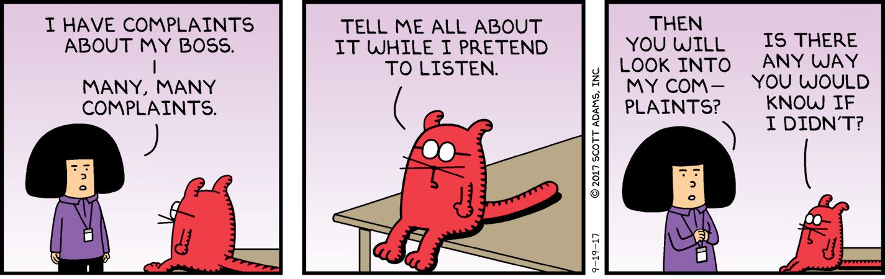
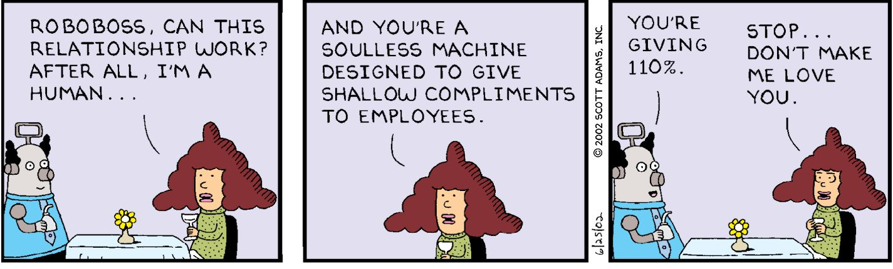
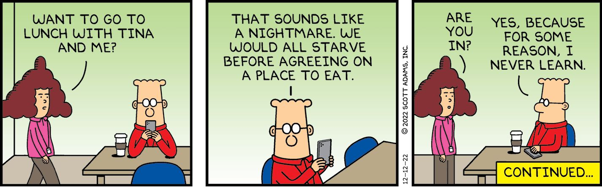
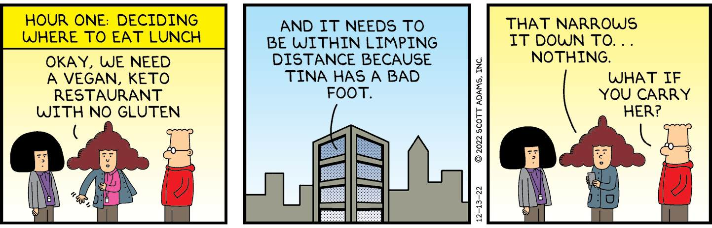
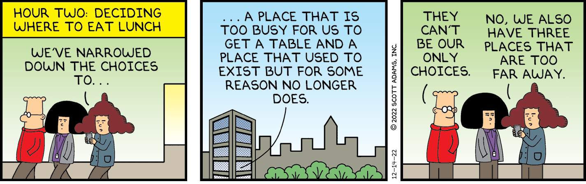
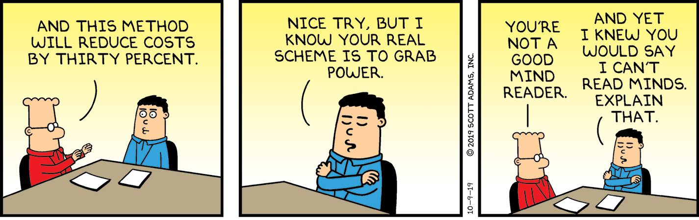
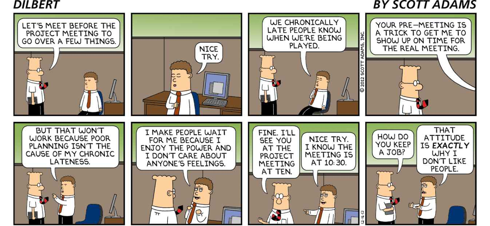

Chapter 4

Social Life Reframes

I grew up in a small town in upstate New York and somehow avoided learning any social skills until I was an adult. I scrambled for decades to figure out the rules of healthy social interactions. I won’t claim I mastered the art, but I can save you about forty years of embarrassment by summarizing much of what I learned in a series of reframes. This chapter includes all the reframes I wish I’d heard when I was a young man. 

Be Yourself

A popular notion is that we all have some core nature that is good and valuable, and everyone else will see it, too, if we just act natural. “Be yourself,” the wise ones tell us. And if someone doesn’t like it, too bad!

It’s hard to pick the single worst advice ever given, but “be yourself” is in the top five. Would it kill you to work toward being a better version of yourself? 

When I got rich making the Dilbert comic in the 1990s, people asked me if I thought wealth would change me. I usually laughed and said, “I hope so. That was the point.” I wanted wealth to make me feel successful, fulfilled, happy, less stressed, and even healthier. And I hoped it would make me feel less selfish and more inclined to help those less fortunate. I think all of that happened and on schedule. 

I once believed that “aging” would be all bad starting at around age thirty. I’m writing this at age sixty-five and can report that I have been wrong for thirty-five years straight. I suppose my basic personality has been consistent over time, but I’ve clearly evolved into a different sort of creature, and I like the change. I wouldn’t go back to any of my younger days. Imagine if I thought “being myself” back then was a good life strategy. I can’t imagine the outcome. Instead, I took the attitude that self-improvement is available in abundance, so I grabbed all I could grab, as often as I could grab it.

Usual Frame: Be yourself.

Reframe: Become a better version of yourself. 

When people tell me they “dress for themselves” as opposed to impressing others, I assume they’re either lying or unaware of how humans are wired. Dressing for yourself feels like the worst fashion strategy of all time. Instead, dress for the impact you want to have on others. Whatever that is. 

Which of these two things will feel better:

  1. Attracting a potential mate whom you marry, have three kids, and live a wonderful life.

or . . . 

  1. Walking past a mirror and thinking, “Damn, I look good to only me.”

Okay, I might have inserted some bias into those choices. But I think you get the idea. How you present yourself will have an enormous impact on how others treat you. People are shallow and visual. That means you will have better social interactions if you dress for other people, not yourself. And ultimately, your relationships are the building blocks of your long-term happiness. Manage them with care. Self-esteem is important, too. But it’s only one building block to better personal relationships. If you were all alone in the world, no amount of self-esteem is likely to make you happy. You need other people for that.

Would you like a surefire way to boost your self-esteem? I have a suggestion: Make others respect you. You already know how to get that done: Take care of your health, finances, family, and be kind to others. That’s about it. If you do the basics, respect comes easily. And that’s 80 percent of what you need for a healthy sense of self. 

For the remaining 20 percent of your self-esteem, go ahead and beat yourself up for not being better. That’s a productive tension, which can help pull you where you want to go. We humans don’t do well when all our problems are solved. Be thankful for any useful irritation that is getting you on your feet and making you try harder. Don’t lose that.

Usual Frame: Learn to love yourself as you are.

Reframe: Be glad your brain is pestering you to improve. 

Imagine the self-critical voice in your head as one part of you that is talking to the rest of you . . . and then don’t take yourself too seriously. You do your best work when you are self-critical. Attacking your own self-esteem is an example of you operating perfectly. You wouldn’t want it any other way. Self-criticism is how you power up to make the changes you want to make.

Giving Advice

In the course of your daily life, you will encounter people who ask for advice as well as people who don’t ask for your advice but you are sure you need it.

Resist the urge. Use this reframe instead.

Usual Frame: This person needs my advice.

Reframe: This person might need some information, empathy, or some help organizing their thoughts.

Given my flawed character, if you were to offer me advice, I might respond in a defensive way. My first instinct would be to tell you why your advice is worse than whatever I was already doing. If I accept your advice, it will make me feel dumb for not solving the problem on my own. I might feel as if I moved down a rung on the social ranking. I hate getting advice even though my cartooning career depended on it. As I mentioned, I’m flawed. I’m also typical. People don’t respond well to advice, sometimes even when they ask for it. It’s a normal human thing.

Instead of advice, suppose you asked me if I’m aware of a new study that could change my decision. I like learning new things, especially stuff that is relevant to my life. I would see your mention of the study as helpful, and I would be likely to research the new information on my own to confirm it. That’s how I would turn your advice to me into my advice for myself. If you frame your advice as nothing more than an offer of information, I will happily accept it. Later I will feel as if I made my own decision, perhaps influenced by what you told me.

A method I use that does not involve giving advice is asking questions about a person’s thought process and priorities. If I can prompt you to describe how your plans make sense and you struggle, you are likely to self-correct without my annoying advice. The gaps in your logic will be apparent to you as you discover you can’t describe your idea coherently. 

Also, be aware that people enjoy complaining—and being heard—more than they like getting advice, even if they ask for it. Sometimes the best way to help is to be an empathetic listener. I’ll trust you to read the room and know when listening is the best strategy for being helpful.

Handling Complaints

In my teens, I worked at the Sugar Maples Resort in upstate New York, and I learned a valuable lesson from my boss. One of my jobs involved working the front desk and taking complaints from customers on various imperfections in their rooms. My boss told me my job was to write down the complaint in front of the guests on a form titled “Work Order.” That’s how the guest would feel “heard.” And I could tell from the guests’ reaction that it worked. They always acted as if they had successfully completed a task. They left the front desk happy.

The flaw in their plan is that many of their complaints were logically or practically impossible to fix. That didn’t matter, as my boss explained. He told me some guests just enjoy complaining, so if you listen to them, they’re happy. You don’t even need to fix their problem. The “being heard” part is what matters more to some guests. 

We fixed whatever was fixable, but that was maybe half the complaints. As events played out, my coworkers and I started competing to see who could crumple up and toss the Work Order form in the trash the fastest before the guest got too far away. Only one guest heard the crinkling and challenged my coworker about it. I think he said he discarded something else.

Usual Frame: People who complain want solutions. 

Reframe: Some people who complain just enjoy complaining. 

The practical implication of this reframe is that you need to know what people want, not what they ask for. If you deal with enough complainers, you soon learn which ones are doing it for their own entertainment, or to feel powerful, and which ones have valid problems in need of fixing. There is no obvious way to know in advance the motivation for people’s complaints. But you can usually figure it out if you look for a pattern in which the complainer puts more energy into the complaint than the solution.

Toxic People

You might have someone in your life who has a so-called “strong personality.” That’s one way to put it. But if you accept that frame, you’re probably already a victim or will be soon. If someone with a “strong personality” does something messed-up that affects you, you might be tempted to chalk it up to that strong personality.

Don’t do that.

“Strong personality” is usually a nice way to say a person is toxic. And in my experience, toxic people can’t change. They have a different reward system, which means they’re acting rationally according to their priorities. For example, your reward system might involve feeling good because you helped someone. A toxic person would be rewarded by watching you fail so they feel superior. 

The only known way to deal with toxic people is to remove them from your life and block them on all social media. Don’t fall for the trap that if you fix their current problems, it will be smooth sailing. Toxic people never run out of current problems.

Usual Frame: This person has a strong personality. I must become stronger to deal with it as an equal.

Reframe: This person is toxic. I must escape now.

The universe is very old. In all that time, no one has ever expelled a toxic person from their life and regretted it. You will not be the first. It’s one of the few things in life that works every time.

Compliments

Giving a compliment is an easy way to improve your life experience. When you offer a sincere, unsolicited compliment, people remember it. They have a better feeling for you and are more likely to hire you, befriend you, marry you, trust you, buy from you, and just about anything else with you. Most people get zero compliments during a normal day. If you’re the one who breaks that streak, you will be remembered in a positive way.

But what’s the downside?

In America, at the time of this writing, the downside is that any compliment from a male over the age of twelve can be construed as suspicious, especially in a work environment. Your culture might be different. I trust you to know when a compliment is appropriate. Outside the workplace, the risk of complimenting a person is low. I’ve been complimenting people my entire life, and I don’t recall a negative outcome. It’s one of the lowest-risk ways to get “free money” that this reality offers. And by free money, I mean you give people a good feeling about you. 

Usual Frame: Giving compliments is awkward, creepy, or manipulative.

Reframe: Withholding a compliment is almost immoral.

Life can be challenging for even the luckiest among us. One unexpected compliment can turn someone’s day around. And it costs you nothing to deliver your little verbal bouquet of niceness. If you have a positive thought about someone, let it out.

But don’t be weird about it. I favor the drop-and-leave approach, which I encourage you to borrow. It involves dropping a thick compliment and immediately changing the subject before your target has a chance to feel awkward or even respond. If you compliment and then linger on the topic, your target will either feel awkward or act humble and deny the truth of it. When you do the drop-and-leave method, the compliment is delivered, and no one has time to feel awkward. Mission accomplished. Only use the drop-and-leave when you don’t know the person well enough to know how they will take a compliment. Someone you know well, such as your spouse, might want you to linger after a compliment, maybe suss out some details, view it from multiple angles—that sort of thing. You’ll know when to linger.

Discovering Your Sex Appeal

If you are universally attractive, you won’t need this reframe. But most of us could use some help.

Usual Frame: No one seems to find me attractive.

Reframe: I haven’t met enough people.

Instead of thinking about the 90 percent of people who are not attracted to your type (just to pick a number), think about the 10 percent who are. In my case, that means women who prefer smart men who are not likely to play in the NBA. If I meet a hundred women, maybe ten will care about my mind more than my appearance, age, or whatever. That’s a lot. 

If settling for 10 percent sounds like a weak consolation prize, consider that even the most popular musical acts in the world are enjoyed by no more than 10 percent of the global public. If you can make 10 percent of the public like you—for any reason—you’re going to be rich. That’s how I got rich with the Dilbert comic. About 10 percent of the public likes it. That’s all I needed to become one of the most successful comic strip creators in history.

Your best strategy for attracting people for romance is to work hard on your fitness and diet. If you get those right, you’ll be one of the most attractive people in your environment, especially after the age of thirty. A woman once told me that any man with a job and a gym membership is already in the top 20 percent of desirable men. You can move to the top 10 percent by focusing on your fitness and your fashion—and by fixing your haircut.

The power of the 10 percent strategy is that it tells you exactly what to do if things aren’t working out for you in the romance department: Meet more people. That’s the whole strategy. Doesn’t matter how you do it. Play a sport, join a club, change jobs, whatever it takes. If you increase the number of people who know you, your odds of finding a match go way up. So forget about being attractive to everyone. Just use math to solve your problem: Meet more people any way you can.

My understanding is that dating apps only work for some types of people—generally the better-looking amongst us. As an unattractive person, I can confirm that no one ever asked to meet me because of my looks. But in person, I can present myself in a better light. Most people reading this book are in the same boat. The solution is to add more people to that boat so your odds of meeting someone the organic way are higher.

That said, meeting new people isn’t enough. You also need to signal some genetic advantages to get yourself a date.

Usual Frame: I need to go find someone to be my romantic partner.

Reframe: I need to signal my genetic advantages to attract a romantic partner.

Combining the two reframes in this chapter, your best strategy is to meet new people in a way that allows you to show off your skills, which translates in the minds of others to genetic advantages. And genetic advantages are what trigger people into wanting to mate with you. For example, if you’re good at sports, join a co-ed sports team. If you’re a good musician, find a way to perform in public, including playing the piano at a party, for example.

You don’t need a whole basket of obvious genetic advantages to attract a mate. Consider a rock star who has musical ability but is a loser in every other way. That guy has plenty of mating opportunities because the musical talent registers as a genetic advantage, even if it was nothing more than an average natural ability boosted by practice alone.

If you’re looking for an easy starting point for meeting new people, join a gym and work on your fitness. If you build some muscles and lose some fat, and enough people see your apparent genetic advantages, your odds of finding a romantic partner go way up. 

Deciding Where to Eat

I have no idea if things work differently in the LGBTQ+ community when negotiating where to eat, but to keep the writing simple, I’ll describe a generic straight couple who frankly bore me. 

There are two things a woman wants in a man:

  1. A decisive man who takes charge.
  2. Total dominion over dining decisions.

As you can imagine, this daily recurring nightmare causes a problem for a hungry man. He must make a dining decision via the process of taking charge while also not doing anything of the sort. If the man approaches this trap as a decision that must be made between two willing parties, he will be doomed to frustration. But if that clever man reframes the situation, it will be easy to navigate it.

Usual Frame: I’m trying to make a dining decision with a crazy person. Please shoot me.

Reframe: It’s not about food. It’s about the illusion of control.

Here’s how the man in this situation can solve the problem of taking charge and not taking charge at the same time: He can offer two restaurant choices—presumably out of many—and ask his partner to pick one. Narrowing the choices to two solves the “taking charge” part because it shows initiative while also providing some choice—but not too much—to his partner. Barry Schwartz, author of The Paradox of Choice, tells us that people become unhappy if they have too many options. The more options you have, the more likely you will be filled with self-doubt about whether you chose correctly. And I observe that to be the case. Whenever people have too many options, they get stressed out. If you don’t believe me, look at the faces of diners who are going to the Cheesecake Factory for the first time. The menu is the size of a dictionary. No one appears to be happy when they’re looking at it. 

Okay, I know the imaginary woman in my example will reject both restaurant choices. But she will probably also make her own suggestion at that point, and the clever man accepts it immediately. Problem solved: The woman observes the man taking charge and doing something useful—narrowing the choices to two. Then when the woman rejects both choices and suggests one she would like instead, she also gets the dining option of her choice. The man gets a win for taking initiative, and he typically doesn’t care too much where he ends up eating. Everyone wins.

Framing the situation as a question of control instead of a food decision opens new options for a solution, including tweaking the decision-making process by narrowing the choices to two. In contrast, framing the struggle as trying to make a rational dining decision with an irrational partner doesn’t give you much to work with.

Before you start emailing me, I am aware that not all people are alike and that you are especially awesome and easy to work with. But I think more than a few readers of this book are living this dining-decision nightmare and will be happy to try my reframe.

If you find yourself on the receiving end of a “Where do you want to eat?” question, you need a different reframe. You might think that not hogging the decision to yourself is a polite position to take. But it probably isn’t because the asker might have wanted to share responsibility with someone for the decision. Not much good can come from, “I don’t care.”

A better way to frame that situation is that the asker wants a copilot for the decision, and nothing will happen until that position is filled. Here is the reframe.

Usual Frame: I need a decision.

Reframe: I need a copilot to share the blame.

My mother taught me this reframe. Sometimes it isn’t about the choice. Sometimes it’s about finding a way to move forward. Never say you don’t care; just choose. Everyone will be glad you did, and you will appear to be a leader. If someone doesn’t like your choice, they’ll probably let you know. 

Of all the reframes in this book, the dining decision reframe has the most universal application. Most of us deal with the “Where do you want to eat?” trap. You’ll be amazed how well this solves it.

These reframes work for any choice in which your honest answer would be “I don’t care.” It isn’t limited to food. The method can work in a variety of professional and personal situations. 

The first time you try one of these reframes, you will probably silently thank me in your mind. And I will silently say, “You’re welcome” because I can sense these things.

Humor

If you are not naturally funny, wouldn’t it be nice to know how to create humor? Everyone likes a good laugh.

Most humor comes from referencing a known pattern and then violating that pattern in a clever and surprising way. For example, when characters act against their stereotypes—a common humor formula—the stereotypes are the pattern being violated. An example would be a cute bunny rabbit that is also a deadly assassin. 

Standup comics often create jokes by first describing what one group of people can get away with in society, then violating the pattern with “imagine me trying that.” For example, the comic might describe some bad behavior a celebrity allegedly got away with and follow with an “imagine if” story in which the comic tries the same behavior as the celebrity, but it doesn’t work out. 

In movies, a common plot device is the “fish out of water.” That’s another way to say a quirky character is dropped into a situation for which they are not equipped, and hilarity ensues. That too is a form of pattern violation that creates humor.

People who don’t write jokes for a living often describe humor as “bad things happening to other people” or “tragedy plus time” or simply a matter of “surprise.” But that level of description doesn’t help you write your own jokes, which is what I want for you. You might find it helpful to reframe humor as pattern violation because that gives you a starting point for writing a joke about anything.

Here’s the humor reframe.

Usual Frame: The usual patterns hold (non-humor).

Reframe: The usual patterns are violated (humor).

You get extra energy from a joke if the pattern you are violating is one in which the people in power—or polite society in general—don’t want violated. That’s why it’s so easy to write jokes about a cop who doesn’t follow the rules, the lawyer who can’t lie for his client, the doctor with the unpleasant bedside personality, or the soulmate who is a monster. If you start with a pattern violation, writing the jokes that go with it is easy.

Pattern violation isn’t the only way to write humor, but the other methods don’t give you such an obvious starting point. Just ask yourself what is the most common and expected way for a given character—your coworkers, your family, professionals, anyone—to act and see what happens if they do the opposite. It’s usually funny before you even write the joke. 

Do you remember a story about a mail carrier who was taking home all the mail he was supposed to be delivering? That’s funny from the start because he did the opposite of delivering the mail. He violated the mail carrier pattern.

You can also create humor by calling out a common pattern of human behavior that no one has yet mentioned. Recently, a friend mentioned the angst of discovering a hole in one sock and feeling guilty for even considering discarding the surviving sock simply because it no longer had a partner. If you have ever had that sock-empathy thought, you probably laughed. Topics that are familiar to you but not already picked over by comedians will work best. 

As you see from the examples, you can create humor by OBSERVING human patterns—and calling them out—or by VIOLATING human patterns. If you’re using the observing method, you can generally only refuel your creativity in an accidental way—by noticing something in your normal day. If you take the approach of violating a pattern, you automatically have a starting point and the germ of an idea for how to proceed.

Side Note: Pattern violation is also one of the top recommendations for making memorable presentations. If you have a theme for your slides, violate the theme on the slide that is the one you most want your audience to remember. Pattern violations—like a stain on a white tablecloth—capture your attention, and that’s exactly what you need to create memories and have impact.

Weirdly, the other most common way to create humor is by writing characters who are acting exactly as you would expect if you were a bigot of some sort. For example, the Dilbert comic character is an engineer, so you would expect him to act a certain way because you are a bigot—you assume he is a socially awkward geek. I can get away with gentle mocking of engineers because I revere them, and I’m a professional humorist who knows where the boundaries are. You probably don’t want to target any group to which you do not belong. And even if you are part of that group, it’s probably better to play it safe.

Imagine the next person you encounter doing exactly the opposite of what their personality would suggest. It will probably make you laugh. And now you know how to create humor.

Marriage

We like to think of love as the process of finding a soulmate. That’s a fun, romantic way to frame it. But realistically, humans can fall in love with whoever is nearby and willing (within reason). And we do, for better or for worse.

But a new view of marriage is gaining traction in some circles. By this view, marriage is about finding someone who AGREES to be your partner and protector for life. Obviously, you want to be compatible in all the ways you can, but the highest priority in this new model is the promise you make to each other, not the love, and not the soulmate part.

You want to have love, and you want to feel your partner is your soulmate. But romantic love and lust have a way of fading over time, no matter how diligent you are about keeping things fresh. Promises are different. A promise kept for a long time becomes more valuable, not less. And a promise to look after each other until death do you part is the ultimate valuable thing for a human. Look for a partner you can love, but on top of that, make sure you find someone who values a promise.

Usual Frame: Marriage is about finding your soul mate.

Reframe: Marriage is about finding love with someone who values promises.

As my critics delight in noting, I’m the last person who should be giving marriage advice. I’m zero-for-two in that department. I have sufficient self-awareness to recommend you avoid whatever I was doing. But this might be a situation in which my overclocked self-esteem can help you. I’ll tell you the reframe I use to excuse my own marriage failures. It can help you, too. It goes like this.

Usual Frame: Marriage is a great system, so if your marriage fails, that means one or both of you messed up.

Reframe: So many marriages ending in divorce proves that marriage is a poorly designed system.

To be clear, marriage is a great system for some percentage of the general population. I don’t think that percentage is greater than 25 percent or so, based on my lifetime of observation. People are different. We wouldn’t thrive in the same jobs, the same sports, or even the same weather. We don’t like the same music, food, or pets. It should be no surprise that the institution of marriage fits some people perfectly while failing others.

Monogamous marriage-for-life is a pre-Internet system and mainstay of human civilization for quite some time. During its glory days, traditional marriage made sense because men and women brought different things to the marriage—things the other could not easily provide. But in the age of equality, every individual can handle a solo life without that much special effort. No mate needed. For that group, marriage is designed to fail. And by that I mean a spouse will generally, over time, start to look worse than a coworker, friend, or almost anyone else. Everyone but your spouse has the advantage of being able to show only their good side. Spouses don’t have that option. That’s why they can’t compete. 

Marriage would work better if people didn’t have easy Internet access to alternatives, but they do. The system guarantees that a couple will start to look increasingly flawed to each other while serving up unlimited mating alternatives—and worse—endless love stories of fictional people who are happily married and always romantic.

I often advise “follow the money” when trying to predict anything. With marriage, there can often be financial incentives to divorce, especially for the person who brings the least financial strength to the marriage. If one partner can leave a suboptimal marriage and take a good chunk of money, and maybe get an automatic babysitter during the shared custody years, that makes divorce feel like a practical option, if not desirable. I don’t believe many people divorce for money alone, but “follow the money” predicts better than you wish it would. Be realistic if you plan to take a marriage path. That’s all I suggest.

Breakups

If you live a normal life, you will probably experience several breakups. They will hurt. I have some experience in this domain and can share my most effective reframes. Realistically, time is the only healer, but you might be able to handle the recovery better with some useful reframes.

Usual Frame: I want my relationship to last forever.

Reframe: Nothing lasts forever. 

Best case scenario, you spend your lives together until one of you watches the other die of age-related problems. Life is not designed to give you a happy ending. And nothing lasts forever. As awful as this sounds—and it is awful—the sooner you embrace doom as inevitable, the sooner you can stop worrying if things will work out for you in the end. In the long run, all businesses will fail, all governments get replaced, and all humans expire. If humans did not experience loss, we would have no capacity for joy. And you and I want joy.

Here’s another reframe I found useful.

Usual Frame: This breakup ends my hopes for happiness.

Reframe: There are happier third marriages than first.

I have no idea if that is true, and I don’t plan to research it because accuracy is not an active ingredient in reframes. Anecdotally, people in their third marriages do seem happier, and that’s good enough for me. If you have never observed that pattern, perhaps this reframe is not for you. But if you have, tell yourself the relationship you are leaving was practice. The odds of getting the right relationship pairing on the first try or even the first several are low. But the odds of finding one of your million-or-so best potential matches in the long run are good. 

Breakups can signal the beginning of hard times. But just as often, and perhaps more often, the freedom you gain from a breakup starts to pay off right away. You will rediscover some of your favorite activities, have more time to work on fitness and your career, and still upgrade your relationship in time. Don’t rush it.

Here’s a reframe that captures all of that.

Usual Frame: I have lost my soulmate.

Reframe: I have a million soulmates I have not yet met.

Not counting online dating, the main place people meet and fall in love is in the workplace. What are the odds that you and your soulmate ended up working for the same company? The obvious explanation is that humans can fall in love with a variety of people. If you are experiencing a breakup, you are not losing your soulmate. At worst, you are losing one of your million-or-so soulmates. 

One of the best reframes for surviving a lost love comes from Dr. Seuss. It shifts your focus away from wallowing in your own pity to how lucky you were to have experienced that human connection in the first place. It’s easy to lose sight of that. 

Usual Frame: I am crying because my relationship ended.

Reframe: “Don’t cry because it is over, smile because it happened.” — Dr. Seuss

My closing advice for this topic is to talk to people who are delighted they broke up with their exes. They’re easy to find. Most recently divorced people fall into that category. When you’re in the middle of your breakup recovery period, feeling happy again can seem impossible. All those now-happy people thought something similar. Learn something from their numbers.

Talking to Teenagers

If you are an adult with teens in your home, you have experienced the joy of trying to reason with them. This generally devolves into you-against-them in a power dynamic that turns into shouting and tears and bad feelings that can last days. The teen sometimes has some impact as well. 

One solution you might try involves explaining to the teen that everyone starts life with a young brain, including the two of you. If people are lucky, they live long enough to have an old brain that is past its expiration date. Somewhere in the middle are the people most capable of making decisions, and that’s where the parent happens to be. You wouldn’t want to ignore biology; human brains are at their best somewhere in the middle of a person’s lifespan, not at either end. 

Great power comes with great responsibility—to paraphrase Spider-Man—so it’s your job to keep the teen safe and on the right track, and you take your responsibility seriously. That’s why you are making the decisions, not the teen. 

There’s a reason Americans can’t run for president until age thirty-five. When it comes to life-and-death decisions, we want the best brains on our side. Without getting political, there is a good reason citizen are concerned when their president is over age seventy-five. Beyond that age, citizens can’t be sure what we’re getting.

That’s the little speech I used with my stepson. Obviously, he never changed his mind about what he wanted and why, but he understood my reasoning and had no counter to it. That’s why we got along. I never made it personal, and I carefully explained why it was in his best interest—like it or not—to do what I asked or advised him to do. I also never tried to give him advice in a domain he knew better than I did—such as snowboarding—to keep my story consistent about who should be making decisions. Had we gone snowboarding together, I would have followed his lead within reason because that was his domain. Here’s what it looks like as a reframe.

Usual Frame: A teen can’t understand the “reason” parents have given, and it turns into a power struggle.

Reframe: The parent is a guide for young brains that are not yet capable of understanding adult reasons.

Here’s another reframe that can take energy out of the you-versus-them dynamic. Frame the issue as you being responsible for the teen’s future self, not the current version of the teen.

Usual Frame: I’m talking to you, teen, and this is between us.

Reframe: I must answer to your future self, not your current self. 

The idea is to reframe the conversation as you siding with the teen’s future self against the current teen whose brain is not yet developed, and I recommend explaining it that way to the teen. That way, it’s two against one. Tell the teen you’re raising them to become a successful and happy adult, and that adult will someday hold you responsible for what you do to their teen self. When the teen says (and they always do), “I don’t understand why you are making me do this!” you can simply answer that their future self will thank you for not taking the advice of a minor with a half-baked noodle for a brain. This framing allows you to take sides with the teen—albeit their future self—against the current version of the teen who has not yet developed risk management skills. If I tell you I’m siding with future you, not present you, it’s a bit of a mind-bender. It’s hard to feel anger toward someone who is taking your side more aggressively than you are. 

By the way, this is an example of embrace-and-amplify persuasion, in which you take the teen’s side more completely than they take it themselves. They want to maximize their today selves, usually in some fleeting and selfish way, whereas you are maximizing their entire lives. 

The key to making this reframe work is to remove all emotion from it. Keep insisting the teen’s future self will be happy you acted the way you are and agree with the teen when they say they “don’t understand” why you are being the way you are. Tell them that’s exactly your point—that they don’t yet have the capacity to understand their long-term best interests, but their future self will. And you answer to their future self—the complete person—not the half-done version.

Full disclosure, this might be the weakest reframe in the book, but it might work better than whatever-the-heck you were doing. Don’t expect any conversation with teens to end in hugs and gratitude. Teens are still teens. But you might be able to use the reframe to detach your emotions from the situation, and that can keep a lid on how heated things get.

Oh, and you probably shouldn’t use the term “half-baked noodle” when talking to a teen. Throw in some adult words such as maturity, fully developed, and even actuarial tables if you want to be a showoff. Read the room. 

That said, if you’re only in it for your entertainment, wait for the inevitable teen complaint of “I don’t understand why . . .” and reply with “That’s exactly my point. If you could understand this situation in full, it would mean you were ready to make decisions without me. I love you. Do your homework and go to bed, you rascal.”

Who Has the Power

I often hear people talk about themselves as powerless pawns in a cruel world. They see power coming from the government, police, their bosses, and even their spouses. But power is a tricky thing, and we often see it backwards. Examples will help my point.

Is an elected politician in charge, or are the voters? You can imagine it both ways. It depends on the specifics, but voters are never powerless. Neither are politicians.

Is your boss in charge, or are you? It depends how hard it would be to replace you. A top engineer in a technical firm probably has more clout than a mid-level boss.

Now let’s say you meet someone for the first time and the encounter does not go well. Perhaps the new person is rude or disrespectful. Maybe they are refusing to be helpful in ways you’d expect any decent person to be. In these cases, are you being controlled by the stranger?

It feels as if your mood and the quality of your day will be altered by how this stranger treats you. That gives the stranger a lot of power over you. If you accept the frame that the other person’s actions and attitude will influence you, then they will. But you don’t have to accept that frame. You have a better option.

Usual Frame: People treat you poorly, and you can’t do much about it.

Reframe: You cause people to act the way they do.

I first discovered this reframe in college. I noticed a weird pattern I could not immediately explain. Whenever I was relaxed, people treated me better. When I was angry or stressed, others seemed to treat me poorly more often than I liked. For years, I believed I had been observing a false pattern that I only imagined. Surely there is no physical mechanism that could make other people nicer just because I was feeling relaxed. I couldn’t imagine how that would work.

Then I got smarter. Some call it experience.

Eventually, I realized that when I was relaxed and happy, I turned others into a version of me. They would smile more, engage more, and generally enjoy the encounter. Once I understood how compatible this view is with science, I reframed my subjective reality as one in which I influence everyone I meet, but they barely influence me.

Is that true? Not exactly. It would be more accurate to say we influence each other. But truth and logic do not matter for reframes. It only matters that you get what you want. And this reframe works fabulously for me because it reminds me to actively “change” the other person into what I need them to be. And what I usually need people to be is nice to me. That’s all. Nothing special. Just be respectful and kind. Most people want to be respectful, kind, and happy, so in my opinion, it’s ethical to persuade them to be more of that.

These days, I define myself as the author of my own experience regarding how others treat me, not a victim of their whims. In truth, I am both. But I frame it in a way that makes me feel the best. 

You probably know the Bible story of David and Goliath, in which smallish David slays the “giant” Goliath using nothing but a sling and some stones. What they don’t normally tell you about the story is that shepherds were both accurate and lethal with slings, and they didn’t need to be within stabbing distance to kill. In other words, David was the powerful character in the story, not the underdog. The story generally gets told the other way around. Humans have a habit of confusing who has the power in any given situation.

We imagine our bosses—if we have bosses—hold power over us. And that is clearly true. But if you want a quick education in how much power a boss really has, try being one. You’ll instantly realize how hard it is to fire someone and hire someone better. Now pile on the legal protections afforded to employees in modern times. Then top that off with a frosting of so-called “wokeness” and see how much power the boss has. Now pack your schedule so you barely have time to apply any power to any specific situation. Now give that boss a spouse, two kids, a dog, and a cat. 

If you go by the job descriptions alone, a boss has all the power. But in the real world, whenever someone is happily paying another for some sort of service, they are often closer to a tie in power. It might be 60-40 in favor of the boss, but 40 isn’t nothing.

We all have more power than we think. You can’t view your own power accurately because it’s nearly impossible to fully appreciate the impact you have on other people. Some examples will help make the point.

When the COVID pandemic broke out in 2020, the Trump administration put out the word to various smart people that the administration was open to ideas for Executive Orders—written commands a president signs to get things done outside the normal lawmaking process. I had some glancing knowledge of the telehealth business because of a recent startup experience, so I suggested an Executive Order allowing telehealth calls across state lines, which was until then not allowed. During a pandemic, this was an obvious rule to change. I reasoned that it would work well for the public and doctors alike and be hard to reverse. A few weeks later, President Trump signed the Executive Order—based on my suggestion that worked its way up through the channels—and a major impediment to reducing healthcare costs disappeared. So who had the “power” in that situation, the President of the United States or . . . me? I would argue that I had the power because the idea was so obviously a good one. And that’s my point: The person with the best ideas is always in charge. It might not seem like it. But they are.

How do I know that? Because I’ve been in countless business situations in which the best idea wins the day. It doesn’t matter who has what job description. If your idea is the best of the bunch under consideration, you’re in charge.

Usual Frame: The boss is in charge.

Reframe: The person with the best ideas is in charge.

Why did seventeen-year-old Greta Thunberg have so much influence on the climate agenda? I’d say it’s because she did the best job of communicating. That’s another way to grab power from the bottom—be the best at communicating something the masses want to hear. You’d be shocked and appalled if you knew how much power a political speechwriter has. That’s a dirty little secret of politics; speechwriters have great influence on policy because if it sounds good when spoken, a politician wants to say it. That means a speechwriter can easily bias a speech by making the catchiest parts support their worldview.

Usual Frame: The experts are in charge.

Reframe: The best communicator is in charge.

Another source of power is competence. If you’re the most competent person in each meeting and that fact becomes apparent to others, suddenly you’re in charge, like it or not. Being competent is an extreme superpower. Everyone wants to hire you, work with you, promote you, buy from you, have babies with you, and be your friend. We are drawn to the competent, and that gives them power.

Usual Frame: The boss is in charge.

Reframe: The most capable people are in charge.

On the downside, competent people end up doing most of the work. That must be why so many people avoid being competent.

Here’s a reframe that can help you identify powerful influencers before anyone else sees them coming. You can think of power in the modern world as the product of persuasion talent multiplied by the size of your audience. If you are persuasive but no one is listening, that won’t help anyone. And if you have a big audience but no persuasion training, you are squandering an opportunity. When you see both—as we observed with both Alexandria Ocasio-Cortez and candidate Donald Trump in 2016—you can easily predict they will have a big impact.

Usual Frame: The people in charge have the power.

Reframe: Power = (Persuasion skill) x (Audience size)

Now that you’ve been exposed to a few examples of power illusions, you might find it easier to spot misleading power dynamics on your own. My default belief in every situation is that I’m the one with the power. I recommend you start with that assumption, too. 

Mind-Reading Isn’t Real

If you have ever experienced something called “a relationship,” you know even the people closest to you can’t tell what you’re thinking much of the time. And if you have experienced the horrors of using social media, you know strangers routinely assign secret motives and nutty opinions to you.

Have you ever been accused of thinking something you were not thinking? Of course you have. It’s a daily occurrence for some of us. As a public figure, I’m falsely accused of having terrible motives every day. Literally every day. This gives me a privileged view of how bad people are at discerning others’ motives based on scant clues. 

When I watch Bill Gates get involved with the most pressing issues of our time, I think he’s trying to help. My assessment of his motives is that he took care of all his own needs and those of his family, so he is turning outward to help “the tribe,” which in this case is all of humankind. I see Gates taking on the nastiest, most intractable problems of our time at great personal cost and risk. So to me, he appears to have good motives. Obviously, his philanthropy also gives him cover—in a physical security sense as well as reputationally—so one could argue his self-interest is the prime motivator. I see his actions as 100 percent compatible with his self-interest and well-intentioned.

Am I right about Gates? I don’t know. I can’t read minds. 

Other people look at the same set of facts about Bill Gates and conclude he is running some sort of global money-making scheme that involves scaring the public to boost his pharma and nuclear investments, to gain control of the world to turn us all into masked and sterilized slaves full of fake DNA, or something like that. 

I probably succeeded in convincing you that other people—including me—are bad at discerning the motives of strangers. But you might still think you are good at it. And that’s the problem. We all believe we are. At this very moment, I’m writing a book that tells you people are bad at mind reading, and I know that to be true. I also know that several times today I will imagine incorrect motives in the minds of strangers. My only defense is the reframe I keep in my mind and often repeat.

Usual Frame: I can discern people’s motives by their actions. 

Reframe: Mind-reading isn’t real. Humans are terrible at discerning motives. 

This reframe is more powerful than it seems. Once you tune your brain to spot instances of “mind-reading” by others, you can push back on their arguments by reminding people that humans don’t know how to read minds. In my experience, people retreat from their absurd accusations about you when you call out their inability to read minds. You might still have to explain your real motives, but it helps to do a controlled burn of your critic’s magical thinking about mind-reading before you tell them what you are really thinking. Try it.

Basket Case Theory 

Sometimes it feels as if everyone I know believes they are weird (and they are) while they also believe most people are non-weird (they are wrong). I call this the Basket Case Theory. Most of us feel as if we’re hiding a secret when we’re around so-called normal people because we don’t feel we are normal, so surely others will notice.

I first learned of Basket Case Theory from a friend and tennis partner when I was in my twenties. The original context was our dating experiences. We kept meeting normal women who would, over time, slowly reveal their hidden traumas and anxieties until we came to see them as Basket Cases (a term denoting someone with debilitating mental and emotional issues). In time, I came to see Basket Case Theory as a useful description of all humans, male and female.

Usual Frame: Most people are normal, but I’m a basket case.

Reframe: Everyone is a basket case once you get to know them.

Basket Case Theory has a lot of utility. It keeps you from getting too starry-eyed about a new relationship until you see what horrors are in the basket. You start to develop realistic expectations of other people, which can prevent disappointment. It also gives you permission to be one of the basket cases yourself since the whole idea is that no one is exempt.

Sure, you’re a weirdo. But so am I, and so is everyone else we know, albeit in different ways. That’s a healthy place to be mentally. It can crush your self-esteem to imagine people around you as healthy and happy and awesome, but you’re not. It should ease your mind to realize that once you get to know others well, their problems are ones you wouldn’t want. We are a civilization of basket cases pretending to be otherwise. You won’t find an exception. At best, you might find someone who doesn’t complain too much. I’ve searched my entire life for the one complete person who hits all the right notes and feels all the right feelings. As far as I can tell, that person is hiding or does not exist. And I take comfort in that. I don’t mind being a weirdo in the land of weirdos. It’s only uncomfortable to be a weirdo if you think others are not.

(Pssst. They are.)

I have a unique window into the basket case phenomenon because I am older than most readers of this book, so I’ve seen the unbroken pattern for decades. I also have the type of job that signals to people I’m open-minded and non-judgy. That means people tell me everything. Even when I don’t want them to. People confess all manner of crimes to me (serious ones), and they know they’re safe to do so. They also confess their deepest desires and mental issues because, again, they’re safe to do so. I start with the basket case assumption about everyone, so any details I learn about a person won’t change my opinion. 

Take it from me: Everyone is a basket case. Some can hide it better than others. It’s a deeply freeing concept. 

Judging Others by Their Mistakes

I already showed you how to make yourself immune to the criticisms of strangers. Now it’s time to learn how to be less critical of others, for the social benefits, but also to protect your mental health.

When others make mistakes that complicate our lives, our most common reaction is anger at the offender. At the same time, we know everyone makes mistakes for all manner of reasons we don’t understand at the time. If we use that standard to judge others, it will keep us busy hating half the people we meet. Worse, you might automatically apply the same standard to yourself and end up baking a big ol’ self-hatred cake. No one wants a self-hatred cake. 

Rather than judge others by their mistakes, I recommend a different standard: Judge people by how they respond to their mistakes. That’s a standard you can hold yourself to with some chance of success. 

Usual Frame: Judge people by their mistakes.

Reframe: Judge people by how they respond to their mistakes.

When you observe someone handle their mistakes with confidence and empathy, fully acknowledging any harm done, you’re seeing the best a person can do. We can’t expect people to be error-free. But we can certainly ask them to handle their mistakes with class.

When a person handles their mistakes well, you instinctively trust them. And you probably should. If you want to be trusted in your own life, that’s a great model to follow. Make your mistakes, apologize if needed, and announce your plan for avoiding the same mistake in the future. People will notice.

Lateness

Do you know anyone whose lateness is so epic that it defies all explanation? If you ask why they’re late, they might offer reasonable explanations such as traffic delays or some hold-up at work. But over time, you notice the same people are always late while others are nearly always on time. That’s probably not a coincidence.

What’s up with that?

You probably assume the always-late person in your life is incompetent or uncaring or both. But I’ll bet you can rule out uncaring because the lateness almost certainly applies when no one pays the price but the perpetrator. And you can probably rule out ordinary incompetence because people of all capabilities can be either habitually late or punctual. 

I was baffled by the phenomenon of the always-late until I heard an expert explain that people with ADHD are not “distracted” as we commonly believe; they have time blindness. They live in the now, meaning they act on the most interesting or critical thing in their immediate surroundings instead of doing what they need to do to satisfy their future hopes and plans. They are blind to the existence of their future selves whenever they’re in the moment.

For contrast, I’m generally on time for everything. I also have an ability to visualize imaginary futures in such vivid detail that they influence my immediate actions. When I do the right things in the present, I see my imaginary future take shape the way I’d like it. You could say I live in the future. Intentionally. Here’s the reframe.

Usual Frame: People who are always late are either incompetent or uncaring or both.

Reframe: Some people have time blindness.

The value of this reframe is that it changes how you feel about the always-late person. Perhaps it helps them understand themselves, too. The lateness isn’t personal if it happens in every context. My experience with the always-late agrees with the experts. No amount of better planning or incentives helps the always-late because they are not intentionally late; they are oblivious to the future. It isn’t personal. It’s just how they’re wired. You will have to adapt if you want them in your life. They would adapt to you if they could. 

That said, people are different, and I suspect a gifted hypnotist could help an always-late person develop a habit that supports punctuality. The trick would be to add some sort of trigger that can happen in the “now” to connect an always-late person to their schedule and timeline. 

I have a lifelong habit of never being out of sight of a clock or my phone when I’m getting ready for anything. I check the time reflexively every five minutes or so and micro-adjust my schedule as I go. I doubt the always-late impose clocks on themselves as aggressively as the always-punctual. But it might be a habit that could be developed, perhaps with help.

One of the most useful ways to view human behavior is that we are just as trainable as dogs. No offense intended to dogs. If you get a reward for a thing and repeat that pattern, you build a subconscious habit. This is true for any animal, including you. For example, some dog owners teach their dogs to make eye contact on a regular basis while walking together to “check in.” You do this by giving the dog a treat for randomly looking in your direction until the behavior locks in. Once it locks in, it becomes a habit outside the dog’s conscious control. In effect, you reprogrammed the dog.

Now imagine a human with a smartwatch and an app with an avatar of your choice that does nothing but compliment you and remind you to stay on task whenever you check the time. Everyone likes compliments, even from machines. That’s why video games give you rewards for achievements and slot machines make happy noises for jackpots. Those are forms of compliments, or affirmations, and they’re addicting. If you could create an addiction for checking your smartwatch—to get your reward every five minutes—then it reminded you to get back on task, would that make you less late?

I don’t know. It probably depends on the individual and the quality of the app. If you want to be late less often, or if you want to help someone else in that situation, I recommend experimenting to see if you can form an addiction to some sort of reminder that can become a subconscious habit.

The “poor man’s” version of this would involve complimenting yourself every time you look at a timepiece, as in, “You are so smart,” or whatever doesn’t sound weird to your ear. Start by doing your micro affirmation no matter the reason you notice the time, even if you only saw a clock in your visual field by chance. 

Ideally, you want your compliment to yourself to be something you would naturally be reminded of in your daily actions. “Smart” works well because we’re always judging our actions as smart or not. Over time and with repetition, anything that makes you think of your own intelligence or that of anyone else should trigger a reflex to check the time. 

I am writing this at Starbucks near my home, and I have reflexively checked their clock a dozen times . . . and they don’t have a clock. But my brain wants the clock to be right above the service bar. So I keep looking for it, by habit, about every five minutes. I don’t have a lateness problem, and you can see why.

I doubt ADHD—or whatever causes future blindness—can be cured by subtraction, as in making it disappear. I think your best bet is to add habits—like software patches—to tame it. 

I had one stepdaughter who got ready for school as soon as she awakened and used the extra half-hour before the drive to her campus for personal entertainment. Her sister did the reverse—she sought entertainment when she woke up and got ready for school just before she needed to leave. Guess which kid was on time every day and which was often late. 

Having a good system for being on time matters. Perhaps a hypnotist or counselor of some sort could help an always-late patient build such a system. 

Your so-called common sense might tell you that fixing lateness in another person or even in yourself should be easy. In practice, it might be one of the hardest traits to rewire. I’ve described some low-effort hacks that might help. What have you got to lose?

Acts of Kindness

A quote of mine on kindness from years ago recently went viral. It, too, is a reframe: “Remember there’s no such thing as a small act of kindness. Every act creates a ripple with no logical end.”

Usual Frame: Small acts of kindness are good.

Reframe: There are no small acts of kindness.

When I was fourteen years old, my neighbor—who used to overpay me for shoveling the snow off his sidewalk and driveway—showed me a small act of kindness with some life advice and a delicious Greek pastry. It took about a minute. That was fifty-one years ago, and I remember it like it was yesterday. The gentleman passed away decades ago. But he will not be forgotten as long as I’m still around.

In my early thirties, I wrote a letter to a professional cartoonist, Jack Cassady, to ask his advice on how to break into the cartooning business. Jack’s advice—which arrived in two separate letters—probably took him less than an hour in all to put together. It changed my life forever.

Some years after Dilbert became a huge hit, I was invited to lunch by a young lawyer who had just launched his own comic strip and wanted some advice on making it successful. At the time, his comic only ran on one website, and I don’t think there was much, if any, money involved. I spent ninety minutes of my life dispensing my best advice as he took notes between bites of lunch. That young man was (and still is) Stephan Pastis, creator of the hugely successful comic strip Pearls Before Swine and creator of Timmy Failure, a successful series of books for kids. Has Pastis paid forward my act of kindness by advising other young cartoonists?

Of course he has. 

There are no small acts of kindness. 
