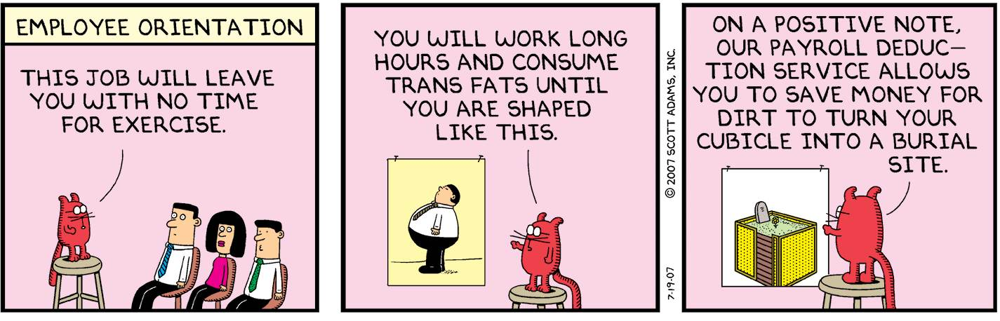
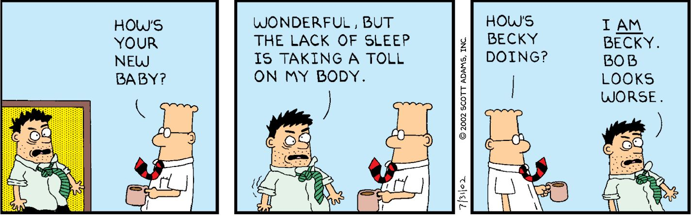

Chapter 5

Physical Health Reframes

I often hear from people on social media that one or more of my reframes on diet and exercise helped them lose massive amounts of weight, often 40 to 80 pounds or more. This outcome is perhaps the most surprising part of my career, and I don’t expect you to believe it’s real until you finish this section of the book. I think you will see the potential right away, and you will know if it works in only a week or two. It won’t cost you a penny. All you need to do is think about diet and fitness in a new way that I’ll describe here.

Diet and Weight Management

Words matter, even when you’re talking to yourself. Every word is like a package of programming code that alters your brain circuitry. But some words are weak, and some have more energy. Here’s a perfect example.

Usual Frame: When I am hungry, I eat food.

Reframe: Some food is fuel. Some food is entertainment.

If everything you eat when you are hungry is “food,” that makes junk food and healthy food accidental equals—not in a logical sense but in a word category sense. That’s unhelpful programming.

If instead you make a habit of sorting all your eating options into fuel versus entertainment, making the right decisions becomes easier. That’s because “nutrition” is a low-energy word compared to fuel or entertainment. No one thinks, mm-mmm . . . nutrition. Compare that to the word fuel, which is literally a substitute word for energy, and of course entertainment is something we naturally crave. The words have a natural persuasion in this situation because humans are drawn to energy and fun, and we’re bored by the topic of nutrition despite knowing its importance.

Is candy fuel or entertainment? If you are hungry, entertainment isn’t what you need. And if you want entertainment, you can probably find a better option. It might seem counterintuitive that you can manipulate yourself with words you chose on your own. But that’s how words work. Words are the building blocks of sentences, of course, but many words carry a little package of power that influences you independently from the context of the sentence. You have a lifetime of putting food in your mouth, but if I said you were putting entertainment in your mouth, it would disrupt your automatic process and make you think about your eating decision.

Yes, you can manipulate yourself with words that help you manage what you eat the same way politicians manipulate others with words. I first learned about the power of individual words when I studied to be a hypnotist. And as a writer, I have three decades of experience picking the right-powered words. Being good at selecting words is the difference between being persuasive and being annoying. 

To pick the most powerful words for controlling your diet choices, pay attention to how words feel in each context. Here are some questions I ask myself:

What does the word remind me of? And is that thing compatible with the message I mean to send? 

Is the word specific enough? Too specific?

Does the word sound compatible with my intention when I hear the word aloud? 

Does the word automatically drag a distracting thought—often a naughty one—into the conversation? 

Does it rhyme? Rhymes are sticky and persuasive.

Is it fun to say the word aloud? 

Is the word overused and worn out?

Will the word trigger someone?

I might be leaving out some questions, but you get the idea. Before selecting the right-powered word, I put it through a lot of filters. Only one of those filters involves the definition of the word. The rest are about how the word feels and what power it carries with it, either accidental or earned. 

You saw the power of word substitution in this earlier reframe: Alcohol is poison. Substituting one word is the easiest type of reframe. You’ll see numerous opportunities for such reframes over the course of your life. Which brings us to this one-word reframe.

Usual Frame: Overeating is a willpower problem.

Reframe: Overeating is a knowledge problem.

If you think a lack of willpower is why you make bad eating choices, you won’t have any tools for fixing your situation because willpower isn’t real. What can you do to increase your willpower—grimace harder? We have no mechanism for adjusting our willpower because willpower is an imaginary concept. What we have instead of willpower is competing preferences, nothing more. If you prefer delicious food today over having a healthy weight tomorrow, you will eat that delicious food. Willpower never comes into play. It’s simply how we describe events after the fact. An empty concept.

Unlike willpower, knowledge is not meaningless. We all know what it takes to increase our knowledge. My proposition to you is that learning how to find and prepare food that is both convenient and healthy is something anyone can do by making continuous small improvements. The more you experiment with healthy food choices, the more equipped you will be to offer yourself a good option when you get hungry. If you’re hungry when the only convenient food is unhealthy stuff, you will eat that unhealthy food. But if you’re hungry and only have healthy food in your home that also tastes great, you will probably do well in controlling your weight. So-called “willpower” has nothing to do with it.

Here’s another reframe you might find useful for maintaining a healthy weight.

Usual Frame: I eat too much of the wrong food.

Reframe: I spend too much time with the wrong people.

You’re the average of the five people you spend the most time with, motivational speaker Jim Rohn famously said. I don’t know about you, but the people with whom I spend the most time are also the people with whom I most often dine. And if one of those friends has a hankering for some fast food, I’m likely to get some french fries while we’re there. I don’t think the people I spend time with necessarily influence my beliefs and attitudes about eating since most of them are red meat eaters and I am not. But they do influence what types of food are convenient for me. Your influencers might be members of your household who buy groceries that get added to your household temptations. It’s hard to avoid the food-related influence of family and friends, especially when it puts you in the proximity of delicious yet unhealthy food. 

I don’t think you would lose much weight if all your closest friends were obese. It wouldn’t seem urgent. You would feel normal and unjudged, at least around your friends. But if all your friends looked great in swimwear but you were 80 pounds heavier than you wanted to be, I believe peer pressure would have an impact on your food choices. 

People tend to talk about food with their friends. If your closest friends know more about healthy eating than you do, the knowledge transfer to you would be an enormous benefit. If the opposite were true and your friends operated under food misconceptions, I assume some of them would spill over to you. Spend time with people who have figured out how to be healthy eaters. Some of that is certain to rub off on you.

Here is our next reframe for maintaining a healthy weight.

Usual Frame: I want food, so I must be hungry.

Reframe: I want food, so I might be tired.

If you think hunger is only caused by an empty stomach, you might be surprised to learn that not getting enough sleep mimics the same feeling of hunger. If you have ever experienced a day in which eating didn’t seem to satisfy your hunger, you might be trying to solve the wrong problem. You might need a nap more than you need food. By the time you feel hungry, it might be too late to nap it away. So remind yourself that you wouldn’t need to wonder about the source of your hunger if you put more effort into your sleeping systems.

A willpower-driven diet rarely works for a variety of reasons, chief among them that humans don’t have much willpower, if any, when it comes to resisting pleasure. But anyone can learn more about food choices, which makes it easier to trade out the bad food for the good. The reason anyone eats junk food is that it tastes great and is inexpensive and convenient. Healthy alternatives can fit that model too but not unless you work at them. Which means a lifetime of continuous learning about what foods are healthiest. You think you already know what foods are best for you, but you probably don’t. For example, would you know an avocado is better than a carrot? You do? Great. Now tell me if an avocado is better than a peanut. Oh . . . you know that, too???

Okay, I acknowledge you know a lot. But my experience is that few people can correctly answer five-out-of-five in my food comparison challenges. And my subjective impression is that people who get all the answers right are maintaining a healthy weight. It isn’t a coincidence. Knowledge about food is the strongest correlation I have seen (anecdotally) with weight. In the context of diet, knowledge is a direct substitute for willpower, which isn’t a real thing anyway.

On to our next reframe.

Usual Frame: I have a weight loss goal.

Reframe: I need to create a weight loss system for myself.

It’s okay to have a weight loss goal, too, but if you want to succeed, focus on your system for getting there. Your system will differ from mine, and that’s fine. We’re different people in different situations. For example, my system has four main components for managing weight:

  1. Don’t keep unhealthy food in the house.
  2. Keep learning about food over an entire lifetime.
  3. Continuously experiment with preparing healthy food to taste great.
  4. Check my weight and look at my full body in the mirror every day.

I asked my X followers what reframes they found useful for maintaining a healthy weight, and here are some that worked for them in the diet domain, starting with this familiar-looking one.

Usual Frame: Sugar is delicious but don’t overdo it.

Reframe: Sugar is poison.

The sugar is poison reframe probably came from a book of the same name. This reframe was a popular response to my query, so people must have found value in it. It is the same approach as alcohol is poison. It’s easier to avoid poison than delicious food.

On to the next reframe . . .

A great way to manage your habits and impulses is to define yourself as the sort of person who doesn’t do that sort of thing. As odd as that sounds, it works. One of our strongest motivations is to be seen as consistent, to others and to ourselves. If you use repetition to brand yourself as a certain type of person, all your other decisions become simpler. All you must do is act how that sort of person would act. Most of our decisions are somewhat automatic and reflexive based on who we are. A vegetarian doesn’t have to think about eating a steak, and an off-duty cop doesn’t think too hard before stepping in to stop a crime in progress. Both are acting according to who they are. 

If you don’t like the decisions you make, turn yourself into the kind of person who doesn’t make those mistakes. You will be amazed how much this helps. Here’s a specific example.

Usual Frame: I am tempted by bad carbs.

Reframe: I’m not the kind of person who eats bad carbs.

Another reframe suggested by an X user takes the irrational nature of reframes to the limit. 

Usual Frame: My stomach has room for more food.

Reframe: I’ve had enough.

If you pair “I’ve had enough” with stopping eating and do it often enough, the sentence itself will become a key. That means your brain will pair the trigger sentence with the response until it becomes automatic. Say the magic sentence and watch your body fall in line.

Here’s another useful diet reframe.

Usual Frame: I’m hungry, so I need food.

Reframe: I’m hungry, so I need protein.

You need protein and “good” carbs as well as fat for a healthy diet. But carbs—both good and bad—are abundant and easy to get. Same with fat. But protein often takes some extra effort. That’s why a protein-first reframe helps keep you on the right track. If you make it a habit to look for protein first, it will be easier to skip the “bad” carbs that are more convenient. 

Exercise

Everyone seems to have an opinion about how to exercise right. There are thousands of books on the topic with all kinds of variations. It can be intimidating to the non-athlete. That’s why I recommend reframing all the complexity away and instead focusing on the few things you need to get right to have a strong foundation.

Usual Frame: Exercising requires willpower and motivation.

Reframe: Exercising is easier than not exercising if you turn it into a habit.

You can learn to love exercise and turn it into an addictive habit by not overdoing it, not doing boring exercises, and rewarding yourself every time. For example, you might start by taking a nice walk in the evening and rewarding yourself with a delicious protein shake. If you keep up the walking, it will eventually start to feel too easy to do short walks, and you will naturally extend them. Then let’s say your friend invites you to go on a bike ride, and you haven’t ridden in years. Your walking habit will give you confidence you can pedal okay, too, so you say yes.

The thing you do NOT need to focus on—at least initially—is obsessing over the “best” form of exercise for you. That question is settled: The best exercises are the ones you are willing to do. And if you start with some painful and challenging form of exercise, don’t expect to be doing it for long. Your brain will talk you out of hurting your body. This is a hypnotist’s truth: If you punish yourself for an action, you can guarantee the action will not last.

Once you become “one who exercises,” you will discover you learn a lot about alternative methods from others. Your fitness education will happen organically. People like to yap about their exercise systems. You can’t avoid it. You will get dragged into learning more than you ever wanted to know about exercise. 

Usual Frame: It’s important to learn the best ways to exercise.

Reframe: The best exercises are the ones you are willing to do.

I’m a lifelong gym rat, and 90 percent of what I know about fitness came from clicking on articles on the Internet and being near people who know how to do things right. You can do the same. Once you turn your fitness into a routine, you begin the infinite journey of refining it for your needs. You’ll get there. What matters most is that you’re physically active every day. The rest will follow in time.

Sleep

It isn’t my imagination that people are complaining more than ever about a lack of sleep. Modern life and sleep are not compatible. I’m going to assume you already know all the tips and tricks for good sleep, so I won’t cover them here. If you need those tips, you can google “how to sleep better”—or any variation—and get the same set of useful tips on a variety of sites. All I will add to the skill of sleep is this one reframe.

Usual Frame: I can’t get to sleep.

Reframe: I didn’t work hard enough.

For the first several years of my cartooning career, I kept my day job at the local phone company. I woke up at 4:00 AM every day and collapsed into bed around 10:00 PM every night, having completed two full-time jobs and usually some exercise. In those years, I never had a problem with sleep. I would be unconscious in minutes and sleep through the night. 

Other times, I experienced days in which I had more leisure than work. On those lazy days, I sometimes didn’t make it to the gym. Getting to sleep under those conditions was a struggle.

Once the pattern became clear to me, I started using sleep as a gauge for how much energy I “wasted” by not working hard enough to make sleep automatic and easy. Now I know to burn off my extra energy in the early evening if I haven’t done enough work or exercise by then. So instead of focusing on the going-to-sleep part of the going-to-sleep process, I focus on living the kind of day that makes sleep easy and automatic.

This reframe won’t work for all readers. I dislike sleep in general, and I’m ambitious by nature, so the emotional impact of reminding myself I “didn’t work hard enough” hits me like fighting words. If you love sleep, and you’re not trying to conquer the universe, this reframe might not be for you.

If you are not convinced you can “work” yourself into better sleep, test it for yourself by taking a long walk—or whatever you prefer for exercise—and mentally track how you sleep after exercising that day versus on your non-exercise days. You should notice a big difference. And that will be your motivation. 

