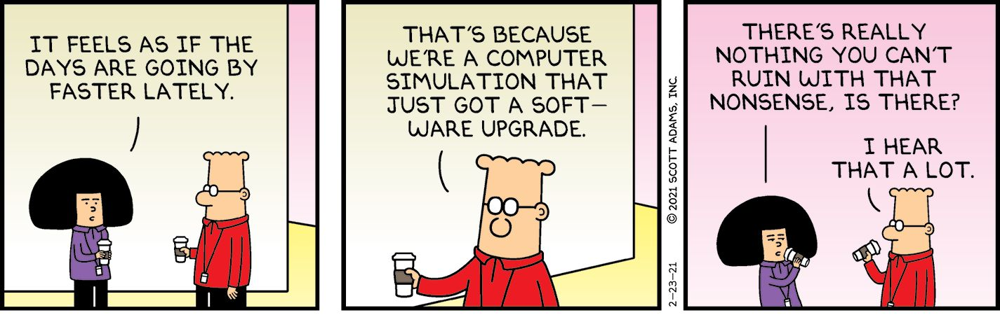
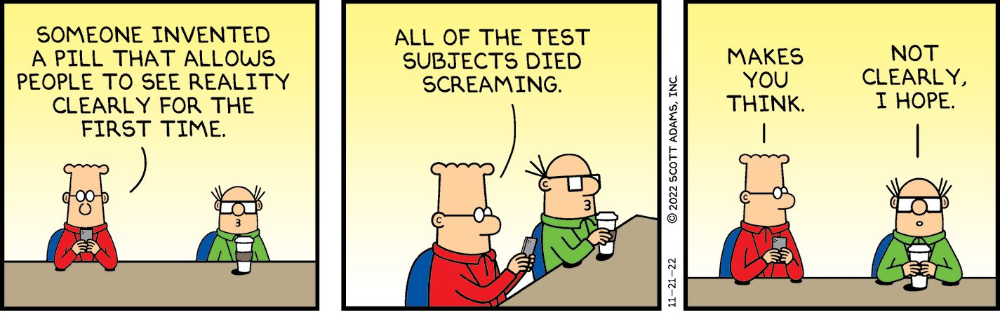
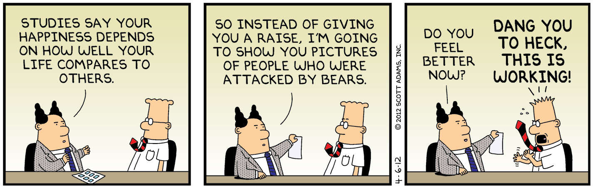
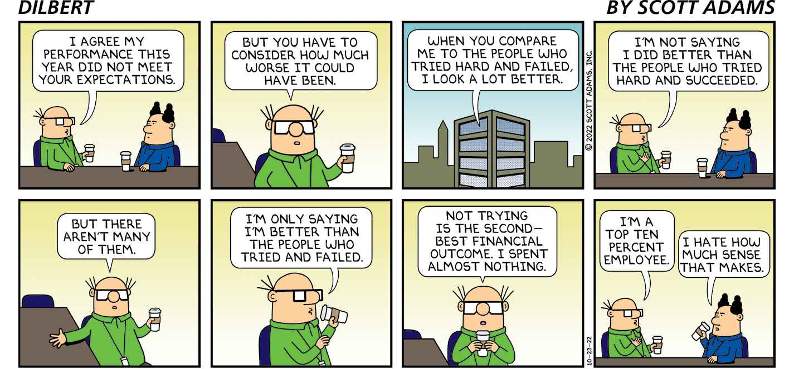

Chapter 7

The Operating System for Your Mind

Scientists once believed that adult brains don’t generate new cells. They believed we were born with all the brain cells we would ever have and that those cells die over the course of an adult’s life. In recent years, science discovered that brains do create new cells. In related news, we have a growing appreciation of something called neuroplasticity—the ability of the brain to create new pathways and new behaviors in any number of ways. In other words, your brain is programmable if you learn how to access the user interface. With this book, I have been teaching you how to write and insert code (programs) into your brain. That’s what the reframes are—software upgrades to your brain. And they cause physical changes to your brain, just as any other learning experience does. 

Once you accept the programmable nature of your own brain, you can get serious about becoming what I call the author of your own experience. This replaces the common view that we are products of our experiences, our genes, and a whole host of factors only fate controls. 

Usual Frame: You are the product of your experiences and genes.

Reframe: You are the author of your experience.

This reframe moves you out of victim mode into player mode. If you are just the result of outside forces and genes you can’t control, that doesn’t provide much motivation. But if you are the author of your own experience, you understand you can create your life one day at a time. The reframes in this book are the code that lets you do just that. Find the reframes in these pages that best match the “dangling wires” in your brain and watch how quickly they get reattached.

I find it useful to think of brains as having operating systems, like computers. Your human operating system is your reflexive pattern for interacting with a new situation. You might layer some knowledge and experience on top of that operating system, but you will still be limited to what it allows you. There are four types of human operating systems I encounter most:

Selfish: I take whatever I can get. Others would do the same.

Revenge: I need revenge for all insults and offenses, both real and imagined. (And most are imagined.)

Victim: I am being victimized by nearly everyone and can’t do anything about it.

Reciprocity: If I make myself useful, good things will come to me.

Of the four operating systems, the first three are deeply flawed. It might feel good in the short run to be selfish, get revenge, or play the victim. But in the long run, the only operating system that can bring you a high-quality life is Reciprocity.

Usual Frame: I deserve to be treated well by others.

Reframe: You get what you give, on average. No one deserves anything.

I spend a lot of time and energy being generous to those who will never return the favor, and I know it. But I also know that being the type of person who would do such things builds trust and attracts people and business deals to me. I also know it only takes one person to reciprocate someday down the line, and that one instance could change my life. The Reciprocity operating system requires patience and the ability to put off pleasure now for long-term gain. That means it will come more easily to some people than others. But we can all learn to give more and act less like victims. If it helps, think of generosity as a selfish strategy. You’re giving with the intention of getting something in return someday. You don’t know when or what form it will take, but Reciprocity is always your best operating system for success.

Will people take advantage of your generosity? Absolutely. But it doesn’t change the larger point that it’s a good strategy. 

The Simulation

Who wants to get weird?

I give you The Simulation Hypothesis. It’s the idea that what we perceive as our reality is a computer simulation created by an advanced species that may or may not look like us. The argument, in its simplest form, is that humans will soon be able to create artificially intelligent life forms who believe they are living independent lives in a simulated world. I would argue we have the technology to do such a thing now. All we need to do is tell the creatures in the simulation that they see more detail in the environment than they do. Coincidentally—or not—that’s exactly how human brains work. We think we see detail in the environment, but we don’t. That’s all illusion. One might describe it as a software module that saves brain processing resources by making us believe we saw more details than we did. If a human creates a computer model that looks like one human, you might expect lots of detail. That’s possible because only one person is being modeled and the computer can handle all that detail. But no programmer would include that sort of detail in a simulated world. They would save resources by making the characters in the simulation believe they were seeing more detail than they were unless it was something they needed to focus on. For example, if you needed to remove a sliver from your finger, the simulation would provide finer detail. 

If we are a simulation, our reality could have the same constraints a software developer would run into when programming a game universe. For example, if a programmer created our universe, they would make sure it was physically impossible for us to travel past the programmed boundaries of our reality. And sure enough, the physical laws of our so-called reality make it impossible to travel fast enough to reach our outer boundaries. 

The core argument for our reality being a simulation is that as soon as any advanced species—including humans—develops the skill to create such a simulation, they would surely make more than one. Maybe millions. And the simulations themselves would evolve to make their own simulations. So the odds of us being the one original species and not one of the millions or trillions of simulations are low. 

I’m a believer that we live in a simulated environment. I don’t believe it because I’m convinced it’s true. I have no way to know what even is true. It would be more accurate to say I find The Simulation a useful filter on life because it answers all my questions and gives me extra, special strategies for success. I’ll explain that part shortly.

As crazy as The Simulation Hypothesis is, some smart people find it credible. Elon Musk is the most famous among them, but the idea comes from American cognitive scientist and author Donald Hoffman. Spend some time on the Internet reading about The Simulation, and you might get hooked. But remember, it’s not about what is true. It’s about which filters and strategies of mind get you the best result.

I won’t ask you to believe we’re living in a simulation. I won’t ask you to believe it’s a rational hypothesis. I won’t ask you to believe there is evidence or science or any solid argument to support that world view. But I will ask you to see The Simulation as one of many filters you can put on life to predict and explain. Like any of the simpler reframes, the only test it must pass is that you find it useful. I’ll show you how to make it so.

Usual Frame: Reality is objective, and science helps us understand it.

Reframe: Our so-called reality is a simulation created by a higher intelligence.

Alternate: You are in a video game, and you have certain problems to solve to get to the next level.

If we are in a simulation, what is the point of it? I can think of several. The one that explains the most observations is that we’re testing different strategies for success on a wide variety of challenges—as stated earlier—so our creators know what solutions they can try in their world.

Have you ever noticed some people have the same odd problem over and over, but others will never once have that sort of problem? I call it a theme. One of my themes is that no matter where I live, I have continuous plumbing problems—the bad kinds. The odds of one person having so many continuous plumbing emergencies over several decades seem insanely low. That’s why it looks programmed. It seems as if I’m A/B testing different ways to approach residential plumbing catastrophes. I’m getting good at it! 

Or maybe we’re an afterlife of some long-deceased species, looping through this same history for infinity. I expect to leave my digital personality in something like that before I go. Wouldn’t my hypothetical creator—if humanlike—do the same?

Or maybe we are avatars (characters) in some sort of massive video game in which the way one wins is by producing the most kids, making the most money, or creating the most positive change. 

Or maybe we’re a reality show. That would explain why we seem to encounter one absurd situation after another.

The point is that we can imagine several reasons a simulated world would exist. But if we’re simulated, what benefits would we get from knowing that?

I like to think that being aware you are simulated allows you to author the game as you go. In other words, you can focus intensely on what you want—and that alone will hack the simulation to produce the change. As noted in the Introduction, some call that affirmations. Some call it positive thinking. Others call it the Law of Attraction. All I know for sure is that the people who believe we live in a Simulation seem to get a lot of what they want compared to those who have other filters on reality. Case in point, Elon Musk has done okay. I can pay my rent, too.

Author Versus Audience

If you believe you can author the simulation with your intentions, you’re likely to experience a reality in which that seems to be exactly what is happening. That’s how I experience life. Even my bad luck seems eerily similar to things I had been thinking about too much, as if I created it by mistake. Many people who practice affirmations tell me about their experiences—they, too, feel as if they’re authoring their own destiny.

The possibility of authoring your future—or even feeling as if you are—is why The Simulation Hypothesis is a powerful reframe. If your view of reality is limited to the common view of cause and effect, you might feel relatively helpless to change anything in your life. But if you use affirmations and your dreams appear to come true against the odds, you open up to new possibilities. Or it feels as if you do. And that can be just as satisfying. 

My current view of reality is that I am in some sort of simulated environment, and I am projecting a subjective bubble of reality everywhere I go just in time to make me think it all seems real. If you and I meet, we can have two different realities and later leave with two different memories of the event. The discrepancies in our realities will never be obvious because we’re unlikely to compare our memories of it in any detail. If for some reason we ever did compare our memories, we would conclude that one or both of us had a faulty memory and that alone explains the discrepancy.

This is how we all live in our own bubble realities, unconcerned that our stories do not sync with the bubble next to us. Importantly, it’s also how the computing device running our simulation can handle the nearly infinite complexity of a simulated universe—it doesn’t. It just convinces us it did, and we imagine we see it.

Usual Frame: We have different memories.

Reframe: We created different subjective realities. 

One of the great comforts of this reframe is that I no longer feel stress when I can’t persuade someone that my view of events is the accurate one. Now I accept that two or more “realities” were running at the same time; there is no reason they need to match. It isn’t easy to get comfortable with that idea, but if you can pull it off, it pays for itself in reduced frustration.

Another advantage of living as though I’m in a simulation is that almost anything seems possible unless ruled out by observed past events. I never feel limited, and I think that attitude helps me take on tougher problems with enthusiasm.

If you will allow me to go full-weird, I speculate that imagining, planning, and predicting might have the same impact on reality. In each case, you visualize the future, and I suspect—without the support of science or facts—that the more accurately you imagine your future, the more you become the author of your reality. I wouldn’t bet my life on it, but it would explain a lot that has happened in my life.

The Simulation Hypothesis might be an accurate description of base reality or not. But like any other reframe, the truth probably doesn’t matter. What matters is that it seems to work for you or not.

The User Interface for Reality 

We will never agree on the “true” nature of reality. But we might agree that some interpretations of reality make you happier than others. As I sit in Starbucks writing this chapter, I can see a valid argument for either optimism or pessimism about the current state of the world. I don’t know which filter is more accurate, but I do know one makes me feel better than the other. So I choose the happy-making one. Under either interpretation of reality, I act the same, taking normal precautions against the unknown. 

A common view of reality assumes there is a solid layer of realness just below our feet, and all we’re doing is choosing which shoes to wear when we walk on it. This is compatible with how most people see the world. But it isn’t the only way.

The deeper—and potentially more useful—view of reality is that we author our reality as we go, so almost nothing is out of bounds. As I’ve said many times, I don’t claim that view of reality is the closest to true. All I know for sure is that people who act as though they can author their reality seem to get results that are hard to explain. I am one of them, and I have a few successful friends who see things the same way but don’t like to say so in public.

Usual Frame: Reality is objective.

Reframe: There might be an objective reality, but human brains don’t have access to it.

Is it crazy to imagine you can author reality itself, including the things outside your direct physical control? That’s a trick question. I made you think past the sale. The “sale” is the assumption that believing you can author your reality—and being wrong about it—is a bad thing. There is no evidence of that. Anecdotally, it looks the opposite, that thinking you can author your reality gives you good outcomes whether there is any underlying truth to it or not. The people with the least respect for our so-called reality are the ones changing it. Elon Musk is my go-to example once again. He specializes in making things happen that many experts think are impossible—in their realities. Most great innovators have a healthy disrespect for the impossible.

For the purposes of this book, I’m only asking you to consider the method of viewing reality as fully programmable—by you. To get the benefits from this approach, you do not need to believe you know the true nature of reality. That can remain a mystery. All I ask is that you be open to acting as though you can author it. See what happens. You might be surprised. That reframe looks like this.

Usual Frame: Reality is only subjective in terms of our opinions and preferences.

Reframe: We can treat all of reality as subjective and get a good outcome, as if we authored it ourselves.

I’ve talked in this book and in my other books about affirmations. The specific technique I use involves visualizing what you want and repeating it or writing it down fifteen times a day. There is nothing magic in the details of how you do it. It doesn’t matter how or when you do it or even how many times you repeat it. What matters is your intensity of focus on the desired outcome. I say that because in my experience the potential futures I could see most clearly for my own life seemed to be the futures that happened. I don’t know if that is because of causation or coincidence, but I choose to treat it as real.

My point is that one can live inside a fully subjective reality without penalty. I’m either authoring my reality or imagining I am. Either way, fully awesome.

I prefer permissive affirmations that allow lots of ways to succeed. For example, I would focus on wealth instead of a specific promotion, and I would ask for a good romantic life as opposed to a specific partner. Give yourself more than one way to win.

If you want to influence yourself or others—and in so doing author your own reality—you need to know what buttons to push on the user interface of the human brain. If you think brains operate on an operating system of rational thought, you are both wrong and probably frustrated at a world that appears to make no sense. If you take the hypnotist’s view that humans are irrational 90 percent of the time, you are ready to see the buttons on the user interface to reality.

And once you see the buttons, you control the game. (Or it can seem that way.) I’ll take you through the main persuasion buttons you need to push to get what you want.

Freedom

Humans love freedom more than pleasure and more than escape from pain. We will even sacrifice our lives for the benefit of other people’s freedom. If you want to understand why people do the things they do or you want to influence them, don’t forget this often-neglected dimension of the human psyche. Humans will often take freedom over money, even over love. 

Nearly every decision increases or decreases the freedom of people involved. You might not see that as a key variable, and that’s my point. You should see it as a key variable because it tops most other concerns.

If you want to hire the best employees, make sure you emphasize how much freedom they will have. If you want the best marriage, make sure you offer freedom to each other, within reason. As I said in the Success Reframes chapter, if you want the best kind of job, pick one that gives you the most schedule flexibility.

Freedom is a huge button on the human interface, and it’s so easy to push. Consider it in every decision you make and remember to consider it when trying to persuade others.

Fear

Fear is the strongest anti-motivator for humans. We will do nearly anything to escape it. That’s why you should be on guard for manipulators who use fear to control you. And it’s why you should use fear to persuade when it’s ethical to do so. And by ethical, I mean you don’t need to lie to describe something frightening that needs to be addressed. If you have reason to believe something bad is going to happen, I would argue you have an obligation to use rational fear to warn those in harm’s way.

How powerful is the fear button when pressed? I believe it determines the selection of presidents in most American elections. Whoever pushes the fear message the hardest wins.

Novelty

The things that catch your attention and stick in your mind are the things that are different, weird, unexpected, or novel in some way. Novelty is the way good communicators grab your attention. They might, for example, curse in an inappropriate venue or include a slide in a slide deck that is wildly different from the rest. Or they might create an insulting nickname for a rival. That sort of thing. 

Learn to insert novelty in your communications, and you can own any topic. But use it sparingly. Otherwise, it loses its power.

Repetition

Human rationality is so thin that repeating an obvious lie often enough will make the lie sound believable. That is the concept behind most advertising, politics, and propaganda. And it’s the easiest button to push if you want to influence. Simply find a message, deliver it, and repeat. But also be aware that it’s being used on you. Watch how often your decisions match what message you saw the most in advertisements or on the news. Once you understand how often repetition hijacks rational thought, you will see it everywhere. 

Simplicity

Our brains are easily overwhelmed with details and complexity. When that happens, we don’t know how to make smart decisions. If you wish to influence someone to action, keep your arguments simple and your asks even more so. Simplicity works. Every detail you add after the minimum detracts from your influence.

Fake Because (Reasons)

I already mentioned the power of the “fake because” in a few specific situations, but it works in almost any domain and is a big part of the user interface for reality. We humans like to have reasons for our decisions to not seem foolish to ourselves and others. But curiously, we are not picky about the quality of those reasons. You can see this most clearly in political issues. Voters tend to agree with their team first and rationalize that agreement later by imagining “reasons” or repeating reasons they heard in the news. The power of knowing this oddity of human intellect is that if you don’t have a great reason for asking for something, use a bad reason. You can even use a reason that doesn’t sound like a reason at all to the listener. Usually, people just want to know that you have a reason. They are less interested in what that reason is.

There will be exceptions, of course. People will want real reasons for their most important decisions, but most of life is a series of less-important decisions. And for those, any reason is often good enough. 

Pacing and Leading

Pacing involves matching the person you want to persuade in any number of ways, from body language to breathing to clothing style to choice of words and more. If you match a person long enough, you form trust (that isn’t otherwise earned), and you can eventually start to “lead” the person you want to influence. Be like the person you’re imitating in some subtle ways until you can lead them. This is why leaders with “the common touch” do well. People see themselves in the leader, which triggers an automatic willingness to be led. It’s like putting yourself in charge of yourself. That feels safe because you love yourself.

Aspirations

People obviously enjoy succeeding. They also love becoming better versions of themselves. If you can paint a credible picture of how someone can aspire to become more than they are, you can motivate them to act. Sometimes people’s immediate aspirations are obvious, such as a team trying to win a championship. But perhaps the team is wondering what they should do and how they should act to realize that aspiration. That’s where you come in. Tell people they’re winners, they’re good at comebacks, or some such message to create an aspirational target. They are not yet winners, but they could be soon! 

A sporting competition is a special case. In life, we have broader aspirations for who we want to be. Most people are not aiming high, which gives them plenty of space to find a better version of themselves. People will work toward that better version somewhat reflexively if they can see it clearly and value it.

Aspirations are a great button for managing others, but it works just as well for motivating yourself. Who do you want to be? How do you want to be remembered? Years ago, I set my life’s highest aspiration at having the largest funeral attendance as possible. In other words, I wanted to have so much positive impact on the planet that people would want to say goodbye to my rotting bones. That sounds like a vague aspiration, but it isn’t. I can put almost any decision I make and any human interaction through that aspiration filter, and it tells me how to be.

Comparing

Comparing any two or more things is such a simple concept and so embedded in everything we do that one would think it requires no further explanation. But my observation is that 75 percent of the public tries to judge the value of a thing compared to some imaginary standard and not to real alternatives. And comparing to real alternatives is the only thing that is useful. We all need reminders to make sure we are comparing the right things. It helps to train yourself to always think in terms of contrast, especially when selling or communicating in general.

For example, if you want to buy a house, your real estate agent will probably show you several terrible properties first. They do that to make the more expensive homes seem that much more desirable. 

One way to understand the toxic effects of social media is that it changed how we see ourselves by comparing us to the top social media celebrities in the world instead of our sloppy friend Bob, to pick a random name. You might be a superstar compared to sloppy Bob, but how do you stack up against the most attractive and successful people in the world? That’s who you are unintentionally competing with when you make social media a big part of your life. It’s no surprise that social media is causing mental health problems, especially with young people.

Proper comparisons are important in negotiations, communications, strategy, humor, storytelling, financial analysis, and just about everything else that matters. You already know the importance of sensible comparisons, but keeping it at the front of your mind is likely to pay dividends.

And never compare yourself to imaginary perfections. That does nothing.

Pattern Recognition

The human brain is a pattern recognition machine but not a good one. It sees false patterns everywhere. And those false patterns inform our biases and bigotry. Once you understand brains as pattern recognition machines—as opposed to logic machines—everything starts to make sense. For example, now you know why people so often base their arguments on analogies instead of reason. It’s because analogies are patterns. Whenever one thing reminds us of another, we irrationally conclude one of those things can describe or predict the other. We see this most vividly in the idea that “history repeats,” which is closer to nonsense than insight. If history repeated, we’d all know what happens next, and obviously we don’t.

And don’t let a historian tell you the problem is that you didn’t study history hard enough. Even historians can’t predict the future. 

Understanding the mind as a pattern recognition machine that isn’t good at its job is one of the most useful buttons in the human interface for reality. Once you find that button, everything makes more sense.

For example, do you believe people choose their religions based on reason and data, or do they mostly adopt the religion they were raised in? An appeal to logic and reason won’t answer that question. Understanding people as pattern-driven does.

Team Instinct

As a civilization, we waste immense energy debating people who are not open to being persuaded. They probably have the same problem when debating you. Once people join a team, they will hallucinate any argument they need to help that team “win.”

Social media exacerbated the problem by gamifying team play. If you make a post that is popular with your followers, they reward you with reposts and likes. It’s addicting and pulls us away from reason and compromise.

Once you see how powerful the team instinct is, you soon realize debate that appeals to reason and data is useless. You’re in the wrong game. The other side is not trying to win the argument, they’re trying to win the game. And winning the game often means making ridiculous arguments that make your team clap like seals no matter how absurd you are.

Association

Advertisers have long known that associating their product with something or someone beloved allows some of the goodwill to rub off on the product. What is less obvious is how often this guilt-by-association (on the dark side) or love-by-association (on the good side) matters to your everyday experience.

For example, if you meet a romantic interest and carelessly guide the conversation toward something tragic in the news, some of that tragedy will rub off on you and diminish your appeal even though you had nothing to do with it. So don’t bring up ugly topics when making a first impression or at any other time during the getting-to-know-each-other phase. Later, an unpleasant topic will have less impact on your appeal—after the first impression period passes. But telling tragic stories still ruins the other person’s day, so avoid doing that if you can.

When a producer pitches a movie to a studio, they often say what two successful movies could be combined to create this new film, as in, “It’s like ET meets Titanic.” If the studio executive liked both movies, some of that goodwill spills over.

You already knew corporations use the trick of associating things people like with their products and associating things people don’t like with their competitors. I’m suggesting you adopt their methods in the way you communicate. Stick to communication that is funny, interesting, useful, optimistic, and even inspirational. It makes you far more fun to be around. The people who are not lucky enough to read this book will communicate the tragic stuff to other people for you, at their own social expense.

Visualization

Whoever controls “the picture” usually wins the day. And by that, I mean what mental image comes to mind when the topic is discussed. The more vivid, the more persuasive. For example, the field of climate change was forever changed by the famous hockey-stick graph that predicted a slow warming period followed by a rapid uptick. Other images for climate change focused on dying polar bears and hurricane coverage. When images that powerful enter the debate, you can usually predict which direction the public will go. And they have.

Similarly, what citizens think of illegal immigration is influenced mostly by what pictures they have been exposed to, including the kind of “pictures” we concoct in our imaginations.

The power of this “button” on the user interface of reality is that there are often many variables at play, which makes it hard to know where things are heading. But if you focus on what visual pops to mind when the topic comes up, you can usually predict better than chance.

Do you remember when candidate Donald Trump labeled candidate Jeb Bush “Low-energy Jeb”? The moment you heard that reframe, you got a mental image of Bush barely able to shuffle across the room. There was no competing visual because “normal Jeb” was the same guy. 

Many things are persuasive. But visual persuasion wins against almost everything but fear. 

Okay, now you know the main buttons on the User Interface for Reality. Drop your antiquated notions of a rational world that only needs a bit more knowledge to make us all hold hands and get along. Instead, reframe life as a dashboard of persuasion buttons you can push as needed to persuade others—and to train your own brain to author your reality.
